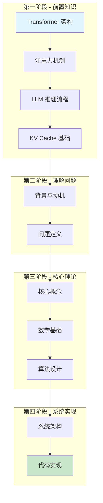
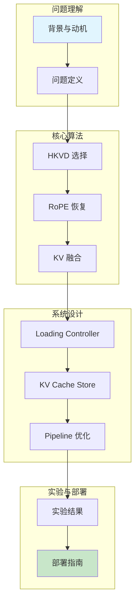

本文档系列旨在帮助开发者深入理解 CacheBlend —— 一种基于 KV Cache 融合的 RAG 推理加速技术，来自 EuroSys '25 论文 "CacheBlend: Fast Large Language Model Serving for RAG with Cached Knowledge Fusion"。

## 你将学到

- RAG 场景下的 LLM 推理挑战
- Cross-Attention 丢失问题的本质
- HKVD Tokens 选择性重计算
- KV 偏差和注意力偏差的数学分析
- RoPE 位置编码恢复算法
- 系统架构：Loading Controller 和 KV Cache Store

## 学习路线图

### 路径一：基础路径（推荐新手）

适合刚接触 KV Cache 优化的读者，从基础概念学起。

### 路径二：进阶路径（适合有基础的读者）

如果你已经了解 KV Cache 的基本概念，可以直接进入核心内容。

## 文档结构

| 章节 | 内容 |
|------|------|
| 前置知识 | Transformer 架构、注意力机制、LLM 推理、KV Cache 基础 |
| 导论 | 背景与动机、问题定义 |
| 核心理论 | 核心概念、数学基础、算法设计 |
| 系统设计 | 整体架构、Loading Controller、KV Cache Store、Pipeline 优化 |
| 实现详解 | 项目结构、数据结构、状态机、LLaMA 模型实现 |
| 算法详解 | RoPE 恢复、HKVD 选择、KV 融合 |
| 实验评估 | 实验设置、实验结果 |
| 进阶内容 | 相关工作、局限性、部署指南 |
| 附录 | 代码索引、配置参考、数学推导、问题排查、基准测试、术语表、FAQ |

## 文档版本

- **论文来源**：EuroSys '25
- **文档版本**：1.0
- **最后更新**：2025 年 1 月
