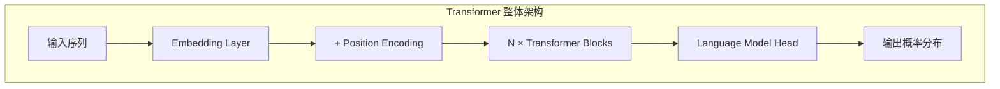
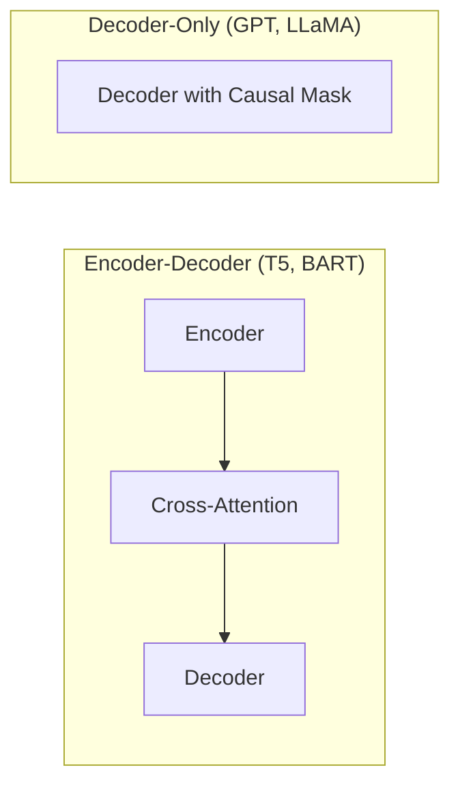
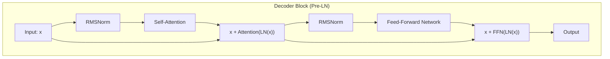
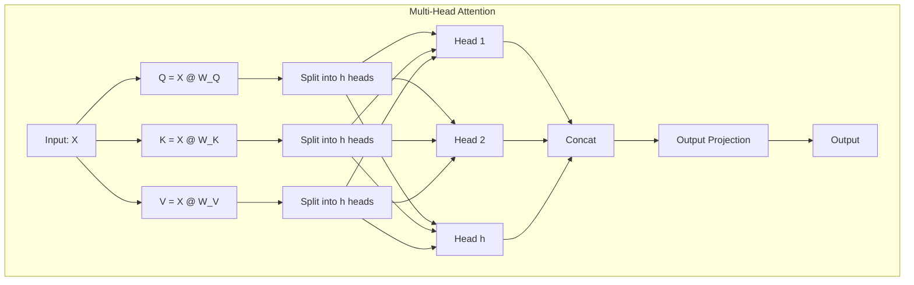
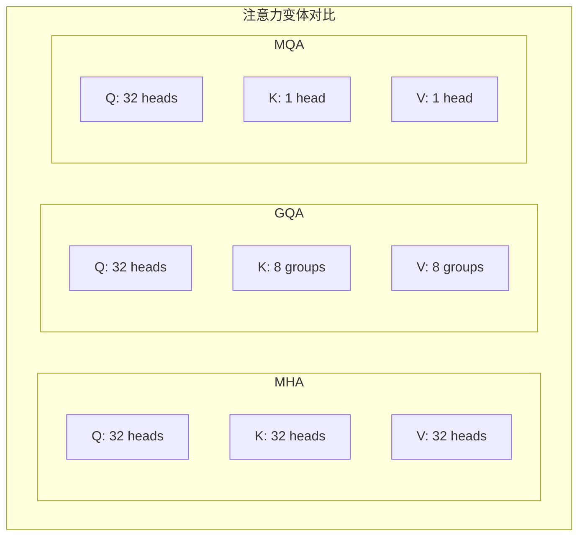
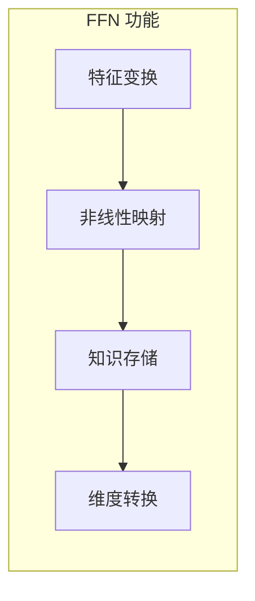
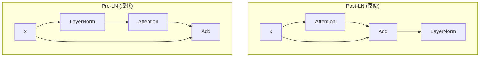
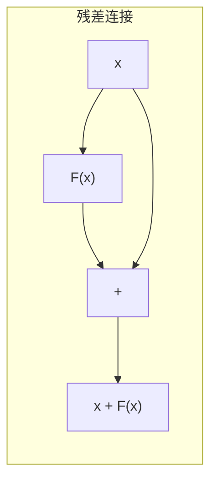
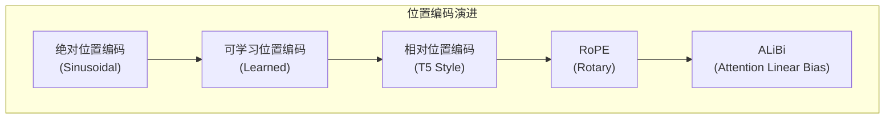

> 本文面向深度学习开发者，详细介绍 Transformer 架构的核心组件和实现细节，为理解 CacheBlend 打下基础。

---

## 目录

- [1. Transformer 架构概述](#1-transformer-架构概述)
- [2. Encoder-Decoder vs Decoder-Only](#2-encoder-decoder-vs-decoder-only)
- [3. Decoder Block 详解](#3-decoder-block-详解)
- [4. Multi-Head Attention](#4-multi-head-attention)
- [5. Feed-Forward Network](#5-feed-forward-network)
- [6. Layer Normalization](#6-layer-normalization)
- [7. Residual Connection](#7-residual-connection)
- [8. Position Encoding](#8-position-encoding)

---

## 1. Transformer 架构概述

Transformer 是 2017 年由 Google 在论文 "Attention Is All You Need" 中提出的架构，彻底改变了自然语言处理领域。与 RNN/LSTM 不同，Transformer 完全基于注意力机制（Attention Mechanism），能够并行处理序列数据。

### 1.1 核心优势

| 特性 | RNN/LSTM | Transformer |
|------|----------|-------------|
| 并行计算 | 无法并行（顺序依赖） | 可以并行（无顺序依赖） |
| 长距离依赖 | 梯度消失问题 | 直接建模（注意力机制） |
| 训练速度 | 慢 | 快 |
| 计算复杂度 | O(n) | O(n²)（但可优化） |

### 1.2 整体架构



---

## 2. Encoder-Decoder vs Decoder-Only

### 2.1 两种主流架构



### 2.2 架构对比

| 架构 | 代表模型 | 适用场景 | 特点 |
|------|---------|---------|------|
| **Encoder-Decoder** | T5, BART, mT5 | 翻译、摘要 | 双向编码 + 自回归解码 |
| **Decoder-Only** | GPT, LLaMA, Mistral | 文本生成、对话 | 仅自回归解码 |
| **Encoder-Only** | BERT, RoBERTa | 分类、NER | 双向编码 |

### 2.3 为什么 LLM 选择 Decoder-Only？

1. **统一的生成范式**: 所有任务都可以转化为文本生成
2. **训练简单**: 只需要下一个 token 预测任务
3. **扩展性好**: 容易扩展到更大规模
4. **KV Cache 友好**: 生成时可以复用之前计算的 KV

---

## 3. Decoder Block 详解

### 3.1 Block 结构（Pre-LN 版本）

现代 LLM（如 LLaMA、Mistral）通常使用 Pre-LN（Pre-Layer Normalization）结构：



### 3.2 PyTorch 实现示例

```python
class DecoderBlock(nn.Module):
    def __init__(self, hidden_size, num_heads, intermediate_size):
        super().__init__()
        self.input_layernorm = RMSNorm(hidden_size)
        self.self_attn = SelfAttention(hidden_size, num_heads)
        self.post_attention_layernorm = RMSNorm(hidden_size)
        self.mlp = MLP(hidden_size, intermediate_size)

    def forward(self, hidden_states, attention_mask=None, position_ids=None):
        # Self-Attention with residual
        residual = hidden_states
        hidden_states = self.input_layernorm(hidden_states)
        hidden_states = self.self_attn(hidden_states, attention_mask, position_ids)
        hidden_states = residual + hidden_states

        # FFN with residual
        residual = hidden_states
        hidden_states = self.post_attention_layernorm(hidden_states)
        hidden_states = self.mlp(hidden_states)
        hidden_states = residual + hidden_states

        return hidden_states
```

---

## 4. Multi-Head Attention

### 4.1 单头注意力回顾

单头注意力的计算公式：

$$
\text{Attention}(Q, K, V) = \text{softmax}\left(\frac{QK^T}{\sqrt{d_k}}\right) V
$$

其中：
- $Q$: Query 矩阵，形状 $[seq\_len, d_k]$
- $K$: Key 矩阵，形状 $[seq\_len, d_k]$
- $V$: Value 矩阵，形状 $[seq\_len, d_v]$
- $d_k$: Key 的维度（用于缩放）

### 4.2 多头注意力

多头注意力将输入投影到多个子空间，每个子空间独立计算注意力：

$$
\text{MultiHead}(Q, K, V) = \text{Concat}(\text{head}_1, ..., \text{head}_h) W^O
$$

其中：
$$
\text{head}_i = \text{Attention}(Q W_i^Q, K W_i^K, V W_i^V)
$$



### 4.3 PyTorch 实现

```python
class MultiHeadAttention(nn.Module):
    def __init__(self, hidden_size, num_heads):
        super().__init__()
        self.num_heads = num_heads
        self.head_dim = hidden_size // num_heads

        self.q_proj = nn.Linear(hidden_size, hidden_size)
        self.k_proj = nn.Linear(hidden_size, hidden_size)
        self.v_proj = nn.Linear(hidden_size, hidden_size)
        self.o_proj = nn.Linear(hidden_size, hidden_size)

    def forward(self, hidden_states, attention_mask=None):
        batch_size, seq_len, _ = hidden_states.shape

        # 投影
        q = self.q_proj(hidden_states)
        k = self.k_proj(hidden_states)
        v = self.v_proj(hidden_states)

        # 重塑为多头形式: [batch, seq, num_heads, head_dim]
        q = q.view(batch_size, seq_len, self.num_heads, self.head_dim).transpose(1, 2)
        k = k.view(batch_size, seq_len, self.num_heads, self.head_dim).transpose(1, 2)
        v = v.view(batch_size, seq_len, self.num_heads, self.head_dim).transpose(1, 2)

        # 计算注意力分数
        scores = torch.matmul(q, k.transpose(-2, -1)) / math.sqrt(self.head_dim)

        # 应用因果掩码（可选）
        if attention_mask is not None:
            scores = scores + attention_mask

        # Softmax + 加权求和
        attn_weights = F.softmax(scores, dim=-1)
        output = torch.matmul(attn_weights, v)

        # 重塑并投影
        output = output.transpose(1, 2).contiguous().view(batch_size, seq_len, -1)
        output = self.o_proj(output)

        return output
```

### 4.4 Grouped Query Attention (GQA)

现代 LLM（如 LLaMA 2/3、Mistral）使用 GQA 来减少 KV Cache 的内存占用：



| 变体 | Query Heads | KV Heads | KV Cache 大小 |
|------|------------|----------|--------------|
| MHA | 32 | 32 | 100% |
| GQA | 32 | 8 | 25% |
| MQA | 32 | 1 | 3.125% |

---

## 5. Feed-Forward Network

### 5.1 标准 FFN

```python
class MLP(nn.Module):
    def __init__(self, hidden_size, intermediate_size):
        super().__init__()
        self.gate_proj = nn.Linear(hidden_size, intermediate_size)
        self.up_proj = nn.Linear(hidden_size, intermediate_size)
        self.down_proj = nn.Linear(intermediate_size, hidden_size)
        self.act_fn = nn.SiLU()  # SwiGLU activation

    def forward(self, x):
        # SwiGLU: down(act(gate(x)) * up(x))
        return self.down_proj(self.act_fn(self.gate_proj(x)) * self.up_proj(x))
```

### 5.2 FFN 的作用



- **中间维度**: 通常是 hidden_size 的 4 倍（如 4096 → 16384）
- **激活函数**: 现代 LLM 常用 SwiGLU 而非 ReLU/GELU

---

## 6. Layer Normalization

### 6.1 Pre-LN vs Post-LN



**Pre-LN 的优势**:
- 训练更稳定
- 不需要 warmup
- 梯度流动更顺畅

### 6.2 RMSNorm vs LayerNorm

LLaMA 使用 RMSNorm（Root Mean Square Layer Normalization）：

```python
class RMSNorm(nn.Module):
    def __init__(self, hidden_size, eps=1e-6):
        super().__init__()
        self.weight = nn.Parameter(torch.ones(hidden_size))
        self.eps = eps

    def forward(self, x):
        # RMSNorm: x / sqrt(mean(x^2) + eps) * weight
        rms = torch.sqrt(torch.mean(x ** 2, dim=-1, keepdim=True) + self.eps)
        return x / rms * self.weight
```

**RMSNorm vs LayerNorm**:
- RMSNorm 不需要计算均值，更简单
- 性能差异不大，但计算更快

---

## 7. Residual Connection

### 7.1 残差连接的重要性



**作用**:
1. **缓解梯度消失**: 梯度可以直接通过 skip connection 传递
2. **训练深层网络**: 允许训练 100+ 层的网络
3. **特征保留**: 保留原始输入信息

### 7.2 在 Transformer 中的应用

```python
# 注意力层的残差
hidden_states = residual + self.self_attn(self.input_layernorm(hidden_states))

# FFN 层的残差
hidden_states = residual + self.mlp(self.post_attention_layernorm(hidden_states))
```

---

## 8. Position Encoding

### 8.1 为什么需要位置编码？

Transformer 的注意力机制是位置无关的（permutation invariant），需要额外注入位置信息。

### 8.2 位置编码的演进



### 8.3 RoPE（Rotary Position Embedding）

RoPE 是目前最流行的位置编码方式（LLaMA、Mistral 等使用）：

**核心思想**: 通过旋转变换将位置信息编码到 Q 和 K 中

$$
f_q(x_m, m) = R_m \cdot x_m
$$

其中 $R_m$ 是旋转矩阵：

$$
R_\theta = \begin{pmatrix}
\cos\theta & -\sin\theta \\
\sin\theta & \cos\theta
\end{pmatrix}
$$

**RoPE 的关键性质**:

$$
\langle R_m q, R_n k \rangle = \langle q, R_{n-m} k \rangle
$$

注意力分数只依赖于**相对位置** $(n-m)$，这是 CacheBlend 能够复用 KV Cache 的理论基础。

```python
def apply_rotary_pos_emb(q, k, cos, sin, position_ids):
    # 获取对应位置的 cos 和 sin
    cos = cos[position_ids].unsqueeze(1)  # [bs, 1, seq_len, dim]
    sin = sin[position_ids].unsqueeze(1)

    # 应用旋转
    q_embed = (q * cos) + (rotate_half(q) * sin)
    k_embed = (k * cos) + (rotate_half(k) * sin)

    return q_embed, k_embed

def rotate_half(x):
    """将向量的前后半部分交换并取负"""
    x1 = x[..., : x.shape[-1] // 2]
    x2 = x[..., x.shape[-1] // 2 :]
    return torch.cat((-x2, x1), dim=-1)
```

### 8.4 位置编码对比

| 方法 | 外推能力 | 计算开销 | 是否可复用 KV |
|------|---------|---------|--------------|
| Sinusoidal | 差 | 低 | 否 |
| Learned | 无 | 低 | 否 |
| RoPE | 中等 | 中等 | 是（通过旋转恢复） |
| ALiBi | 好 | 低 | 否 |

---

## 总结

本文介绍了 Transformer 架构的核心组件：

1. **Decoder-Only 架构**: 现代 LLM 的主流选择
2. **Multi-Head Attention**: 并行计算多个注意力子空间
3. **FFN**: 非线性特征变换
4. **Layer Normalization**: 训练稳定性
5. **Residual Connection**: 梯度流动
6. **RoPE**: 相对位置编码，CacheBlend 的理论基础

理解这些组件是深入学习 CacheBlend 的前提。

---

## 下一步

- [注意力机制深度解析](./02-attention-mechanism.md)
- [LLM 推理流程](./03-llm-inference.md)
