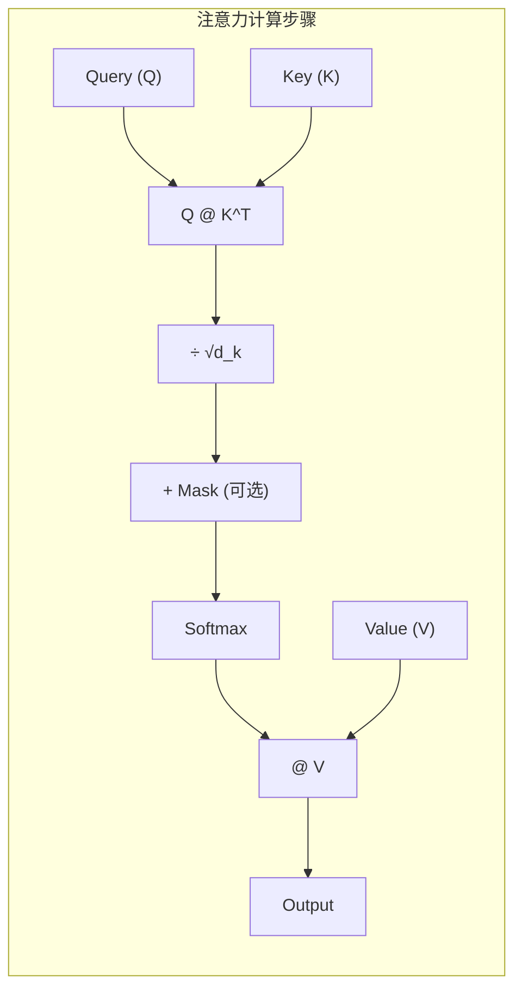
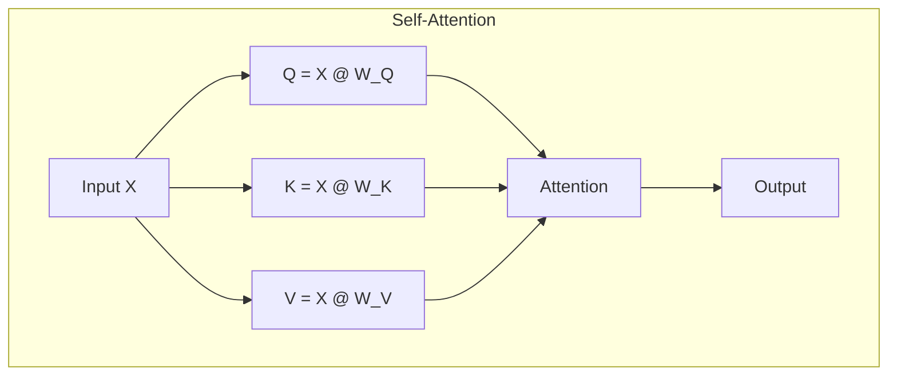
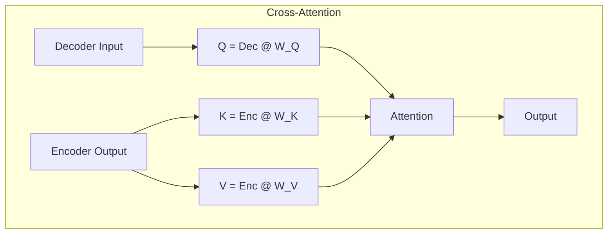
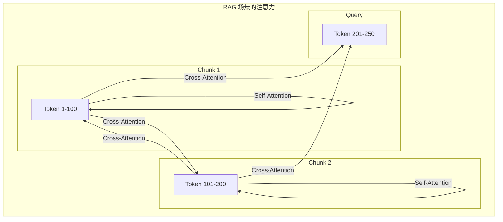
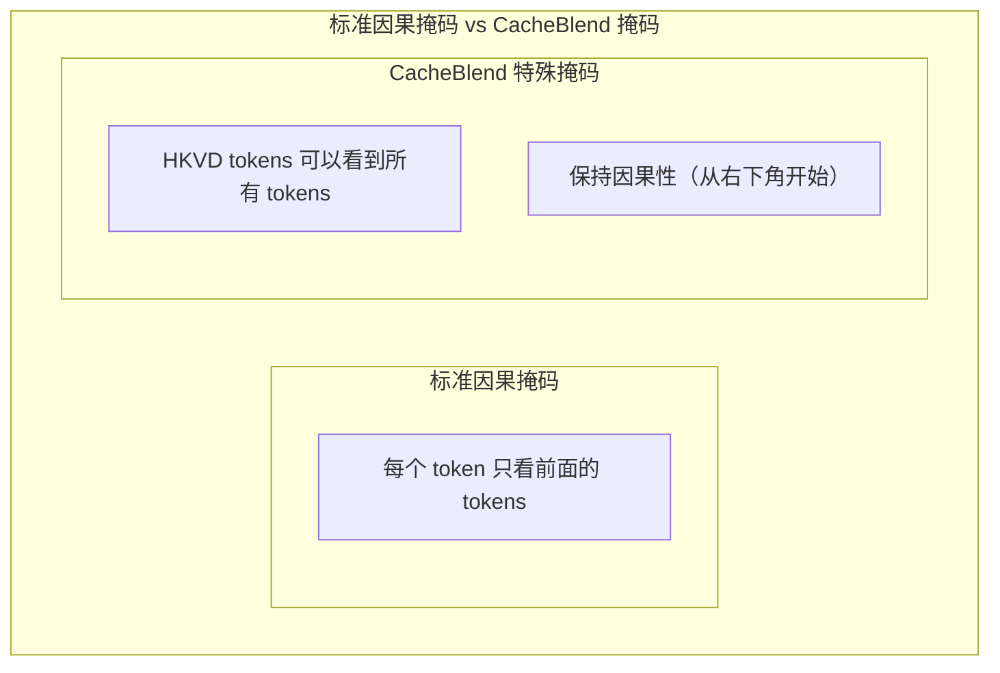
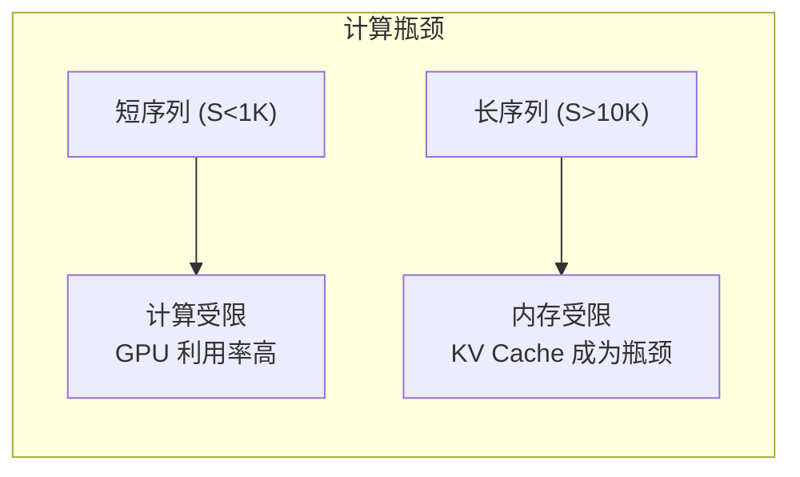
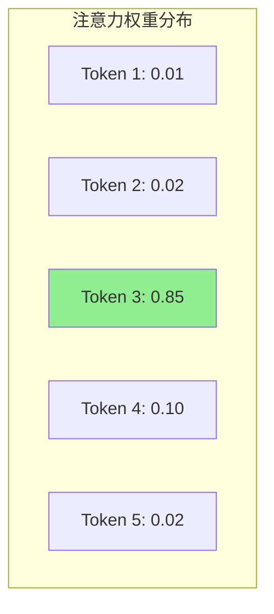

> 深入理解 Self-Attention 和 Cross-Attention 的计算原理，为理解 CacheBlend 的核心创新奠定基础。

---

## 目录

- [1. Scaled Dot-Product Attention](#1-scaled-dot-product-attention)
- [2. Self-Attention vs Cross-Attention](#2-self-attention-vs-cross-attention)
- [3. Causal Attention Mask](#3-causal-attention-mask)
- [4. 注意力的计算复杂度](#4-注意力的计算复杂度)
- [5. 注意力稀疏性](#5-注意力稀疏性)
- [6. 从零实现注意力机制](#6-从零实现注意力机制)

---

## 1. Scaled Dot-Product Attention

### 1.1 计算公式

$$
\text{Attention}(Q, K, V) = \text{softmax}\left(\frac{QK^T}{\sqrt{d_k}}\right) V
$$

### 1.2 计算步骤分解



### 1.3 为什么要缩放？

缩放因子 $\sqrt{d_k}$ 的作用是防止点积值过大导致 softmax 进入饱和区：

| 维度 $d_k$ | 无缩放的点积范围 | 缩放后范围 |
|-----------|----------------|----------|
| 64 | [-64, 64] | [-8, 8] |
| 128 | [-128, 128] | [-11.3, 11.3] |
| 256 | [-256, 256] | [-16, 16] |

当点积值过大时，softmax 的梯度会接近 0，导致训练困难。

### 1.4 维度分析

假设：
- Batch size: $B$
- Sequence length: $S$
- Hidden size: $H$
- Number of heads: $N$
- Head dimension: $d = H / N$

各张量维度：

| 张量 | 维度 | 说明 |
|-----|------|------|
| $Q$ | $[B, N, S, d]$ | Query |
| $K$ | $[B, N, S, d]$ | Key |
| $V$ | $[B, N, S, d]$ | Value |
| $QK^T$ | $[B, N, S, S]$ | 注意力分数 |
| Attention Weights | $[B, N, S, S]$ | Softmax 后的权重 |
| Output | $[B, N, S, d]$ | 加权求和结果 |

---

## 2. Self-Attention vs Cross-Attention

### 2.1 Self-Attention（自注意力）

在 Self-Attention 中，Q、K、V 都来自**同一个输入序列**：



**用途**: 建模序列内部的依赖关系

### 2.2 Cross-Attention（交叉注意力）

在 Cross-Attention 中，Q 来自一个序列，K 和 V 来自**另一个序列**：



**用途**: Encoder-Decoder 架构中，Decoder 关注 Encoder 的输出

### 2.3 CacheBlend 中的 Cross-Attention

在 RAG 场景中，当多个文本块（chunks）拼接时：



**关键观察**: Cross-Attention 对于多 chunk 场景至关重要，但也是 KV Cache 复用的主要障碍。

---

## 3. Causal Attention Mask

### 3.1 为什么需要因果掩码？

在自回归生成中，位置 $i$ 的 token 只能看到位置 $\leq i$ 的 token：

```
Token:     [A]  [B]  [C]  [D]
Position:   0    1    2    3

A 可以看到: [A]
B 可以看到: [A, B]
C 可以看到: [A, B, C]
D 可以看到: [A, B, C, D]
```

### 3.2 掩码矩阵

因果掩码是一个下三角矩阵：

```
     A   B   C   D
A  [ 0, -∞, -∞, -∞ ]
B  [ 0,  0, -∞, -∞ ]
C  [ 0,  0,  0, -∞ ]
D  [ 0,  0,  0,  0 ]
```

### 3.3 实现代码

```python
def create_causal_mask(seq_len, device):
    """创建因果掩码"""
    # 创建上三角矩阵，对角线以上为 True
    mask = torch.triu(torch.ones(seq_len, seq_len, device=device), diagonal=1)
    # 将 True 转换为 -inf
    mask = mask.masked_fill(mask == 1, float('-inf'))
    return mask

# 使用示例
seq_len = 4
mask = create_causal_mask(seq_len, 'cuda')
# tensor([[  0., -inf, -inf, -inf],
#         [  0.,   0., -inf, -inf],
#         [  0.,   0.,   0., -inf],
#         [  0.,   0.,   0.,   0.]])
```

### 3.4 CacheBlend 中的特殊掩码

CacheBlend 使用 `LowerTriangularFromBottomRightMask`，允许 HKVD tokens 看到所有位置：



---

## 4. 注意力的计算复杂度

### 4.1 时间复杂度

| 操作 | 复杂度 | 说明 |
|------|-------|------|
| $QK^T$ | $O(S^2 \cdot d)$ | 矩阵乘法 |
| Softmax | $O(S^2)$ | 逐元素操作 |
| $\text{Attn} \cdot V$ | $O(S^2 \cdot d)$ | 矩阵乘法 |
| **总计** | $O(S^2 \cdot d)$ | 二次复杂度 |

### 4.2 空间复杂度

| 张量 | 大小 | 说明 |
|-----|------|------|
| Attention Scores | $O(B \cdot N \cdot S^2)$ | 存储注意力矩阵 |
| KV Cache | $O(B \cdot L \cdot S \cdot d)$ | 存储所有层的 KV |

### 4.3 瓶颈分析



**CacheBlend 的价值**: 在长序列 RAG 场景中，通过选择性重计算减少 Prefill 延迟。

---

## 5. 注意力稀疏性

### 5.1 什么是注意力稀疏性？

实验观察：在大多数情况下，注意力权重集中在少数 token 上。



### 5.2 量化度量

注意力稀疏度定义：

$$
\text{Sparsity}(A, \epsilon) = \frac{|\{(i,j): A_{ij} < \epsilon\}|}{n^2}
$$

实际测量结果：

| 阈值 $\epsilon$ | 稀疏度 |
|----------------|-------|
| 0.01 | 90-95% |
| 0.001 | 85-90% |
| 0.0001 | 75-85% |

### 5.3 稀疏性的来源

1. **Softmax 的特性**: Softmax 会放大大值，压制小值
2. **位置偏好**: 模型倾向于关注特定位置（如开头、结尾）
3. **语义结构**: 自然语言中只有少数 token 携带关键信息

### 5.4 对 CacheBlend 的启示

注意力稀疏性意味着：
- **大多数 token 对注意力输出贡献很小**
- **只需要精确计算少数关键 token 的 KV**
- **这是 HKVD Token 选择策略的理论基础**

```python
# 注意力稀疏性验证代码
def analyze_attention_sparsity(attn_weights, thresholds=[0.01, 0.001, 0.0001]):
    """分析注意力矩阵的稀疏性"""
    results = {}
    total_elements = attn_weights.numel()

    for thresh in thresholds:
        sparse_count = (attn_weights < thresh).sum().item()
        sparsity = sparse_count / total_elements
        results[thresh] = sparsity

    return results
```

---

## 6. 从零实现注意力机制

### 6.1 完整实现

```python
import torch
import torch.nn.functional as F
import math

class ScaledDotProductAttention(torch.nn.Module):
    """Scaled Dot-Product Attention 完整实现"""

    def __init__(self, dropout=0.0):
        super().__init__()
        self.dropout = torch.nn.Dropout(dropout)

    def forward(self, query, key, value, mask=None, return_weights=False):
        """
        Args:
            query: [batch, num_heads, seq_len_q, head_dim]
            key:   [batch, num_heads, seq_len_k, head_dim]
            value: [batch, num_heads, seq_len_k, head_dim]
            mask:  [batch, 1, seq_len_q, seq_len_k] or broadcastable

        Returns:
            output: [batch, num_heads, seq_len_q, head_dim]
            attn_weights (optional): [batch, num_heads, seq_len_q, seq_len_k]
        """
        d_k = query.shape[-1]

        # Step 1: 计算注意力分数
        # [batch, heads, seq_q, head_dim] @ [batch, heads, head_dim, seq_k]
        # -> [batch, heads, seq_q, seq_k]
        scores = torch.matmul(query, key.transpose(-2, -1))

        # Step 2: 缩放
        scores = scores / math.sqrt(d_k)

        # Step 3: 应用掩码（如果有）
        if mask is not None:
            # mask 中 True 的位置会被设为 -inf
            scores = scores.masked_fill(mask, float('-inf'))

        # Step 4: Softmax 归一化
        attn_weights = F.softmax(scores, dim=-1)

        # Step 5: Dropout（训练时）
        attn_weights = self.dropout(attn_weights)

        # Step 6: 加权求和
        # [batch, heads, seq_q, seq_k] @ [batch, heads, seq_k, head_dim]
        # -> [batch, heads, seq_q, head_dim]
        output = torch.matmul(attn_weights, value)

        if return_weights:
            return output, attn_weights
        return output


class MultiHeadSelfAttention(torch.nn.Module):
    """多头自注意力完整实现"""

    def __init__(self, hidden_size, num_heads, dropout=0.0):
        super().__init__()
        assert hidden_size % num_heads == 0

        self.hidden_size = hidden_size
        self.num_heads = num_heads
        self.head_dim = hidden_size // num_heads

        # 投影层
        self.q_proj = torch.nn.Linear(hidden_size, hidden_size, bias=False)
        self.k_proj = torch.nn.Linear(hidden_size, hidden_size, bias=False)
        self.v_proj = torch.nn.Linear(hidden_size, hidden_size, bias=False)
        self.o_proj = torch.nn.Linear(hidden_size, hidden_size, bias=False)

        self.attention = ScaledDotProductAttention(dropout)

    def forward(self, hidden_states, attention_mask=None, use_cache=False, past_kv=None):
        """
        Args:
            hidden_states: [batch, seq_len, hidden_size]
            attention_mask: [batch, 1, seq_len, seq_len]
            use_cache: 是否返回 KV Cache
            past_kv: (past_key, past_value) 之前缓存的 KV

        Returns:
            output: [batch, seq_len, hidden_size]
            present_kv (optional): (key, value) 当前的 KV
        """
        batch_size, seq_len, _ = hidden_states.shape

        # 投影
        query = self.q_proj(hidden_states)
        key = self.k_proj(hidden_states)
        value = self.v_proj(hidden_states)

        # 重塑为多头形式
        query = self._reshape_for_multihead(query, batch_size)
        key = self._reshape_for_multihead(key, batch_size)
        value = self._reshape_for_multihead(value, batch_size)

        # 如果有过去的 KV，拼接
        if past_kv is not None:
            past_key, past_value = past_kv
            key = torch.cat([past_key, key], dim=2)
            value = torch.cat([past_value, value], dim=2)

        # 计算注意力
        attn_output = self.attention(query, key, value, mask=attention_mask)

        # 重塑回原始形状
        attn_output = attn_output.transpose(1, 2).contiguous()
        attn_output = attn_output.view(batch_size, seq_len, self.hidden_size)

        # 输出投影
        output = self.o_proj(attn_output)

        if use_cache:
            return output, (key, value)
        return output

    def _reshape_for_multihead(self, x, batch_size):
        """[batch, seq, hidden] -> [batch, heads, seq, head_dim]"""
        x = x.view(batch_size, -1, self.num_heads, self.head_dim)
        return x.transpose(1, 2)


# 使用示例
def demo_attention():
    batch_size = 2
    seq_len = 10
    hidden_size = 256
    num_heads = 8

    # 创建模型
    attn = MultiHeadSelfAttention(hidden_size, num_heads)

    # 创建输入
    x = torch.randn(batch_size, seq_len, hidden_size)

    # 创建因果掩码
    mask = torch.triu(torch.ones(seq_len, seq_len), diagonal=1).bool()
    mask = mask.unsqueeze(0).unsqueeze(0)  # [1, 1, seq, seq]

    # 前向传播
    output, (key, value) = attn(x, attention_mask=mask, use_cache=True)

    print(f"Input shape: {x.shape}")
    print(f"Output shape: {output.shape}")
    print(f"KV Cache shapes: K={key.shape}, V={value.shape}")

if __name__ == "__main__":
    demo_attention()
```

### 6.2 KV Cache 的使用

```python
def generate_with_kv_cache(model, prompt_tokens, max_new_tokens=100):
    """使用 KV Cache 进行自回归生成"""

    # Prefill 阶段：处理 prompt
    hidden = model.embed(prompt_tokens)  # [1, prompt_len, hidden]
    output, kv_cache = model.attention(hidden, use_cache=True)

    # Decode 阶段：逐 token 生成
    generated = []
    for _ in range(max_new_tokens):
        # 只处理最后一个 token
        last_hidden = hidden[:, -1:, :]  # [1, 1, hidden]

        # 使用缓存的 KV
        output, kv_cache = model.attention(
            last_hidden,
            use_cache=True,
            past_kv=kv_cache
        )

        # 预测下一个 token
        next_token = model.lm_head(output[:, -1, :]).argmax(dim=-1)
        generated.append(next_token)

        # 更新 hidden（仅用于下一次迭代的 embedding）
        hidden = model.embed(next_token.unsqueeze(1))

        if next_token == EOS_TOKEN:
            break

    return generated
```

---

## 总结

本文深入介绍了注意力机制的核心概念：

1. **Scaled Dot-Product Attention**: 基础计算公式和维度分析
2. **Self-Attention vs Cross-Attention**: CacheBlend 关注的核心问题
3. **Causal Mask**: 自回归生成的必要条件
4. **计算复杂度**: 长序列的瓶颈分析
5. **注意力稀疏性**: HKVD Token 选择的理论基础

这些概念是理解 CacheBlend 如何通过选择性重计算来恢复 Cross-Attention 的基础。

---

## 下一步

- [LLM 推理流程](./03-llm-inference.md)
- [KV Cache 基础原理](./04-kv-cache-fundamentals.md)
