> 深入理解大语言模型的推理过程，包括 Prefill 和 Decode 两个阶段，以及它们与 KV Cache 的关系。

---

## 目录

- [1. LLM 推理概述](#1-llm-推理概述)
- [2. Tokenization](#2-tokenization)
- [3. Prefill 阶段](#3-prefill-阶段)
- [4. Decode 阶段](#4-decode-阶段)
- [5. Memory-Bound vs Compute-Bound](#5-memory-bound-vs-compute-bound)
- [6. Continuous Batching](#6-continuous-batching)
- [7. vLLM 与 PagedAttention](#7-vllm-与-pagedattention)

---

## 1. LLM 推理概述

### 1.1 推理流程总览

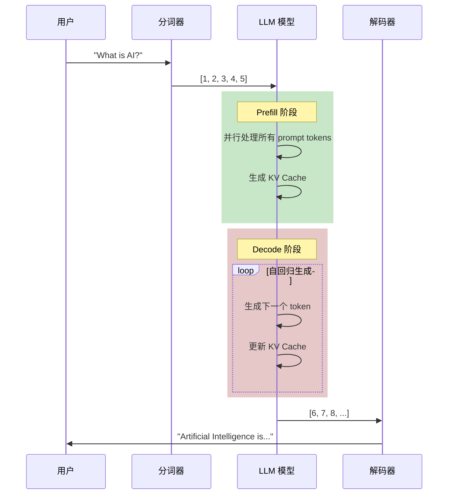

### 1.2 关键指标

| 指标 | 定义 | 重要性 |
|------|------|--------|
| **TTFT** | Time-To-First-Token，首 token 延迟 | 用户体验关键 |
| **TPS** | Tokens Per Second，生成速度 | 吞吐量指标 |
| **Latency** | 端到端延迟 | 总体响应时间 |
| **Throughput** | 单位时间处理的请求数 | 系统容量 |

---

## 2. Tokenization

### 2.1 什么是 Tokenization？

将文本转换为模型可以理解的数字序列。

```python
from transformers import AutoTokenizer

tokenizer = AutoTokenizer.from_pretrained("meta-llama/Llama-2-7b-hf")

text = "What is artificial intelligence?"
tokens = tokenizer.encode(text)
# [1, 1724, 338, 23116, 21082, 29973]

# 解码回文本
decoded = tokenizer.decode(tokens)
# "What is artificial intelligence?"
```

### 2.2 常见 Tokenization 方法

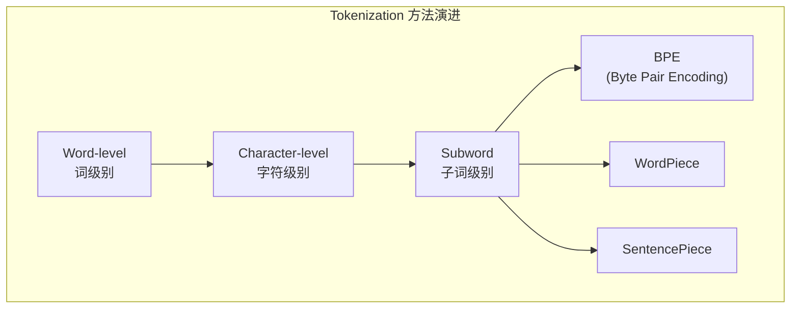

### 2.3 BPE 算法示例

```
原始文本: "low lower lowest"

迭代过程:
1. 初始词表: ['l', 'o', 'w', 'e', 'r', 's', 't', ' ']
2. 合并 'l' + 'o' -> 'lo'
3. 合并 'lo' + 'w' -> 'low'
4. 合并 'e' + 'r' -> 'er'
5. 合并 'e' + 's' -> 'es'
6. ...

最终: ['low', 'er', 'est']
```

---

## 3. Prefill 阶段

### 3.1 什么是 Prefill？

Prefill（预填充）是处理输入 prompt 的阶段，**并行**计算所有 prompt tokens 的 KV Cache。

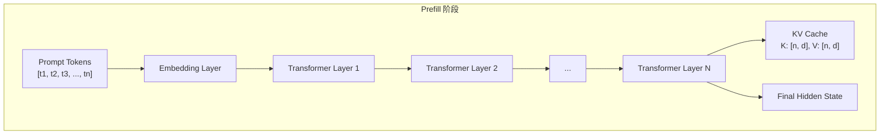

### 3.2 Prefill 的特点

| 特点 | 说明 |
|------|------|
| **并行计算** | 所有 prompt tokens 同时处理 |
| **Compute-Bound** | 计算密集，GPU 利用率高 |
| **一次性** | 每个请求只执行一次 |
| **生成 KV Cache** | 为 Decode 阶段准备缓存 |

### 3.3 Prefill 的计算量

```python
def estimate_prefill_flops(prompt_len, hidden_size, num_layers, num_heads):
    """估算 Prefill 阶段的计算量"""

    # 注意力计算: O(n^2 * d)
    attn_flops = 2 * prompt_len * prompt_len * hidden_size * num_layers

    # FFN 计算: O(n * d * 4d)
    ffn_flops = 2 * prompt_len * hidden_size * 4 * hidden_size * num_layers

    total_flops = attn_flops + ffn_flops
    return total_flops

# 示例：Llama-7B, prompt_len=1000
flops = estimate_prefill_flops(1000, 4096, 32, 32)
print(f"Prefill FLOPs: {flops / 1e12:.2f} TFLOPs")
```

### 3.4 CacheBlend 对 Prefill 的优化

CacheBlend 的核心贡献是**减少 Prefill 阶段的计算量**：

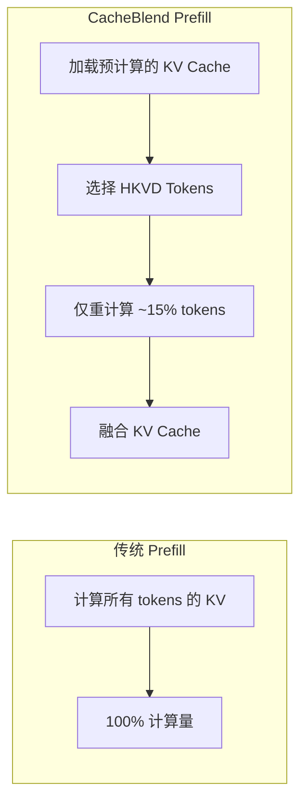

---

## 4. Decode 阶段

### 4.1 什么是 Decode？

Decode（解码）是自回归生成 token 的阶段，每次只生成**一个** token。

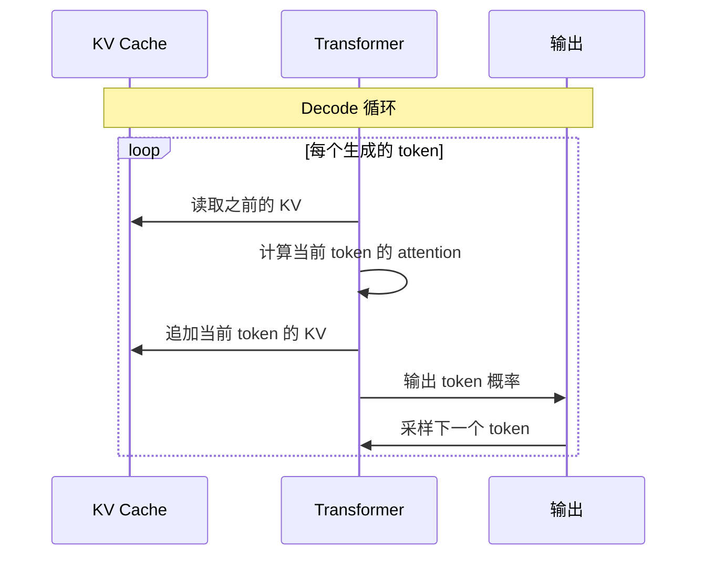

### 4.2 Decode 的特点

| 特点 | 说明 |
|------|------|
| **顺序生成** | 每次只生成一个 token |
| **Memory-Bound** | 内存带宽受限 |
| **使用 KV Cache** | 避免重复计算 |
| **延迟敏感** | 影响用户体验 |

### 4.3 Decode 的计算量

```python
def decode_step_flops(seq_len, hidden_size, num_layers):
    """单步 Decode 的计算量"""

    # 注意力: 只计算最后一个 token
    # Q 与 所有 K 的点积: O(seq_len * d)
    attn_flops = 2 * seq_len * hidden_size * num_layers

    # FFN: 只处理最后一个 token
    ffn_flops = 2 * hidden_size * 4 * hidden_size * num_layers

    return attn_flops + ffn_flops

# 对比
prefill_1000 = estimate_prefill_flops(1000, 4096, 32, 32)
decode_step = decode_step_flops(1000, 4096, 32)

print(f"Prefill (1000 tokens): {prefill_1000 / 1e9:.2f} GFLOPs")
print(f"Single Decode step:    {decode_step / 1e9:.2f} GFLOPs")
print(f"Ratio: {prefill_1000 / decode_step:.0f}x")
```

### 4.4 Decode 的瓶颈

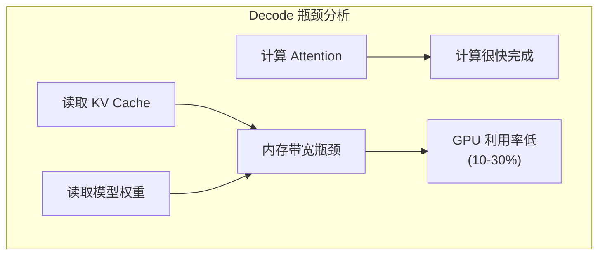

---

## 5. Memory-Bound vs Compute-Bound

### 5.1 两种瓶颈

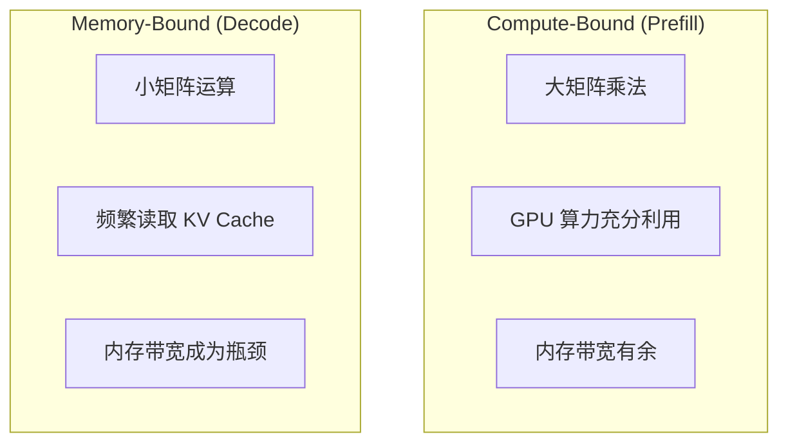

### 5.2 Roofline 模型

```
          ↑ Performance (FLOPs/s)
          │
    Peak  │         _______________
  Compute │        /
          │       /  Compute-Bound
          │      /   (Prefill)
          │     /
          │    /  Memory-Bound
          │   /   (Decode)
          │  /
          │ /
          └─────────────────────────→
                   Arithmetic Intensity (FLOPs/Byte)
```

### 5.3 优化策略

| 阶段 | 瓶颈 | 优化策略 |
|------|------|---------|
| Prefill | Compute | 算子融合、Flash Attention |
| Decode | Memory | KV Cache 压缩、批处理 |
| 两者 | - | 量化、Speculative Decoding |

---

## 6. Continuous Batching

### 6.1 传统 Batching 的问题

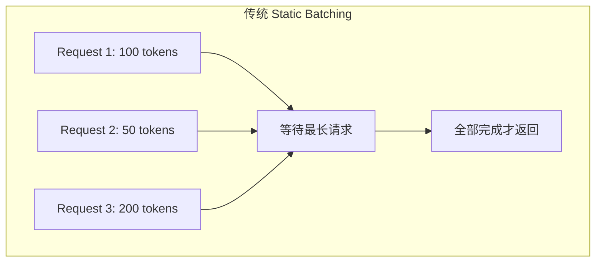

问题：短请求需要等待长请求完成。

### 6.2 Continuous Batching

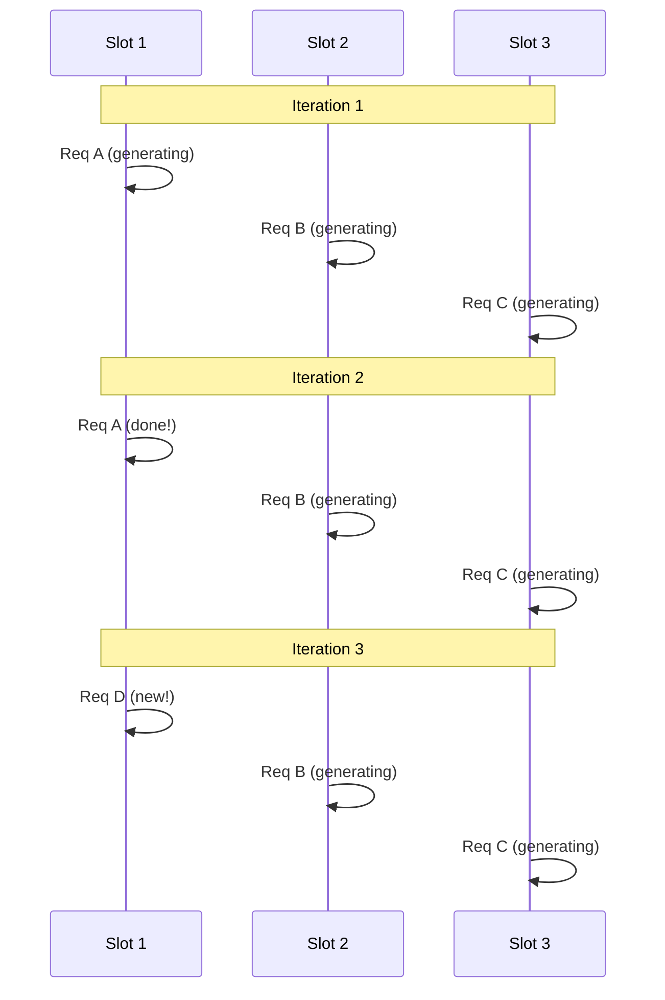

优势：
- 请求完成后立即返回
- 新请求立即加入
- GPU 利用率更高

---

## 7. vLLM 与 PagedAttention

### 7.1 vLLM 简介

vLLM 是目前最流行的 LLM 推理引擎，核心创新是 **PagedAttention**。

### 7.2 传统 KV Cache 的问题

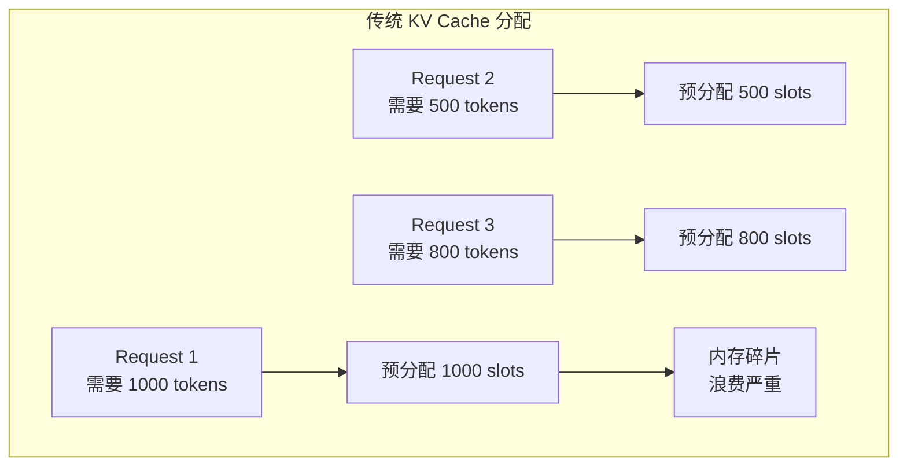

问题：
- 不知道生成多少 tokens，必须预分配最大长度
- 内存碎片化严重
- 难以支持长序列

### 7.3 PagedAttention 解决方案

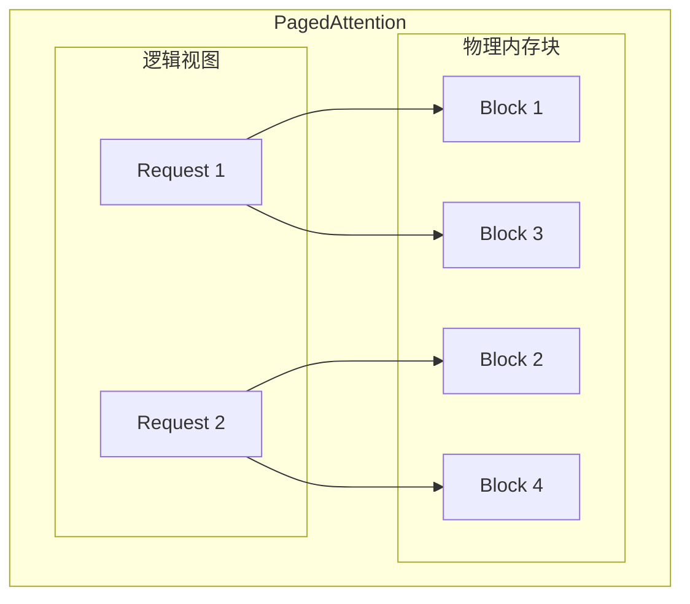

优势：
- **按需分配**: 用多少分配多少
- **无碎片**: 块大小固定
- **高效共享**: 相同 prefix 可共享

### 7.4 CacheBlend 在 vLLM 中的实现

CacheBlend 基于 vLLM 实现，主要修改：

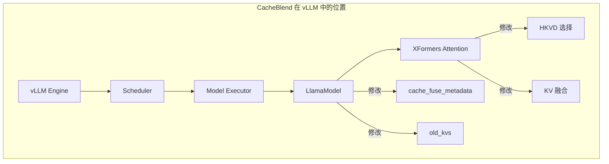

---

## 总结

本文介绍了 LLM 推理的核心流程：

1. **Tokenization**: 文本到数字的转换
2. **Prefill**: 并行处理 prompt，生成 KV Cache
3. **Decode**: 自回归生成，使用 KV Cache
4. **瓶颈分析**: Prefill 计算密集，Decode 内存密集
5. **Continuous Batching**: 提高 GPU 利用率
6. **PagedAttention**: 高效 KV Cache 管理

CacheBlend 的核心价值是**优化 Prefill 阶段**，通过选择性重计算减少延迟，同时保持生成质量。

---

## 下一步

- [KV Cache 基础原理](./04-kv-cache-fundamentals.md)
