> 深入理解 KV Cache 的工作原理、存储结构和优化方法，这是理解 CacheBlend 的核心前提。

---

## 目录

- [1. 为什么需要 KV Cache](#1-为什么需要-kv-cache)
- [2. KV Cache 的存储结构](#2-kv-cache-的存储结构)
- [3. KV Cache 的内存计算](#3-kv-cache-的内存计算)
- [4. KV Cache 复用](#4-kv-cache-复用)
- [5. KV Cache 优化技术](#5-kv-cache-优化技术)
- [6. RAG 场景的 KV Cache 挑战](#6-rag-场景的-kv-cache-挑战)

---

## 1. 为什么需要 KV Cache

### 1.1 自回归生成的重复计算问题

在没有 KV Cache 的情况下，每生成一个 token 都需要重新计算所有之前 token 的 K 和 V：

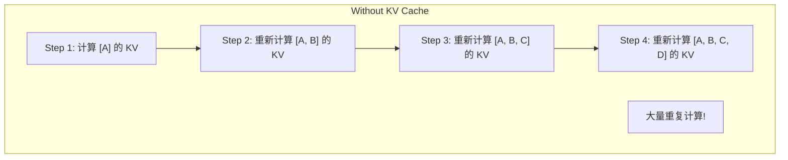

### 1.2 KV Cache 的解决方案

缓存已经计算过的 K 和 V，新 token 只需计算自己的 KV 并追加：

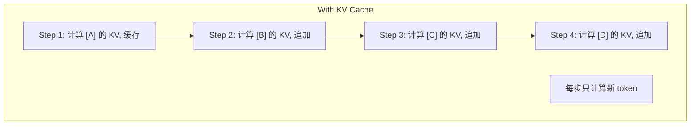

### 1.3 计算量对比

| 步骤 | 无 KV Cache | 有 KV Cache | 节省 |
|------|------------|------------|------|
| Step 1 | 1 token | 1 token | 0% |
| Step 2 | 2 tokens | 1 token | 50% |
| Step 3 | 3 tokens | 1 token | 67% |
| Step n | n tokens | 1 token | (n-1)/n |

生成 1000 tokens 时，KV Cache 减少了约 **99.9%** 的重复计算。

---

## 2. KV Cache 的存储结构

### 2.1 每层的 KV Cache

每个 Transformer 层都有独立的 KV Cache：

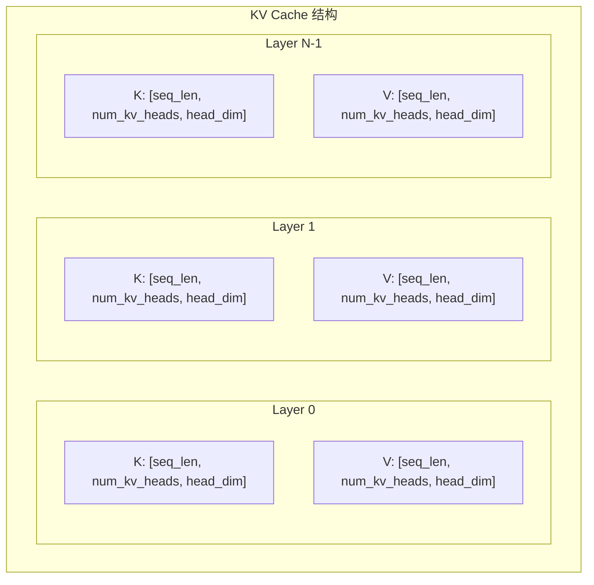

### 2.2 维度说明

以 LLaMA-7B 为例：

| 参数 | 值 | 说明 |
|------|---|------|
| num_layers | 32 | 层数 |
| hidden_size | 4096 | 隐藏维度 |
| num_attention_heads | 32 | 注意力头数 |
| num_kv_heads | 32 (MHA) / 8 (GQA) | KV 头数 |
| head_dim | 128 | 每个头的维度 |

### 2.3 PyTorch 中的表示

```python
# KV Cache 的典型存储方式
class KVCache:
    def __init__(self, num_layers, max_seq_len, num_kv_heads, head_dim, dtype):
        self.k_cache = torch.zeros(
            num_layers, max_seq_len, num_kv_heads, head_dim,
            dtype=dtype, device='cuda'
        )
        self.v_cache = torch.zeros(
            num_layers, max_seq_len, num_kv_heads, head_dim,
            dtype=dtype, device='cuda'
        )
        self.seq_len = 0

    def update(self, layer_idx, new_k, new_v):
        """追加新的 KV"""
        batch_len = new_k.shape[0]
        self.k_cache[layer_idx, self.seq_len:self.seq_len + batch_len] = new_k
        self.v_cache[layer_idx, self.seq_len:self.seq_len + batch_len] = new_v
        if layer_idx == 0:  # 只在第一层更新 seq_len
            self.seq_len += batch_len

    def get(self, layer_idx):
        """获取当前层的 KV"""
        return (
            self.k_cache[layer_idx, :self.seq_len],
            self.v_cache[layer_idx, :self.seq_len]
        )
```

---

## 3. KV Cache 的内存计算

### 3.1 内存公式

KV Cache 的内存占用：

$$
\text{Memory} = 2 \times L \times S \times H_{kv} \times D \times \text{sizeof(dtype)}
$$

其中：
- $2$: K 和 V 两个张量
- $L$: 层数
- $S$: 序列长度
- $H_{kv}$: KV 头数
- $D$: 每个头的维度
- $\text{sizeof(dtype)}$: 数据类型大小（FP16=2, FP32=4）

### 3.2 实际计算示例

```python
def calculate_kv_cache_memory(
    num_layers=32,
    seq_len=2048,
    num_kv_heads=8,  # GQA
    head_dim=128,
    dtype_bytes=2,  # FP16
    batch_size=1
):
    """计算 KV Cache 内存占用"""
    memory_bytes = (
        2  # K and V
        * num_layers
        * seq_len
        * num_kv_heads
        * head_dim
        * dtype_bytes
        * batch_size
    )
    return memory_bytes

# LLaMA-7B, 2048 tokens, batch_size=1
memory = calculate_kv_cache_memory()
print(f"KV Cache Memory: {memory / 1024**2:.2f} MB")
# 约 256 MB

# LLaMA-70B, 8192 tokens, batch_size=8
memory_70b = calculate_kv_cache_memory(
    num_layers=80,
    seq_len=8192,
    num_kv_heads=8,
    head_dim=128,
    batch_size=8
)
print(f"KV Cache Memory (70B): {memory_70b / 1024**3:.2f} GB")
# 约 10 GB
```

### 3.3 KV Cache 内存占用趋势

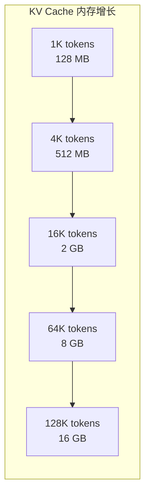

**关键观察**: KV Cache 内存随序列长度**线性增长**，成为长上下文的主要瓶颈。

---

## 4. KV Cache 复用

### 4.1 复用的动机

在很多场景下，多个请求共享相同的上下文：

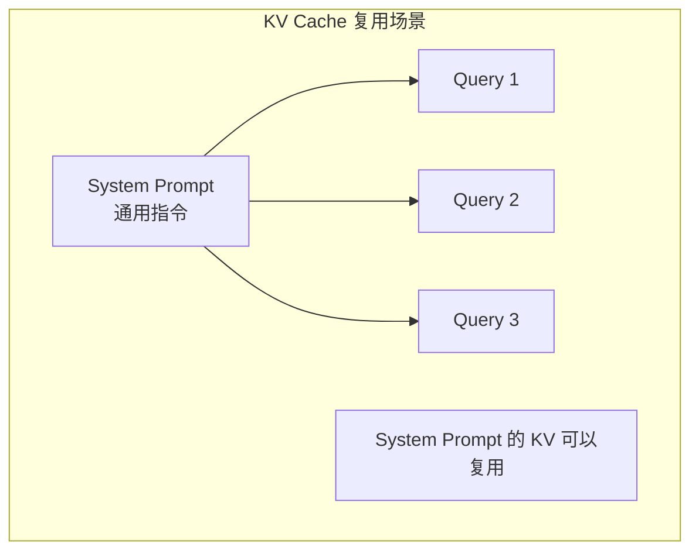

### 4.2 Prefix Caching

**原理**: 缓存相同前缀的 KV Cache

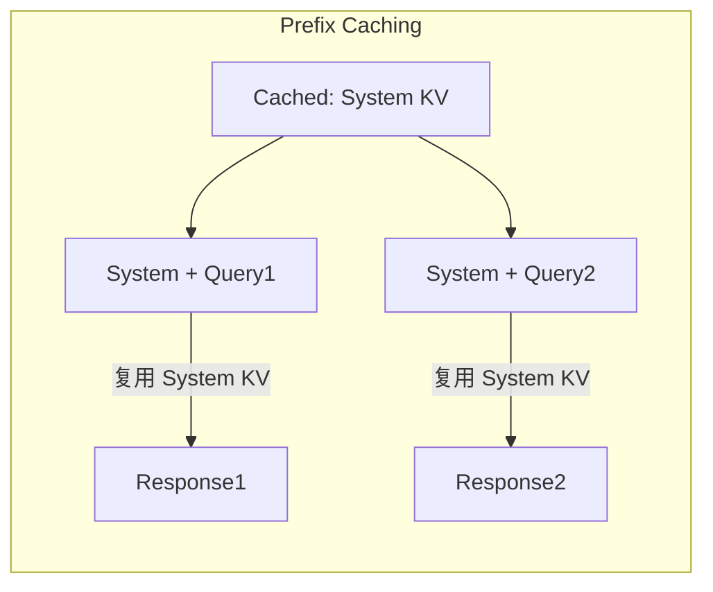

**限制**: 只能复用**连续的前缀**，中间的 chunk 无法复用。

### 4.3 CacheBlend 的创新

CacheBlend 突破了 Prefix Caching 的限制，支持**任意位置**的 KV Cache 复用：

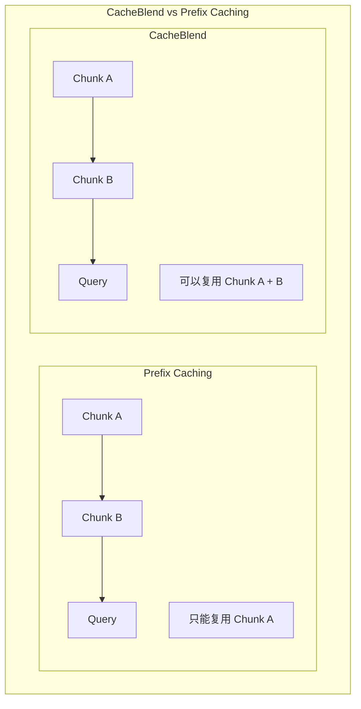

---

## 5. KV Cache 优化技术

### 5.1 优化方法总览

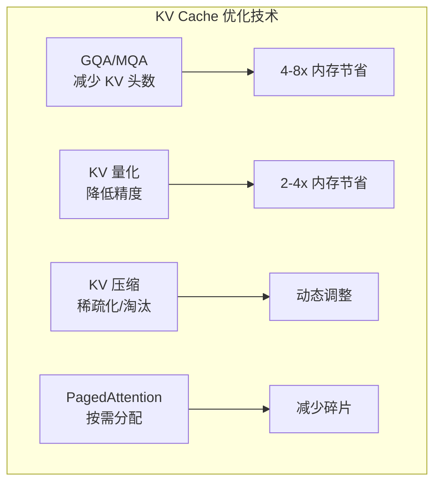

### 5.2 Grouped Query Attention (GQA)

```python
# MHA: 32 个 Q heads, 32 个 KV heads
# GQA: 32 个 Q heads, 8 个 KV heads (每 4 个 Q 共享 1 个 KV)

class GQA(nn.Module):
    def __init__(self, hidden_size, num_q_heads, num_kv_heads):
        self.num_q_heads = num_q_heads      # 32
        self.num_kv_heads = num_kv_heads    # 8
        self.num_groups = num_q_heads // num_kv_heads  # 4

        self.q_proj = nn.Linear(hidden_size, num_q_heads * head_dim)
        self.k_proj = nn.Linear(hidden_size, num_kv_heads * head_dim)  # 更小
        self.v_proj = nn.Linear(hidden_size, num_kv_heads * head_dim)  # 更小

    def forward(self, x, kv_cache=None):
        q = self.q_proj(x)  # [batch, seq, 32 * head_dim]
        k = self.k_proj(x)  # [batch, seq, 8 * head_dim]
        v = self.v_proj(x)  # [batch, seq, 8 * head_dim]

        # 扩展 K, V 以匹配 Q 的头数
        k = k.repeat_interleave(self.num_groups, dim=2)
        v = v.repeat_interleave(self.num_groups, dim=2)

        return attention(q, k, v)
```

### 5.3 KV Cache 量化

```python
# FP16 -> INT8 量化
def quantize_kv_cache(kv_cache, scale=None):
    """将 KV Cache 从 FP16 量化到 INT8"""
    if scale is None:
        scale = kv_cache.abs().max() / 127.0

    quantized = (kv_cache / scale).round().clamp(-128, 127).to(torch.int8)
    return quantized, scale

def dequantize_kv_cache(quantized, scale):
    """反量化"""
    return quantized.to(torch.float16) * scale
```

### 5.4 KV Cache 压缩（H2O, StreamingLLM）

```python
class H2OCache:
    """Heavy-Hitter Oracle: 保留高注意力权重的 KV"""

    def __init__(self, max_size, heavy_ratio=0.2):
        self.max_size = max_size
        self.heavy_ratio = heavy_ratio

    def update(self, k, v, attn_weights):
        if self.cache_len + 1 > self.max_size:
            # 根据累积注意力权重淘汰
            importance = attn_weights.sum(dim=0)  # 累积注意力
            keep_idx = importance.topk(int(self.max_size * self.heavy_ratio)).indices

            # 保留重要的 + 最近的
            self.k_cache = torch.cat([self.k_cache[keep_idx], k])
            self.v_cache = torch.cat([self.v_cache[keep_idx], v])
```

---

## 6. RAG 场景的 KV Cache 挑战

### 6.1 RAG 场景描述

RAG（Retrieval-Augmented Generation）需要将多个检索到的文本块作为上下文：

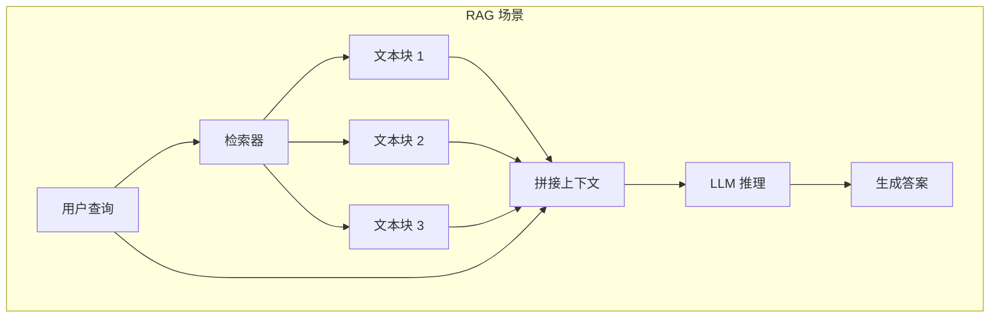

### 6.2 现有方案的问题

| 方案 | 优点 | 缺点 |
|------|------|------|
| **Full Recompute** | 质量最高 | TTFT 延迟大 |
| **Prefix Caching** | 可复用前缀 | 非前缀 chunk 无法复用 |
| **Full KV Reuse** | 速度最快 | 丢失 Cross-Attention，质量差 |

### 6.3 Cross-Attention 的问题

当直接复用 KV Cache 时，**Cross-Attention 会丢失**：

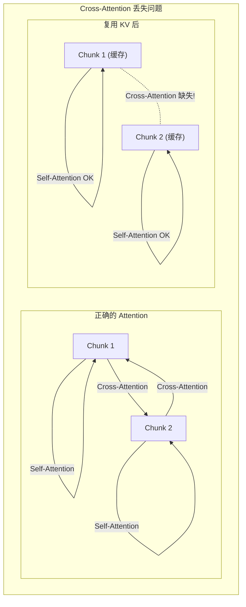

### 6.4 CacheBlend 的解决方案

CacheBlend 通过**选择性重计算**恢复 Cross-Attention：

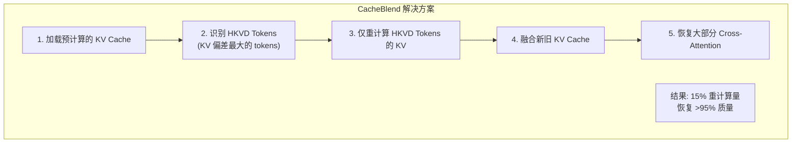

---

## 总结

本文介绍了 KV Cache 的核心概念：

1. **为什么需要 KV Cache**: 避免自回归生成中的重复计算
2. **存储结构**: 每层独立存储 K 和 V 张量
3. **内存计算**: 随序列长度线性增长
4. **复用技术**: Prefix Caching 的限制
5. **优化方法**: GQA、量化、压缩、PagedAttention
6. **RAG 挑战**: Cross-Attention 丢失问题

CacheBlend 正是为了解决 RAG 场景中 KV Cache 复用导致的 Cross-Attention 丢失问题而设计的。

---

## 下一步

现在你已经具备了理解 CacheBlend 的所有前置知识！

- [CacheBlend 背景与动机](../01-introduction/01-background.md)
- [CacheBlend 核心概念](../02-theory/01-core-concepts.md)
