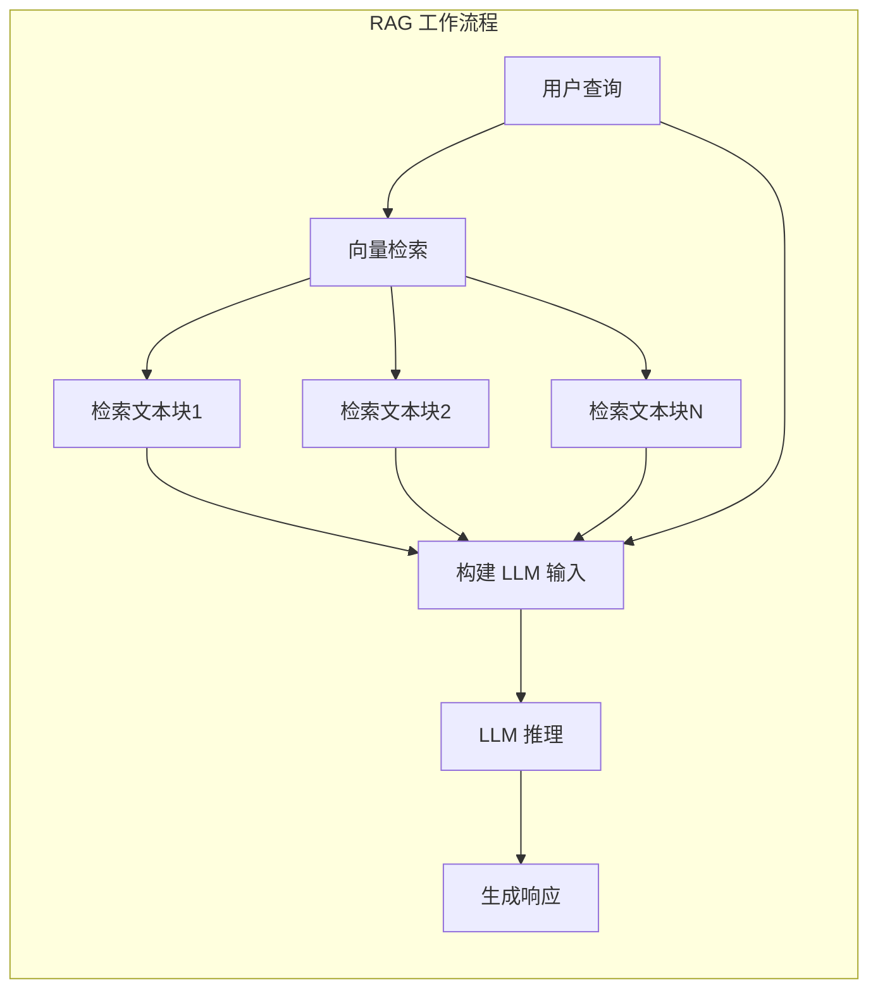
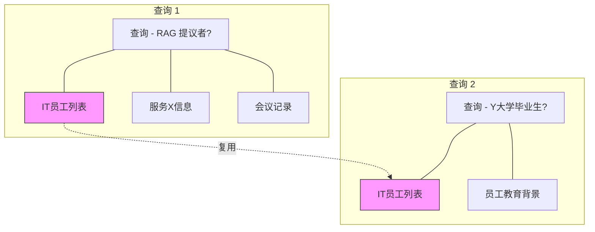
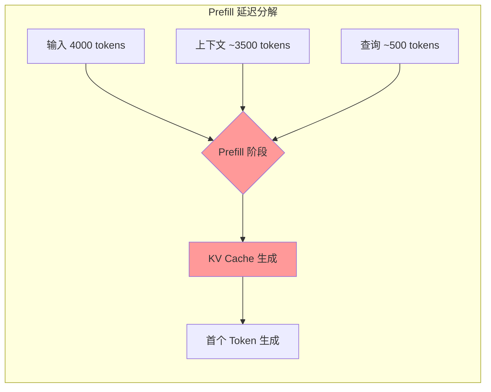

本节介绍大语言模型推理的核心挑战，特别是 RAG 场景下的延迟问题，以及 KV Cache 复用的价值和潜力。

---

## 1.1 大语言模型推理的挑战

大语言模型（Large Language Models, LLMs）在个人助理、医疗 AI、问答系统等领域展现出卓越的能力。为确保高质量和一致的响应，应用程序通常需要在用户查询中补充额外的文本，以提供必要的领域知识或用户特定信息的上下文。

一个典型的例子是 **Retrieval-Augmented Generation (RAG，检索增强生成)**，其中用户查询会被多个从数据库检索的文本块（text chunks）作为前缀，共同构成 LLM 的输入。

然而，这些上下文文本块会显著减慢 LLM 推理速度。这是因为在生成任何 token 之前，LLM 首先需要通过 **Prefill（预填充）** 阶段处理整个 LLM 输入，以生成 **KV Cache（键值缓存）**——这是与每个输入 token 相关联的张量的拼接，其中嵌入了该 token 与其前面 token 之间的"注意力"关系。

## 1.2 RAG 场景的特殊需求

RAG 场景有其独特的特点和挑战：

1. **多文本块输入**：为了回答一个查询，通常需要在 LLM 输入中添加多个文本块来提供不同的上下文
2. **文本复用**：相同的文本块经常被不同的 LLM 输入复用
3. **跨块交互**：不同文本块之间可能存在重要的语义关联，需要通过 Cross-Attention（交叉注意力）来捕获

让我们通过一个具体例子来理解这些需求：

> **场景**：一个使用 LLM 管理内部记录的公司
> **查询 1**："IT 部门的谁在上次全体会议上提议使用 RAG 来增强客户服务 X？"
> **查询 2**："IT 部门有哪些人毕业于 Y 大学？"
>
> 虽然这两个查询看起来不同，但它们都需要 IT 部门员工列表作为必要的上下文来生成正确答案。

## 1.3 KV Cache 复用的价值

由于复用的上下文通常包含比用户查询更多的信息，因此输入"上下文"部分的 Prefill 占据了 Prefill 开销的主要部分。理想情况下，存储和复用这些复用文本的 KV Cache 可以避免在不同 LLM 输入中重复使用这些文本时的 Prefill 开销。

**性能影响的量化**：
- 对于 4000 个 token 的输入（RAG 中的典型上下文长度）
- 在一个 A40 GPU 上运行 Prefill：
  - Llama-34B: 约 3 秒
  - Llama-70B: 约 6 秒
- 这导致用户在看到第一个生成词之前必须等待相当长的时间

---

## 下一步

接下来，我们将深入探讨现有 KV Cache 处理方案的问题，以及 CacheBlend 要解决的核心挑战：

- [问题定义与现有方案](./02-problem-definition.md)
