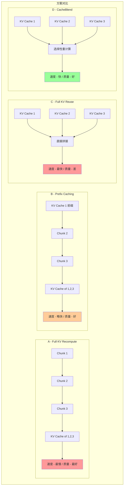
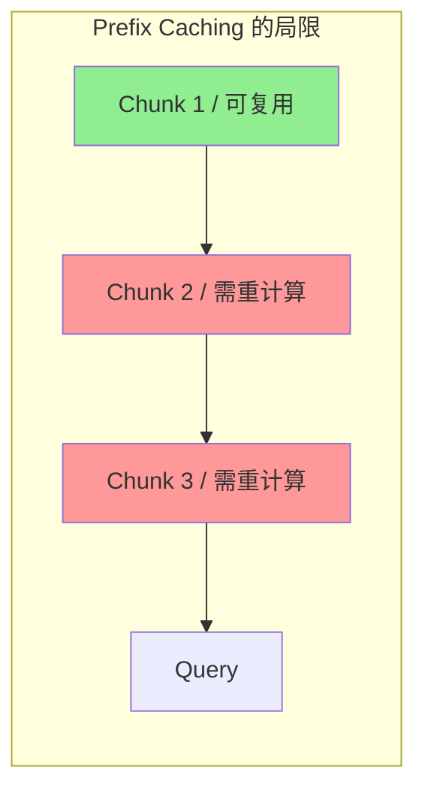
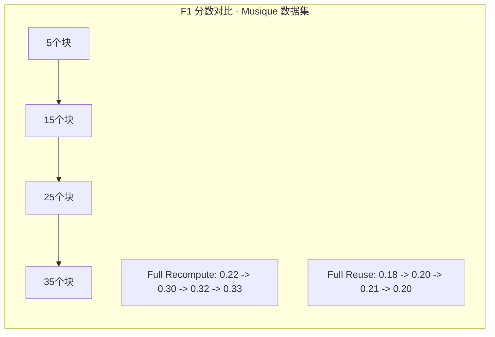
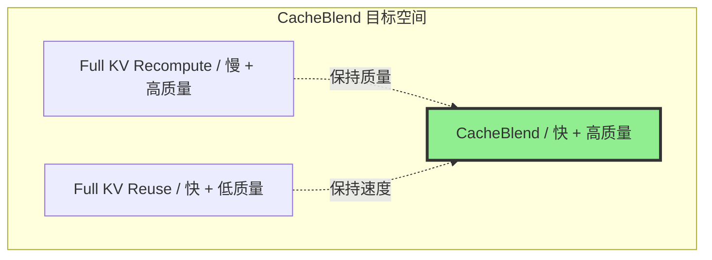

本节分析现有 KV Cache 处理方案的局限性，深入探讨 Cross-Attention 的重要性，并明确 CacheBlend 要解决的核心问题。

---

## 2.1 现有方案概述

目前存在三种主要的 KV Cache 处理方案：



## 2.2 Full KV Recompute（完全 KV 重计算）

**工作原理**：
- 将原始文本作为输入直接输入 LLM
- LLM 在 Prefill 期间计算所有 token 的 KV Cache

**优点**：
- 生成质量最高，包含完整的跨块注意力信息

**缺点**：
- 速度最慢，尤其是长输入时
- Prefill 延迟和计算量与输入长度超线性增长

## 2.3 Prefix Caching（前缀缓存）

**工作原理**：
- 预计算并存储可复用文本块的 KV Cache
- 如果文本块位于 LLM 输入的前缀位置，则可直接复用预计算的 KV Cache
- 代表系统：vLLM、SGLang、RAGCache

**优点**：
- 前缀的 KV Cache 不受后续文本影响，生成结果与完全重计算完全相同
- 对于单一前缀场景效果很好

**缺点**：
- 只能复用**第一个**文本块的 KV Cache
- 当输入包含多个文本块时，除第一个块外，其他块的 KV Cache 都无法复用
- 在 RAG 场景中，加速效果有限



## 2.4 Full KV Reuse（完全 KV 复用）

**工作原理**：
- 独立预计算每个文本块的 KV Cache
- 当复用的文本不在输入前缀位置时，通过调整位置编码来复用 KV Cache
- 代表系统：PromptCache

**优点**：
- 速度最快，几乎不需要重新计算

**缺点**：
- **忽略了跨块注意力**（Cross-Attention）
- 由于预计算时不知道前面的文本块，无法计算跨块的注意力信息
- 对于需要综合多个文本块信息的查询，会导致错误答案

## 2.5 Cross-Attention（跨块注意力）的重要性

让我们通过一个具体例子来说明跨块注意力为何重要：

**场景设置**：
- **Chunk 1**: "Lionel Messi scored 13 goals at FIFA World Cups."
- **Chunk 2**: "Cristiano Ronaldo scored 8 goals at FIFA World Cups."
- **Query**: "Who scored more goals at FIFA World Cups, Messi or Ronaldo?"

```mermaid
graph TB
    subgraph full_recompute["Full KV Recompute - 正确答案"]
        A1["Chunk 1 - Messi 13球"] --> A2["Chunk 2 - Ronaldo 8球"]
        A2 --> AQ["Query - 谁进球更多?"]
        AQ --> AA["Messi 进球比 Ronaldo 多"]

        A1 -.->|"Cross-Attention 建立关联"| A2
    end

    subgraph full_reuse["Full KV Reuse - 错误答案"]
        B1["KV - Messi 13球"]
        B2["KV - Ronaldo 8球"]
        BQ["Query - 谁进球更多?"]
        B1 --> BC["直接拼接"]
        B2 --> BC
        BQ --> BC
        BC --> BA["无法正确比较 答非所问"]

        B1 -.x|"无 Cross-Attention"| B2
    end

    style AA fill:#90EE90
    style BA fill:#ff9999
```

**Attention Matrix（注意力矩阵）对比**：

Full KV Recompute 的注意力矩阵包含完整的 Cross-Attention 区域，而 Full KV Reuse 的注意力矩阵在 Cross-Attention 区域为零（从未计算）。

```
Full KV Recompute:          Full KV Reuse:
┌─────────────────┐         ┌─────────────────┐
│ █████           │         │ █████           │
│ █████           │         │ █████           │
│ █████████████   │  vs     │ █████ 00000     │  <- Cross-Attention
│ █████████████   │         │ █████ 00000     │    区域缺失
│ ███████████████ │         │ █████ █████████ │
└─────────────────┘         └─────────────────┘
   Chunk1  Chunk2              Chunk1  Chunk2
```

## 2.6 实验验证：Cross-Attention 的影响

论文通过实验验证了 Cross-Attention 的重要性。在 Musique 和 2WikiMQA 两个多跳问答数据集上，随着检索的相关文本块数量增加：

1. **Full KV Recompute**（包含 Cross-Attention）的 F1 分数持续提升
2. **Full KV Reuse**（无 Cross-Attention）的 F1 分数明显低于前者
3. 差距随文本块数量增加而扩大



## 2.7 CacheBlend 的目标

CacheBlend 旨在解决一个核心挑战：

> **当 LLM 输入包含多个文本块时，如何快速组合它们各自预计算的 KV Cache，以达到与昂贵的 Full KV Recompute 相同的生成质量？**

换句话说，CacheBlend 追求同时获得：
- **Full KV Reuse 的速度**
- **Full KV Recompute 的质量**



---

## 下一步

了解了问题背景后，接下来我们将深入探讨 CacheBlend 的核心理论，包括选择性 KV 重计算的数学基础和关键洞察：

- [CacheBlend 核心理论](../02-theory/01-selective-recompute.md)
