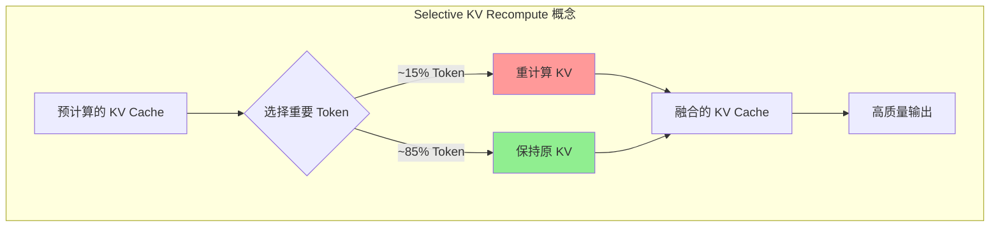
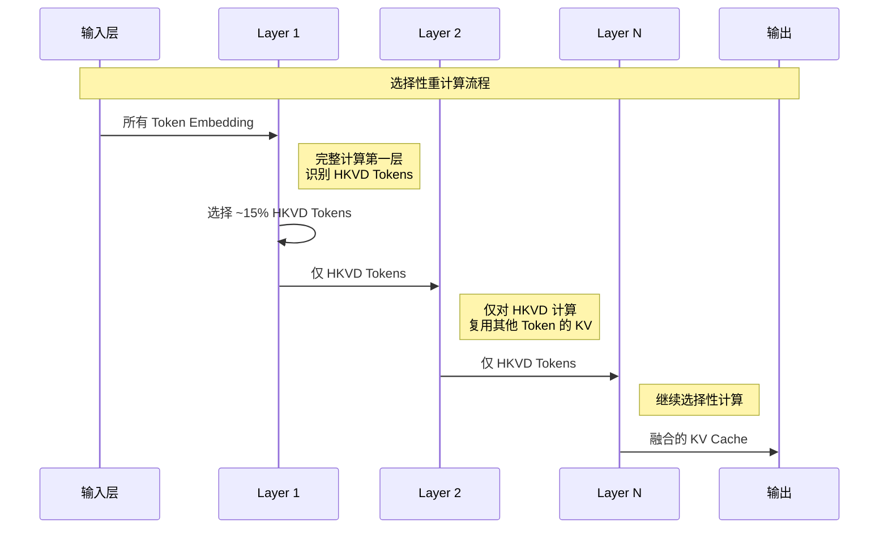
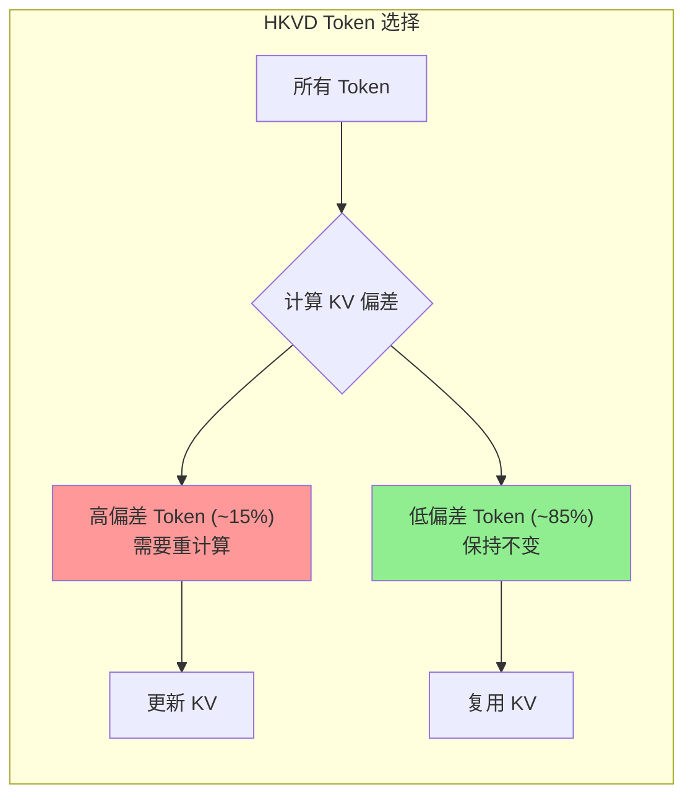

本文档介绍 CacheBlend 的核心思想，包括选择性 KV 重计算机制、工作流程概述以及 HKVD Tokens 的基本概念。这些是理解 CacheBlend 系统设计的基础。

---

## 2.1 CacheBlend 核心思想

### 2.1.1 Selective KV Recompute（选择性 KV 重计算）

CacheBlend 的核心思想是**选择性 KV 重计算**：

- **复用**：无论是否为前缀，都复用预计算的 KV Cache
- **选择性更新**：基于特定 LLM 输入中的前面文本，选择性地重新计算**一小部分 token** 的 KV 值，以部分更新每个复用的 KV Cache

**核心优势**：
1. 与 Full KV Recompute 相比：更新不到 15% 的 KV 通常可以生成相同质量的响应
2. 与 Full KV Reuse 相比：通过少量额外的 KV 更新获得更高的生成质量

### 2.1.2 工作流程概述

CacheBlend 按照传统的逐层方式执行 Prefill，但在每一层中，它只更新一小部分 token 的 KV，同时复用其他 token 的 KV：

### 2.1.3 HKVD Tokens 概念

**HKVD (High-KV-Deviation) Tokens（高 KV 偏差令牌）** 是指那些在预计算 KV Cache 和完整 Prefill KV Cache 之间差异最大的 token。

直觉上：
- 如果一个 token 与其他文本块的 token 有很低的注意力（低 Cross-Attention），其 KV 偏差会很低，不需要重计算
- 只有当一个 token 与其他文本块有高注意力时（高 KV 偏差），才需要重计算其 KV

---

## 下一步

- [数学基础与关键洞察](./02-mathematical-foundations.md) - 了解 CacheBlend 的数学理论基础
- [算法设计](./03-algorithm-design.md) - 深入理解 Token 选择策略和渐进过滤方案
