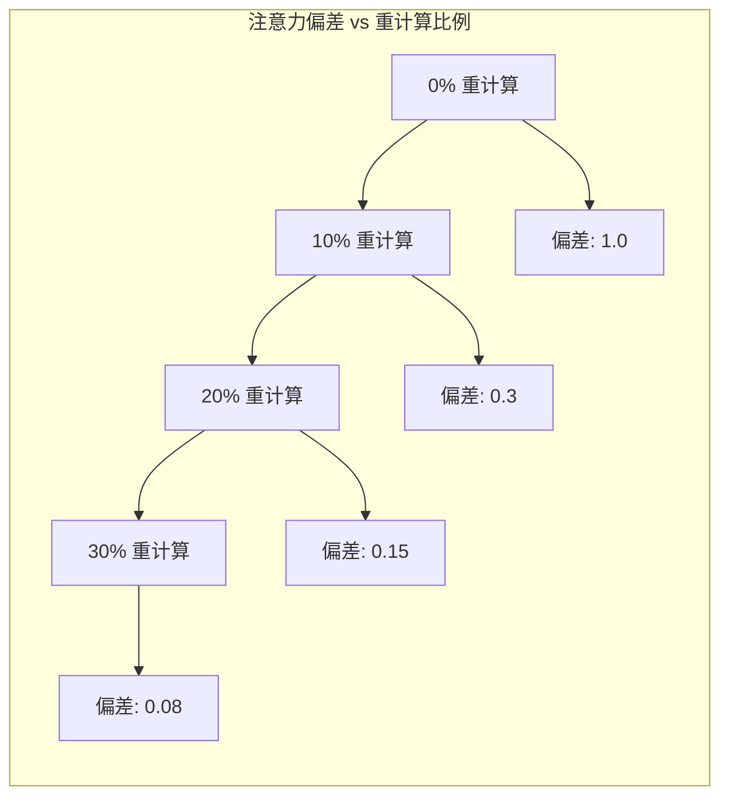
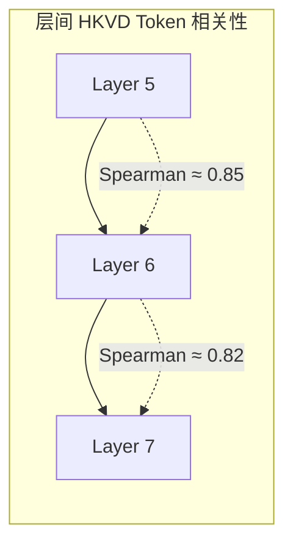
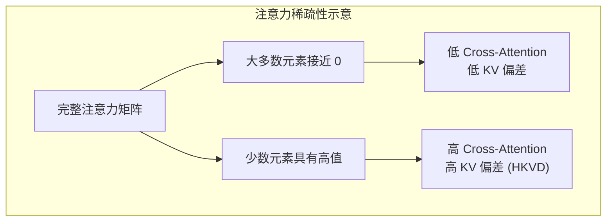

本文档详细介绍 CacheBlend 的数学理论基础，包括 KV 偏差和注意力偏差的形式化定义、RoPE 位置编码的关键性质，以及支撑 CacheBlend 设计的两个核心洞察。

---

## 2.2 数学基础

### 2.2.1 符号定义

| 符号 | 描述 |
|------|------|
| $i$ | 层索引 |
| $j$ | Token 索引 |
| $KV$ | KV Cache |
| $KV_i$ | 第 $i$ 层的 KV |
| $KV_i[j]$ | 第 $i$ 层第 $j$ 个 token 的 KV |
| $KV^{full}$ | 完全重计算的 KV Cache |
| $KV^{pre}$ | 预计算的 KV Cache |
| $KV^{new}$ | CacheBlend 更新后的 KV Cache |
| $A_i$ | 第 $i$ 层的前向注意力矩阵 |
| $A_i^{full}$ | Full KV Recompute 的前向注意力矩阵 |
| $A_i^{pre}$ | Full KV Reuse 的前向注意力矩阵 |
| $A_i^{new}$ | CacheBlend 的前向注意力矩阵 |

### 2.2.2 KV Deviation（KV 偏差）

**定义**：KV Cache $KV$ 在第 $i$ 层第 $j$ 个 token 的 **KV 偏差** 定义为 $KV_i[j]$ 与 $KV_i^{full}[j]$ 之间的绝对差：

$$\Delta_{kv}(KV_i, KV_i^{full})[j] = |KV_i[j] - KV_i^{full}[j]|$$

这衡量了给定 KV 在特定 token 和层上与完整 Prefill 的 KV Cache 相比有多大差异。

### 2.2.3 Attention Deviation（注意力偏差）

**定义**：第 $i$ 层的前向注意力矩阵 $A_i$ 的**注意力偏差**定义为其与 $A_i^{full}$ 差异的 L-2 范数：

$$\Delta_{attn}(A_i, A_i^{full}) = ||A_i - A_i^{full}||_2$$

Full KV Reuse 由于缺少 Cross-Attention 而导致前向注意力矩阵的偏差。

### 2.2.4 优化目标

使用这些符号，CacheBlend 的目标可以形式化为：

> 如何快速将预计算的 KV Cache $KV^{pre}$ 更新为新的 KV Cache $KV^{new}$，使得任意层 $i$ 上的注意力偏差 $\Delta_{attn}(A_i^{new}, A_i^{full})$ 最小化。

### 2.2.5 RoPE 位置编码

**Rotary Position Embedding (RoPE，旋转位置编码)** 是现代 LLM 中常用的位置编码方案。

**定义**：对于需要嵌入到位置 $m$ 的 query 向量 $q$ 和 key 向量 $k \in \mathbb{R}^d$，RoPE 编码位置信息如下：

$$q_m, k_m = R^d_{\Theta,m}\{q, k\}$$

其中旋转矩阵为：

$$R^d_{\Theta,m} = \begin{pmatrix}
\cos m\theta_0 & -\sin m\theta_0 & \cdots & 0 & 0 \\
\sin m\theta_0 & \cos m\theta_0 & \cdots & 0 & 0 \\
\vdots & \vdots & \ddots & \vdots & \vdots \\
0 & 0 & \cdots & \cos m\theta_{d/2-1} & -\sin m\theta_{d/2-1} \\
0 & 0 & \cdots & \sin m\theta_{d/2-1} & \cos m\theta_{d/2-1}
\end{pmatrix}$$

超参数 $\Theta \in \{\theta_i = 10000^{-2i/d}, i \in [0, 1, ..., d/2-1]\}$

### 2.2.6 RoPE 的关键性质：相对位置不变性

**命题**：RoPE 只依赖相对位置。

给定固定位置 $m$ 的 key 向量 $k_m$ 和位置 $(m+l)$ 的 query 向量 $q_{m+l}$，注意力分数 $q_{m+l}k_m$ 计算如下：

$$q_{m+l}k_m = (R^d_{\Theta,m+l}q)^T(R^d_{\Theta,m}k)$$
$$= \sum_{i=0}^{d/2-1}(q_{[2i]}k_{[2i]} + q_{[2i+1]}k_{[2i+1]})\cos l\theta_i$$

注意力分数 $q_{m+l}k_m$ 只依赖**相对距离** $l$，而不是绝对位置 $m$。

**对 CacheBlend 的意义**：
- 预计算的 KV Cache 中每个 chunk 的 K 向量必须用正确的位置编码调整
- 在 RoPE 中，这个修正只需将 K 向量乘以一个旋转矩阵
- 这一步开销可忽略不计，因为乘法只执行一次

---

## 2.3 关键洞察

### 2.3.1 Insight 1: HKVD Tokens 对注意力偏差的主导作用

> **洞察 1**：在第 $i$ 层，重计算具有更高 KV 偏差的 token $j$ 的 KV（即 $\Delta_{kv}(KV_i, KV_i^{full})[j]$）会以更大的幅度减少注意力偏差（即 $\Delta_{attn}(A_i, A_i^{full})$）。

**实验验证**：

论文的图 6 显示：
- 随着重计算比例增加，注意力偏差逐渐减少
- **最大的下降发生在重计算前几个最高 KV 偏差的 token 时**
- 约 10-15% 的重计算即可将偏差降到很低水平

### 2.3.2 Insight 2: 层间 HKVD Tokens 的高相关性

> **洞察 2**：在一层上具有最高 KV 偏差的 token 很可能在下一层也具有最高的 KV 偏差。

例如，如果第一层的 HKVD tokens 是 token 2、3 和 5，那么这三个 token 在第二层也可能比其他大多数 token 具有更高的 KV 偏差。

**实验验证**（图 8）：
论文使用 Spearman 秩相关系数衡量相邻层之间 token KV 偏差的相关性，发现一致的高相似性（> 0.8）。

**直觉解释**：
- 每个 token 的输入嵌入在 Transformer 模型的各层之间变化缓慢
- 因此，KV Cache（由输入嵌入通过线性变换生成）在各层之间也应该具有相似性

### 2.3.3 注意力稀疏性的理论基础

HKVD tokens 只占一小部分的原因可以用**注意力稀疏性**来解释——这是许多先前研究在 Transformer 模型中观察到的一个广泛性质。

**注意力稀疏性**指的是：在注意力矩阵中，高注意力通常只发生在少量 token 与其前面的 token 之间。

论文图 7 显示了 KV 偏差在不同 token 上的分布：
- 约 10-15% 的 token 具有明显高于其他 token 的 KV 偏差
- 这验证了 Cross-Attention 的稀疏性

---

## 下一步

- [算法设计](./03-algorithm-design.md) - 深入理解基于这些洞察的 Token 选择策略和渐进过滤方案
- [核心概念](./01-core-concepts.md) - 回顾 CacheBlend 的基本概念
