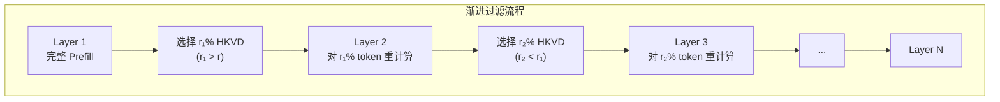

本文档详细介绍 CacheBlend 的算法设计，包括 Token 选择策略、基于层间相关性的解决方案、渐进过滤方案、选择性重计算的工作流程以及内存开销分析。

---

## 2.4 算法设计

### 2.4.1 Token 选择策略

如果我们要在第 $i$ 层重计算 $r\%$ 的 token 的 KV，我们应该选择具有最高 KV 偏差的 $r\%$ token。我们将这些 token 称为第 $i$ 层的 **HKVD tokens**。

但问题是：**如何在不知道真实 KV 值或注意力矩阵的情况下识别 HKVD tokens？**

朴素方法需要知道每一层的完整 Prefill $KV_i^{full}$，但这太昂贵了，违背了选择性 KV 重计算的目的。

### 2.4.2 基于层间相关性的解决方案

基于 Insight 2（层间 HKVD tokens 高度相关），一个直接的解决方案是：

1. 首先在第一层执行 Prefill
2. 选择第一层的 HKVD tokens
3. 在所有其他层只更新这些 token 的 KV

由于 LLM 通常有超过 30 层，这个过程可以比 Full KV Recompute 节省大部分计算。

### 2.4.3 Gradual Filtering（渐进过滤）方案

仅使用第一层不同 token 的注意力偏差可能不够可靠，特别是对于更深的层。因此，CacheBlend 采用**渐进过滤**方案：

**算法步骤**：
1. 如果平均每层要选择 $r\%$ HKVD tokens
2. 基于第一层的 token-wise 注意力偏差选择 $r_1\%$ token，其中 $r_1$ 略大于 $r$
3. 将这些作为第二层的 HKVD tokens
4. 在第二层重计算这 $r_1\%$ HKVD tokens 的 KV
5. 选择具有最高 token-wise 注意力偏差的 $r_2\%$ token，其中 $r_2$ 略小于 $r_1$
6. 将这些作为下一层的 HKVD tokens
7. 依此类推

**渐进过滤的优势**：
- 最终选择的 HKVD tokens 不仅在第一层具有高注意力偏差
- 而且在多个层上都具有高注意力偏差
- 这在经验上更可靠地识别每层的 HKVD tokens

### 2.4.4 选择性重计算的工作流程

**关键步骤**：
1. 首先在每层 $i$ 的输入上应用掩码，将其减少到选定 token 的子集
2. 然后将减少后的输入变换为 $Q_i$、$K_i$ 和 $V_i$ 向量（也仅限于选定 token）
3. 然后通过复用未选定 token 在第 $i$ 层的 KV Cache 条目来扩展 $K_i$ 和 $V_i$ 向量
4. 最后运行相同的注意力模块生成下一层的输入

**计算开销**：
- 计算开销与选定 token 的数量成正比
- 如果每层重计算 $r\%$ 的 token，总计算开销将是 Full Prefill 的 $r\%$

### 2.4.5 内存开销分析

虽然执行 HKVD 计算的层 $i$ 的 KV Cache 空间同时持有更新的 KV 和预计算的 KV，但一旦推理进入层 $i+1$，层 $i$ 的额外预计算 KV 立即被丢弃。这使得 HKVD 中的内存开销可以忽略不计。

---

## 下一步

- [系统设计](../03-system/01-architecture.md) - 了解 CacheBlend 的系统架构设计
- [核心概念](./01-core-concepts.md) - 回顾 CacheBlend 的基本概念
- [数学基础与关键洞察](./02-mathematical-foundations.md) - 回顾支撑算法设计的理论基础
