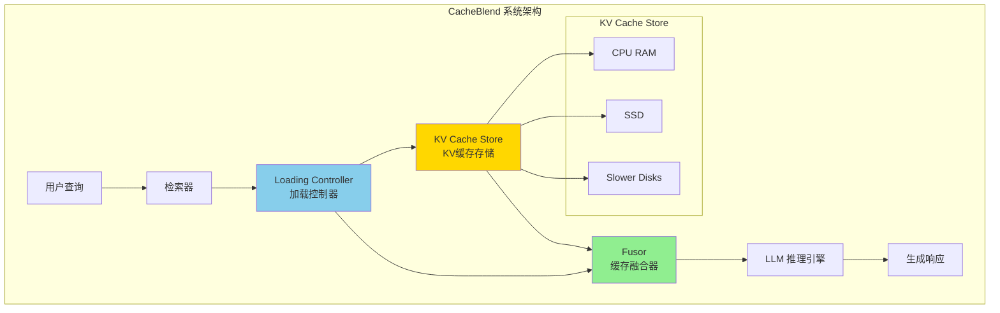
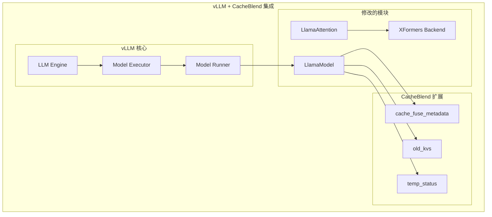
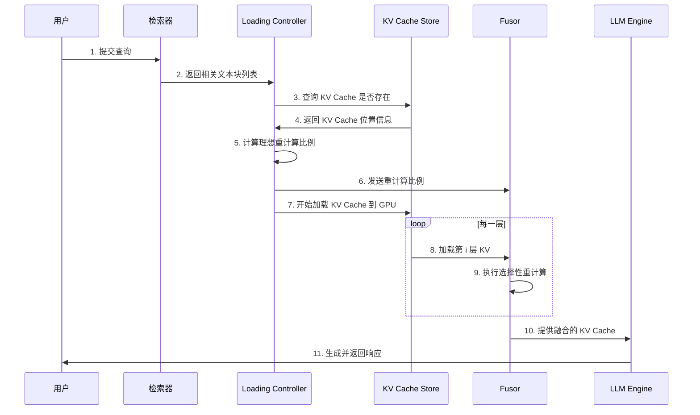

本文档介绍 CacheBlend 系统的整体架构设计，包括核心组件、与 vLLM 的集成方式以及数据流与控制流的详细说明。

---

## 3.1.1 CacheBlend 系统组件

CacheBlend 系统由三个主要组件组成：

## 3.1.2 与 vLLM 的集成

CacheBlend 在 vLLM 之上实现，约 3000 行 Python 代码。集成点包括：

## 3.1.3 数据流与控制流

---

**下一步**: [Loading Controller（加载控制器）](./02-loading-controller.md)
