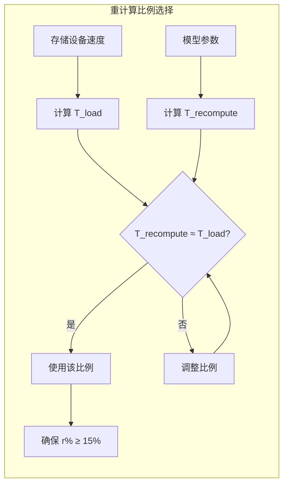
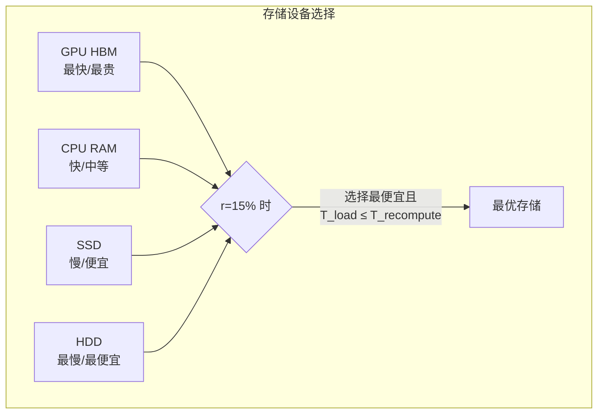

本文档详细介绍 CacheBlend 中的 Loading Controller 组件，它负责决定最优的重计算比例和存储设备选择，是实现延迟隐藏的关键。

---

## 3.2.1 核心洞察

> **基本洞察**：如果选择性 KV 重计算的延迟比将 KV 加载到 GPU 内存的时间更快，那么正确地流水线化选择性 KV 重计算和 KV 加载可以使 KV 重计算的额外延迟可忽略不计。

## 3.2.2 重计算比例估算

Loading Controller 使用两个延迟估算器来找到理想的重计算比例：

**重计算延迟估算器**：
$$T_{recompute}(r\%, LLM, L) = r\% \times Prefill(LLM, L)$$

其中 $Prefill(LLM, L)$ 是离线预测量的。

**加载延迟估算器**：
$$T_{load}(LLM, L, storage\_device) = \frac{PerTokenKVSize(LLM) \times L}{Throughput(storage\_device)}$$

**理想重计算比例计算**：
1. 选择 $r\%$ 使得 $T_{recompute}(r\%, LLM, L) = T_{load}(LLM, L, storage\_device)$
2. 取 $\max(r\%, r^*\%)$，其中 $r^*\%$ 是经验上质量损失可忽略的最小重计算比例（实践中约 15%）

## 3.2.3 存储设备选择

对于固定的重计算比例（如 15%），Loading Controller 还可以帮助选择最佳存储设备：

**问题**：如果只做固定选择性重计算比例（如 15%）的 KV 重计算，如何选择合适的存储设备来存储 KV，使其不会增加额外延迟？

**解决方案**：
1. 使用存储成本估算器估算每个设备存储 KV 的成本
2. 估算所有设备的重计算和加载延迟
3. 找出 $T_{recompute} \geq T_{load}$ 的最便宜存储设备

## 3.2.4 实际示例

**Llama-7B, 4K 上下文**：
- 重计算 15% token：3 ms/层
- 从 NVME SSD 加载一层 KV Cache：16 ms
- **结论**：KV 加载可以完全隐藏 KV 重计算延迟，无额外 TTFT

**Llama-70B, 4K 上下文**：
- 重计算 15% token：7 ms/层
- 从 NVME SSD 加载一层 KV Cache：4 ms
- **结论**：KV 加载不能完全隐藏重计算延迟，需要智能控制器调整

---

**上一步**: [整体架构](./01-architecture.md)

**下一步**: [KV Cache Store 与 Fusor](./03-kv-cache-store.md)
