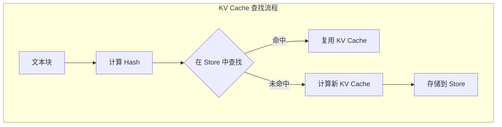
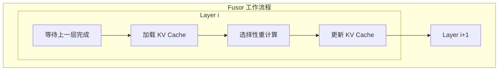

本文档介绍 CacheBlend 的两个核心组件：KV Cache Store（负责 KV 缓存的存储和检索）和 Fusor（负责缓存融合和选择性重计算）。

---

## 3.3 KV Cache Store（KV缓存存储）

### 3.3.1 文本分块策略

KV Cache Store 将 LLM 输入分割成多个文本块，每个块可以是复用的或新的：
- RAG 输入通常由多个检索的上下文块（通常是固定长度）和用户输入组成
- LLM 输入的分割是特定于应用的
- CacheBlend 实现了与近期工作相同的策略

### 3.3.2 Hash 映射机制

一旦输入被分割成文本块，每个块被哈希以找到其对应的 KV Cache：
- 与 vLLM 中的块哈希实现方式相同
- 如果找到匹配，复用 KV Cache
- 如果未找到，需要计算新的 KV Cache



### 3.3.3 LRU 驱逐策略

当存储设备满时，使用 LRU（Least Recently Used）策略驱逐 KV Cache：
- 驱逐最近最少使用的 KV Cache
- 保留最常用的 KV Cache

### 3.3.4 存储层级

CacheBlend 支持在单一存储设备层级中存储 KV Cache：
- CPU RAM
- SSD

哈希表保存在 CPU 中，因为其大小相对较小（一百万块约 16MB）。

---

## 3.4 Fusor（缓存融合器）

### 3.4.1 核心功能

Fusor（缓存融合器）通过选择性重计算合并预计算的 KV Cache：



### 3.4.2 层级处理流程

从算法 4.3 回顾，哪些 token 需要在一层重计算取决于前一层的重计算结果。因此：

1. Fusor 等待前一层的重计算完成
2. 第 $L$ 层的 KV Cache 被加载到 GPU 内存的队列中
3. 使用 Loading Controller 计算的重计算比例执行选择性重计算
4. Fusor 重复此过程直到所有层都被重计算

### 3.4.3 接口设计

CacheBlend 通过三个接口执行逐层部分 Prefill：

```python
# 接口 1: 获取 KV Cache
fetch_kv(text, layer_id) -> KVCache
# 给定文本和层 ID，从 KV Store 获取对应的 KV Cache
# 如果 KV Cache 不在系统中，返回 -1

# 接口 2: 部分 Prefill
prefill_layer(input_dict, KVCache) -> output_dict
# 接收输入和当前层的 KV Cache，执行该层的部分 Prefill
# 输出用作下一层的输入

# 接口 3: 同步
synchronize()
# 在每层 Prefill 前需要同步，确保该层的 KV Cache 已加载到 GPU
```

---

**上一步**: [Loading Controller](./02-loading-controller.md)

**下一步**: [Pipeline 优化](./04-pipeline-optimization.md)
