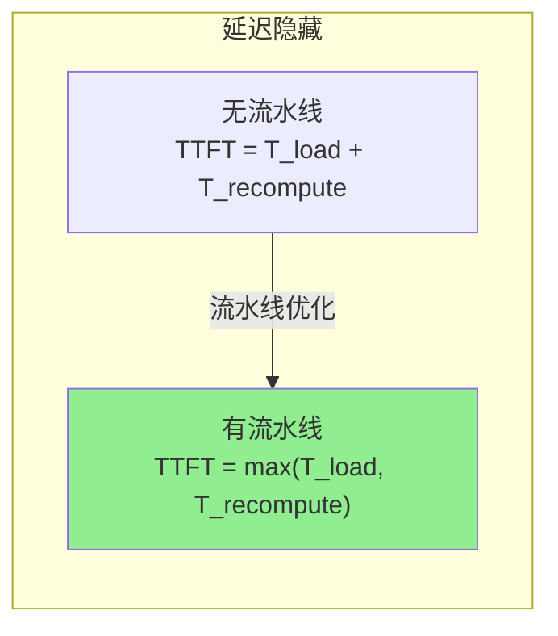
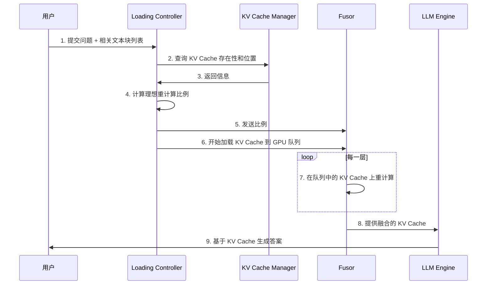

本文档介绍 CacheBlend 的流水线优化策略，通过将 KV Cache 加载与选择性重计算并行化，实现延迟隐藏，最大限度减少 TTFT（Time To First Token）。

---

## 3.5.1 流水线并行策略

CacheBlend 的一个关键优化是将 KV 加载与选择性重计算流水线化：

```mermaid
gantt
    title CacheBlend 流水线时序
    dateFormat X
    axisFormat %s

    section Layer 1
    加载 KV     :a1, 0, 16
    重计算      :a2, after a1, 3

    section Layer 2
    加载 KV     :b1, after a1, 16
    重计算      :b2, after b1, 3

    section Layer 3
    加载 KV     :c1, after b1, 16
    重计算      :c2, after c1, 3
```

## 3.5.2 两线程实现

在第 $i$ 层的部分 Prefill 中，使用两个线程来流水线化：
- **线程 1**：执行第 $i$ 层的计算（prefill_layer）
- **线程 2**：加载第 $i+1$ 层的 KV Cache（fetch_kv）

在 prefill_layer 之前调用 synchronize 以确保 Prefill 所需的 KV Cache 已加载到 GPU。

## 3.5.3 延迟隐藏效果

当加载延迟 >= 重计算延迟时：
- KV 重计算延迟被完全隐藏
- TTFT 不增加额外延迟

## 3.5.4 系统完整流程

将所有组件整合在一起：

---

**上一步**: [KV Cache Store 与 Fusor](./03-kv-cache-store.md)

**下一步**: [第四部分 - 代码实现深度解析](../04-implementation/README.md)
