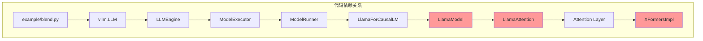

本文档介绍 CacheBlend 项目的整体结构，包括目录布局、核心文件清单以及代码依赖关系，帮助开发者快速了解项目组织方式。

## 目录结构概览

```
CacheBlend/
├── README.md                          # 项目说明文档
├── requirements.txt                   # Python 依赖 (rouge_score)
├── 2405.16444v3.pdf                   # 论文 PDF
├── example/                           # 示例脚本
│   ├── blend.py                       # 基础示例
│   ├── blend_musique.py               # MusiQue 数据集评估
│   ├── blend_samsum.py                # SAMSum 数据集评估
│   ├── blend_wikimqa.py               # WikiMQA 数据集评估
│   └── utils.py                       # 工具函数
├── inputs/                            # 输入数据
│   ├── 1-10.json                      # 测试样本
│   ├── musique_s.json                 # MusiQue 数据集
│   ├── samsum.json                    # SAMSum 数据集
│   └── wikimqa_s.json                 # WikiMQA 数据集
└── vllm_blend/                        # 修改后的 vLLM
    ├── vllm/                          # 核心代码
    │   ├── attention/                 # 注意力机制
    │   │   ├── backends/
    │   │   │   └── xformers.py        # CacheBlend 核心
    │   │   └── layer.py               # 注意力层接口
    │   ├── model_executor/
    │   │   └── models/
    │   │       └── llama.py           # CacheBlend 核心
    │   ├── engine/                    # 推理引擎
    │   ├── core/                      # 核心模块
    │   └── worker/                    # Worker 进程
    ├── csrc/                          # CUDA 核心代码
    └── setup.py                       # 安装脚本
```

## 核心文件清单

| 文件 | 行数 | 核心功能 |
|------|------|----------|
| `llama.py` | ~523 | LlamaModel、LlamaAttention 实现，状态机管理 |
| `xformers.py` | ~571 | HKVD 选择、KV 融合、注意力计算 |
| `blend.py` | ~108 | 使用示例，展示完整工作流程 |
| `layer.py` | ~50 | 注意力层接口，参数传递 |

## 依赖关系图



---

**下一步**: [核心数据结构](./02-data-structures.md)
