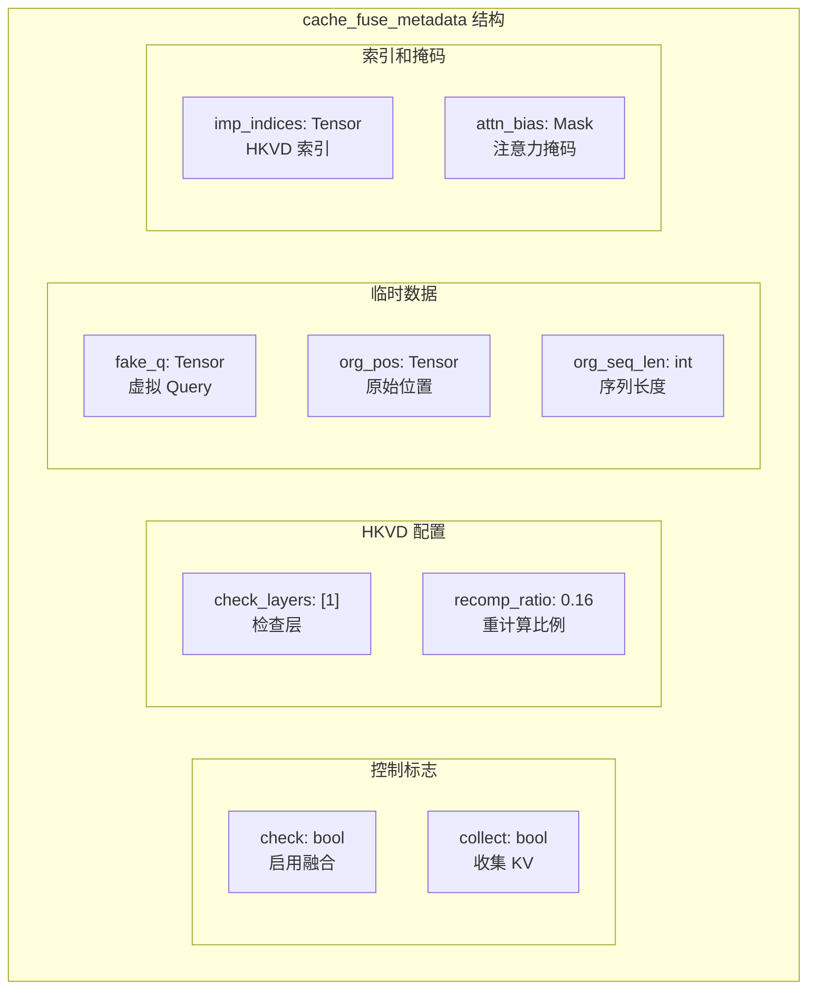

本文档详细介绍 CacheBlend 实现中的核心数据结构，包括 `cache_fuse_metadata` 配置字典、`old_kvs` KV 缓存管理以及 `hack_kv` 机制。

## cache_fuse_metadata 详解

`cache_fuse_metadata` 是 CacheBlend 的核心配置字典，定义在 `LlamaModel` 类中：

```python
# 文件: vllm_blend/vllm/model_executor/models/llama.py
# 位置: LlamaModel.__init__() 第 300-310 行

self.cache_fuse_metadata = {
    # === 控制标志 ===
    "check": False,              # 是否启用 CacheBlend 融合
    "collect": False,            # 是否收集当前层的 KV（用于初始化）

    # === HKVD 相关配置 ===
    "check_layers": [1],         # 哪些层执行 HKVD 选择（通常是第 1 层）
    "recomp_ratio": 0.16,        # 重计算比例（默认 16%）
    "recomp_ratios": [0.16],     # 每层的比例列表

    # === 临时数据 ===
    "fake_q": None,              # 用于旋转旧 K 的虚拟 query
    "org_pos": None,             # 原始位置编码
    "org_seq_len": None,         # 原始序列长度

    # === 缓存和索引 ===
    "original_slot_mapping": None,  # 原始 slot 映射
    "our_slot_mapping": None,       # 更新后的 slot 映射
    "imp_indices": None,            # HKVD token 的索引
    "attn_bias": None,              # 注意力掩码
    "kv_cache_dtype": None,         # KV Cache 数据类型
}
```



## 字段详细说明

| 字段 | 类型 | 说明 |
|------|------|------|
| `check` | bool | 主开关，True 时启用 CacheBlend 融合模式 |
| `collect` | bool | 收集模式，True 时在每层保存新计算的 KV 到 `hack_kv` |
| `check_layers` | List[int] | 执行 HKVD 选择的层索引列表，默认 [1] |
| `recomp_ratio` | float | 重计算 token 的比例，默认 0.16 (16%) |
| `fake_q` | Tensor | 用于旋转旧 K 向量的虚拟 Query，任意值即可 |
| `org_pos` | Tensor | 原始位置编码，用于正确旋转旧 KV |
| `org_seq_len` | int | 原始输入序列长度 |
| `imp_indices` | Tensor | 选定的 HKVD token 索引 |
| `attn_bias` | AttentionBias | 特殊的注意力掩码（LowerTriangularFromBottomRightMask） |
| `suffix_len` | int | 后缀长度（新增 token 数量），用于计算时保护后缀 |

## old_kvs 管理

`old_kvs` 存储预计算的 KV Cache，每层一个 [K, V] 对：

```python
# 文件: vllm_blend/vllm/model_executor/models/llama.py
# 位置: LlamaModel.__init__() 第 312 行

self.old_kvs = [[None, None]] * len(self.layers)  # [K, V] 对列表
```

**结构**：
```
old_kvs[layer_idx] = [K_tensor, V_tensor]
  - K_tensor: [seq_len, kv_size]
  - V_tensor: [seq_len, kv_size]
```

## hack_kv 机制

`hack_kv` 是 `LlamaAttention` 类的属性，用于在 `collect` 模式下保存当前层计算的 KV：

```python
# 文件: vllm_blend/vllm/model_executor/models/llama.py
# 位置: LlamaAttention.__init__() 第 156 行

self.hack_kv = []  # 临时存储 [K, V]
```

**用途**：
1. 在 `collect=True` 时，每次 forward 后保存 `[k.clone(), v.clone()]`
2. 外部代码可以读取这些值来构建 `old_kvs`

---

**上一步**: [项目结构](./01-project-structure.md)

**下一步**: [状态机实现](./03-state-machine.md)
