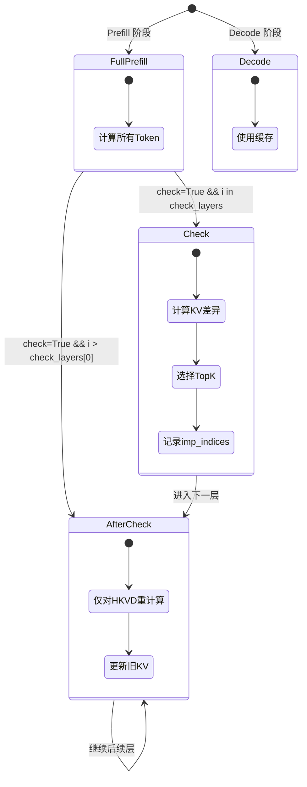

本文档详细介绍 CacheBlend 中的状态机设计，包括 `temp_status` 状态定义、状态转换逻辑以及各状态下的处理行为。

## temp_status 状态定义

CacheBlend 使用 `temp_status` 变量控制每层的处理模式：

| 状态值 | 名称 | 说明 |
|--------|------|------|
| -1 | Decode | 解码阶段，仅使用缓存 |
| 0 | Full Prefill | 完整预填充，计算所有 token |
| 1 | Check | 检查层，执行 HKVD 选择 + 计算差异 |
| 2 | After Check | 检查后层，使用选定的 HKVD token 更新 KV |



## 状态转换逻辑

```python
# 文件: vllm_blend/vllm/model_executor/models/llama.py
# 位置: LlamaModel.forward() 第 330-356 行

def forward(self, input_ids, positions, kv_caches, attn_metadata, ...):
    # 初始状态判断
    if attn_metadata.prefill_metadata:
        temp_status = 0  # Full Prefill
        if self.cache_fuse_metadata["check"]:
            # 初始化检查模式
            self.cache_fuse_metadata["org_seq_len"] = input_ids.shape[0]
            self.cache_fuse_metadata["fake_q"] = None
            self.cache_fuse_metadata["attn_bias"] = None
            self.cache_fuse_metadata["imp_indices"] = None
            self.cache_fuse_metadata['org_pos'] = positions[:]
    else:
        temp_status = -1  # Decode

    # 层循环中的状态转换
    for i in range(len(self.layers)):
        if self.cache_fuse_metadata["check"]:
            if i in self.cache_fuse_metadata["check_layers"]:
                temp_status = 1  # Check 层
            elif i > self.cache_fuse_metadata["check_layers"][0]:
                temp_status = 2  # After Check

        # 执行该层
        hidden_states, residual = layer(
            ...,
            status=temp_status,
            cache_fuse_metadata=self.cache_fuse_metadata,
            old_kv=self.old_kvs[i]
        )

        # Check 层后更新 positions
        if temp_status == 1:
            positions = positions[self.cache_fuse_metadata["imp_indices"]]
```

## 状态转换流程图

```mermaid
graph TB
    Start[开始] --> P{Prefill?}

    P -->|是| S0["temp_status = 0<br>(Full Prefill)"]
    P -->|否| SM1["temp_status = -1<br>(Decode)"]

    S0 --> C{check=True?}
    C -->|否| L0["遍历所有层<br>status=0"]
    C -->|是| Init["初始化元数据"]

    Init --> Loop["for i in layers"]
    Loop --> InCheck{i in check_layers?}

    InCheck -->|是| S1["temp_status = 1<br>(Check)"]
    InCheck -->|否| AfterCheck{i > check_layers[0]?}

    AfterCheck -->|是| S2["temp_status = 2<br>(After Check)"]
    AfterCheck -->|否| S0_2["temp_status = 0"]

    S1 --> ExecLayer["执行层 i"]
    S2 --> ExecLayer
    S0_2 --> ExecLayer

    ExecLayer --> UpdatePos{status==1?}
    UpdatePos -->|是| Filter["positions = positions[imp_indices]"]
    UpdatePos -->|否| Next
    Filter --> Next["下一层"]
    Next --> Loop

    style S1 fill:#ff9999
    style S2 fill:#ffcc99
```

---

**上一步**: [核心数据结构](./02-data-structures.md)

**下一步**: [LlamaModel 实现](./04-llama-model.md)
