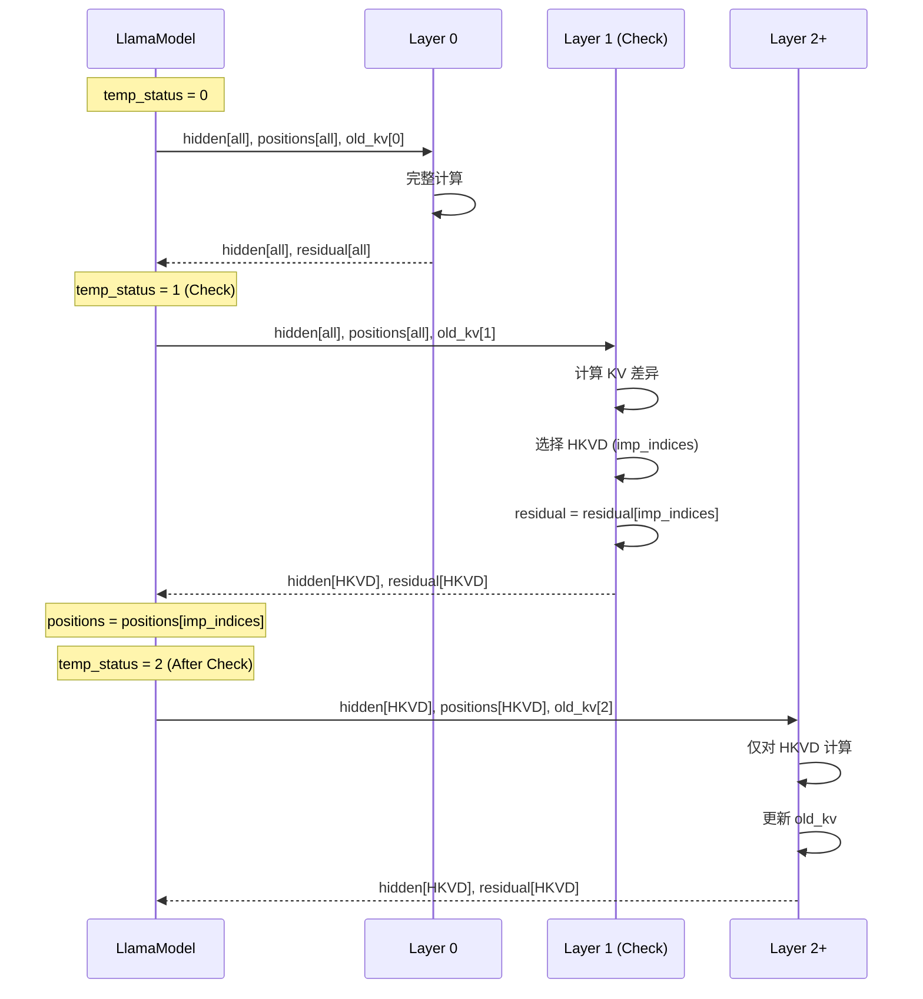

本文档详细介绍 CacheBlend 中 `LlamaModel` 类的实现，包括类结构、forward 方法的详细逻辑以及层间数据传递机制。

## 类结构

```python
# 文件: vllm_blend/vllm/model_executor/models/llama.py

class LlamaModel(nn.Module):
    """LLaMA 模型的主体实现"""

    def __init__(self, config, linear_method=None, lora_config=None):
        super().__init__()
        self.config = config

        # Token 嵌入层
        self.embed_tokens = VocabParallelEmbedding(...)

        # Transformer 层
        self.layers = nn.ModuleList([
            LlamaDecoderLayer(config, linear_method)
            for _ in range(config.num_hidden_layers)
        ])

        # 最终层归一化
        self.norm = RMSNorm(config.hidden_size, eps=config.rms_norm_eps)

        # CacheBlend 核心数据结构
        self.cache_fuse_metadata = {...}  # 配置字典
        self.old_kvs = [[None, None]] * len(self.layers)  # 预计算 KV
```

## forward 方法详解

```python
def forward(
    self,
    input_ids: Optional[torch.Tensor],
    positions: torch.Tensor,
    kv_caches: List[torch.Tensor],
    attn_metadata: AttentionMetadata,
    inputs_embeds: Optional[torch.Tensor] = None,
) -> torch.Tensor:
    """
    前向传播方法

    Args:
        input_ids: 输入 token ID [seq_len]
        positions: 位置编码 [seq_len]
        kv_caches: 每层的 KV Cache
        attn_metadata: 注意力元数据
        inputs_embeds: 可选的预计算嵌入

    Returns:
        hidden_states: 最终隐藏状态
    """
    # Step 1: 获取输入嵌入
    if inputs_embeds is not None:
        hidden_states = inputs_embeds
    else:
        hidden_states = self.get_input_embeddings(input_ids)

    # Step 2: 确定初始状态
    if attn_metadata.prefill_metadata:
        temp_status = 0  # Prefill 模式
        if self.cache_fuse_metadata["check"]:
            # 初始化 CacheBlend 元数据
            self.cache_fuse_metadata["org_seq_len"] = input_ids.shape[0]
            self.cache_fuse_metadata["fake_q"] = None
            self.cache_fuse_metadata["attn_bias"] = None
            self.cache_fuse_metadata["imp_indices"] = None
            self.cache_fuse_metadata["original_slot_mapping"] = None
            self.cache_fuse_metadata["our_slot_mapping"] = None
            self.cache_fuse_metadata['org_pos'] = positions[:]
    else:
        temp_status = -1  # Decode 模式

    residual = None

    # Step 3: 遍历所有层
    for i in range(len(self.layers)):
        # 状态转换
        if self.cache_fuse_metadata["check"]:
            if i in self.cache_fuse_metadata["check_layers"]:
                temp_status = 1  # Check 层
            elif i > self.cache_fuse_metadata["check_layers"][0]:
                temp_status = 2  # After Check

        # 获取当前层的旧 KV
        old_kv = self.old_kvs[i]

        # 执行层计算
        layer = self.layers[i]
        hidden_states, residual = layer(
            positions,
            hidden_states,
            kv_caches[i],
            attn_metadata,
            residual,
            status=temp_status,
            cache_fuse_metadata=self.cache_fuse_metadata,
            old_kv=old_kv
        )

        # Check 层后过滤 positions
        if temp_status == 1:
            positions = positions[self.cache_fuse_metadata["imp_indices"]]

    # Step 4: 最终层归一化
    hidden_states, _ = self.norm(hidden_states, residual)
    return hidden_states
```

## 层间数据传递图



---

**上一步**: [状态机实现](./03-state-machine.md)

**下一步**: [LlamaAttention 实现](./05-llama-attention.md)
