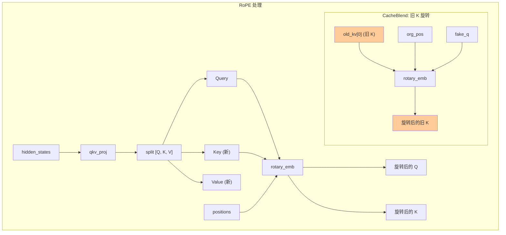

本文档详细介绍 CacheBlend 中 `LlamaAttention` 类的实现，包括类结构、forward 方法、RoPE 位置编码处理以及 hack_kv 收集逻辑。

## 类结构

```python
# 文件: vllm_blend/vllm/model_executor/models/llama.py

class LlamaAttention(nn.Module):
    """LLaMA 注意力层实现"""

    def __init__(
        self,
        hidden_size: int,
        num_heads: int,
        num_kv_heads: int,
        rope_theta: float = 10000,
        rope_scaling: Optional[Dict[str, Any]] = None,
        max_position_embeddings: int = 8192,
        ...
    ):
        super().__init__()

        # 头配置
        self.num_heads = num_heads
        self.num_kv_heads = num_kv_heads
        self.head_dim = hidden_size // num_heads
        self.q_size = self.num_heads * self.head_dim
        self.kv_size = self.num_kv_heads * self.head_dim

        # QKV 投影
        self.qkv_proj = QKVParallelLinear(...)
        self.o_proj = RowParallelLinear(...)

        # 旋转位置编码
        self.rotary_emb = get_rope(...)

        # 注意力层
        self.attn = Attention(...)

        # CacheBlend: hack_kv 存储
        self.hack_kv = []
```

## forward 方法详解

```python
def forward(
    self,
    positions: torch.Tensor,
    hidden_states: torch.Tensor,
    kv_cache: torch.Tensor,
    attn_metadata: AttentionMetadata,
    status,                    # CacheBlend: 状态
    cache_fuse_metadata,       # CacheBlend: 元数据
    old_kv,                    # CacheBlend: 旧 KV
) -> torch.Tensor:
    """
    注意力层前向传播

    Args:
        positions: 位置编码
        hidden_states: 输入隐藏状态
        kv_cache: 当前层的 KV Cache
        attn_metadata: 注意力元数据
        status: CacheBlend 状态 (-1, 0, 1, 2)
        cache_fuse_metadata: CacheBlend 配置
        old_kv: 预计算的 [K, V]

    Returns:
        output: 注意力输出
    """
    # Step 1: QKV 投影
    qkv, _ = self.qkv_proj(hidden_states)
    q, k, v = qkv.split([self.q_size, self.kv_size, self.kv_size], dim=-1)

    # Step 2: CacheBlend - 旋转旧 K
    # 在 Check 或 After Check 模式下，需要用原始位置旋转旧 K
    if status in [1, 2]:
        if cache_fuse_metadata["fake_q"] is None:
            # 创建虚拟 Query（任意值，只需要形状匹配）
            cache_fuse_metadata['fake_q'] = torch.rand_like(q)

        # 使用原始位置旋转旧 K
        _, old_kv[0] = self.rotary_emb(
            cache_fuse_metadata['org_pos'],  # 原始位置
            cache_fuse_metadata['fake_q'],   # 虚拟 Query
            old_kv[0]                        # 旧 K
        )

    # Step 3: CacheBlend - 收集新 KV
    if cache_fuse_metadata['collect']:
        self.hack_kv = [k.clone(), v.clone()]

    # Step 4: 旋转新 Q, K
    q, k = self.rotary_emb(positions, q, k)

    # Step 5: 执行注意力计算
    attn_output = self.attn(
        q, k, v, kv_cache, attn_metadata,
        status, cache_fuse_metadata, old_kv,
        self.kv_scale
    )

    # Step 6: 输出投影
    output, _ = self.o_proj(attn_output)
    return output
```

## RoPE 位置编码处理流程



## hack_kv 收集逻辑

```python
# 收集模式：保存当前计算的 K, V
if cache_fuse_metadata['collect']:
    self.hack_kv = [k.clone(), v.clone()]
```

**使用场景**：
1. 初始化阶段，对每个文本块单独运行 Prefill
2. `collect=True` 时，每层保存计算的 KV
3. 外部代码读取 `hack_kv` 并拼接到 `old_kvs`

---

**上一步**: [LlamaModel 实现](./04-llama-model.md)

**下一步**: [XFormers 后端实现](./06-xformers-backend.md)
