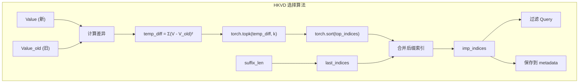
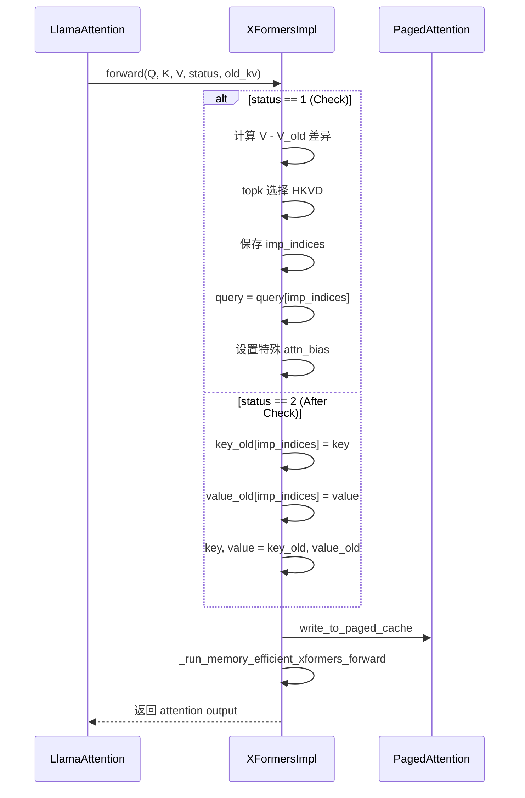
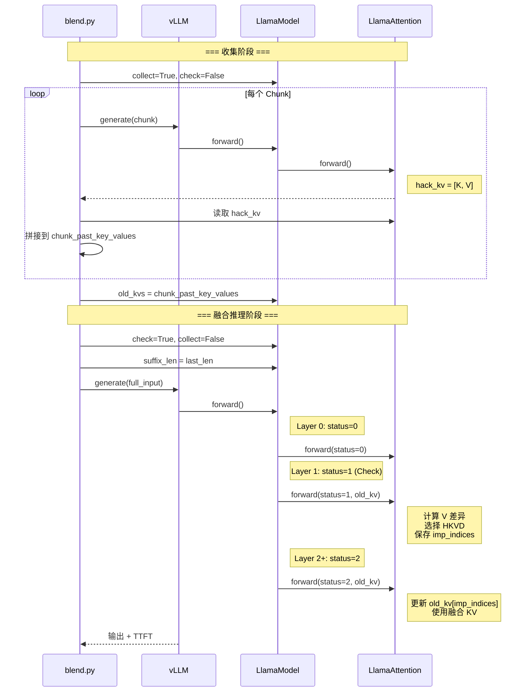

本文档详细介绍 CacheBlend 的 XFormers 注意力后端实现，包括 HKVD 选择算法、注意力掩码处理，以及示例代码 blend.py 的完整执行流程解析。

## XFormersImpl 类概述

```python
# 文件: vllm_blend/vllm/attention/backends/xformers.py

class XFormersImpl(AttentionImpl):
    """
    XFormers 注意力后端实现

    支持的输入布局:
    - Prefill: |<--prefill_0-->|<--prefill_1-->|...|<--prefill_N-1-->|
    - Decode:  |<--decode_0-->|..........|<--decode_M-1-->|<--padding-->|
    """

    def __init__(self, num_heads, head_size, scale, num_kv_heads=None, ...):
        self.num_heads = num_heads
        self.head_size = head_size
        self.scale = float(scale)
        self.num_kv_heads = num_kv_heads or num_heads
        self.num_queries_per_kv = self.num_heads // self.num_kv_heads
```

## forward 方法完整实现

```python
def forward(
    self,
    query: torch.Tensor,
    key: torch.Tensor,
    value: torch.Tensor,
    kv_cache: Optional[torch.Tensor],
    attn_metadata: AttentionMetadata[XFormersMetadata],
    kv_scale: float,
    status: int,               # CacheBlend 状态
    cache_fuse_metadata: dict, # CacheBlend 配置
    old_kv,                    # 旧 KV
) -> torch.Tensor:
    """
    XFormers 注意力前向传播

    Args:
        query: [num_tokens, num_heads * head_size]
        key: [num_tokens, num_kv_heads * head_size]
        value: [num_tokens, num_kv_heads * head_size]
        kv_cache: [2, num_blocks, block_size * num_kv_heads * head_size]
        attn_metadata: 注意力元数据
        kv_scale: KV 缩放因子
        status: CacheBlend 状态
        cache_fuse_metadata: CacheBlend 配置
        old_kv: 预计算的 [K, V]

    Returns:
        output: [num_tokens, num_heads * head_size]
    """
    # Step 1: Reshape
    num_tokens, hidden_size = query.shape
    query = query.view(-1, self.num_heads, self.head_size)
    key = key.view(-1, self.num_kv_heads, self.head_size)
    value = value.view(-1, self.num_kv_heads, self.head_size)

    # Step 2: CacheBlend - 处理旧 KV
    if status in [1, 2]:
        key_old = old_kv[0].view(-1, self.num_kv_heads, self.head_size)
        value_old = old_kv[1].view(-1, self.num_kv_heads, self.head_size)

    # Step 3: CacheBlend - HKVD 选择 (status=1)
    if status in [1]:
        last_len = cache_fuse_metadata['suffix_len']
        total_len = value.shape[0]

        # 构建后缀索引（必须保留）
        last_indices = [total_len - last_len + l for l in range(last_len)]

        # 计算重计算 token 数量
        topk_num = int((total_len - last_len) * cache_fuse_metadata["recomp_ratio"])

        # 核心：计算 Value 的 L2 差异
        temp_diff = torch.sum(
            (value[:-last_len, :, :] - value_old[:-last_len, :, :]) ** 2,
            dim=[1, 2]
        )

        # 选择差异最大的 top-k token
        top_indices = torch.topk(temp_diff, k=topk_num).indices
        top_indices, _ = torch.sort(top_indices)

        # 合并 HKVD 索引和后缀索引
        top_indices = torch.cat([
            top_indices,
            torch.tensor(last_indices, device=top_indices.device)
        ])

        # 过滤 Query
        query = query[top_indices]

        # 保存 HKVD 索引
        cache_fuse_metadata["imp_indices"] = top_indices

        # 设置特殊注意力掩码
        attn_bias = LowerTriangularFromBottomRightMask()
        cache_fuse_metadata["attn_bias"] = attn_bias
        attn_metadata.prefill_metadata.attn_bias = None

    # Step 4: 保存 KV Cache 数据类型
    cache_fuse_metadata["kv_cache_dtype"] = value.dtype

    # Step 5: CacheBlend - KV 融合 (status=2)
    if status in [2]:
        imp_indices = cache_fuse_metadata["imp_indices"]
        # 仅更新 HKVD token 的 KV
        key_old[imp_indices] = key
        value_old[imp_indices] = value
        # 使用融合后的 KV
        key = key_old
        value = value_old

    # Step 6: 写入 Paged Cache
    if kv_cache is not None:
        key_cache, value_cache = PagedAttention.split_kv_cache(...)
        PagedAttention.write_to_paged_cache(
            key, value, key_cache, value_cache,
            attn_metadata.slot_mapping,
            attn_metadata.kv_cache_dtype,
            kv_scale
        )

    # Step 7: 处理 token 数量
    if status in [1, 2]:
        num_prefill_tokens = attn_metadata.num_prefill_tokens
        output = torch.empty_like(query)
        decode_query = None
        key = key[:num_prefill_tokens]
        value = value[:num_prefill_tokens]
        assert query.shape[0] == len(cache_fuse_metadata["imp_indices"])
    else:
        # 正常路径：分离 prefill 和 decode
        num_prefill_tokens = attn_metadata.num_prefill_tokens
        num_decode_tokens = attn_metadata.num_decode_tokens
        output = torch.empty_like(query)
        decode_query = query[num_prefill_tokens:]
        query = query[:num_prefill_tokens]
        key = key[:num_prefill_tokens]
        value = value[:num_prefill_tokens]

    # Step 8: 执行注意力计算
    if prefill_meta := attn_metadata.prefill_metadata:
        if kv_cache is None or prefill_meta.block_tables.numel() == 0:
            out = self._run_memory_efficient_xformers_forward(
                query, key, value, prefill_meta,
                status, cache_fuse_metadata
            )
            output = out
        else:
            # Prefix-enabled attention
            out = PagedAttention.forward_prefix(...)
            output[:num_prefill_tokens] = out

    # Step 9: 处理 Decode（如果有）
    if decode_meta := attn_metadata.decode_metadata:
        output[num_prefill_tokens:] = PagedAttention.forward_decode(...)

    return output.view(-1, self.num_heads * self.head_size)
```

## HKVD 选择算法详解



**代码实现**：
```python
# 计算重计算 token 数量
topk_num = int((total_len - last_len) * cache_fuse_metadata["recomp_ratio"])

# 核心：计算 Value 的 L2 距离
# 形状: [prefix_len, num_kv_heads, head_size] -> [prefix_len]
temp_diff = torch.sum(
    (value[:-last_len, :, :] - value_old[:-last_len, :, :]) ** 2,
    dim=[1, 2]  # 在 head 和 dim 维度求和
)

# 选择差异最大的 token
top_indices = torch.topk(temp_diff, k=topk_num).indices
```

## 注意力掩码处理

CacheBlend 使用特殊的注意力掩码 `LowerTriangularFromBottomRightMask`：

```python
def _run_memory_efficient_xformers_forward(
    self, query, key, value, attn_metadata,
    status, cache_fuse_metadata
):
    # 处理 GQA/MQA
    if self.num_kv_heads != self.num_heads:
        query = query.view(query.shape[0], self.num_kv_heads,
                          self.num_queries_per_kv, query.shape[-1])
        key = key[:, :, None, :].expand(...)
        value = value[:, :, None, :].expand(...)

    # 设置注意力偏置
    if attn_metadata.attn_bias is None:
        if self.alibi_slopes is None:
            attn_metadata.attn_bias = BlockDiagonalCausalMask.from_seqlens(
                attn_metadata.prompt_lens
            )

    # 添加 batch 维度
    query = query.unsqueeze(0)
    key = key.unsqueeze(0)
    value = value.unsqueeze(0)

    # CacheBlend: 使用特殊掩码
    if status in [1, 2]:
        out = xops.memory_efficient_attention_forward(
            query, key, value,
            attn_bias=cache_fuse_metadata["attn_bias"],  # 特殊掩码
            p=0.0,
            scale=self.scale
        )
    else:
        out = xops.memory_efficient_attention_forward(
            query, key, value,
            attn_bias=attn_metadata.attn_bias,  # 标准掩码
            p=0.0,
            scale=self.scale
        )

    return out.view_as(original_query)
```

## 完整执行流程图



---

## 示例代码解析

### blend.py 完整流程

```python
# 文件: example/blend.py

from vllm import LLM, SamplingParams
import torch
import json
from transformers import AutoTokenizer

# ========== Step 1: 初始化 ==========
llm = LLM(
    model="mistralai/Mistral-7B-Instruct-v0.2",
    gpu_memory_utilization=0.5
)
tokenizer = AutoTokenizer.from_pretrained("mistralai/Mistral-7B-Instruct-v0.2")
llm.set_tokenizer(tokenizer)

# 遍历测试样本
for sample_idx in range(1, 11):
    # ========== Step 2: 加载数据 ==========
    f = open(f"inputs/{sample_idx}.json")
    ex = json.load(f)
    chunk_num = ex['chunk_num']
    doc_prompts = [ex[f'{i}'] for i in range(chunk_num)]
    q_prompt = ex['query']

    # Tokenize
    doc_chunk_ids = [tokenizer.encode(doc)[1:] for doc in doc_prompts]
    q_ids = tokenizer.encode(q_prompt)[1:]

    # ========== Step 3: 获取 CacheBlend 元数据 ==========
    cache_fuse_metadata = (
        llm.llm_engine
        .model_executor
        .driver_worker
        .model_runner
        .model
        .model
        .cache_fuse_metadata
    )

    # 初始化标志
    cache_fuse_metadata['collect'] = False
    cache_fuse_metadata['check'] = False

    # ========== Step 4: 准备特殊 token ==========
    s_start_full = [733, 4138, 28793]  # [INST] 开始
    s_start_len = len(s_start_full) + 1
    s_start = []
    s_start_1_len = len(s_start) + 1
    s_end = [733, 28748, 16289, 28793]  # [/INST] 结束
    s_end_len = len(s_end)

    # 构建 chunk ID 列表
    doc_chunk_ids = [s_start + chunk_ids for chunk_ids in doc_chunk_ids]
    doc_chunk_ids = [s_start_full] + doc_chunk_ids
    doc_chunk_ids = doc_chunk_ids + [s_start + q_ids + s_end]

    last_len = len([q_ids + s_end])

    # ========== Step 5: 收集阶段 - 构建 old_kvs ==========
    cache_fuse_metadata['collect'] = True
    cache_fuse_metadata["check"] = False

    num_layer = 32
    chunk_past_key_values = []

    # 对每个 chunk 运行 Prefill 并收集 KV
    for i in range(len(doc_chunk_ids)):
        prompts = [tokenizer.decode(doc_chunk_ids[i])]
        sampling_params = SamplingParams(temperature=0, max_tokens=1)
        llm.generate(prompts, sampling_params)

        # 从每层读取 hack_kv
        llm_layers = (
            llm.llm_engine
            .model_executor
            .driver_worker
            .model_runner
            .model
            .model
            .layers
        )

        for j in range(num_layer):
            past_key_values = llm_layers[j].self_attn.hack_kv

            if i == 0:
                # 第一个 chunk: 包含 [INST]
                temp_k = past_key_values[0][:s_start_len].clone()
                temp_v = past_key_values[1][:s_start_len].clone()
            else:
                # 后续 chunk: 不包含开头特殊 token
                temp_k = past_key_values[0][s_start_1_len:len(doc_chunk_ids[i])+1].clone()
                temp_v = past_key_values[1][s_start_1_len:len(doc_chunk_ids[i])+1].clone()

            if i == 0:
                chunk_past_key_values.append([temp_k, temp_v])
            else:
                # 拼接 KV
                chunk_past_key_values[j][0] = torch.cat(
                    (chunk_past_key_values[j][0], temp_k), dim=0
                )
                chunk_past_key_values[j][1] = torch.cat(
                    (chunk_past_key_values[j][1], temp_v), dim=0
                )

        # 更新 old_kvs
        llm.llm_engine.model_executor.driver_worker.model_runner.model.model.old_kvs = chunk_past_key_values

    # ========== Step 6: 构建完整输入 ==========
    input_ids = []
    for i in range(len(doc_chunk_ids)):
        if i == 0:
            temp_ids = doc_chunk_ids[i]
        else:
            temp_ids = doc_chunk_ids[i][s_start_1_len-1:]
        input_ids += temp_ids

    input_prompt = tokenizer.decode(input_ids)

    # ========== Step 7: CacheBlend 推理 ==========
    sampling_params = SamplingParams(temperature=0, max_tokens=10)
    cache_fuse_metadata["check"] = True      # 启用融合
    cache_fuse_metadata['collect'] = False
    cache_fuse_metadata['suffix_len'] = last_len

    output = llm.generate([input_prompt], sampling_params)
    print(f"Cached generation: {output[0].outputs[0].text}")
    print(f"TTFT with cache: {output[0].metrics.first_token_time - output[0].metrics.first_scheduled_time}")

    # ========== Step 8: 对比 - Full Prefill ==========
    sampling_params = SamplingParams(temperature=0, max_tokens=10)
    cache_fuse_metadata["check"] = False
    cache_fuse_metadata['collect'] = False

    output = llm.generate([input_prompt], sampling_params)
    print(f"Normal generation: {output[0].outputs[0].text}")
    print(f"TTFT with full prefill: {output[0].metrics.first_token_time - output[0].metrics.first_scheduled_time}")
    print("------------")
```

### 执行流程图

```mermaid
graph TB
    subgraph "blend.py 执行流程"
        A[初始化 LLM] --> B[加载数据]
        B --> C[获取 cache_fuse_metadata]
        C --> D[设置 collect=True]

        subgraph "收集阶段"
            D --> E[循环处理每个 Chunk]
            E --> F[运行 Prefill]
            F --> G[读取 hack_kv]
            G --> H[拼接到 chunk_past_key_values]
            H --> I[更新 old_kvs]
            I --> E
        end

        I --> J[构建完整输入]
        J --> K[设置 check=True]

        subgraph "融合推理"
            K --> L[运行 CacheBlend 推理]
            L --> M[输出结果 + TTFT]
        end

        M --> N[设置 check=False]

        subgraph "对比推理"
            N --> O[运行 Full Prefill]
            O --> P[输出结果 + TTFT]
        end
    end
```



### 数据流详解



### 关键参数配置

| 参数 | 值 | 说明 |
|------|-----|------|
| `collect` | True -> False | 收集阶段 True，融合阶段 False |
| `check` | False -> True | 收集阶段 False，融合阶段 True |
| `suffix_len` | last_len | 后缀长度，必须在 check=True 前设置 |
| `recomp_ratio` | 0.16 | 重计算比例，默认 16% |
| `check_layers` | [1] | 执行 HKVD 选择的层 |

---

**上一步**: [LlamaAttention 实现](./05-llama-attention.md)
