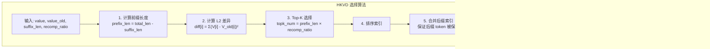

本文档详细介绍 CacheBlend 中 HKVD（High KV Divergence）Token 选择算法的原理与实现。该算法是 CacheBlend 的核心创新之一，通过识别 KV Cache 偏差最大的 Token 进行选择性重计算。

---

## 5.2.1 算法目标

选择 KV 偏差最大的 token，这些 token 需要重计算以恢复 Cross-Attention。

## 5.2.2 核心代码

```python
# 文件: vllm_blend/vllm/attention/backends/xformers.py
# 位置: XFormersImpl.forward() 第 204-221 行

if status in [1]:
    # 获取后缀长度（必须保留的 token）
    last_len = cache_fuse_metadata['suffix_len']
    total_len = value.shape[0]

    # 构建后缀索引
    last_indices = [total_len - last_len + l for l in range(last_len)]

    # 计算需要选择的 token 数量
    # (total_len - last_len) 是前缀长度
    # recomp_ratio 是重计算比例
    topk_num = int((total_len - last_len) * cache_fuse_metadata["recomp_ratio"])

    # 核心：计算 Value 的 L2 差异
    # value: [seq_len, num_kv_heads, head_size]
    # value_old: [seq_len, num_kv_heads, head_size]
    # temp_diff: [prefix_len]
    temp_diff = torch.sum(
        (value[:-last_len, :, :] - value_old[:-last_len, :, :]) ** 2,
        dim=[1, 2]
    )

    # 选择差异最大的 top-k
    top_indices = torch.topk(temp_diff, k=topk_num).indices

    # 排序以保持顺序
    top_indices, _ = torch.sort(top_indices)

    # 合并 HKVD 索引和后缀索引
    top_indices = torch.cat([
        top_indices,
        torch.tensor(last_indices, device=top_indices.device)
    ])

    # 过滤 Query
    query = query[top_indices]

    # 保存 HKVD 索引
    cache_fuse_metadata["imp_indices"] = top_indices

    # 设置特殊注意力掩码
    attn_bias = LowerTriangularFromBottomRightMask()
    cache_fuse_metadata["attn_bias"] = attn_bias
```

## 5.2.3 算法详解



## 5.2.4 为什么使用 Value 差异而不是 Key 差异？

从代码可以看出，HKVD 选择使用的是 Value 的差异：

```python
temp_diff = torch.sum((value[:-last_len,:,:] - value_old[:-last_len,:,:])**2, dim=[1,2])
```

原因：
1. Value 向量直接参与注意力输出的加权求和
2. Value 差异更能反映最终输出的差异
3. 实验表明 Value 差异与 Key 差异高度相关

## 5.2.5 后缀保护机制

后缀（新生成的部分）必须完全保留，不参与 HKVD 选择：

```python
# 后缀索引
last_indices = [total_len - last_len + l for l in range(last_len)]

# 合并时后缀放在最后
top_indices = torch.cat([top_indices, torch.tensor(last_indices, ...)])
```

这确保了新生成的 token 不会被过滤掉。

---

## 下一步

- [KV Cache 融合算法](./03-kv-fusion.md) - 了解如何将重计算的 KV 与旧 KV Cache 融合
