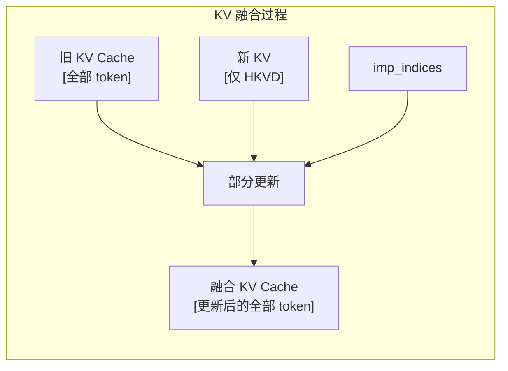
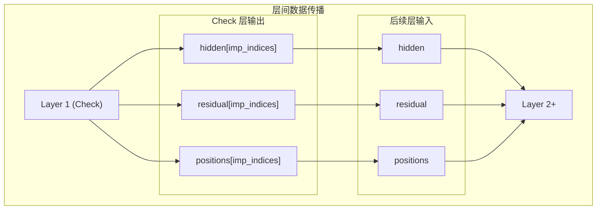
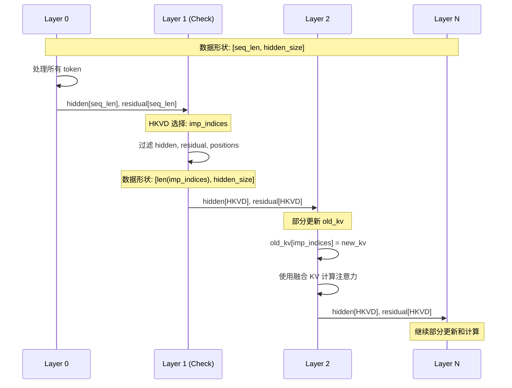

本文档详细介绍 CacheBlend 中 KV Cache 融合算法和层间传播算法的原理与实现。这两个算法协同工作，确保选择性重计算的结果正确传播到后续层。

---

## 5.3 KV Cache 融合算法

### 5.3.1 算法描述

在 status=2 的层中，将新计算的 HKVD token 的 KV 更新到旧 KV Cache 中。

### 5.3.2 核心代码

```python
# 文件: vllm_blend/vllm/attention/backends/xformers.py
# 位置: XFormersImpl.forward() 第 240-245 行

if status in [2]:
    # 获取 HKVD 索引
    imp_indices = cache_fuse_metadata["imp_indices"]

    # 核心：部分更新
    # 只更新 HKVD token 对应位置的 KV
    key_old[imp_indices] = key      # key 只包含 HKVD token
    value_old[imp_indices] = value  # value 只包含 HKVD token

    # 使用融合后的 KV 进行后续计算
    key = key_old
    value = value_old
```

### 5.3.3 融合过程图示



### 5.3.4 内存效率分析

这种部分更新策略非常高效：
- 只需要存储 HKVD token 的新 KV（约 15%）
- 直接在 old_kv 上原地更新
- 不需要额外的大内存分配

---

## 5.4 层间传播算法

### 5.4.1 残差连接处理

在 Check 层（status=1）之后，残差连接也需要过滤：

```python
# 文件: vllm_blend/vllm/model_executor/models/llama.py
# 位置: LlamaDecoderLayer.forward() 第 264-265 行

if status == 1:
    # 过滤残差，只保留 HKVD token 对应的部分
    residual = residual[cache_fuse_metadata["imp_indices"]]
```

### 5.4.2 位置编码过滤

在 LlamaModel 中，位置编码也需要过滤：

```python
# 文件: vllm_blend/vllm/model_executor/models/llama.py
# 位置: LlamaModel.forward() 第 373-376 行

if temp_status == 1:
    # 过滤位置编码，只保留 HKVD token 的位置
    positions = positions[self.cache_fuse_metadata["imp_indices"]]
```

### 5.4.3 层间数据一致性



### 5.4.4 完整的层间传播流程



---

## 下一步

- [实验设置](../06-experiments/01-setup.md) - 了解 CacheBlend 的实验评估方法
