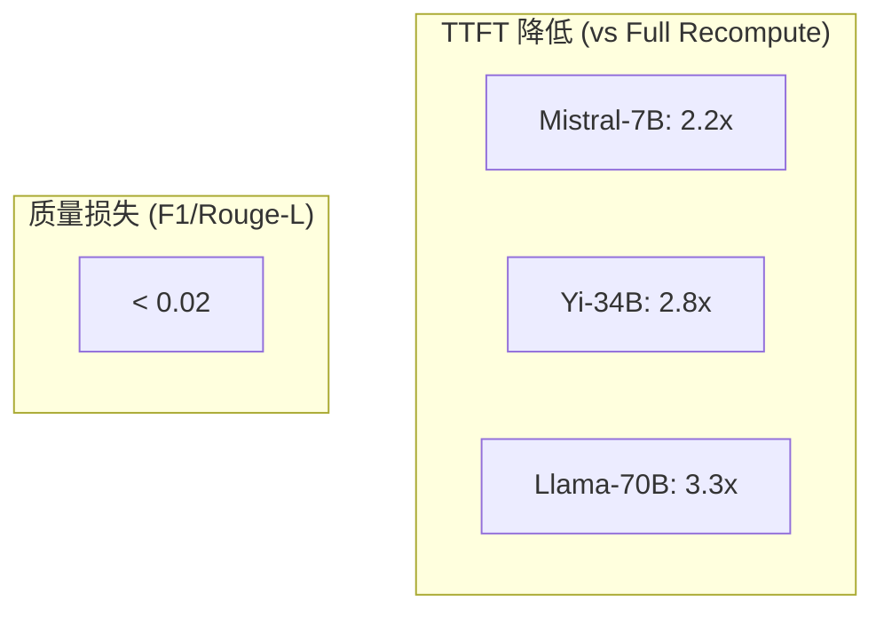
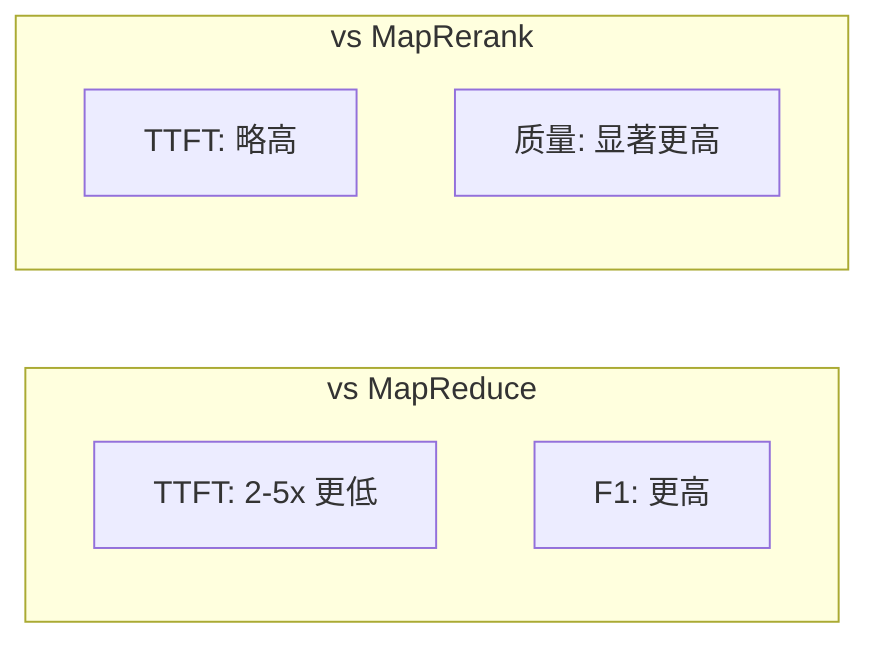

本文档详细介绍 CacheBlend 的实验结果，包括与基线方法的性能对比以及各种参数的敏感性分析。

---

## 6.2 性能结果

### 6.2.1 TTFT 与质量对比

**关键结论**：
- CacheBlend 相比 Full KV Recompute 降低 TTFT **2.2-3.3x**
- F1 和 Rouge-L 分数损失在 **0.02 以内**

### 6.2.2 吞吐量提升

| 模型 | vs Full Recompute | vs Prefix Caching |
|------|-------------------|-------------------|
| Mistral-7B | 2.8x | 2.1x |
| Yi-34B | 4.2x | 2.8x |
| Llama-70B | 5.0x | 3.3x |

### 6.2.3 与 Full KV Reuse 的质量对比

| 数据集 | Full KV Reuse | CacheBlend | 提升 |
|--------|---------------|------------|------|
| 2WikiMQA (F1) | 0.15-0.20 | 0.30-0.35 | +0.10-0.20 |
| Musique (F1) | 0.12-0.18 | 0.25-0.30 | +0.10-0.15 |
| SAMSum (Rouge-L) | 0.15-0.25 | 0.35-0.40 | +0.15-0.20 |
| MultiNews (Rouge-L) | 0.08-0.12 | 0.18-0.22 | +0.08-0.12 |

### 6.2.4 与 MapReduce/MapRerank 对比

---

## 6.3 敏感性分析

### 6.3.1 重计算比例影响

| 重计算比例 | F1 分数损失 | TTFT 降低 |
|------------|-------------|-----------|
| 5% | < 0.002 | 6.6x |
| 10% | < 0.002 | 5.3x |
| 15% | < 0.002 | 4.1x |
| 18% | < 0.002 | 3.4x |
| 50% | 0 | 2.0x |
| 100% | 0 (baseline) | 1.0x |

**最佳配置**: **15% 重计算比例**
- 质量损失可忽略（< 0.002）
- TTFT 降低 4.1x

### 6.3.2 Chunk 数量影响

| Chunk 数量 | TTFT (CacheBlend) | TTFT (Full Recompute) | 加速比 |
|------------|-------------------|----------------------|--------|
| 3 | 0.4s | 0.9s | 2.3x |
| 6 | 0.6s | 1.3s | 2.2x |
| 9 | 0.8s | 1.8s | 2.3x |
| 12 | 1.0s | 2.2s | 2.2x |

**结论**: 加速比在不同 chunk 数量下保持稳定

### 6.3.3 Chunk 长度影响

| Chunk 长度 | TTFT (CacheBlend) | TTFT (Full Recompute) | 加速比 |
|------------|-------------------|----------------------|--------|
| 300 tokens | 0.5s | 1.1s | 2.2x |
| 600 tokens | 0.8s | 1.6s | 2.0x |
| 900 tokens | 1.2s | 2.4s | 2.0x |

### 6.3.4 Batch Size 影响

| Batch Size | TTFT (CacheBlend) | TTFT (Full Recompute) |
|------------|-------------------|----------------------|
| 2 | 1.5s | 3.0s |
| 6 | 3.5s | 6.0s |
| 10 | 6.0s | 12.0s |

**结论**: 随着 batch size 增加，Prefill 开销变得更加主导，CacheBlend 的优势更加明显

### 6.3.5 存储设备影响

| 存储设备 | TTFT (CacheBlend) | TTFT (Full KV Reuse) |
|----------|-------------------|---------------------|
| CPU RAM | 0.5s | 0.3s |
| Slower Disk (4Gbps) | 1.2s | 1.0s |

**结论**:
- CacheBlend 在不同存储设备上都保持质量优势
- 存储越慢，CacheBlend 与 Full KV Reuse 的延迟差距越小
- 这是因为 CacheBlend 的延迟更多由加载延迟主导

---

## 下一步

- [相关工作对比](../07-advanced/01-related-work.md) - 了解 CacheBlend 与其他方法的对比分析
