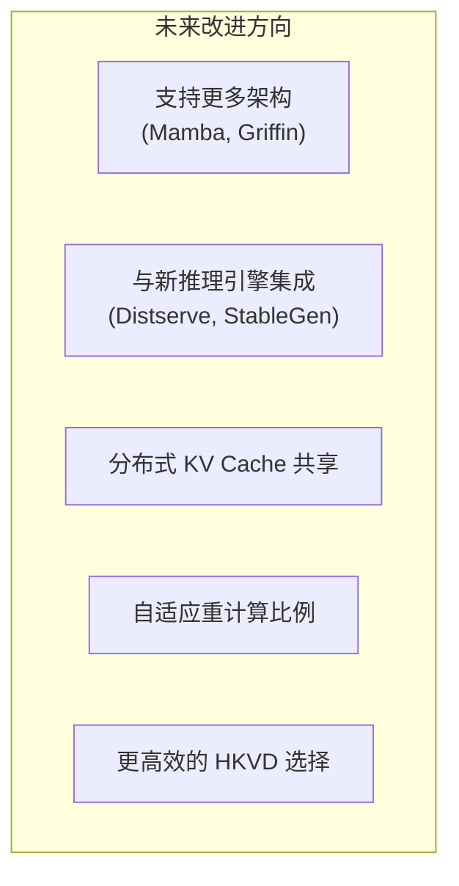
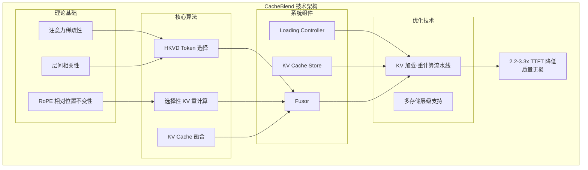

本文档讨论 CacheBlend 的当前局限性、未来研究方向，以及对整个系统的总结。

---

## 当前局限

1. **架构限制**：目前只适用于 Transformer 架构，未测试 Mamba、Griffin 等

2. **模型覆盖**：未在更多模型和量化设置上测试

3. **系统集成**：仅集成到 vLLM，未测试 Distserve、StableGen 等新引擎

4. **分布式场景**：未研究跨计算节点共享 KV Cache 的场景

---

## 未来方向

1. **架构扩展**：研究 Mamba、Griffin 等非 Transformer 架构的适配

2. **引擎集成**：与 Distserve、StableGen 等新推理引擎集成，进一步提升性能

3. **分布式支持**：研究跨节点 KV Cache 共享和融合

4. **自适应策略**：根据输入特征动态调整重计算比例

5. **算法优化**：更高效的 HKVD 选择算法，减少选择开销

---

## 总结

### 核心贡献

CacheBlend 是一个创新的 KV Cache 融合系统，解决了 RAG 场景中多文本块输入的推理加速问题。

**主要贡献**：

1. **问题识别**：指出现有方案（Prefix Caching、Full KV Reuse）的局限性

2. **核心洞察**：
   - Cross-Attention 对生成质量至关重要
   - 只有少量 HKVD tokens 需要重计算
   - 层间 HKVD tokens 高度相关

3. **系统设计**：
   - 选择性 KV 重计算框架
   - Loading Controller 智能调度
   - KV 加载与重计算流水线

4. **实现验证**：
   - 在 vLLM 上实现约 3000 行代码
   - 在多个模型和数据集上验证

### 性能总结

| 指标 | 结果 |
|------|------|
| **TTFT 降低** | 2.2-3.3x (vs Full Recompute) |
| **吞吐量提升** | 2.8-5x (vs Full Recompute) |
| **质量损失** | < 0.02 F1/Rouge-L |
| **重计算开销** | 仅 15% 的 token |

### 技术架构总结

### 适用场景

CacheBlend 特别适合以下场景：

1. **RAG 应用**：需要多个检索文本块作为上下文
2. **多文档问答**：需要综合多个文档的信息
3. **长上下文推理**：输入包含大量可复用的上下文
4. **低延迟要求**：需要快速的首 token 响应时间

### 结语

CacheBlend 通过巧妙利用注意力稀疏性和层间相关性，实现了 KV Cache 的高效融合，在保持生成质量的同时显著降低了推理延迟。这一工作为 RAG 场景下的 LLM 推理优化提供了新的思路，也为未来的 KV Cache 管理研究奠定了基础。

---

## 参考文献

1. CacheBlend 论文: https://arxiv.org/abs/2405.16444
2. vLLM: https://github.com/vllm-project/vllm
3. SGLang: https://github.com/sgl-project/sglang
4. PromptCache: https://arxiv.org/abs/2311.04934
5. RAGCache: https://arxiv.org/abs/2404.12457
