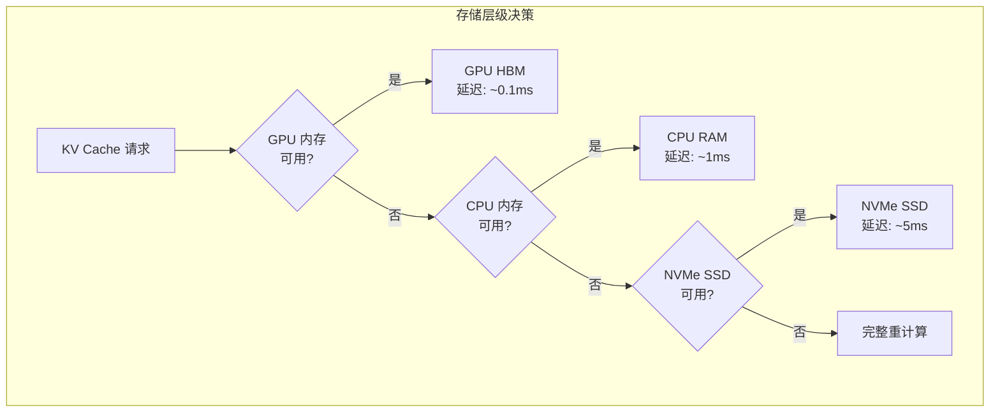
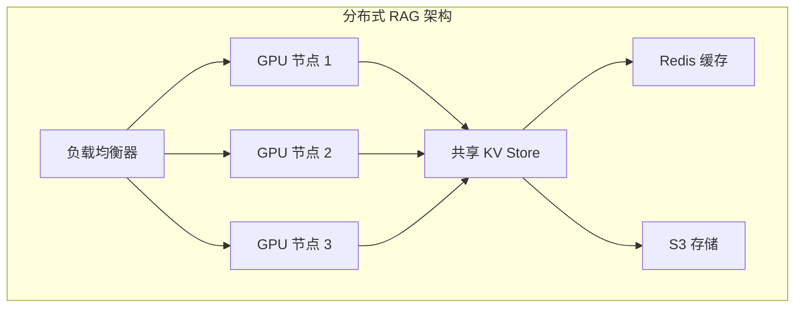

本文档整合了 CacheBlend 的调试与故障排除、性能调优以及扩展应用场景，为生产环境部署提供全面的指导。

---

## 第一部分：性能调优

### 重计算比例调优

重计算比例（recomp_ratio）是影响质量-速度权衡的关键参数。

#### 推荐值

| 场景 | 推荐比例 | 说明 |
|------|---------|------|
| 高质量要求 | 0.20-0.30 | 问答、推理任务 |
| 平衡模式 | 0.15-0.20 | 通用 RAG 场景 |
| 高速度要求 | 0.08-0.15 | 摘要、分类任务 |

#### 自动调优脚本

```python
def tune_recomp_ratio(llm, test_input, ground_truth, ratios=[0.05, 0.10, 0.15, 0.20, 0.25, 0.30]):
    """自动寻找最佳重计算比例"""
    results = []

    for ratio in ratios:
        cache_fuse_metadata['recomp_ratio'] = ratio

        t1 = time.time()
        output = llm.generate([test_input], sampling_params)
        ttft = output[0].metrics.first_token_time - output[0].metrics.first_scheduled_time

        # 计算质量分数（F1 或 Rouge-L）
        quality = compute_quality(output[0].outputs[0].text, ground_truth)

        results.append({
            'ratio': ratio,
            'ttft': ttft,
            'quality': quality
        })

        print(f"Ratio: {ratio:.2f}, TTFT: {ttft:.3f}s, Quality: {quality:.4f}")

    # 找到满足质量阈值的最小比例
    quality_threshold = 0.95 * results[-1]['quality']  # 相对于最高质量的 95%
    for r in results:
        if r['quality'] >= quality_threshold:
            print(f"推荐比例: {r['ratio']:.2f}")
            return r['ratio']

    return ratios[-1]
```

### Check 层选择

Check 层决定在哪一层进行 HKVD 选择。

#### 层选择的权衡

| 层位置 | 优点 | 缺点 |
|--------|------|------|
| 较早（Layer 0-2） | 更准确的全局选择 | 计算开销稍高 |
| 中间（Layer 8-16） | 平衡质量和速度 | 可能错过早期层的关键信息 |
| 较晚（Layer 24+） | 最低开销 | 选择可能不够准确 |

**推荐**: 使用 Layer 1 作为默认选择，这是论文中验证的最佳位置。

#### 多层 Check（实验性）

```python
# 使用多层进行 HKVD 选择
cache_fuse_metadata['check_layers'] = [1, 8, 16]
cache_fuse_metadata['recomp_ratios'] = [0.20, 0.15, 0.10]  # 每层不同比例
```

### 存储层级优化

#### 存储选择策略



#### 预取策略

```python
# 实现简单的预取
def prefetch_kv_cache(next_chunk_ids, kv_store):
    """在处理当前 chunk 时预取下一个 chunk 的 KV"""
    for chunk_id in next_chunk_ids:
        if chunk_id in kv_store.disk_cache:
            # 异步加载到 GPU
            kv_store.async_load_to_gpu(chunk_id)
```

### 批处理优化

#### 动态批处理

```python
def dynamic_batch_generation(llm, requests, max_batch_size=8):
    """根据请求特征动态调整批大小"""

    # 按照 chunk 重叠度分组
    grouped_requests = group_by_chunk_overlap(requests)

    for group in grouped_requests:
        # 共享 chunk 的请求一起处理
        batch_size = min(len(group), max_batch_size)

        # 共享的 chunk 只需加载一次
        shared_chunks = get_shared_chunks(group)
        load_kv_cache(shared_chunks)

        # 批量生成
        outputs = llm.generate(
            [r.prompt for r in group[:batch_size]],
            sampling_params
        )
```

---

## 第二部分：调试与故障排除

### 常见问题与解决方案

#### 问题 1: 输出质量明显下降

**症状**: CacheBlend 生成的输出与完整 Prefill 差异很大

**可能原因与解决方案**:

1. **重计算比例太低**
   ```python
   # 调高重计算比例
   cache_fuse_metadata['recomp_ratio'] = 0.25  # 从 0.16 增加到 0.25
   ```

2. **Check 层选择不当**
   ```python
   # 尝试使用更早或更晚的层
   cache_fuse_metadata['check_layers'] = [0]  # 或 [2]
   ```

3. **后缀长度设置错误**
   ```python
   # 确保后缀长度正确计算
   suffix_len = len(query_tokens)  # 而不是 len(query_prompt)
   cache_fuse_metadata['suffix_len'] = suffix_len
   ```

#### 问题 2: TTFT 没有明显改善

**症状**: 启用 CacheBlend 后 TTFT 与完整 Prefill 相近

**可能原因与解决方案**:

1. **输入太短**
   - CacheBlend 对短输入的优势不明显
   - 建议输入长度 > 1000 tokens

2. **KV Cache 加载延迟太高**
   ```python
   # 检查 KV Cache 存储位置
   # 优先使用 GPU 内存 > CPU 内存 > SSD
   ```

3. **重计算比例太高**
   ```python
   cache_fuse_metadata['recomp_ratio'] = 0.10  # 降低重计算比例
   ```

#### 问题 3: CUDA 内存溢出

**症状**: RuntimeError: CUDA out of memory

**解决方案**:

```python
# 1. 降低 GPU 内存利用率
llm = LLM(model="...", gpu_memory_utilization=0.4)

# 2. 分块处理长输入
# 将输入分成更小的 chunk

# 3. 清理旧的 KV Cache
llm.llm_engine.model_executor.driver_worker.model_runner.model.model.old_kvs = \
    [[None, None]] * num_layers
```

### 性能诊断

#### 诊断 TTFT 组成

```python
import time

# 测量各阶段时间
t1 = time.time()
# KV Cache 加载
t2 = time.time()
# HKVD 选择
t3 = time.time()
# 部分重计算
t4 = time.time()
# Token 生成
t5 = time.time()

print(f"KV 加载: {t2-t1:.3f}s")
print(f"HKVD 选择: {t3-t2:.3f}s")
print(f"部分重计算: {t4-t3:.3f}s")
print(f"生成: {t5-t4:.3f}s")
```

#### 验证 HKVD 选择质量

```python
# 检查选择的 HKVD indices
imp_indices = cache_fuse_metadata["imp_indices"]
print(f"HKVD token 数量: {len(imp_indices)}")
print(f"HKVD token 比例: {len(imp_indices) / total_len:.2%}")

# 可视化 KV 偏差分布
import matplotlib.pyplot as plt
temp_diff = torch.sum((value - value_old)**2, dim=[1,2])
plt.hist(temp_diff.cpu().numpy(), bins=50)
plt.title("KV Deviation Distribution")
plt.savefig("kv_deviation.png")
```

### 日志与监控

#### 启用详细日志

```python
import logging
logging.basicConfig(level=logging.DEBUG)

# 在关键位置添加日志
logger = logging.getLogger(__name__)

# 在 xformers.py 中
if status == 1:
    logger.debug(f"HKVD 选择: {len(top_indices)} tokens from {total_len}")
    logger.debug(f"Top-K 偏差范围: {temp_diff[top_indices].min():.4f} - {temp_diff[top_indices].max():.4f}")
```

---

## 第三部分：扩展应用场景

### 多轮对话优化

在多轮对话场景中，每轮对话都可以复用之前轮次的 KV Cache。

```python
class ConversationManager:
    def __init__(self, llm):
        self.llm = llm
        self.conversation_kv_cache = {}

    def add_turn(self, user_message, turn_id):
        """添加新的对话轮次"""

        # 收集当前轮次的 KV
        cache_fuse_metadata['collect'] = True

        # 构建完整对话历史
        full_prompt = self.build_prompt(user_message, turn_id)

        # 使用 CacheBlend 融合历史 KV
        if turn_id > 0:
            cache_fuse_metadata['check'] = True
            # 设置之前轮次的 KV
            self.load_previous_turns_kv(turn_id)

        output = self.llm.generate([full_prompt], sampling_params)

        # 保存当前轮次的 KV
        self.save_turn_kv(turn_id)

        return output
```

### 长文档分析

对于需要分析超长文档（>100K tokens）的场景：

```python
def analyze_long_document(llm, document, chunk_size=2048, overlap=256):
    """分块分析长文档，使用 CacheBlend 加速"""

    # 1. 文档分块
    chunks = chunk_document(document, chunk_size, overlap)

    # 2. 预计算所有 chunk 的 KV Cache
    chunk_kvs = []
    for i, chunk in enumerate(chunks):
        cache_fuse_metadata['collect'] = True
        llm.generate([chunk], SamplingParams(max_tokens=1))
        chunk_kvs.append(extract_kv(llm))

    # 3. 使用滑动窗口进行分析
    results = []
    window_size = 5  # 每次使用 5 个 chunk 的上下文

    for i in range(len(chunks) - window_size + 1):
        # 融合窗口内的 KV Cache
        window_chunks = chunks[i:i+window_size]
        merged_kv = merge_chunk_kvs(chunk_kvs[i:i+window_size])

        # 使用 CacheBlend 生成分析
        cache_fuse_metadata['check'] = True
        set_old_kvs(llm, merged_kv)

        query = f"分析这部分文档的主要内容：\n{window_chunks[-1]}"
        output = llm.generate([query], sampling_params)
        results.append(output)

    return results
```

### 混合精度推理

CacheBlend 可以与量化技术结合：

```python
# 使用 FP16 KV Cache
llm = LLM(
    model="mistralai/Mistral-7B-Instruct-v0.2",
    dtype="float16",
    kv_cache_dtype="fp8"  # 8-bit KV Cache
)

# CacheBlend 自动适配 KV Cache 精度
cache_fuse_metadata["kv_cache_dtype"] = torch.float16
```

### 分布式 RAG 系统

在分布式部署中使用 CacheBlend：



```python
class DistributedKVStore:
    def __init__(self, redis_client, s3_client):
        self.redis = redis_client
        self.s3 = s3_client
        self.local_cache = {}

    def get_kv(self, chunk_id):
        """多级缓存获取 KV"""
        # L1: 本地 GPU 内存
        if chunk_id in self.local_cache:
            return self.local_cache[chunk_id]

        # L2: Redis（跨节点共享）
        kv = self.redis.get(f"kv:{chunk_id}")
        if kv:
            self.local_cache[chunk_id] = kv
            return kv

        # L3: S3 持久化存储
        kv = self.s3.get_object(f"kv-cache/{chunk_id}")
        if kv:
            self.redis.setex(f"kv:{chunk_id}", 3600, kv)  # 缓存 1 小时
            self.local_cache[chunk_id] = kv
            return kv

        return None
```

---

## 生产环境部署建议

1. **使用预热请求**来预计算常用 chunk 的 KV Cache
2. **实现 KV Cache 的持久化存储**（Redis/S3）
3. **监控质量指标**，动态调整重计算比例
4. **设置内存限制**，实现 LRU 淘汰策略

---

## 参考文献

1. CacheBlend 论文: https://arxiv.org/abs/2405.16444
2. vLLM: https://github.com/vllm-project/vllm
