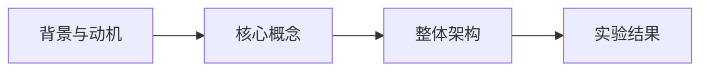
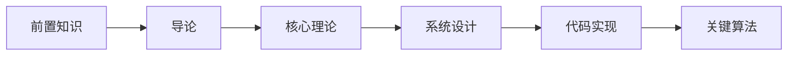
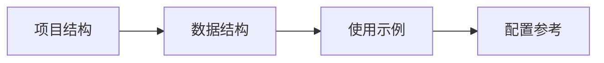

# CacheBlend 技术文档

> **CacheBlend: Fast Large Language Model Serving for RAG with Cached Knowledge Fusion**
>
> EuroSys '25, March 30–April 3, 2025, Rotterdam, Netherlands

---

## 文档导航

本文档系统性地介绍 CacheBlend 的原理、实现和使用方法，适合深度学习开发者和 LLM 推理优化研究者阅读。

---

## 快速开始

如果你想快速了解 CacheBlend：

1. [CacheBlend 是什么？](./01-introduction/01-background.md) - 5 分钟了解核心思想
2. [核心概念](./02-theory/01-core-concepts.md) - 理解 HKVD Tokens 和选择性重计算
3. [快速使用](./04-implementation/01-project-structure.md) - 代码示例

---

## 文档结构

### 前置知识

如果你对 Transformer、Attention、KV Cache 不熟悉，建议先阅读：

| 文档 | 内容 | 阅读时间 |
|------|------|---------|
| [Transformer 架构详解](./00-prerequisites/01-transformer-architecture.md) | Decoder-Only、MHA、FFN、RoPE | 15 min |
| [注意力机制深度解析](./00-prerequisites/02-attention-mechanism.md) | Self-Attention、Cross-Attention、稀疏性 | 15 min |
| [LLM 推理流程](./00-prerequisites/03-llm-inference.md) | Prefill、Decode、Continuous Batching | 10 min |
| [KV Cache 基础原理](./00-prerequisites/04-kv-cache-fundamentals.md) | 存储结构、内存计算、复用 | 10 min |

### 第一部分：导论

| 文档 | 内容 |
|------|------|
| [背景与动机](./01-introduction/01-background.md) | RAG 场景的挑战、现有方案的局限 |
| [问题定义](./01-introduction/02-problem-definition.md) | Cross-Attention 丢失问题的形式化定义 |

### 第二部分：核心理论

| 文档 | 内容 |
|------|------|
| [核心概念](./02-theory/01-core-concepts.md) | 选择性 KV 重计算、HKVD Tokens |
| [数学基础](./02-theory/02-mathematical-foundations.md) | KV 偏差、注意力偏差、RoPE 恢复 |
| [算法设计](./02-theory/03-algorithm-design.md) | Token 选择策略、层间相关性利用 |

### 第三部分：系统设计

| 文档 | 内容 |
|------|------|
| [整体架构](./03-system-design/01-architecture.md) | 系统组件、数据流 |
| [Loading Controller](./03-system-design/02-loading-controller.md) | 重计算比例估算、存储设备选择 |
| [KV Cache Store](./03-system-design/03-kv-cache-store.md) | 分块策略、Hash 映射、LRU 淘汰 |
| [Pipeline 优化](./03-system-design/04-pipeline-optimization.md) | KV 加载与重计算流水线 |

### 第四部分：代码实现

| 文档 | 内容 |
|------|------|
| [项目结构](./04-implementation/01-project-structure.md) | 目录结构、核心文件 |
| [核心数据结构](./04-implementation/02-data-structures.md) | cache_fuse_metadata、old_kvs |
| [状态机实现](./04-implementation/03-state-machine.md) | temp_status 状态转换 |
| [LlamaModel 实现](./04-implementation/04-llama-model.md) | forward 方法详解 |
| [LlamaAttention 实现](./04-implementation/05-llama-attention.md) | RoPE 处理、hack_kv |
| [XFormers 后端](./04-implementation/06-xformers-backend.md) | HKVD 选择、KV 融合 |

### 第五部分：关键算法

| 文档 | 内容 |
|------|------|
| [RoPE 位置恢复](./05-algorithms/01-rope-recovery.md) | 数学原理、代码实现 |
| [HKVD Token 选择](./05-algorithms/02-hkvd-selection.md) | L2 距离、Top-K 选择 |
| [KV Cache 融合](./05-algorithms/03-kv-fusion.md) | 部分更新策略 |

### 第六部分：实验评估

| 文档 | 内容 |
|------|------|
| [实验设置](./06-experiments/01-setup.md) | 模型、数据集、基线 |
| [实验结果](./06-experiments/02-results.md) | TTFT、吞吐量、质量对比 |

### 第七部分：进阶内容

| 文档 | 内容 |
|------|------|
| [相关工作对比](./07-advanced/01-related-work.md) | PromptCache、RAGCache、SGLang |
| [局限性与未来方向](./07-advanced/02-limitations.md) | 当前局限、改进方向 |
| [部署指南](./07-advanced/03-deployment-guide.md) | 生产环境部署建议 |

### 附录

| 文档 | 内容 |
|------|------|
| [代码索引](./appendix/A-code-index.md) | 关键代码位置速查 |
| [配置参考](./appendix/B-config-reference.md) | cache_fuse_metadata 参数说明 |
| [数学推导](./appendix/C-math-derivations.md) | RoPE 证明、HKVD 理论基础 |
| [故障排除](./appendix/D-troubleshooting.md) | 常见问题与解决方案 |
| [基准测试](./appendix/E-benchmarks.md) | TTFT、质量基准测试代码 |
| [术语表](./appendix/F-glossary.md) | 技术术语中英对照 |
| [FAQ](./appendix/G-faq.md) | 常见问题解答 |

---

## 阅读路线

### 路线 A：快速理解（30 分钟）

### 路线 B：深度学习（2-3 小时）

### 路线 C：动手实践（1 小时）

---

## 核心指标

| 指标 | CacheBlend | vs Full Recompute |
|------|-----------|-------------------|
| **TTFT** | 降低 2.2-3.3× | 基准 |
| **吞吐量** | 提升 2.8-5× | 基准 |
| **质量损失** | < 0.02 F1/Rouge-L | 无损失 |
| **重计算比例** | ~15% | 100% |

---

## 相关链接

- **论文**: [arXiv:2405.16444](https://arxiv.org/abs/2405.16444)
- **代码**: [GitHub - LMCache](https://github.com/LMCache/LMCache)
- **会议**: EuroSys '25

---

## 贡献

欢迎提交 Issue 和 Pull Request 来改进文档！

---

*本文档基于 CacheBlend 论文和代码库生成，旨在为深度学习开发者提供系统性的技术解析。*
