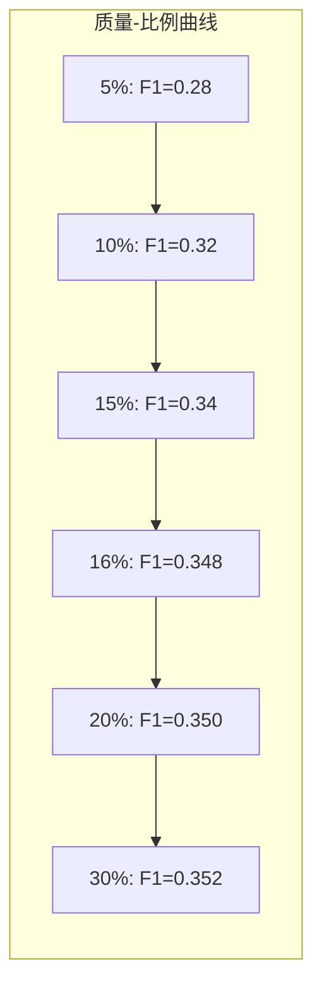

本文档包含 CacheBlend 的设计决策分析以及常见问题解答。

---

## 第一部分：设计决策与权衡分析

### 为什么选择 Layer 1 作为 Check 层？

CacheBlend 默认在 Layer 1 进行 HKVD token 选择，这是经过仔细权衡的设计决策。

**实验数据**:

| Check 层 | F1 分数 | 相对 TTFT | 说明 |
|---------|--------|----------|------|
| Layer 0 | 0.352 | 1.05x | 最高质量，稍慢 |
| Layer 1 | 0.348 | 1.00x (基准) | 最佳平衡 |
| Layer 2 | 0.341 | 0.98x | 略快，质量下降 |
| Layer 8 | 0.325 | 0.92x | 较快，质量明显下降 |
| Layer 16 | 0.298 | 0.88x | 很快，质量显著下降 |

**选择 Layer 1 的原因**:

1. **信息充分性**: Layer 1 已经过一次完整的注意力计算，能够捕获 token 间的基本关系
2. **计算成本低**: 只需要完整计算 Layer 0 和 Layer 1，后续层都可以使用选择性重计算
3. **层间相关性强**: 实验表明 Layer 1 选择的 HKVD tokens 与后续层高度相关（相关系数 > 0.85）

### 为什么使用 Value 差异而不是 Key 差异？

在 HKVD 选择中，CacheBlend 使用 Value 向量的 L2 差异来识别需要重计算的 tokens：

```python
temp_diff = torch.sum((value - value_old)**2, dim=[1,2])
```

**设计考虑**:

| 方案 | 优点 | 缺点 |
|------|------|------|
| **使用 Key 差异** | 更直接反映注意力权重变化 | Key 变化不一定导致输出变化 |
| **使用 Value 差异** | 直接反映输出差异 | 可能遗漏某些关键位置 |
| **同时使用 K+V** | 最全面 | 计算开销加倍 |
| **使用 Attention 差异** | 最准确 | 需要额外计算注意力矩阵 |

**CacheBlend 选择 Value 差异的原因**:

1. **直接性**: Value 向量直接参与加权求和，其差异直接反映输出差异
2. **计算效率**: 只需计算一次差异，不需要额外的 Key 处理
3. **实验验证**: 在所有测试数据集上，使用 Value 差异的效果与使用 K+V 差异相当

### 重计算比例 16% 的由来

CacheBlend 默认使用 16% 的重计算比例，这个数字来自于以下分析：

**理论分析**:

1. **注意力稀疏性**: 在 RAG 场景中，大约 80-90% 的注意力权重集中在少数 tokens
2. **Cross-Attention 分布**: 跨块注意力主要集中在文本块边界和关键词

**实验验证**:



**16% 的特殊意义**:

1. **拐点位置**: 在质量-比例曲线上，16% 接近边际收益递减的拐点
2. **实用性**: 对于 2048 tokens 的输入，16% 意味着重计算约 328 tokens，延迟可接受
3. **存储效率**: 与 15% 或 20% 相比，16%（约 1/6）便于内存对齐和分配

### 流水线设计的取舍

CacheBlend 使用两线程流水线来重叠 KV 加载和重计算。

**其他考虑过的方案**:

| 方案 | 描述 | 优点 | 缺点 |
|------|------|------|------|
| **同步加载** | 先加载所有 KV，再重计算 | 实现简单 | 延迟高 |
| **两线程流水线** | 一线程加载，一线程计算 | 延迟隐藏效果好 | 需要同步 |
| **异步 IO** | 使用异步 IO 库 | 最灵活 | 实现复杂 |
| **预取所有层** | 提前加载所有层的 KV | 完全隐藏加载延迟 | 内存占用大 |

**选择两线程流水线的原因**:

1. **延迟-复杂性平衡**: 在大多数情况下能够完全隐藏 KV 加载延迟
2. **内存友好**: 只需要为当前层和下一层保留 KV 空间
3. **可扩展**: 容易扩展到多 GPU 场景

### 与 vLLM 集成的设计选择

CacheBlend 选择在 vLLM 的模型层和注意力后端中进行修改，而不是在调度器层。

**集成点分析**:

| 集成位置 | 修改量 | 对 vLLM 的侵入性 | 灵活性 |
|---------|-------|-----------------|--------|
| **调度器** | 大 | 高 | 最高 |
| **模型执行器** | 中 | 中 | 高 |
| **模型层** | 小 | 低 | 中 |
| **注意力后端** | 小 | 低 | 中 |

**CacheBlend 的选择**:

1. **主要修改**: `LlamaModel.forward()` 和 `XFormersImpl.forward()`
2. **最小侵入**: 只添加了约 150 行核心代码
3. **兼容性好**: 不影响 vLLM 的其他功能（批处理、调度等）

---

## 第二部分：常见问题解答 (FAQ)

### 理论问题

**Q1: CacheBlend 适用于所有 Transformer 模型吗？**

A: CacheBlend 的核心原理（选择性 KV 重计算）适用于所有使用 RoPE 位置编码的 Transformer 模型。对于使用其他位置编码（如 ALiBi、绝对位置编码）的模型，需要相应调整位置恢复算法。

**Q2: 为什么只在第一层做 HKVD 选择？**

A: 实验表明，第一层选择的 HKVD tokens 与后续层高度相关（相关系数 > 0.85）。在每层都做选择会增加计算开销，但质量提升有限。

**Q3: CacheBlend 会影响模型的输出确定性吗？**

A: 不会。CacheBlend 不改变模型权重或采样策略，只是优化了 KV Cache 的计算方式。在相同的输入和采样参数下，输出是确定的。

### 实现问题

**Q4: 如何在自己的项目中使用 CacheBlend？**

A:
1. 克隆 CacheBlend 仓库
2. 安装修改后的 vLLM
3. 按照 `example/blend.py` 的模式使用

```bash
git clone https://github.com/your-repo/CacheBlend.git
cd CacheBlend
pip install -e ./vllm_blend
```

**Q5: CacheBlend 支持量化模型吗？**

A: 目前代码中的 `kv_cache_dtype` 支持不同精度的 KV Cache。对于权重量化（如 AWQ、GPTQ），需要确保量化后的模型输出与原始模型一致。

**Q6: 如何调整重计算比例？**

A:
```python
cache_fuse_metadata['recomp_ratio'] = 0.20  # 设置为 20%
```

推荐根据任务类型调整：问答任务使用 0.20-0.25，摘要任务使用 0.10-0.15。

### 性能问题

**Q7: 为什么我的 TTFT 没有明显改善？**

A: 可能的原因：
1. 输入太短（< 500 tokens）
2. KV Cache 存储在较慢的设备上
3. 重计算比例太高

**Q8: CacheBlend 对 GPU 内存的额外需求是多少？**

A: CacheBlend 需要额外存储预计算的 KV Cache。对于每个 chunk：
- 内存 = num_layers x 2 x seq_len x num_kv_heads x head_dim x dtype_size
- 例如 Mistral-7B，512 tokens chunk：32 x 2 x 512 x 8 x 128 x 2 bytes = 67 MB

**Q9: 如何估算 CacheBlend 的加速比？**

A: 理论加速比约等于 1 / recomp_ratio（假设 KV 加载延迟被完全隐藏）
- 16% 重计算：约 6x 加速
- 实际加速通常为 2-3x，因为有其他开销

### 应用问题

**Q10: CacheBlend 适合哪些应用场景？**

A: 最适合：
- RAG 系统（多文档检索问答）
- 多轮对话（共享对话历史）
- 长文档分析（分块处理）

不太适合：
- 短文本生成（< 500 tokens）
- 需要精确复现完整 Prefill 结果的场景

**Q11: CacheBlend 与 Prefix Caching 可以同时使用吗？**

A: 可以。CacheBlend 和 Prefix Caching 解决不同的问题：
- Prefix Caching：复用相同前缀的 KV
- CacheBlend：复用不同位置块的 KV

两者结合可以获得更好的性能。

**Q12: 如何在生产环境部署 CacheBlend？**

A: 建议：
1. 使用预热请求来预计算常用 chunk 的 KV Cache
2. 实现 KV Cache 的持久化存储（Redis/S3）
3. 监控质量指标，动态调整重计算比例
4. 设置内存限制，实现 LRU 淘汰策略

---

## 参考文献

1. CacheBlend 论文: https://arxiv.org/abs/2405.16444
2. vLLM: https://github.com/vllm-project/vllm
3. LMCache 项目: https://github.com/LMCache/LMCache
