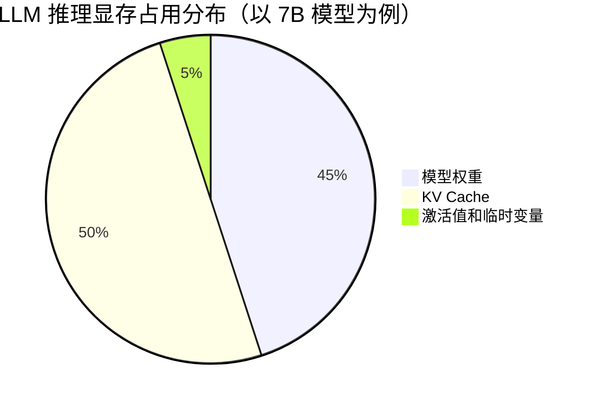
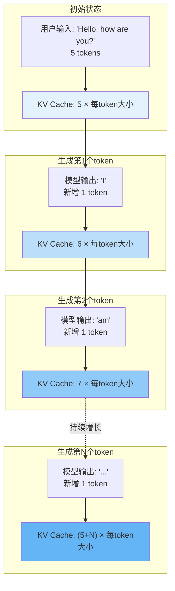
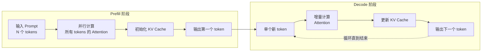
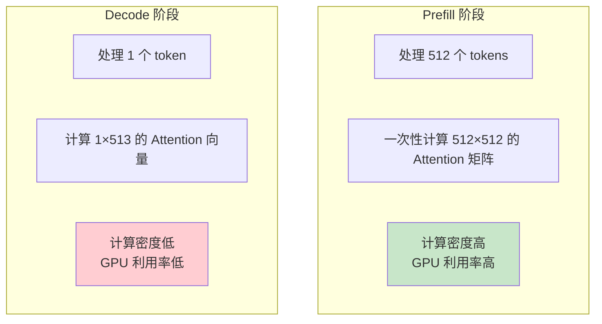
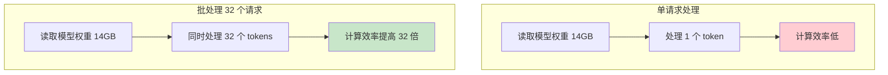
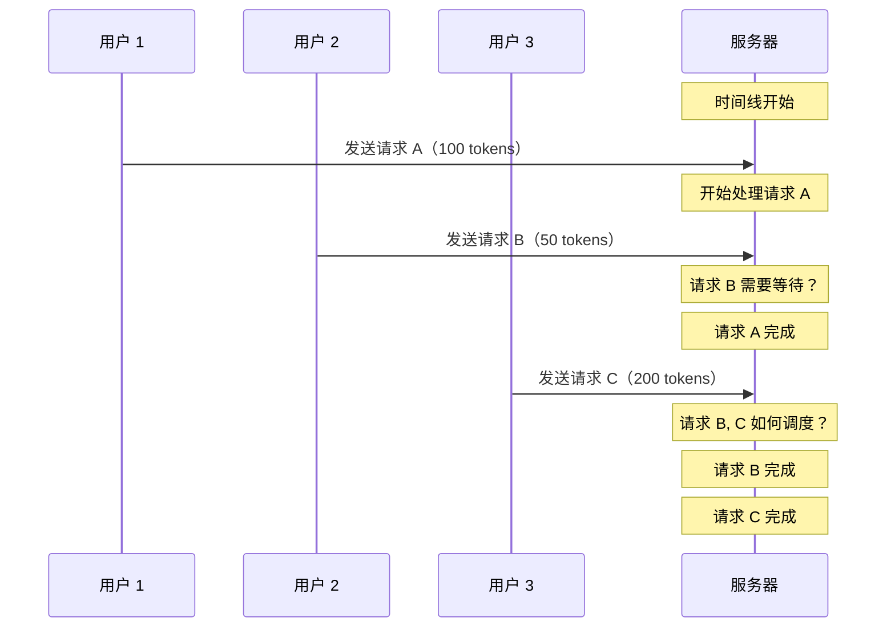
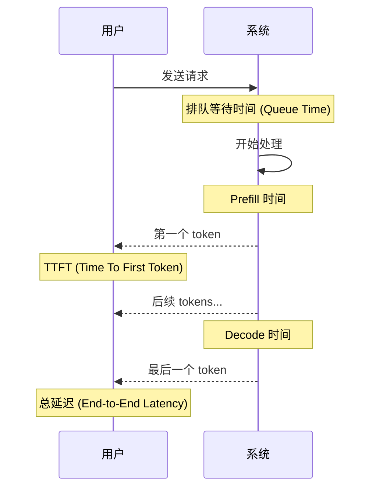
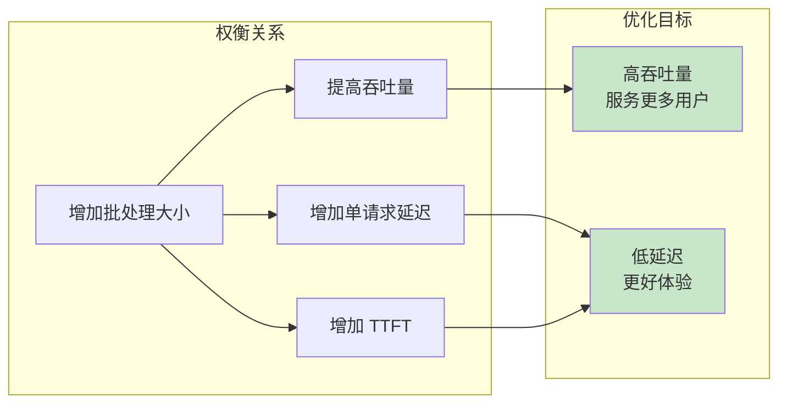
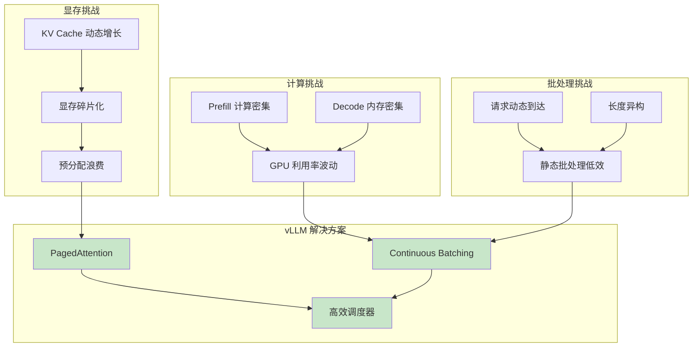

> 本章将深入分析 LLM 推理在显存、计算、批处理三个维度面临的具体挑战，为后续理解 vLLM 的解决方案打下基础。

---

## 引言

上一章我们从宏观视角了解了 LLM 推理的困境。本章将进行更深入的技术分析，用具体的数字和公式来量化这些挑战。理解这些挑战对于理解 vLLM 的设计决策至关重要。

---

## 1. 显存挑战：一道简单的数学题

### 1.1 显存占用的组成

LLM 推理时的显存占用主要由三部分组成：



| 组成部分 | 说明 | 占比 |
|---------|------|------|
| 模型权重 | 神经网络的参数 | 约 45% |
| KV Cache | 注意力机制的缓存 | 约 50%（动态增长） |
| 激活值和临时变量 | 计算过程中的中间结果 | 约 5% |

可以看到，**KV Cache 是显存占用的主要部分**，而且它还会随着生成长度动态增长！

### 1.2 模型权重的显存占用

模型权重的显存占用计算相对简单：

```
模型权重显存 = 参数量 × 每个参数的字节数
```

不同精度下的字节数：

| 精度 | 每个参数字节数 | 说明 |
|------|---------------|------|
| FP32 | 4 字节 | 全精度浮点 |
| FP16/BF16 | 2 字节 | 半精度浮点（推理常用） |
| INT8 | 1 字节 | 8 位整数量化 |
| INT4 | 0.5 字节 | 4 位整数量化 |

**示例计算**：LLaMA-2-7B 模型

| 精度 | 计算 | 显存占用 |
|------|------|---------|
| FP32 | 7B × 4 = 28GB | 28 GB |
| FP16 | 7B × 2 = 14GB | 14 GB |
| INT8 | 7B × 1 = 7GB | 7 GB |
| INT4 | 7B × 0.5 = 3.5GB | 3.5 GB |

### 1.3 KV Cache 的显存占用

KV Cache 是 LLM 推理中的关键数据结构，用于存储注意力计算的中间结果。它的显存占用计算公式：

```
KV Cache 显存 = 2 × num_layers × num_heads × head_dim × seq_len × batch_size × bytes_per_element
```

或者简化为：

```
KV Cache 显存 = 2 × num_layers × hidden_dim × seq_len × batch_size × bytes_per_element
```

其中：
- `2` 表示 Key 和 Value 两部分
- `num_layers` 是 Transformer 层数
- `hidden_dim` 是隐藏维度（= num_heads × head_dim）
- `seq_len` 是序列长度（**会动态增长**）
- `batch_size` 是批次大小（并发请求数）
- `bytes_per_element` 是每个元素的字节数（FP16 = 2）

**示例计算**：LLaMA-2-7B 模型

| 参数 | 值 |
|------|-----|
| num_layers | 32 |
| hidden_dim | 4096 |
| FP16 bytes | 2 |

单个请求，不同序列长度的 KV Cache 大小：

| 序列长度 | 计算 | KV Cache 大小 |
|---------|------|---------------|
| 512 | 2 × 32 × 4096 × 512 × 2 | 256 MB |
| 1024 | 2 × 32 × 4096 × 1024 × 2 | 512 MB |
| 2048 | 2 × 32 × 4096 × 2048 × 2 | 1 GB |
| 4096 | 2 × 32 × 4096 × 4096 × 2 | 2 GB |

**关键观察**：KV Cache 与序列长度**线性增长**！

### 1.4 KV Cache 的动态增长问题

让我们用一个图来展示 KV Cache 的动态增长过程：



**这带来了一个严重问题**：在请求开始时，我们不知道最终会生成多少 token！

传统方案的处理方式：
- **预分配最大长度**：浪费大量显存
- **动态扩展**：可能导致显存不足或碎片化

### 1.5 显存碎片化详解

让我们用一个具体的场景来说明显存碎片化：

假设我们有 10GB 可用显存，最大序列长度 2048 tokens（每个请求预分配 1GB）。

**场景演示**：

```
初始状态：
+--------------------------------------------------+
|                    空闲 (10GB)                    |
+--------------------------------------------------+

接受请求 A（预分配 1GB）：
+----------+---------------------------------------+
| 请求 A   |              空闲 (9GB)               |
+----------+---------------------------------------+

接受请求 B（预分配 1GB）：
+----------+----------+----------------------------+
| 请求 A   | 请求 B   |       空闲 (8GB)           |
+----------+----------+----------------------------+

接受更多请求 C, D, E, F, G, H, I, J：
+----+----+----+----+----+----+----+----+----+----+
| A  | B  | C  | D  | E  | F  | G  | H  | I  | J  |
+----+----+----+----+----+----+----+----+----+----+

请求 A, C, E, G, I 完成并释放：
+----+----+----+----+----+----+----+----+----+----+
|空闲| B  |空闲| D  |空闲| F  |空闲| H  |空闲| J  |
+----+----+----+----+----+----+----+----+----+----+
     ↑         ↑         ↑         ↑         ↑
    1GB       1GB       1GB       1GB       1GB

问题：虽然有 5GB 空闲，但都是分散的 1GB 块！
无法接受需要 2GB 连续空间的请求！
```

**碎片化的两种类型**：

1. **内部碎片（Internal Fragmentation）**：
   - 预分配 1GB，实际只用 100MB
   - 浪费了 900MB

2. **外部碎片（External Fragmentation）**：
   - 总空闲 5GB，但最大连续块只有 1GB
   - 无法满足大于 1GB 的请求

### 1.6 实际案例：A100 80GB 能服务多少用户？

让我们计算一下在 A100 80GB GPU 上部署 LLaMA-2-7B 模型时，最多能服务多少并发用户。

**条件**：
- GPU 显存：80GB
- 模型：LLaMA-2-7B (FP16)
- 最大序列长度：4096 tokens

**计算**：

```
1. 模型权重：7B × 2 = 14GB
2. 系统开销（CUDA、激活值等）：约 2GB
3. 可用于 KV Cache 的显存：80 - 14 - 2 = 64GB
4. 每个请求的 KV Cache（4096 tokens）：约 2GB
5. 理论最大并发：64 ÷ 2 = 32 个请求
```

**但是**，如果考虑实际使用场景：
- 平均输入长度：100 tokens
- 平均输出长度：200 tokens
- 平均 KV Cache：300 tokens × (2GB/4096) ≈ 150MB

如果使用 PagedAttention：
```
实际并发：64GB ÷ 150MB ≈ 426 个请求
```

这就是 vLLM 显存效率提升的来源！

---

## 2. 计算挑战：Prefill vs Decode

### 2.1 两阶段的计算特性

LLM 推理分为两个截然不同的阶段：



**详细对比**：

| 特性 | Prefill 阶段 | Decode 阶段 |
|------|-------------|-------------|
| **处理 tokens 数** | N（整个输入） | 1（单个新 token） |
| **计算量** | O(N²) 或 O(N) | O(1) 或 O(N) |
| **内存访问** | 读取模型权重 + 写入 KV Cache | 读取模型权重 + 读写 KV Cache |
| **计算密度** | 高 | 低 |
| **瓶颈** | 计算能力 | 内存带宽 |
| **GPU 利用率** | 高（50-80%） | 低（10-30%） |
| **持续时间** | 短（一次性） | 长（循环多次） |

### 2.2 计算密度分析

**计算密度（Arithmetic Intensity）** 是衡量一个操作是计算密集型还是内存密集型的关键指标：

```
计算密度 = 浮点运算次数 / 内存访问字节数
```

对于 GPU 来说：
- **计算密度高**：GPU 计算单元充分利用，性能好
- **计算密度低**：GPU 等待数据传输，计算单元空闲



**Prefill 阶段**（以 512 token 输入为例）：
```
计算量：512 × 512 × hidden_dim × num_layers = 很大
内存访问：读取模型权重 + 写入 KV Cache
计算密度：高
→ 计算密集型，GPU 利用率高
```

**Decode 阶段**：
```
计算量：1 × seq_len × hidden_dim × num_layers = 较小
内存访问：读取模型权重 + 读取整个 KV Cache + 写入新 KV
计算密度：低
→ 内存密集型，GPU 利用率低
```

### 2.3 Decode 阶段的瓶颈分析

让我们用具体数字来分析 Decode 阶段为什么慢：

**假设条件**：
- 模型：LLaMA-2-7B
- GPU：A100 80GB
- 当前序列长度：1000 tokens

**每个 Decode step 需要**：
1. 读取模型权重：14GB（FP16）
2. 读取 KV Cache：约 500MB（1000 tokens × 0.5MB/token）
3. 计算 Attention 和 FFN
4. 写入新的 KV 数据：约 0.5MB

**A100 GPU 的能力**：
- 内存带宽：2TB/s
- FP16 计算能力：312 TFLOPS

**时间分析**：
```
数据读取时间 = (14GB + 0.5GB) / 2TB/s ≈ 7.25ms
计算时间 = 实际计算量 / 312 TFLOPS ≈ 0.5ms（相对很少）

结论：大部分时间在读取数据，而不是计算！
```

这就是为什么 **Decode 阶段是内存带宽瓶颈**。

### 2.4 批处理如何提高效率

批处理可以提高 Decode 阶段的效率，原理是**分摊模型权重的读取开销**：



**数学分析**：

| 模式 | 模型权重读取 | 处理 tokens | 效率 |
|------|-------------|-------------|------|
| 单请求 | 14GB | 1 | 1x |
| 批处理 32 | 14GB | 32 | 32x |
| 批处理 64 | 14GB | 64 | 64x |

这就是为什么**批处理对 LLM 推理如此重要**！

---

## 3. 批处理挑战：动态与异构

### 3.1 请求的动态特性

LLM 服务面临的请求具有高度动态性：



**动态性表现在**：

1. **到达时间不确定**：用户随机发送请求
2. **输入长度不确定**：每个请求的 prompt 长度不同
3. **输出长度不确定**：生成长度取决于模型和停止条件
4. **请求优先级不同**：可能有 VIP 用户或紧急请求

### 3.2 异构性带来的挑战

即使在同一批次中，不同请求的特性也大不相同：

```
批次中的请求分布示例：
┌─────────┬──────────┬──────────┬─────────────┐
│ 请求 ID │ 输入长度 │ 当前输出 │ 状态        │
├─────────┼──────────┼──────────┼─────────────┤
│ A       │ 10       │ 95       │ Decode 中   │
│ B       │ 500      │ 0        │ Prefill 中  │
│ C       │ 50       │ 200      │ 即将完成    │
│ D       │ 100      │ 30       │ Decode 中   │
│ E       │ 1000     │ 0        │ 等待 Prefill│
└─────────┴──────────┴──────────┴─────────────┘
```

**异构性带来的问题**：

1. **序列长度不一致**：
   - 不同请求的 KV Cache 大小不同
   - Attention 计算的工作量不同

2. **状态不一致**：
   - 有的在 Prefill，有的在 Decode
   - 计算密度差异巨大

3. **完成时间不一致**：
   - 有的即将完成，有的刚开始
   - 资源释放时机不确定

### 3.3 静态批处理的问题

传统静态批处理无法处理这种动态异构的场景：

```mermaid
gantt
    title 静态批处理的问题
    dateFormat X
    axisFormat %s

    section 请求 A
    处理 (100 tokens)  :done, a, 0, 100
    等待其他请求完成    :crit, await, 100, 200

    section 请求 B
    处理 (200 tokens)  :done, b, 0, 200

    section 请求 C
    等待加入批次        :crit, cwait, 0, 200

    section GPU 利用
    有效计算          :active, gpu1, 0, 100
    部分空闲          :crit, gpu2, 100, 200
```



**问题总结**：

| 问题 | 影响 |
|------|------|
| 必须等待最长请求 | 短请求延迟增加 |
| 无法动态加入 | 新请求等待时间长 |
| 资源不能复用 | 显存利用率低 |
| GPU 利用率波动 | 平均效率低 |

---

## 4. 关键性能指标详解

理解 LLM 推理的性能指标对于评估和优化系统至关重要。

### 4.1 吞吐量（Throughput）

**定义**：单位时间内处理的 token 数或请求数

```
Token 吞吐量 = 总生成 tokens / 总时间 (tokens/second)
请求吞吐量 = 总完成请求 / 总时间 (requests/second)
```

**影响因素**：
- GPU 计算能力
- 内存带宽
- 批处理大小
- 显存效率

### 4.2 延迟（Latency）

延迟有多个维度：



**关键延迟指标**：

| 指标 | 英文 | 说明 | 用户感知 |
|------|------|------|---------|
| TTFT | Time To First Token | 首个 token 生成时间 | 响应速度感 |
| TPOT | Time Per Output Token | 每个输出 token 的时间 | 流畅度感 |
| 总延迟 | End-to-End Latency | 完整响应时间 | 等待时间 |

### 4.3 TPS（Tokens Per Second）

**定义**：每秒生成的 token 数

有两种计算方式：
1. **单请求 TPS**：单个请求的生成速度
2. **系统 TPS**：整个系统的总吞吐量

```
单请求 TPS = 输出 tokens / Decode 时间
系统 TPS = 所有请求的输出 tokens / 总时间
```

### 4.4 指标之间的权衡

这些指标之间存在权衡关系：



**权衡策略**：

| 场景 | 优先指标 | 策略 |
|------|---------|------|
| 实时对话 | 低 TTFT，低 TPOT | 小批次，快速响应 |
| 批量处理 | 高吞吐量 | 大批次，最大化效率 |
| 混合场景 | 平衡 | 动态调整批次大小 |

---

## 5. 挑战总结

让我们用一张图总结 LLM 推理面临的所有挑战：



---

## 6. 本章小结

本章我们深入分析了 LLM 推理面临的三大挑战：

### 显存挑战
- **KV Cache 显存占用**：与序列长度线性相关，可占总显存 50% 以上
- **显存碎片化**：预分配导致内部碎片，动态释放导致外部碎片
- **量化影响**：模型参数 7B → 14GB (FP16) → 7GB (INT8) → 3.5GB (INT4)

### 计算挑战
- **Prefill vs Decode**：计算密集型 vs 内存密集型
- **GPU 利用率**：Prefill 高 (50-80%)，Decode 低 (10-30%)
- **瓶颈转换**：Prefill 瓶颈在计算，Decode 瓶颈在内存带宽

### 批处理挑战
- **动态性**：请求随机到达，长度不确定
- **异构性**：同一批次内请求状态不同
- **静态批处理的问题**：必须等待最长请求，无法动态调整

### 关键性能指标
- **TTFT**：首 token 延迟，影响用户体验
- **TPS**：生成速度，影响流畅度
- **吞吐量**：系统容量，影响服务规模

---

## 思考题

1. 对于一个 70B 参数的模型，在 A100 80GB GPU 上最多能支持多长的序列？
2. 为什么 Decode 阶段不能简单地通过增加 GPU 计算核心来加速？
3. 如果用户主要发送很短的请求（< 50 tokens），显存碎片化问题会更严重还是更轻？

---

## 下一步

了解了 LLM 推理的挑战后，让我们来看看 vLLM 的整体架构是如何设计来应对这些挑战的：

👉 [下一章：vLLM 整体架构概览](03-vllm-overview.md)
