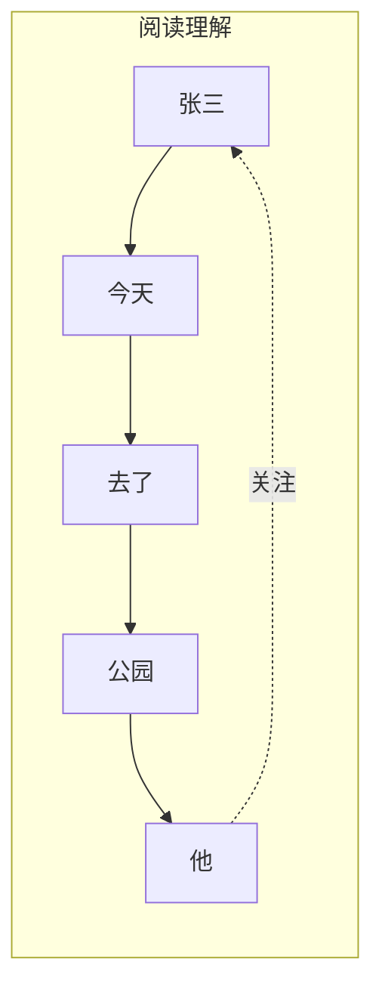
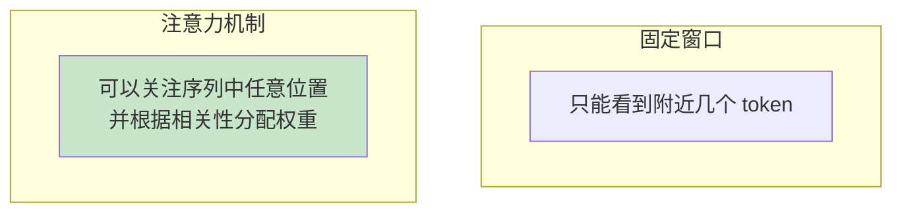
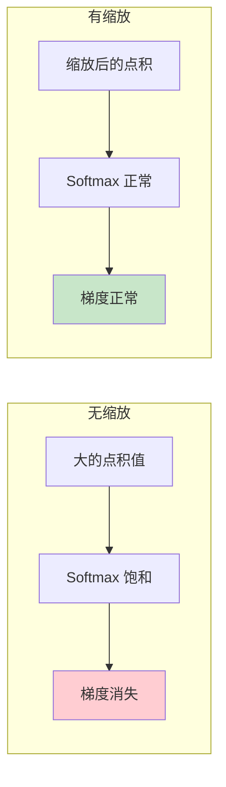
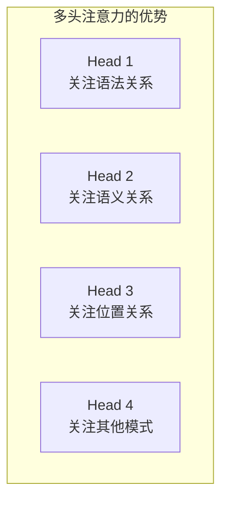
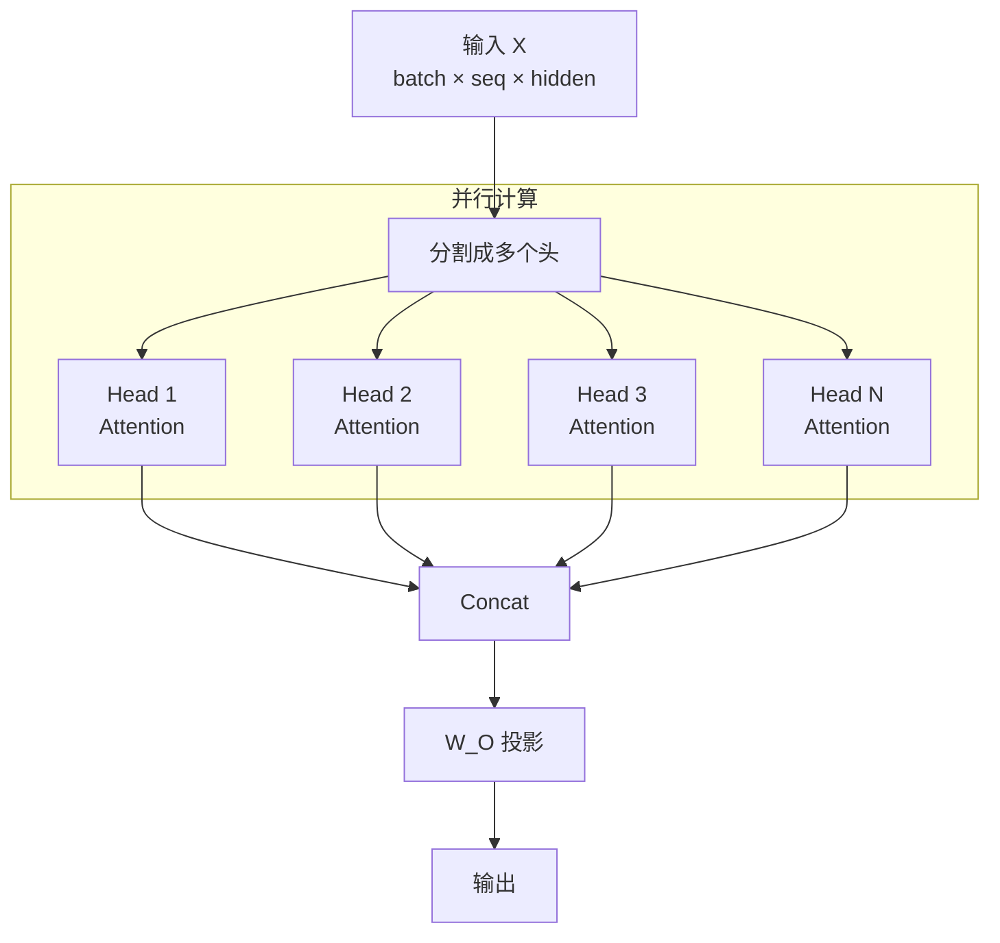
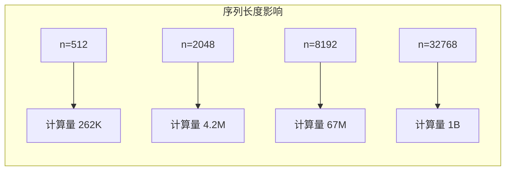
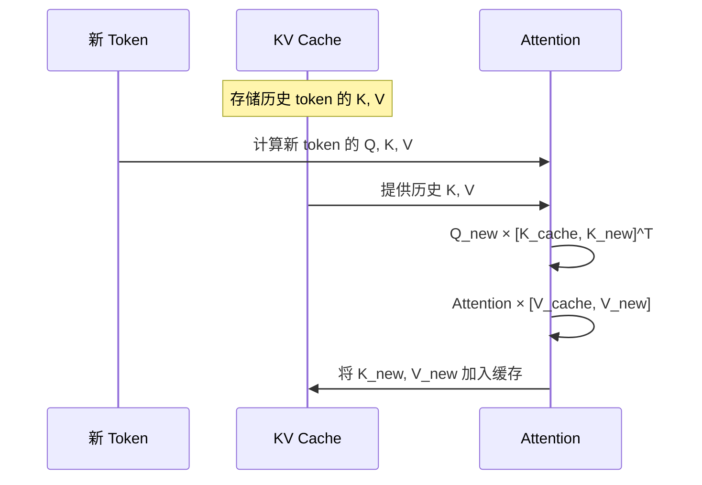

# 注意力机制原理

> 本章将深入介绍自注意力机制的数学原理和计算过程，这是理解 vLLM 核心优化的关键。

---

## 引言

注意力机制是 Transformer 的核心创新，也是 vLLM 优化的主要目标。理解注意力机制的计算过程，对于理解 KV Cache 和 PagedAttention 至关重要。

---

## 1. 注意力的直觉理解

### 1.1 人类注意力的类比

想象你在阅读一篇文章，当你看到"他"这个代词时，你会自动"关注"前文中提到的人名，以理解"他"指的是谁。

这就是注意力机制的核心思想：**让模型学会"关注"序列中最相关的部分**。



### 1.2 从"全局视野"到"重点关注"

没有注意力机制时，模型只能看到固定窗口内的信息。有了注意力机制：



---

## 2. 自注意力（Self-Attention）计算

### 2.1 Query、Key、Value 的含义

自注意力使用三个向量：

| 向量 | 类比 | 作用 |
|------|------|------|
| **Query (Q)** | "我要找什么" | 当前位置的查询向量 |
| **Key (K)** | "我是什么" | 每个位置的索引向量 |
| **Value (V)** | "我的内容" | 每个位置的值向量 |

**直觉理解**：
- Q 是"问题"
- K 是"索引/标签"
- V 是"内容"
- 计算 Q 和所有 K 的相似度，用相似度加权所有 V

### 2.2 计算公式

自注意力的核心公式：

$$
\text{Attention}(Q, K, V) = \text{softmax}\left(\frac{QK^T}{\sqrt{d_k}}\right) V
$$

其中：
- $Q$：Query 矩阵，形状 $[seq\_len, d_k]$
- $K$：Key 矩阵，形状 $[seq\_len, d_k]$
- $V$：Value 矩阵，形状 $[seq\_len, d_v]$
- $d_k$：Key 的维度（用于缩放）

### 2.3 计算步骤详解

```mermaid
flowchart TD
    subgraph 步骤1: 生成 Q, K, V
        X[输入 X<br/>seq_len × hidden_dim]
        X --> WQ[W_Q 投影]
        X --> WK[W_K 投影]
        X --> WV[W_V 投影]
        WQ --> Q[Query<br/>seq_len × d_k]
        WK --> K[Key<br/>seq_len × d_k]
        WV --> V[Value<br/>seq_len × d_v]
    end

    subgraph 步骤2: 计算注意力分数
        Q --> MM[Q × K^T]
        K --> MM
        MM --> SC[÷ √d_k<br/>缩放]
        SC --> MASK[+ Mask<br/>可选]
        MASK --> SM[Softmax]
        SM --> ATT[注意力权重<br/>seq_len × seq_len]
    end

    subgraph 步骤3: 加权求和
        ATT --> OUT[× V]
        V --> OUT
        OUT --> O[输出<br/>seq_len × d_v]
    end

    style SC fill:#fff9c4
    style SM fill:#c8e6c9
```

### 2.4 逐步计算示例

假设我们有一个简单的序列，3 个 token，每个 token 的隐藏维度是 4：

```python
import torch
import torch.nn.functional as F

# 输入
seq_len = 3
d_k = 4

# 假设 Q, K, V 已经通过线性投影得到
Q = torch.tensor([
    [1.0, 0.0, 1.0, 0.0],  # token 0 的 query
    [0.0, 1.0, 0.0, 1.0],  # token 1 的 query
    [1.0, 1.0, 0.0, 0.0],  # token 2 的 query
])

K = torch.tensor([
    [1.0, 0.0, 0.0, 1.0],  # token 0 的 key
    [0.0, 1.0, 1.0, 0.0],  # token 1 的 key
    [1.0, 1.0, 1.0, 1.0],  # token 2 的 key
])

V = torch.tensor([
    [1.0, 2.0, 3.0, 4.0],  # token 0 的 value
    [5.0, 6.0, 7.0, 8.0],  # token 1 的 value
    [9.0, 10., 11., 12.],  # token 2 的 value
])

# 步骤 1: 计算 Q × K^T
scores = Q @ K.T
print("注意力分数 (未缩放):")
print(scores)
# tensor([[1., 1., 2.],
#         [1., 1., 2.],
#         [1., 1., 3.]])

# 步骤 2: 缩放
d_k = 4
scaled_scores = scores / (d_k ** 0.5)
print("\n缩放后的分数:")
print(scaled_scores)

# 步骤 3: Softmax
attention_weights = F.softmax(scaled_scores, dim=-1)
print("\n注意力权重:")
print(attention_weights)
# 每行和为 1

# 步骤 4: 加权求和
output = attention_weights @ V
print("\n输出:")
print(output)
```

### 2.5 注意力权重可视化

注意力权重形成一个 `[seq_len, seq_len]` 的矩阵：

```
         Token 0  Token 1  Token 2
Token 0 [  0.30    0.30     0.40  ]  # Token 0 关注谁
Token 1 [  0.30    0.30     0.40  ]  # Token 1 关注谁
Token 2 [  0.20    0.20     0.60  ]  # Token 2 关注谁
```

每一行表示一个 token 对所有 token 的注意力分布（和为 1）。

---

## 3. 缩放因子 √d 的作用

### 3.1 为什么需要缩放

当 $d_k$ 较大时，$QK^T$ 的点积结果会变得很大。这会导致：

1. **Softmax 饱和**：大值经过 softmax 后趋近于 1，小值趋近于 0
2. **梯度消失**：softmax 在饱和区域的梯度接近 0



### 3.2 数学解释

假设 Q 和 K 的元素服从均值 0、方差 1 的分布，那么：

- $Q \cdot K$ 的均值为 0
- $Q \cdot K$ 的方差为 $d_k$

除以 $\sqrt{d_k}$ 后，方差变为 1，分布更稳定。

---

## 4. 多头注意力（Multi-Head Attention）

### 4.1 为什么需要多头

单头注意力只能学习一种"关注模式"。多头注意力让模型同时学习多种不同的关系：



### 4.2 多头计算过程



### 4.3 代码实现

```python
class MultiHeadAttention(nn.Module):
    def __init__(self, hidden_dim, num_heads):
        super().__init__()
        self.num_heads = num_heads
        self.head_dim = hidden_dim // num_heads

        # Q, K, V 投影
        self.q_proj = nn.Linear(hidden_dim, hidden_dim)
        self.k_proj = nn.Linear(hidden_dim, hidden_dim)
        self.v_proj = nn.Linear(hidden_dim, hidden_dim)

        # 输出投影
        self.o_proj = nn.Linear(hidden_dim, hidden_dim)

    def forward(self, x):
        batch_size, seq_len, _ = x.shape

        # 投影
        Q = self.q_proj(x)  # [batch, seq, hidden]
        K = self.k_proj(x)
        V = self.v_proj(x)

        # 重塑为多头: [batch, seq, num_heads, head_dim]
        Q = Q.view(batch_size, seq_len, self.num_heads, self.head_dim)
        K = K.view(batch_size, seq_len, self.num_heads, self.head_dim)
        V = V.view(batch_size, seq_len, self.num_heads, self.head_dim)

        # 转置: [batch, num_heads, seq, head_dim]
        Q = Q.transpose(1, 2)
        K = K.transpose(1, 2)
        V = V.transpose(1, 2)

        # 注意力计算
        scores = Q @ K.transpose(-2, -1) / (self.head_dim ** 0.5)
        attn_weights = F.softmax(scores, dim=-1)
        output = attn_weights @ V  # [batch, num_heads, seq, head_dim]

        # 合并多头
        output = output.transpose(1, 2)  # [batch, seq, num_heads, head_dim]
        output = output.reshape(batch_size, seq_len, -1)  # [batch, seq, hidden]

        # 输出投影
        output = self.o_proj(output)

        return output
```

### 4.4 头数与维度的关系

```
hidden_dim = num_heads × head_dim
```

**常见配置**：

| 模型 | hidden_dim | num_heads | head_dim |
|------|-----------|-----------|----------|
| GPT-2 Small | 768 | 12 | 64 |
| GPT-2 Large | 1280 | 20 | 64 |
| LLaMA-7B | 4096 | 32 | 128 |
| LLaMA-70B | 8192 | 64 | 128 |

---

## 5. Masked Attention（因果掩码）

### 5.1 为什么需要掩码

在语言模型中，预测下一个 token 时**不能看到未来的 token**。因果掩码确保每个位置只能关注它之前的位置。

```mermaid
graph LR
    subgraph 无掩码（双向注意力）
        A1[token 1] <--> A2[token 2]
        A1 <--> A3[token 3]
        A2 <--> A3
    end

    subgraph 有掩码（单向注意力）
        B1[token 1]
        B2[token 2] --> B1
        B3[token 3] --> B1
        B3 --> B2
    end
```

### 5.2 掩码矩阵

因果掩码是一个下三角矩阵：

```python
seq_len = 4
mask = torch.tril(torch.ones(seq_len, seq_len))
print(mask)
# tensor([[1., 0., 0., 0.],
#         [1., 1., 0., 0.],
#         [1., 1., 1., 0.],
#         [1., 1., 1., 1.]])
```

**可视化**：

```
         位置 0  位置 1  位置 2  位置 3
位置 0  [  1      0       0       0   ]  → 只能看自己
位置 1  [  1      1       0       0   ]  → 可看 0, 1
位置 2  [  1      1       1       0   ]  → 可看 0, 1, 2
位置 3  [  1      1       1       1   ]  → 可看全部
```

### 5.3 应用掩码

在 softmax 之前应用掩码，将不允许关注的位置设为负无穷：

```python
def masked_attention(Q, K, V, mask):
    d_k = Q.shape[-1]
    scores = Q @ K.transpose(-2, -1) / (d_k ** 0.5)

    # 应用掩码：将 mask=0 的位置设为 -inf
    scores = scores.masked_fill(mask == 0, float('-inf'))

    attn_weights = F.softmax(scores, dim=-1)
    output = attn_weights @ V
    return output
```

**掩码后的注意力分数**：

```
before softmax:
[[ 0.5   -inf   -inf   -inf]
 [ 0.3    0.7   -inf   -inf]
 [ 0.2    0.4    0.6   -inf]
 [ 0.1    0.3    0.5    0.8]]

after softmax:
[[1.00   0.00   0.00   0.00]  # 只关注位置 0
 [0.40   0.60   0.00   0.00]  # 关注位置 0, 1
 [0.25   0.33   0.42   0.00]  # 关注位置 0, 1, 2
 [0.15   0.22   0.28   0.35]] # 关注全部
```

---

## 6. 注意力的计算复杂度

### 6.1 时间复杂度

核心计算 $QK^T$ 和 $(\text{softmax})V$：

- $QK^T$：$[n, d] \times [d, n] = O(n^2 d)$
- $\text{Attention} \times V$：$[n, n] \times [n, d] = O(n^2 d)$

**总时间复杂度**：$O(n^2 d)$

其中 $n$ 是序列长度，$d$ 是维度。

### 6.2 空间复杂度

需要存储注意力权重矩阵：

**空间复杂度**：$O(n^2)$

### 6.3 长序列的挑战



当序列长度增加 4 倍，计算量增加 16 倍！这是长序列 LLM 面临的核心挑战。

### 6.4 优化方法简介

| 方法 | 原理 | 复杂度 |
|------|------|--------|
| Flash Attention | IO 优化，减少内存访问 | O(n²) 但更快 |
| Sparse Attention | 稀疏注意力模式 | O(n√n) 或 O(n) |
| Linear Attention | 核方法近似 | O(n) |
| Sliding Window | 只关注局部窗口 | O(nw) |

vLLM 主要使用 **Flash Attention** 作为注意力后端。

---

## 7. Grouped-Query Attention (GQA)

### 7.1 传统 MHA vs GQA

为了减少 KV Cache 的内存占用，现代模型使用 GQA：

```mermaid
graph TB
    subgraph MHA（Multi-Head Attention）
        MQ1[Q Head 1] --> MK1[K Head 1]
        MQ2[Q Head 2] --> MK2[K Head 2]
        MQ3[Q Head 3] --> MK3[K Head 3]
        MQ4[Q Head 4] --> MK4[K Head 4]
    end

    subgraph GQA（Grouped-Query Attention）
        GQ1[Q Head 1] --> GK1[K Group 1]
        GQ2[Q Head 2] --> GK1
        GQ3[Q Head 3] --> GK2[K Group 2]
        GQ4[Q Head 4] --> GK2
    end
```

### 7.2 GQA 的优势

| 特性 | MHA | GQA |
|------|-----|-----|
| Q heads | N | N |
| K/V heads | N | N/group_size |
| KV Cache 大小 | 100% | 减少到 1/group_size |
| 模型质量 | 基准 | 接近基准 |

**示例**（LLaMA-2-70B）：
- Q heads: 64
- KV heads: 8
- KV Cache 减少 8 倍！

---

## 8. 注意力与 KV Cache 的关系

### 8.1 为什么需要缓存 K 和 V

在自回归生成中，每生成一个新 token，都需要计算它与所有历史 token 的注意力。

**不使用 KV Cache**：每次都重新计算所有 token 的 K 和 V
**使用 KV Cache**：缓存历史 token 的 K 和 V，只计算新 token 的

这正是下一章的主题！

### 8.2 预览：KV Cache 的作用



---

## 9. 本章小结

### 核心公式

$$
\text{Attention}(Q, K, V) = \text{softmax}\left(\frac{QK^T}{\sqrt{d_k}}\right) V
$$

### 关键概念

| 概念 | 说明 |
|------|------|
| Q/K/V | Query（查询）、Key（键）、Value（值） |
| 缩放因子 | $\sqrt{d_k}$，防止 softmax 饱和 |
| 多头注意力 | 并行学习多种注意力模式 |
| 因果掩码 | 防止看到未来 token |
| GQA | 减少 KV heads，降低内存占用 |

### 计算复杂度

- 时间复杂度：$O(n^2 d)$
- 空间复杂度：$O(n^2)$
- 长序列是主要挑战

### 与 vLLM 的关联

- KV Cache 是注意力优化的核心
- PagedAttention 优化 K/V 的内存管理
- Flash Attention 优化注意力计算速度

---

## 思考题

1. 如果没有缩放因子 $\sqrt{d_k}$，会发生什么？
2. 为什么 GQA 可以在减少 KV heads 的同时保持模型质量？
3. 在因果掩码下，位置 0 的 token 只能关注自己，这会影响模型效果吗？

---

## 下一步

理解了注意力机制后，我们将深入学习 KV Cache 的概念和作用：

👉 [下一章：KV Cache 概念](04-kv-cache-concept.md)
