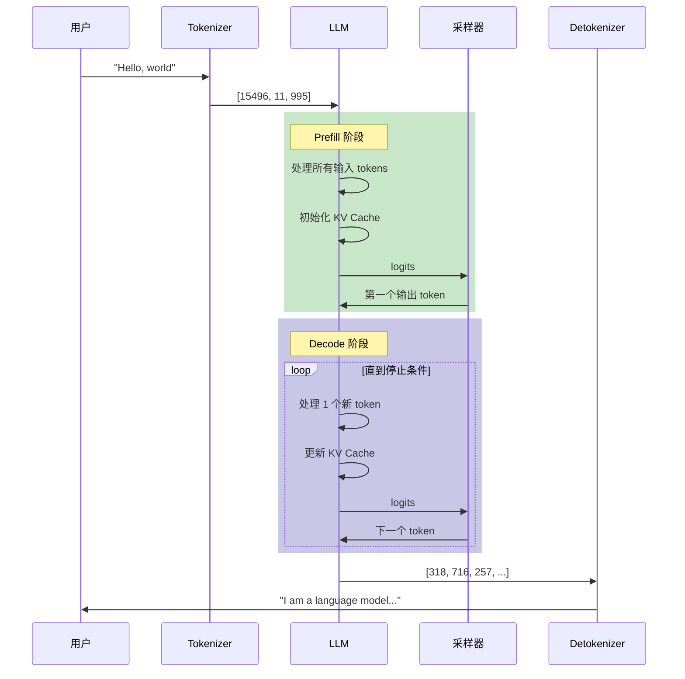
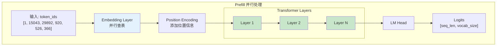
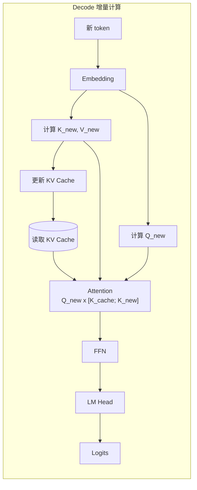
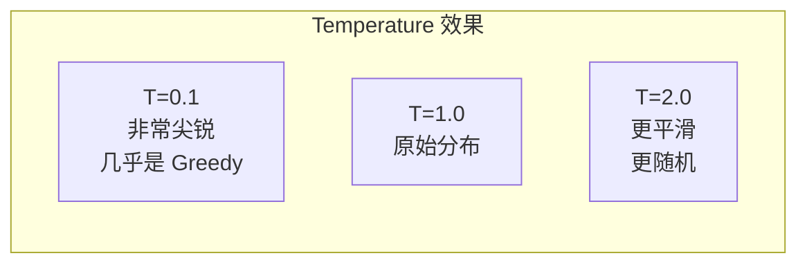
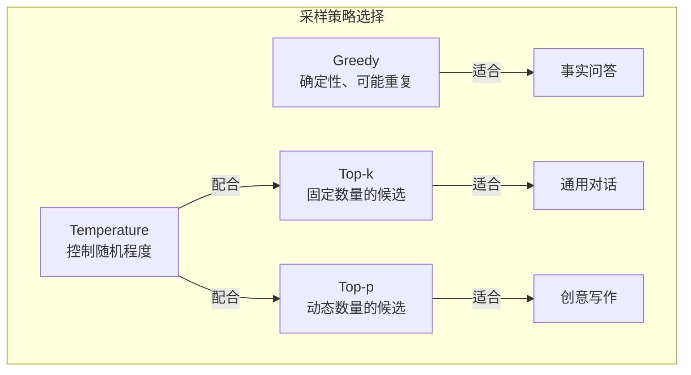
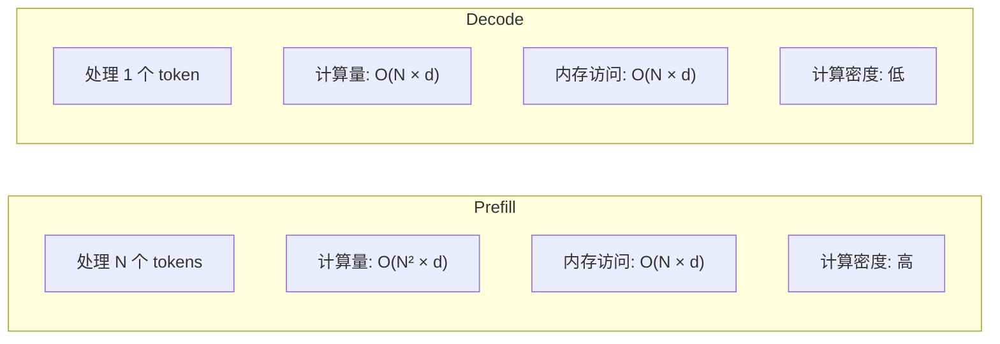
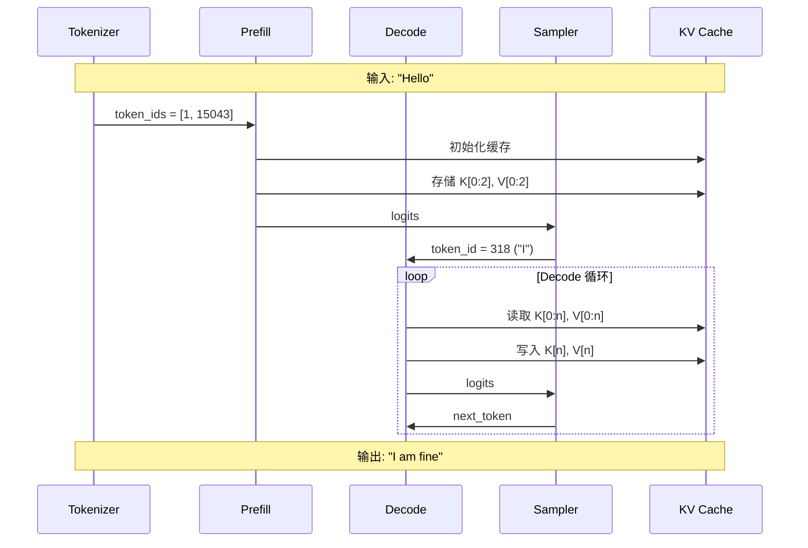

> 本章将详细介绍 LLM 文本生成的完整流程，包括 Prefill、Decode 两个阶段以及各种采样策略。

---

## 引言

LLM 生成文本是一个复杂的过程，涉及 tokenization、模型前向传播、采样等多个环节。理解这个过程对于理解 vLLM 的优化策略至关重要。

---

## 1. 生成流程概览

### 1.1 完整流程图



### 1.2 两阶段模型

LLM 生成分为两个截然不同的阶段：

| 阶段 | Prefill（预填充） | Decode（解码） |
|------|------------------|----------------|
| 处理内容 | 整个输入 prompt | 新生成的 token |
| 每次处理 | N 个 tokens | 1 个 token |
| KV Cache | 初始化 | 增量更新 |
| 计算特性 | 计算密集型 | 内存密集型 |
| GPU 利用率 | 高 | 低 |

---

## 2. Prefill 阶段详解

### 2.1 输入处理：Tokenization

第一步是将文本转换为 token IDs：

```python
from transformers import AutoTokenizer

tokenizer = AutoTokenizer.from_pretrained("meta-llama/Llama-2-7b-hf")

text = "Hello, how are you?"
tokens = tokenizer.encode(text)
print(tokens)  # [1, 15043, 29892, 920, 526, 366, 29973]
print(tokenizer.convert_ids_to_tokens(tokens))
```

### 2.2 并行计算所有 Token

在 Prefill 阶段，所有输入 token 可以并行处理：



### 2.3 KV Cache 初始化与填充

Prefill 期间，计算并存储所有输入 token 的 K、V：

```python
def prefill(model, input_ids, kv_cache):
    """
    input_ids: [batch_size, seq_len]
    """
    batch_size, seq_len = input_ids.shape

    # Embedding
    hidden_states = model.embed_tokens(input_ids)  # [batch, seq, hidden]

    # 遍历每一层
    for layer_idx, layer in enumerate(model.layers):
        # 计算 Q, K, V
        q = layer.q_proj(hidden_states)
        k = layer.k_proj(hidden_states)
        v = layer.v_proj(hidden_states)

        # 存入 KV Cache
        kv_cache.update(layer_idx, k, v)

        # 自注意力计算
        # ... (使用完整的 K, V，应用因果掩码)

        # FFN
        # ...

    # LM Head
    logits = model.lm_head(hidden_states)

    # 只返回最后一个位置的 logits（用于预测下一个 token）
    return logits[:, -1, :]  # [batch, vocab_size]
```

### 2.4 生成第一个 Token

使用最后一个位置的 logits 生成第一个输出 token：

```python
def generate_first_token(logits, sampling_params):
    """
    logits: [batch_size, vocab_size]
    """
    # 应用采样策略
    next_token = sample(logits, sampling_params)  # [batch_size, 1]
    return next_token
```

---

## 3. Decode 阶段详解

### 3.1 单 Token 增量计算

Decode 阶段每次只处理一个新 token：



### 3.2 如何利用 KV Cache

```python
def decode_step(model, new_token_id, kv_cache, position):
    """
    new_token_id: [batch_size, 1]
    position: 当前位置索引
    """
    # Embedding
    hidden_states = model.embed_tokens(new_token_id)  # [batch, 1, hidden]

    # 遍历每一层
    for layer_idx, layer in enumerate(model.layers):
        # 只计算新 token 的 Q, K, V
        q_new = layer.q_proj(hidden_states)  # [batch, 1, hidden]
        k_new = layer.k_proj(hidden_states)
        v_new = layer.v_proj(hidden_states)

        # 从缓存获取历史 K, V
        k_cache, v_cache = kv_cache.get(layer_idx)

        # 合并：[k_cache, k_new] 和 [v_cache, v_new]
        k_full = torch.cat([k_cache, k_new], dim=2)
        v_full = torch.cat([v_cache, v_new], dim=2)

        # 更新缓存
        kv_cache.update(layer_idx, k_new, v_new)

        # 注意力计算：Q_new (1个) 与 K_full (N+1个)
        # scores: [batch, heads, 1, N+1]
        scores = (q_new @ k_full.transpose(-2, -1)) / sqrt(head_dim)

        # 无需因果掩码（新 token 可以看到所有历史）
        attn_weights = F.softmax(scores, dim=-1)

        # 加权求和
        attn_output = attn_weights @ v_full  # [batch, heads, 1, head_dim]

        # ... FFN 等

    # LM Head
    logits = model.lm_head(hidden_states)  # [batch, 1, vocab_size]

    return logits.squeeze(1)  # [batch, vocab_size]
```

### 3.3 Decode 循环

```python
def decode_loop(model, first_token, kv_cache, max_tokens, stop_token_id):
    """完整的 decode 循环"""
    generated_tokens = [first_token]
    current_token = first_token
    position = kv_cache.current_len

    for step in range(max_tokens):
        # 执行一步 decode
        logits = decode_step(model, current_token, kv_cache, position)

        # 采样下一个 token
        next_token = sample(logits, sampling_params)

        # 检查停止条件
        if next_token == stop_token_id:
            break

        generated_tokens.append(next_token)
        current_token = next_token
        position += 1

    return generated_tokens
```

---

## 4. 采样策略详解

### 4.1 从 Logits 到概率分布

模型输出的是 logits（未归一化的分数），需要转换为概率分布：

```python
# logits: [vocab_size]

probs = F.softmax(logits, dim=-1)
```

### 4.2 Greedy Decoding（贪婪解码）

最简单的策略：每次选择概率最高的 token。

```python
def greedy_decode(logits):
    return torch.argmax(logits, dim=-1)
```

**特点**：
- 确定性（相同输入总是相同输出）
- 可能陷入重复
- 不适合创意生成

### 4.3 Temperature（温度）

Temperature 控制概率分布的"尖锐"程度：

```python
def apply_temperature(logits, temperature):
    return logits / temperature
```



| Temperature | 效果 | 适用场景 |
|-------------|------|---------|
| < 1.0 | 更确定，偏向高概率 | 事实性回答 |
| = 1.0 | 原始分布 | 一般场景 |
| > 1.0 | 更随机，更多样 | 创意写作 |

### 4.4 Top-k Sampling

只从概率最高的 k 个 token 中采样：

```python
def top_k_sampling(logits, k):
    # 找到 top-k 的值和索引
    top_k_logits, top_k_indices = torch.topk(logits, k)

    # 将其他位置设为 -inf
    filtered_logits = torch.full_like(logits, float('-inf'))
    filtered_logits.scatter_(-1, top_k_indices, top_k_logits)

    # 重新计算概率并采样
    probs = F.softmax(filtered_logits, dim=-1)
    return torch.multinomial(probs, num_samples=1)
```

**示例**（k=3）：

```
原始概率: [0.40, 0.30, 0.15, 0.10, 0.05]
Top-3:    [0.40, 0.30, 0.15, 0.00, 0.00]
归一化后: [0.47, 0.35, 0.18, 0.00, 0.00]
```

### 4.5 Top-p (Nucleus) Sampling

选择累积概率达到 p 的最小 token 集合：

```python
def top_p_sampling(logits, p):
    # 排序
    sorted_logits, sorted_indices = torch.sort(logits, descending=True)
    probs = F.softmax(sorted_logits, dim=-1)

    # 计算累积概率
    cumsum_probs = torch.cumsum(probs, dim=-1)

    # 找到累积概率 > p 的位置
    sorted_indices_to_remove = cumsum_probs > p
    # 保留第一个超过阈值的
    sorted_indices_to_remove[..., 1:] = sorted_indices_to_remove[..., :-1].clone()
    sorted_indices_to_remove[..., 0] = False

    # 过滤
    sorted_logits[sorted_indices_to_remove] = float('-inf')

    # 采样
    probs = F.softmax(sorted_logits, dim=-1)
    return torch.multinomial(probs, num_samples=1)
```

**示例**（p=0.9）：

```
排序后概率: [0.40, 0.30, 0.15, 0.10, 0.05]
累积概率:   [0.40, 0.70, 0.85, 0.95, 1.00]
                                ↑ 超过 0.9
保留:       [0.40, 0.30, 0.15, 0.10]  累积 = 0.95
```

### 4.6 采样策略对比



### 4.7 常用参数组合

| 场景 | Temperature | Top-p | Top-k |
|------|------------|-------|-------|
| 代码生成 | 0.1-0.3 | - | - |
| 事实问答 | 0.0-0.5 | 0.9 | - |
| 通用对话 | 0.7-0.9 | 0.9 | 40 |
| 创意写作 | 1.0-1.2 | 0.95 | 50 |
| 脑暴创意 | 1.5-2.0 | 0.98 | 100 |

---

## 5. 停止条件

### 5.1 常见停止条件

```python
def check_stop_condition(token_id, generated_tokens, params):
    # 1. 生成了 EOS token
    if token_id == params.eos_token_id:
        return True, "EOS"

    # 2. 达到最大长度
    if len(generated_tokens) >= params.max_tokens:
        return True, "MAX_LENGTH"

    # 3. 遇到停止字符串
    text = tokenizer.decode(generated_tokens)
    for stop_str in params.stop_strings:
        if stop_str in text:
            return True, "STOP_STRING"

    return False, None
```

### 5.2 vLLM 中的停止条件

```python
# vllm/sampling_params.py
class SamplingParams:
    max_tokens: int = 16           # 最大生成 token 数
    stop: List[str] = []           # 停止字符串
    stop_token_ids: List[int] = [] # 停止 token ID
    include_stop_str_in_output: bool = False
    ignore_eos: bool = False       # 是否忽略 EOS
```

---

## 6. 计算特性对比

### 6.1 Prefill vs Decode



| 特性 | Prefill | Decode |
|------|---------|--------|
| 每次处理 tokens | N | 1 |
| Attention 计算 | Q[N] × K[N]ᵀ | Q[1] × K[N]ᵀ |
| 计算量 | O(N²d) | O(Nd) |
| 内存读取 | 模型权重 | 模型权重 + KV Cache |
| 计算/访存比 | 高 | 低 |
| GPU 利用率 | 50-80% | 10-30% |
| 瓶颈 | 计算 | 内存带宽 |

### 6.2 GPU 利用率可视化

```mermaid
gantt
    title GPU 利用率时间线
    dateFormat X
    axisFormat %s

    section GPU 计算
    Prefill (高利用率) :done, p, 0, 20
    Decode Step 1 (低利用率) :crit, d1, 20, 25
    Decode Step 2 (低利用率) :crit, d2, 25, 30
    Decode Step 3 (低利用率) :crit, d3, 30, 35
    ...更多 decode steps :crit, dn, 35, 80
```



### 6.3 批处理的重要性

单独处理一个 decode step 时，GPU 大部分时间在等待数据传输。通过批处理多个请求，可以提高 GPU 利用率：

```python
# 单请求
def decode_single(request):
    read_weights()      # 14GB
    process_1_token()   # 很小的计算量
    # GPU 大部分时间空闲

def decode_batch(requests, batch_size=32):
    read_weights()      # 14GB（只读一次）
    process_32_tokens() # 32 倍的计算量
    # GPU 利用率提高 32 倍
```

---

## 7. 完整生成示例

### 7.1 代码示例

```python
def generate(model, tokenizer, prompt, max_tokens=100, temperature=0.8, top_p=0.9):
    # 1. Tokenization
    input_ids = tokenizer.encode(prompt, return_tensors='pt').cuda()

    # 2. 初始化 KV Cache
    kv_cache = KVCache(model.config)
    kv_cache.allocate(batch_size=1)

    # 3. Prefill 阶段
    logits = prefill(model, input_ids, kv_cache)

    # 4. 采样第一个 token
    sampling_params = SamplingParams(temperature=temperature, top_p=top_p)
    first_token = sample(logits, sampling_params)
    generated_tokens = [first_token.item()]

    # 5. Decode 循环
    current_token = first_token
    for _ in range(max_tokens - 1):
        # Decode 一步
        logits = decode_step(model, current_token, kv_cache)

        # 采样
        next_token = sample(logits, sampling_params)

        # 检查停止条件
        if next_token.item() == tokenizer.eos_token_id:
            break

        generated_tokens.append(next_token.item())
        current_token = next_token

    # 6. Detokenization
    output_text = tokenizer.decode(generated_tokens)
    return output_text

output = generate(model, tokenizer, "Once upon a time", max_tokens=50)
print(output)
```

### 7.2 时序图



---

## 8. 本章小结

### 生成流程

1. **Tokenization**：文本 → Token IDs
2. **Prefill**：并行处理输入，初始化 KV Cache
3. **Decode**：逐个生成 token，增量更新 KV Cache
4. **Sampling**：从 logits 采样 token
5. **Detokenization**：Token IDs → 文本

### 两阶段特性

| 阶段 | Prefill | Decode |
|------|---------|--------|
| 并行度 | 高 | 低（每次 1 token） |
| 计算密度 | 高 | 低 |
| 瓶颈 | 计算 | 内存带宽 |
| 优化重点 | 并行计算 | 批处理 |

### 采样策略

- **Greedy**：确定性，取最大概率
- **Temperature**：控制随机程度
- **Top-k**：限制候选数量
- **Top-p**：动态限制累积概率

### 与 vLLM 的关联

- **Continuous Batching**：动态组合 Prefill 和 Decode
- **Chunked Prefill**：分块处理长输入
- **采样优化**：批量采样提高效率

---

## 思考题

1. 为什么 Decode 阶段不能像 Prefill 那样并行处理多个 token？
2. 如果使用 temperature=0，结果会和 greedy decoding 一样吗？
3. vLLM 的 Continuous Batching 如何同时处理 Prefill 和 Decode 请求？

---

## 下一步

深度学习基础部分已经完成！接下来我们将进入核心模块详解，首先介绍 vLLM 的核心创新——PagedAttention：

👉 [下一章：PagedAttention 分页注意力](../03-core-modules/01-paged-attention.md)
