> 本章将详细介绍 vLLM 的核心创新——PagedAttention，包括设计思想、数据结构和实现原理。

---

## 引言

PagedAttention 是 vLLM 最重要的创新，它借鉴了操作系统虚拟内存管理的思想，革命性地解决了 KV Cache 的显存浪费问题。本章将深入剖析其设计原理和实现细节。

---

## 1. 传统 KV Cache 的问题回顾

### 1.1 连续内存分配的要求

传统方案要求每个请求的 KV Cache 存储在**连续的内存空间**中：

```
传统 KV Cache 布局:
+----------------------------------------------------------+
| Request A 的 KV Cache (预分配 max_seq_len)                 |
| [K0,V0][K1,V1][K2,V2]...[Kn,Vn][   空闲预留空间   ]        |
+----------------------------------------------------------+
| Request B 的 KV Cache (预分配 max_seq_len)                 |
| [K0,V0][K1,V1]...[Km,Vm][      空闲预留空间      ]         |
+----------------------------------------------------------+
```

### 1.2 显存碎片化图解

当多个请求并发时，显存碎片化问题严重：

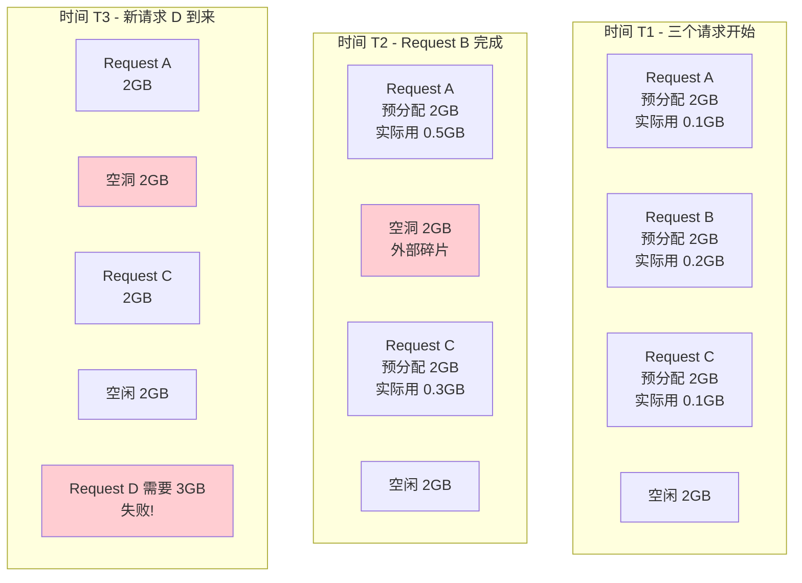

### 1.3 量化浪费

| 问题类型 | 说明 | 浪费比例 |
|---------|------|---------|
| 内部碎片 | 预分配 >> 实际使用 | 40-60% |
| 外部碎片 | 空洞无法利用 | 20-30% |
| **总计** | **综合浪费** | **60-80%** |

---

## 2. PagedAttention 核心思想

### 2.1 灵感来源：操作系统虚拟内存

操作系统如何管理内存？

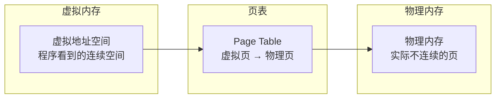

**关键特性**：
1. 程序看到连续的地址空间
2. 物理内存可以不连续
3. 按需分配（用到才分配）
4. 页面可以共享

### 2.2 PagedAttention 的类比

将操作系统的思想应用到 KV Cache 管理：

| 操作系统概念 | PagedAttention 对应 |
|-------------|-------------------|
| 页（Page） | Block（块） |
| 页表（Page Table） | Block Table（块表） |
| 虚拟地址 | 逻辑块索引 |
| 物理地址 | 物理块 ID |
| 页帧 | KV Cache 块 |

### 2.3 核心改进

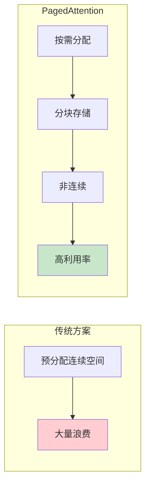

---

## 3. 关键数据结构详解

### 3.1 Block（块）

Block 是 KV Cache 的基本存储单元：

```python
# 概念定义
class KVCacheBlock:
    block_id: int              # 物理块 ID
    ref_cnt: int               # 引用计数（支持共享）
    block_hash: Optional[int]  # 用于前缀缓存匹配
```

**Block 的特点**：
- **固定大小**：每个 block 存储固定数量的 token（如 16 个）
- **独立分配**：不需要连续
- **可复用**：释放后可分配给其他请求

### 3.2 Block 的存储内容

每个 Block 存储若干 token 的 K 和 V：

```
Block 结构 (block_size = 16):
┌─────────────────────────────────────────────────┐
│ Token 0:  K[layers, heads, head_dim]            │
│           V[layers, heads, head_dim]            │
├─────────────────────────────────────────────────┤
│ Token 1:  K[layers, heads, head_dim]            │
│           V[layers, heads, head_dim]            │
├─────────────────────────────────────────────────┤
│ ...                                             │
├─────────────────────────────────────────────────┤
│ Token 15: K[layers, heads, head_dim]            │
│           V[layers, heads, head_dim]            │
└─────────────────────────────────────────────────┘
```

**实际存储形状**：

```python
# 单个 Block 的 KV Cache 形状
k_block = torch.zeros(num_layers, num_heads, block_size, head_dim)
v_block = torch.zeros(num_layers, num_heads, block_size, head_dim)

kv_cache = torch.zeros(num_blocks, 2, num_layers, num_heads, block_size, head_dim)
```

### 3.3 Block Table（块表）

Block Table 记录逻辑块到物理块的映射：

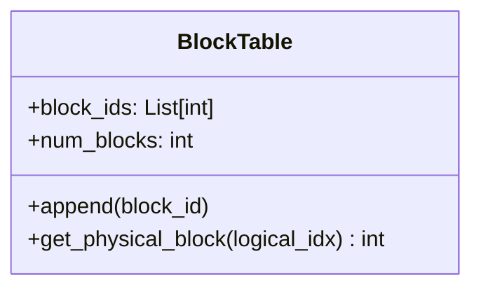

**示例**：

```
Request A 的 Block Table:
逻辑块索引:  0    1    2    3
            ↓    ↓    ↓    ↓
物理块 ID:  [5]  [2]  [8]  [12]

解释:
- 逻辑块 0 → 物理块 5
- 逻辑块 1 → 物理块 2
- 逻辑块 2 → 物理块 8
- 逻辑块 3 → 物理块 12
```

### 3.4 Slot Mapping（槽位映射）

Slot Mapping 将 token 位置映射到具体的缓存槽位：

```python
def get_slot_mapping(token_position, block_size, block_table):
    """
    token_position: token 在序列中的位置（如 35）
    block_size: 每个 block 的 token 数（如 16）
    block_table: 块表
    """
    logical_block_idx = token_position // block_size  # 35 // 16 = 2
    block_offset = token_position % block_size        # 35 % 16 = 3

    physical_block_id = block_table[logical_block_idx]  # 假设是 8
    slot_id = physical_block_id * block_size + block_offset  # 8 * 16 + 3 = 131

    return slot_id
```

**图解**：

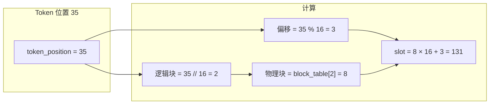

---

## 4. 内存管理优势

### 4.1 减少显存碎片

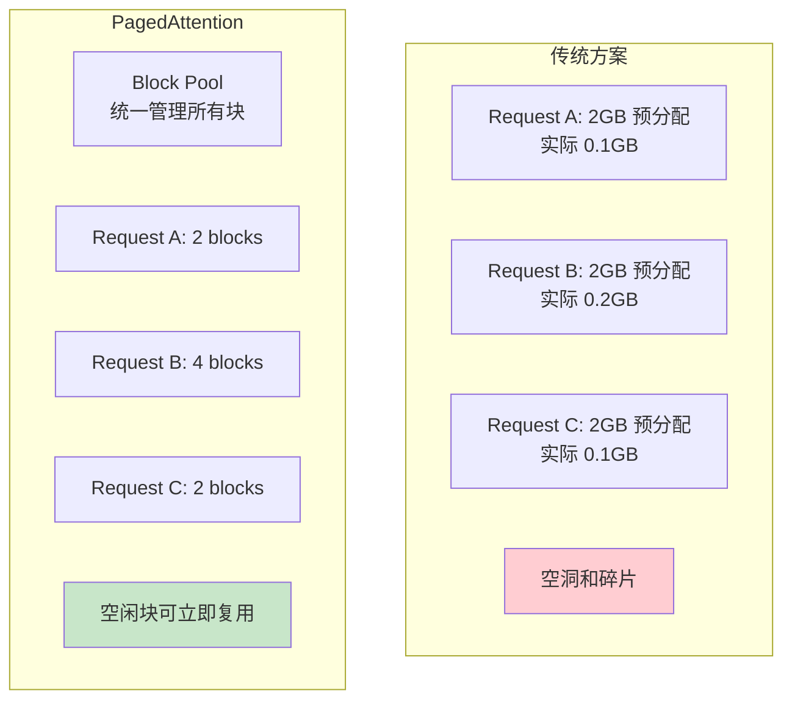

### 4.2 按需分配

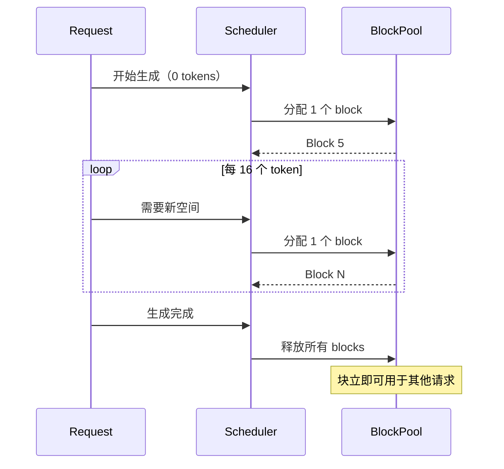

### 4.3 支持 Copy-on-Write

当多个请求共享相同前缀时，可以共享 Block：

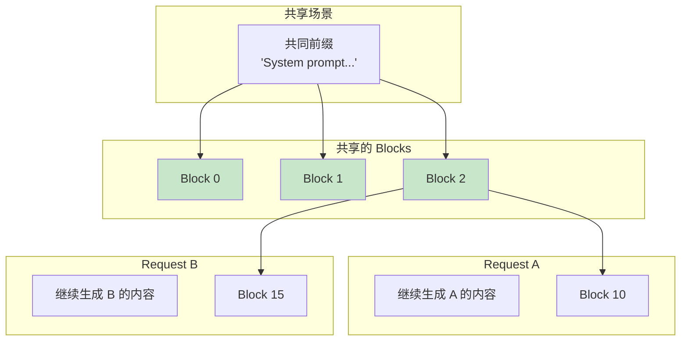

**引用计数**：
- Block 0, 1, 2 的 ref_cnt = 2（被两个请求共享）
- 只有当 ref_cnt = 0 时才真正释放

### 4.4 支持前缀缓存

相同前缀的请求可以直接复用已计算的 KV Cache：

```python
# 前缀缓存示例
request_1 = "你好，请问" + "天气怎么样？"
request_2 = "你好，请问" + "今天星期几？"

```

---

## 5. PagedAttention 计算流程

### 5.1 写入 KV Cache

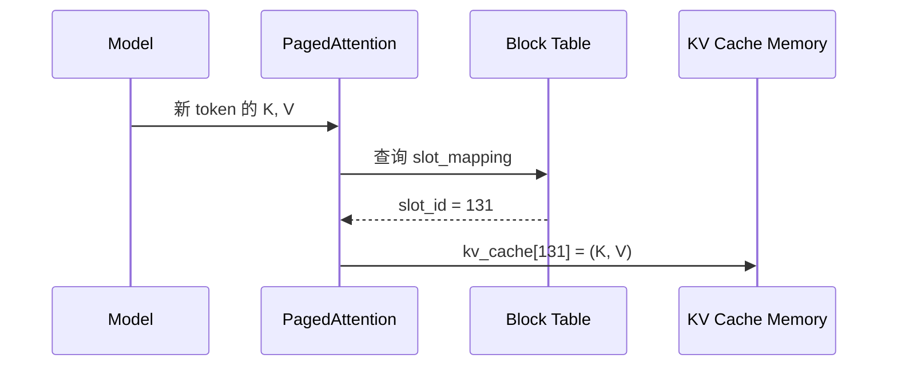

### 5.2 读取并计算 Attention

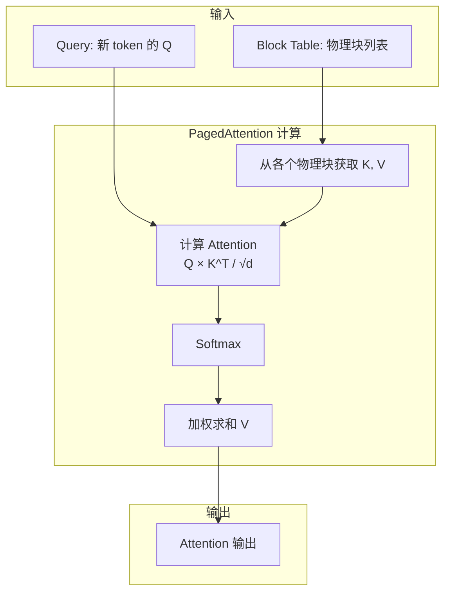

### 5.3 代码实现概览

```python
# vllm/v1/attention/ops/paged_attn.py (简化版)

class PagedAttention:
    @staticmethod
    def write_to_paged_cache(
        key: torch.Tensor,           # [num_tokens, num_heads, head_dim]
        value: torch.Tensor,         # [num_tokens, num_heads, head_dim]
        key_cache: torch.Tensor,     # [num_blocks, block_size, num_heads, head_dim]
        value_cache: torch.Tensor,   # [num_blocks, block_size, num_heads, head_dim]
        slot_mapping: torch.Tensor,  # [num_tokens]
    ):
        """将新的 K, V 写入缓存"""
        # 使用 slot_mapping 确定写入位置
        # slot_mapping[i] 告诉我们 token i 应该写入哪个槽位
        pass

    @staticmethod
    def forward(
        query: torch.Tensor,         # [num_tokens, num_heads, head_dim]
        key_cache: torch.Tensor,     # KV Cache
        value_cache: torch.Tensor,
        block_tables: torch.Tensor,  # [batch, max_blocks] 块表
        context_lens: torch.Tensor,  # [batch] 每个请求的上下文长度
        ...
    ) -> torch.Tensor:
        """执行 PagedAttention 计算"""
        # 1. 根据 block_tables 定位 K, V
        # 2. 计算 Attention
        # 3. 返回输出
        pass
```

---

## 6. 块的动态管理

### 6.1 块的生命周期

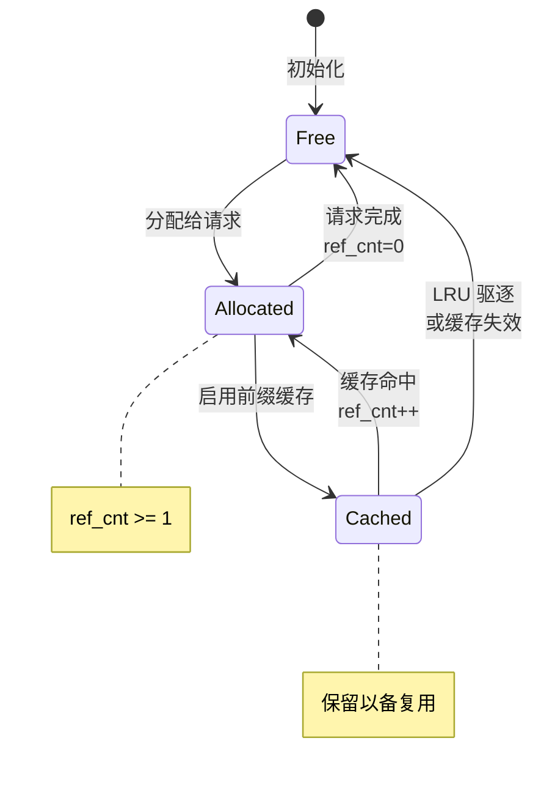

### 6.2 块分配流程

```python
def allocate_blocks_for_request(request, kv_cache_manager):
    """为请求分配所需的 blocks"""
    num_tokens = len(request.prompt_tokens) + request.num_generated_tokens
    num_blocks_needed = (num_tokens + block_size - 1) // block_size

    blocks = []
    for i in range(num_blocks_needed):
        # 尝试获取空闲块
        block = kv_cache_manager.get_free_block()
        if block is None:
            # 没有空闲块，触发驱逐或返回失败
            return None
        blocks.append(block)

    # 更新请求的块表
    request.block_table = blocks
    return blocks
```

### 6.3 块增长过程

```mermaid
gantt
    title 请求的块分配时间线
    dateFormat X
    axisFormat %s

    section 块分配
    Block 0 (prefill) :done, b0, 0, 16
    Block 1 (prefill 续) :done, b1, 16, 32
    Block 2 (decode) :active, b2, 32, 48
    Block 3 (decode 续) :active, b3, 48, 64
```

---

## 7. CUDA 内核实现

### 7.1 文件位置

- Python 接口：`vllm/v1/attention/ops/paged_attn.py`
- CUDA 内核：`csrc/attention/paged_attention_v1.cu`、`paged_attention_v2.cu`

### 7.2 V1 vs V2 内核

| 特性 | V1 | V2 |
|------|----|----|
| 适用场景 | 短序列 | 长序列 |
| 分块策略 | 简单 | 两级分块 |
| 性能 | 中等 | 更优 |

### 7.3 内核参数

```cpp
// paged_attention_v2.cu (简化)
template<typename T, int BLOCK_SIZE, int NUM_THREADS>
__global__ void paged_attention_v2_kernel(
    T* __restrict__ out,              // 输出
    const T* __restrict__ q,          // Query
    const T* __restrict__ k_cache,    // Key Cache
    const T* __restrict__ v_cache,    // Value Cache
    const int* __restrict__ block_tables,  // 块表
    const int* __restrict__ context_lens,  // 上下文长度
    const float scale,                // 缩放因子
    ...
) {
    // 1. 确定当前线程处理的 query
    // 2. 遍历 block_table 中的所有块
    // 3. 计算 Attention 分数
    // 4. Softmax 和加权求和
}
```

---

## 8. 性能对比

### 8.1 显存效率

| 方案 | 显存利用率 | 最大并发 |
|------|-----------|---------|
| 传统预分配 | 20-40% | 低 |
| PagedAttention | 96%+ | 高 2-4 倍 |

### 8.2 吞吐量提升

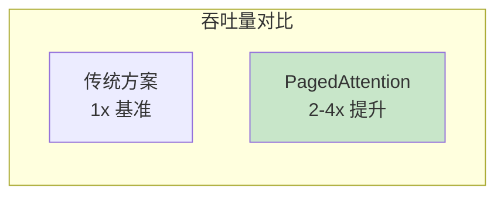

### 8.3 碎片率

```
传统方案:
- 内部碎片: 50-70%
- 外部碎片: 10-20%
- 总碎片: 60-80%

PagedAttention:
- 内部碎片: < 4% (最后一个块)
- 外部碎片: 0% (固定大小块)
- 总碎片: < 4%
```

---

## 9. 本章小结

### 核心创新

1. **分块存储**：将 KV Cache 分成固定大小的 Block
2. **非连续分配**：Block 可以分散在显存任意位置
3. **按需分配**：生成新 token 时才分配新 Block
4. **块表映射**：通过 Block Table 管理逻辑到物理的映射

### 关键数据结构

| 结构 | 作用 |
|------|------|
| Block | KV Cache 的基本存储单元 |
| Block Table | 逻辑块 → 物理块映射 |
| Slot Mapping | Token 位置 → 缓存槽位 |
| BlockPool | 管理所有空闲块 |

### 优势总结

- **显存效率**：从 20-40% 提升到 96%+
- **减少碎片**：从 60-80% 降到 4% 以下
- **支持共享**：多请求可共享相同前缀的 Block
- **按需增长**：不需要预分配最大长度

### 代码位置

| 功能 | 文件 |
|------|------|
| Python 接口 | `vllm/v1/attention/ops/paged_attn.py` |
| CUDA 内核 | `csrc/attention/paged_attention_v2.cu` |
| 块管理 | `vllm/v1/core/block_pool.py` |
| 块表 | `vllm/v1/worker/block_table.py` |

---

## 思考题

1. 为什么选择固定大小的 Block 而不是可变大小？
2. 前缀缓存和 Copy-on-Write 有什么区别和联系？
3. 如果 block_size 设置得太大或太小，会有什么影响？

---

## 下一步

了解了 PagedAttention 的原理后，让我们来看看 KV Cache Manager 是如何管理这些 Block 的：

👉 [下一章：KV Cache 管理器](02-kv-cache-manager.md)
