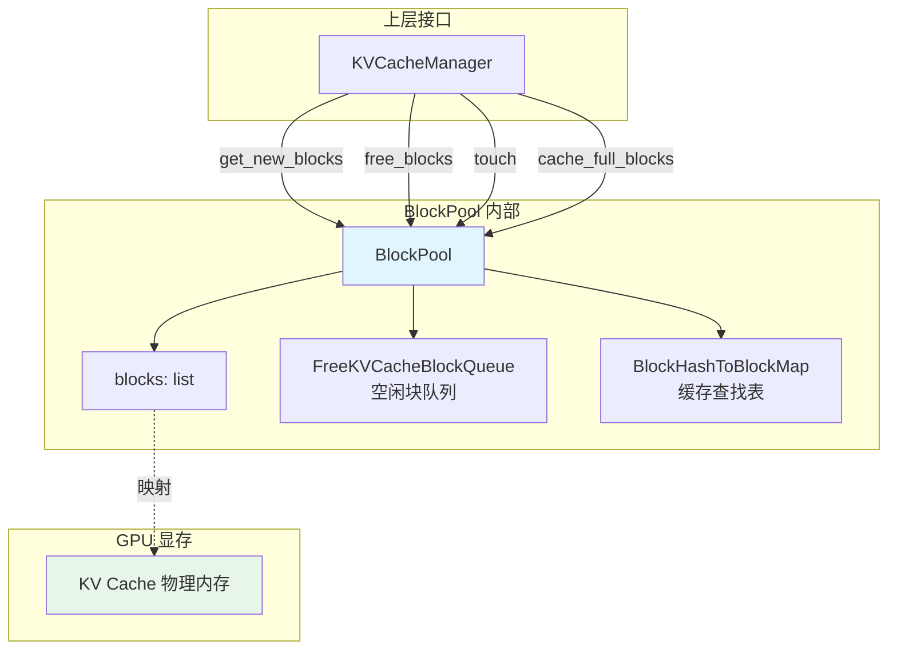
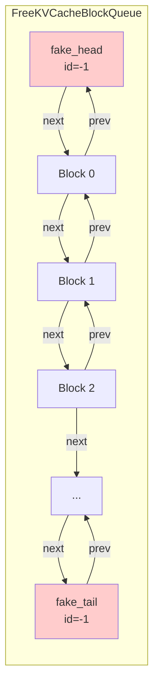
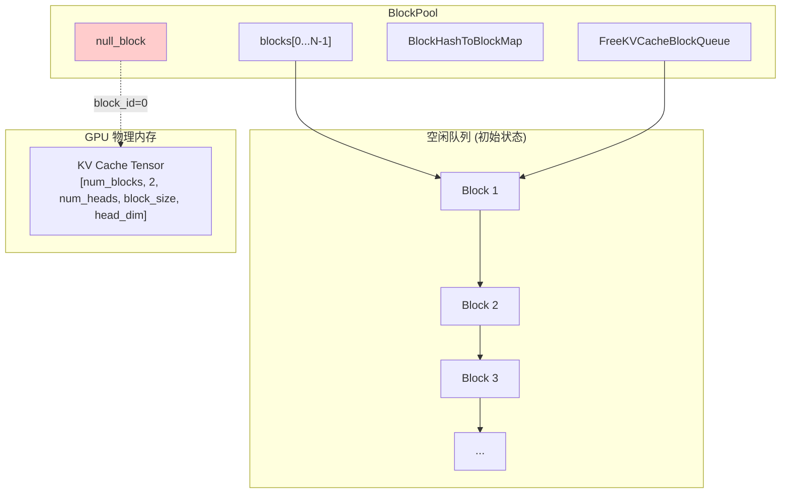
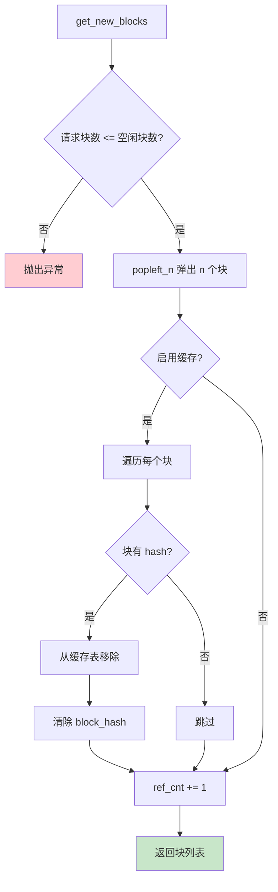
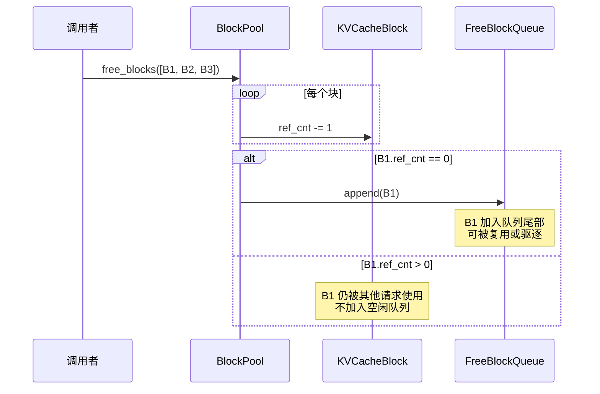
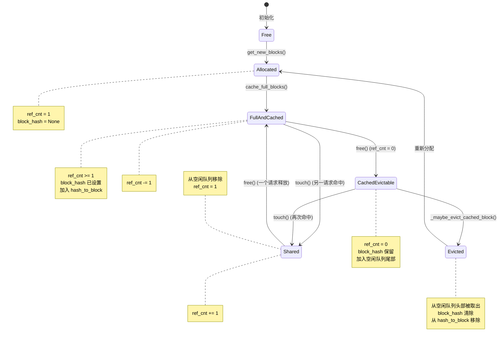
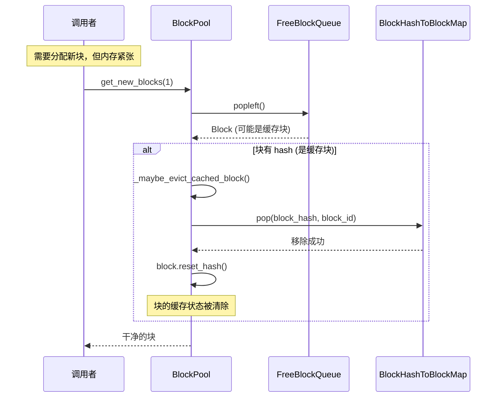
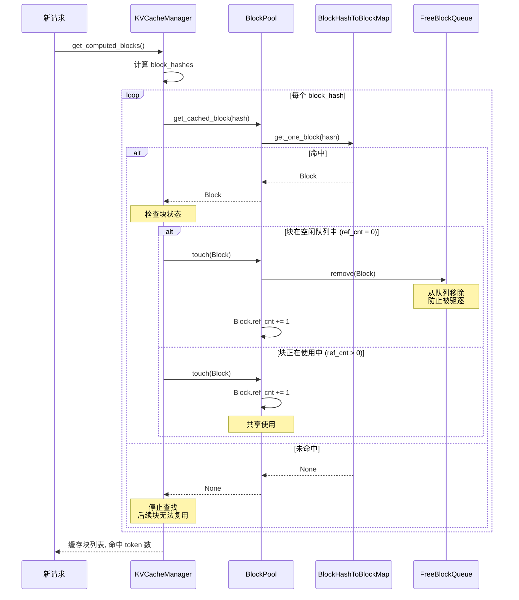

# Block Pool 内存块池详解

在前两章中，我们了解了 PagedAttention 的分页思想和 KVCacheManager 的分配接口。本章我们将深入到内存管理的最底层——**BlockPool**。

BlockPool 是 vLLM 内存管理的基石，它直接管理 GPU 上的物理内存块，负责块的分配、释放、缓存和驱逐。理解 BlockPool 的工作原理，对于深入理解 vLLM 的内存效率至关重要。

---

## 1. BlockPool 的作用



**BlockPool 的核心职责：**

1. **块管理**：维护所有物理块的元数据
2. **分配/释放**：从空闲队列分配块，释放块回队列
3. **缓存管理**：维护 Block Hash 到 Block 的映射
4. **LRU 驱逐**：当需要分配但无空闲块时，驱逐最久未使用的块

---

## 2. 核心数据结构

### 2.1 KVCacheBlock - 块元数据

每个物理块都有一个对应的 `KVCacheBlock` 对象来存储元数据：

```python
# vllm/v1/core/kv_cache_utils.py

@dataclass
class KVCacheBlock:
    """KV Cache 块的元数据"""

    # 块 ID，范围 [0, num_gpu_blocks - 1]
    block_id: int

    # 引用计数
    ref_cnt: int = 0

    # 块的 Hash 值（仅当块满且被缓存时有效）
    _block_hash: BlockHashWithGroupId | None = None

    # 双向链表指针（用于空闲队列）
    prev_free_block: "KVCacheBlock | None" = None
    next_free_block: "KVCacheBlock | None" = None

    # 是否是占位符块（null block）
    is_null: bool = False
```

**关键字段解释：**

| 字段 | 说明 |
|-----|------|
| `block_id` | 块的唯一标识，对应 GPU 内存中的物理位置 |
| `ref_cnt` | 引用计数，表示有多少请求正在使用这个块 |
| `_block_hash` | 用于前缀缓存的 hash 值，只有满块才有 |
| `prev/next_free_block` | 空闲队列的链表指针，实现 O(1) 的插入删除 |
| `is_null` | 标记占位符块，用于填充 Block Table 中的空位 |

### 2.2 FreeKVCacheBlockQueue - 空闲块队列

空闲块队列是一个**双向链表**，按 LRU 顺序组织空闲块：

```python
# vllm/v1/core/kv_cache_utils.py

class FreeKVCacheBlockQueue:
    """
    双向链表实现的空闲块队列。

    特点：
    - O(1) 的头部/尾部插入和删除
    - O(1) 的中间删除（已知节点位置）
    - LRU 顺序：最久未使用的块在队列头部
    """

    def __init__(self, blocks: list[KVCacheBlock]) -> None:
        self.num_free_blocks = len(blocks)

        # 初始化双向链表
        for i in range(self.num_free_blocks):
            if i > 0:
                blocks[i].prev_free_block = blocks[i - 1]
            if i < self.num_free_blocks - 1:
                blocks[i].next_free_block = blocks[i + 1]

        # 哨兵节点，简化边界处理
        self.fake_free_list_head = KVCacheBlock(block_id=-1)
        self.fake_free_list_tail = KVCacheBlock(block_id=-1)

        # 连接哨兵与实际链表
        self.fake_free_list_head.next_free_block = blocks[0]
        blocks[0].prev_free_block = self.fake_free_list_head
        self.fake_free_list_tail.prev_free_block = blocks[-1]
        blocks[-1].next_free_block = self.fake_free_list_tail
```

**链表结构示意图：**



**为什么用双向链表而不是 Python 的 deque？**

```python
# 场景：缓存命中，需要从队列中间移除块

# 使用 deque：O(n) 查找 + 移除
def remove_from_deque(deque, block):
    deque.remove(block)  # O(n)

# 使用双向链表：O(1) 直接移除
def remove_from_linked_list(block):
    block.prev_free_block.next_free_block = block.next_free_block
    block.next_free_block.prev_free_block = block.prev_free_block
    block.prev_free_block = block.next_free_block = None
```

### 2.3 BlockHashToBlockMap - 缓存查找表

用于快速查找已缓存的块：

```python
# vllm/v1/core/block_pool.py

class BlockHashToBlockMap:
    """
    Block Hash 到 Block 的映射表。

    注意：同一个 Hash 可能对应多个 Block（虽然内容相同，
    但分配给了不同的请求）。
    """

    def __init__(self):
        # 单个块时直接存储 KVCacheBlock
        # 多个块时存储 dict[block_id, KVCacheBlock]
        self._cache: dict[
            BlockHashWithGroupId,
            KVCacheBlock | dict[int, KVCacheBlock]
        ] = {}

    def get_one_block(self, key: BlockHashWithGroupId) -> KVCacheBlock | None:
        """获取任意一个匹配的块"""
        blocks = self._cache.get(key)
        if blocks is not None:
            if isinstance(blocks, KVCacheBlock):
                return blocks
            if isinstance(blocks, dict):
                return next(iter(blocks.values()))
        return None

    def insert(self, key: BlockHashWithGroupId, block: KVCacheBlock) -> None:
        """插入块到缓存"""
        blocks = self._cache.get(key)
        if blocks is None:
            self._cache[key] = block
        elif isinstance(blocks, KVCacheBlock):
            # 第二个相同 hash 的块，升级为 dict
            self._cache[key] = {blocks.block_id: blocks, block.block_id: block}
        elif isinstance(blocks, dict):
            blocks[block.block_id] = block
```

**为什么同一 Hash 可能有多个块？**

```
请求 A: "Hello, how are you?"
请求 B: "Hello, how are you?" (相同内容)

当两个请求同时运行时：
- 请求 A 分配了 Block #5 来存储 "Hello, how are you?"
- 请求 B 也需要这些 token，但由于 Block #5 正在被使用，
  所以也分配了 Block #8

两个块内容相同，Hash 相同，但是物理上是两个不同的块。
```

---

## 3. BlockPool 类详解

```python
# vllm/v1/core/block_pool.py

class BlockPool:
    """管理 KV Cache 块的内存池"""

    def __init__(
        self,
        num_gpu_blocks: int,      # GPU 块总数
        enable_caching: bool,      # 是否启用前缀缓存
        hash_block_size: int,      # Hash 计算的块大小
        enable_kv_cache_events: bool = False,
        metrics_collector: KVCacheMetricsCollector | None = None,
    ):
        self.num_gpu_blocks = num_gpu_blocks
        self.enable_caching = enable_caching

        # 所有块的元数据
        self.blocks: list[KVCacheBlock] = [
            KVCacheBlock(idx) for idx in range(num_gpu_blocks)
        ]

        # 空闲块队列（LRU 顺序）
        self.free_block_queue = FreeKVCacheBlockQueue(self.blocks)

        # 缓存查找表
        self.cached_block_hash_to_block = BlockHashToBlockMap()

        # 占位符块（用于填充 Block Table 中的空位）
        self.null_block = self.free_block_queue.popleft()
        self.null_block.is_null = True
```

**初始化后的状态：**



**注意：** `null_block` 是第一个被"分配"的块（block_id=0），但它实际上是一个占位符，永远不会存储真实数据。它用于填充 Block Table 中那些暂时不需要的位置（例如滑动窗口注意力中窗口外的位置）。

---

## 4. 核心操作详解

### 4.1 get_new_blocks() - 分配新块

```python
def get_new_blocks(self, num_blocks: int) -> list[KVCacheBlock]:
    """
    从空闲队列分配指定数量的块。

    如果启用了缓存，可能会驱逐一些缓存块来腾出空间。
    """
    if num_blocks > self.get_num_free_blocks():
        raise ValueError(f"Cannot get {num_blocks} free blocks from the pool")

    # 从队列头部弹出 n 个块
    ret: list[KVCacheBlock] = self.free_block_queue.popleft_n(num_blocks)

    if self.enable_caching:
        for block in ret:
            # 如果块之前被缓存过，需要驱逐它
            self._maybe_evict_cached_block(block)
            block.ref_cnt += 1
    else:
        for block in ret:
            block.ref_cnt += 1

    return ret
```

**分配流程图：**



### 4.2 free_blocks() - 释放块

```python
def free_blocks(self, ordered_blocks: Iterable[KVCacheBlock]) -> None:
    """
    释放一组块。块应按驱逐优先级排序（先释放的先被驱逐）。

    注意：释放不一定意味着块立即可复用。如果块被多个请求共享
    （ref_cnt > 1），释放只会减少引用计数。
    """
    blocks_list = list(ordered_blocks)

    # 减少所有块的引用计数
    for block in blocks_list:
        block.ref_cnt -= 1

    # 只有 ref_cnt == 0 且非 null 的块才加入空闲队列
    self.free_block_queue.append_n(
        [block for block in blocks_list
         if block.ref_cnt == 0 and not block.is_null]
    )
```

**释放流程示意：**



### 4.3 touch() - 缓存命中处理

当一个请求命中了缓存块时，需要调用 `touch()` 来增加引用计数：

```python
def touch(self, blocks: Sequence[KVCacheBlock]) -> None:
    """
    触碰块，增加引用计数。

    如果块在空闲队列中（ref_cnt 为 0），需要将其从队列中移除，
    因为它现在被使用了。
    """
    for block in blocks:
        # ref_cnt=0 意味着块在空闲队列中
        if block.ref_cnt == 0 and not block.is_null:
            self.free_block_queue.remove(block)  # O(1)

        block.ref_cnt += 1
```

**touch 的关键作用：**

```
场景：请求 B 命中了请求 A 的缓存块

初始状态：
- Block #5 被请求 A 使用，ref_cnt = 1
- Block #5 有 hash 值（已缓存）

请求 A 完成后：
- Block #5.ref_cnt = 0
- Block #5 加入空闲队列尾部
- Block #5 的 hash 仍然保留（可被缓存复用）

请求 B 查找缓存，命中 Block #5：
- touch(Block #5)
- 从空闲队列移除 Block #5（因为 ref_cnt 是 0）
- Block #5.ref_cnt = 1

现在 Block #5 又被使用了，不会被驱逐！
```

### 4.4 cache_full_blocks() - 缓存满块

当一个块填满后，将其加入缓存表：

```python
def cache_full_blocks(
    self,
    request: Request,
    blocks: list[KVCacheBlock],
    num_cached_blocks: int,     # 已缓存的块数
    num_full_blocks: int,       # 满块数
    block_size: int,
    kv_cache_group_id: int,
) -> None:
    """
    缓存新的满块。

    为每个新满块计算 hash 并加入缓存表。
    """
    if num_cached_blocks >= num_full_blocks:
        return

    new_full_blocks = blocks[num_cached_blocks:num_full_blocks]

    for i, blk in enumerate(new_full_blocks):
        if blk.is_null:
            continue

        # 获取块的 hash
        block_hash = request.block_hashes[num_cached_blocks + i]

        # 设置块的 hash
        block_hash_with_group_id = make_block_hash_with_group_id(
            block_hash, kv_cache_group_id
        )
        blk.block_hash = block_hash_with_group_id

        # 加入缓存表
        self.cached_block_hash_to_block.insert(block_hash_with_group_id, blk)
```

---

## 5. 块的生命周期



---

## 6. LRU 驱逐策略

BlockPool 使用 **LRU（Least Recently Used）** 策略来决定驱逐哪些缓存块。

### 6.1 LRU 顺序的维护

```
关键规则：
1. 新分配的块从队列头部取出
2. 释放的块（ref_cnt 降为 0）加入队列尾部
3. 缓存命中时，块从队列中间移除

这意味着：
- 队列头部是最久未使用的块（最先被驱逐）
- 队列尾部是最近使用的块（最后被驱逐）
```

### 6.2 驱逐过程



### 6.3 为什么使用逆序释放？

```python
# KVCacheManager 中的释放逻辑
def free(self, request: Request) -> None:
    """释放请求占用的块，按逆序释放"""
    blocks = self.coordinator.get_blocks(request.request_id)
    # 逆序：尾部块先加入空闲队列
    self.block_pool.free_blocks(reversed(blocks))
```

**原因：**

```
请求 A 占用块: [Block_1, Block_2, Block_3, Block_4]
                 ↑         ↑         ↑         ↑
               前缀      ....      ....      尾部

如果请求 B 有相同的前缀 "Hello, how"，它更可能复用 Block_1

正序释放的结果：
空闲队列: [..., Block_1, Block_2, Block_3, Block_4]
                   ↑                              ↑
                 先驱逐                         后驱逐
// 前缀块先被驱逐，不好！

逆序释放的结果：
空闲队列: [..., Block_4, Block_3, Block_2, Block_1]
                   ↑                              ↑
                 先驱逐                         后驱逐
// 尾部块先被驱逐，前缀块保留更久，好！
```

---

## 7. 前缀缓存的缓存命中

### 7.1 缓存查找流程

```python
def get_cached_block(
    self, block_hash: BlockHash, kv_cache_group_ids: list[int]
) -> list[KVCacheBlock] | None:
    """
    根据 block hash 查找缓存块。

    返回每个 group 的缓存块，如果任何 group 未命中则返回 None。
    """
    cached_blocks = []
    for group_id in kv_cache_group_ids:
        block_hash_with_group_id = make_block_hash_with_group_id(
            block_hash, group_id
        )
        block = self.cached_block_hash_to_block.get_one_block(
            block_hash_with_group_id
        )
        if not block:
            return None  # 任何 group 未命中，整体失败
        cached_blocks.append(block)
    return cached_blocks
```

### 7.2 完整的缓存命中场景



---

## 8. 配置与调优

### 8.1 关键配置参数

| 参数 | 说明 | 影响 |
|-----|------|------|
| `num_gpu_blocks` | 总块数 | 更多块 = 更大的 KV Cache 容量 |
| `enable_caching` | 是否启用前缀缓存 | 开启后有缓存命中收益，但增加管理开销 |
| `block_size` | 每块 token 数 | 更大块 = 更少碎片，但粒度更粗 |

### 8.2 块数量计算

```python
# vllm/v1/core/kv_cache_utils.py

def get_num_blocks(
    vllm_config: VllmConfig,
    num_layers: int,
    available_memory: int,
    page_size: int  # 每块占用的显存
) -> int:
    """计算可分配的块数"""
    num_blocks = int(available_memory // page_size // num_layers)
    num_blocks = max(num_blocks, 0)
    return num_blocks
```

**显存消耗公式：**

```
page_size = block_size × num_heads × head_dim × 2 × dtype_size
                           ↑                    ↑
                    (K 和 V)            (FP16 = 2 bytes)

total_kv_cache_memory = page_size × num_layers × num_blocks
```

### 8.3 监控使用率

```python
def get_usage(self) -> float:
    """获取 KV Cache 使用率"""
    total_gpu_blocks = self.num_gpu_blocks - 1  # 减去 null_block
    if not total_gpu_blocks:
        return 0
    return 1.0 - (self.get_num_free_blocks() / total_gpu_blocks)
```

---

## 9. 代码位置速查

| 功能 | 文件 | 关键类/函数 |
|-----|------|------------|
| BlockPool | `vllm/v1/core/block_pool.py` | `BlockPool` 类 |
| KVCacheBlock | `vllm/v1/core/kv_cache_utils.py` | `KVCacheBlock` 数据类 |
| 空闲队列 | `vllm/v1/core/kv_cache_utils.py` | `FreeKVCacheBlockQueue` 类 |
| 缓存查找表 | `vllm/v1/core/block_pool.py` | `BlockHashToBlockMap` 类 |
| Hash 计算 | `vllm/v1/core/kv_cache_utils.py` | `hash_block_tokens()` |
| 块数计算 | `vllm/v1/core/kv_cache_utils.py` | `get_num_blocks()` |

---

## 10. 小结

本章我们深入了解了 BlockPool 的工作原理：

1. **核心数据结构**：
   - `KVCacheBlock`：块元数据，包含引用计数和 hash
   - `FreeKVCacheBlockQueue`：双向链表实现的 LRU 空闲队列
   - `BlockHashToBlockMap`：前缀缓存的 hash 查找表

2. **关键操作**：
   - `get_new_blocks()`：从队列头部分配块
   - `free_blocks()`：减少引用计数，ref_cnt=0 时加入队列尾部
   - `touch()`：缓存命中时增加引用计数
   - `cache_full_blocks()`：缓存满块的 hash

3. **LRU 驱逐**：
   - 队列头部是最久未使用的块
   - 逆序释放确保前缀块保留更久

4. **块生命周期**：Free → Allocated → Cached → Evictable → Evicted

在下一章中，我们将学习调度器（Scheduler）如何使用这些内存管理组件来做出调度决策。

---

## 导航

- 上一篇：[KV Cache 管理器](02-kv-cache-manager.md)
- 下一篇：[调度器原理](04-scheduler.md)
- [返回目录](../README.md)
