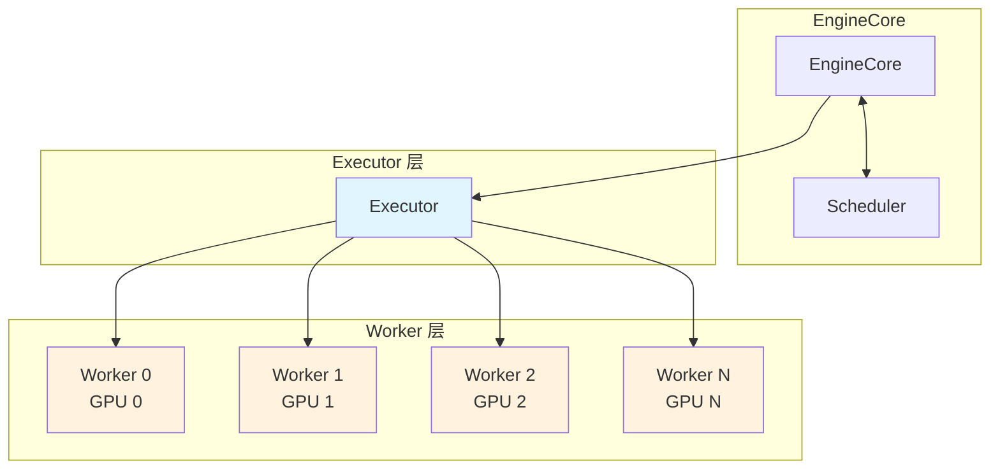
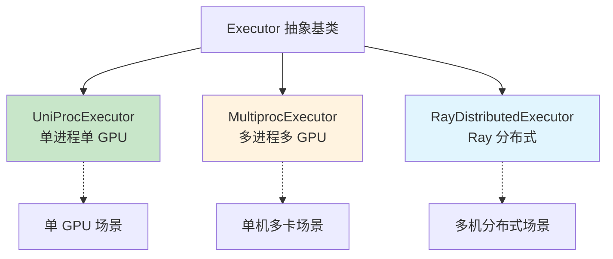
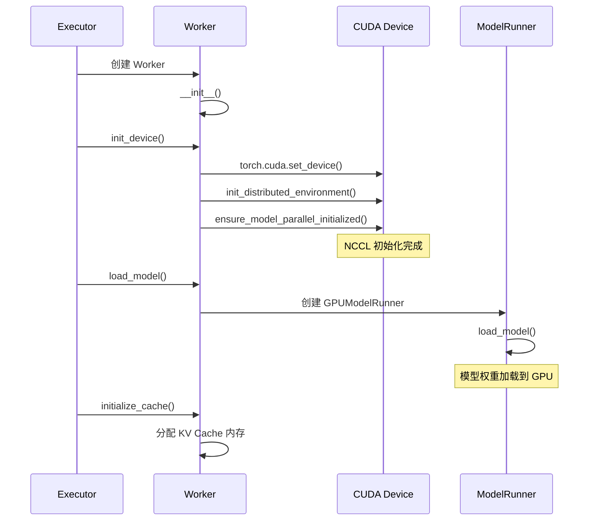
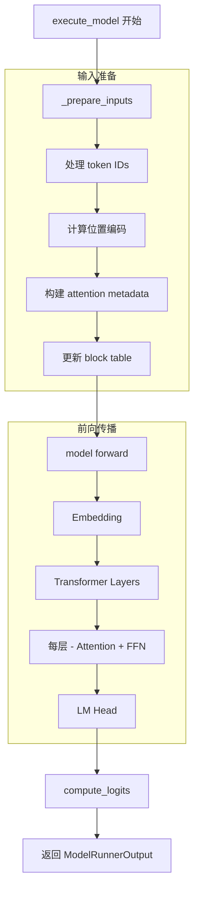
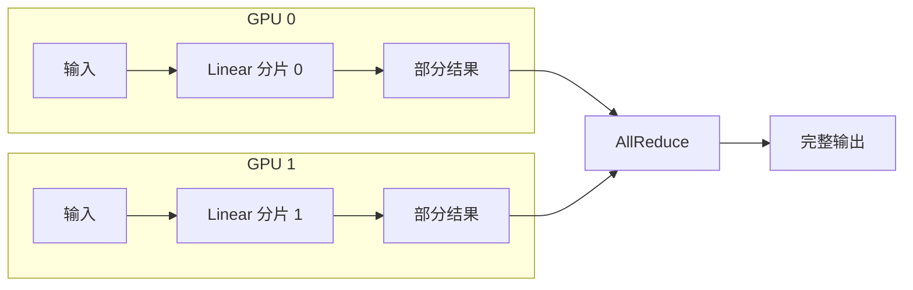
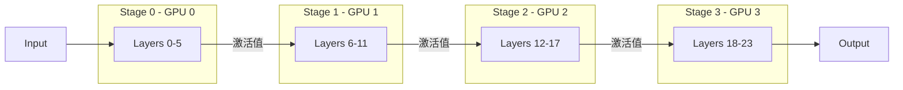
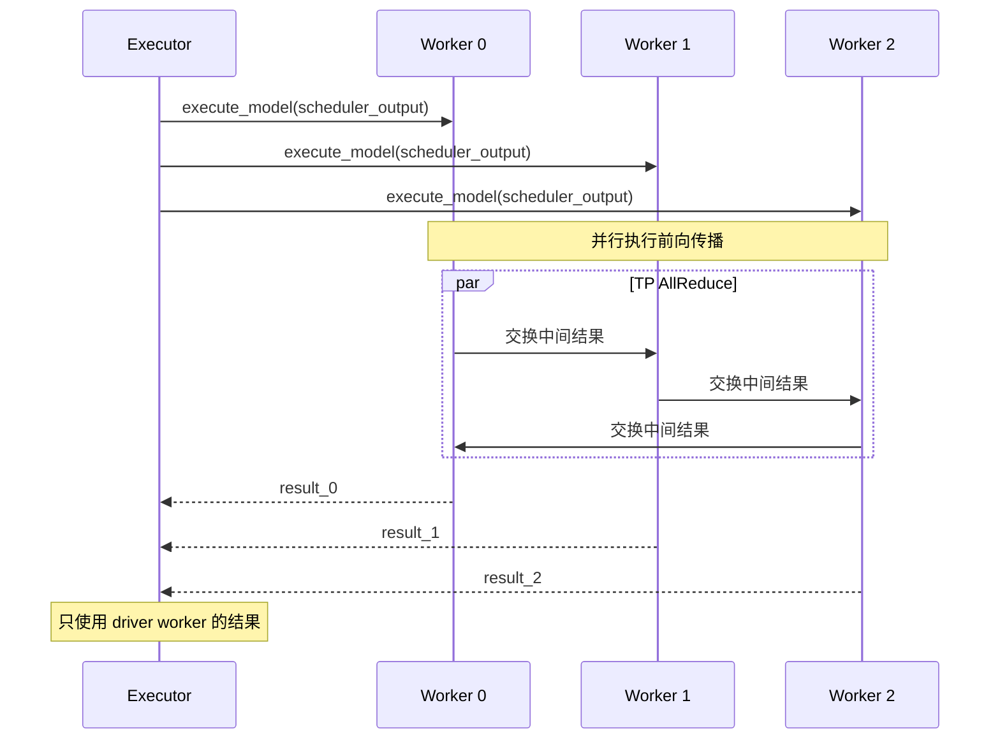

# Executor 与 Worker 详解

在上一章中，我们了解了 vLLM 的入口点和请求处理流程。本章我们将深入 Executor 和 Worker 层，了解模型是如何在 GPU 上执行的。

---

## 1. Executor 与 Worker 的关系



**职责划分：**

| 组件 | 职责 |
|-----|------|
| **Executor** | 管理多个 Worker，协调分布式执行 |
| **Worker** | 在单个 GPU 上执行模型推理 |

---

## 2. Executor 抽象基类

### 2.1 类定义

```python
# vllm/v1/executor/abstract.py

class Executor(ABC):
    """vLLM Executor 的抽象基类

    Executor 负责在一个或多个设备上执行模型。
    """

    uses_ray: bool = False      # 是否使用 Ray
    supports_pp: bool = False   # 是否支持流水线并行

    def __init__(self, vllm_config: VllmConfig) -> None:
        self.vllm_config = vllm_config
        self.model_config = vllm_config.model_config
        self.cache_config = vllm_config.cache_config
        self.parallel_config = vllm_config.parallel_config
        ...
        self._init_executor()  # 子类实现

    @abstractmethod
    def _init_executor(self) -> None:
        """初始化 Executor（由子类实现）"""
        raise NotImplementedError

    @abstractmethod
    def collective_rpc(
        self,
        method: str | Callable,
        args: tuple = (),
        kwargs: dict | None = None,
    ) -> list:
        """在所有 Worker 上执行 RPC 调用"""
        raise NotImplementedError

    def execute_model(
        self,
        scheduler_output: SchedulerOutput,
    ) -> ModelRunnerOutput | None:
        """执行模型推理"""
        return self.collective_rpc(
            "execute_model",
            args=(scheduler_output,),
        )[0]
```

### 2.2 Executor 工厂方法

```python
@staticmethod
def get_class(vllm_config: VllmConfig) -> type["Executor"]:
    """根据配置获取合适的 Executor 类"""

    distributed_executor_backend = vllm_config.parallel_config.distributed_executor_backend

    if distributed_executor_backend == "ray":
        from vllm.v1.executor.ray_executor import RayDistributedExecutor
        return RayDistributedExecutor

    elif distributed_executor_backend == "mp":
        from vllm.v1.executor.multiproc_executor import MultiprocExecutor
        return MultiprocExecutor

    elif distributed_executor_backend == "uni":
        from vllm.v1.executor.uniproc_executor import UniProcExecutor
        return UniProcExecutor

    else:
        raise ValueError(f"Unknown executor backend: {distributed_executor_backend}")
```

---

## 3. Executor 实现类型

### 3.1 类型对比



### 3.2 UniProcExecutor - 单进程

```python
# vllm/v1/executor/uniproc_executor.py

class UniProcExecutor(Executor):
    """单进程 Executor，用于单 GPU 场景"""

    def _init_executor(self) -> None:
        # 直接在当前进程创建 Worker
        self.driver_worker = Worker(
            vllm_config=self.vllm_config,
            local_rank=0,
            rank=0,
            distributed_init_method="",
            is_driver_worker=True,
        )
        self.driver_worker.init_device()
        self.driver_worker.load_model()

    def collective_rpc(self, method, args=(), kwargs=None):
        """直接调用 Worker 方法"""
        if isinstance(method, str):
            func = getattr(self.driver_worker, method)
        else:
            func = lambda: method(self.driver_worker)
        return [func(*args, **(kwargs or {}))]
```

### 3.3 MultiprocExecutor - 多进程

```python
# vllm/v1/executor/multiproc_executor.py

class MultiprocExecutor(Executor):
    """多进程 Executor，用于单机多卡场景"""

    supports_pp = True

    def _init_executor(self) -> None:
        # 创建多个 Worker 进程
        self.workers = []

        for rank in range(self.parallel_config.world_size):
            worker = self._create_worker(rank)
            self.workers.append(worker)

    def collective_rpc(self, method, args=(), kwargs=None):
        """并行调用所有 Worker"""
        futures = []
        for worker in self.workers:
            future = worker.execute_method(method, args, kwargs)
            futures.append(future)

        # 等待所有 Worker 完成
        results = [f.result() for f in futures]
        return results
```

### 3.4 RayDistributedExecutor - Ray 分布式

```python
# vllm/v1/executor/ray_executor.py

class RayDistributedExecutor(Executor):
    """Ray 分布式 Executor，用于多机场景"""

    uses_ray = True
    supports_pp = True

    def _init_executor(self) -> None:
        import ray

        # 创建 Ray Actor（远程 Worker）
        self.workers = []

        for rank in range(self.parallel_config.world_size):
            worker_actor = ray.remote(Worker).remote(
                vllm_config=self.vllm_config,
                rank=rank,
                ...
            )
            self.workers.append(worker_actor)

    def collective_rpc(self, method, args=(), kwargs=None):
        """通过 Ray 调用远程 Worker"""
        import ray

        refs = []
        for worker in self.workers:
            ref = getattr(worker, method).remote(*args, **(kwargs or {}))
            refs.append(ref)

        # 异步获取结果
        results = ray.get(refs)
        return results
```

---

## 4. Worker 详解

### 4.1 Worker 基类

```python
# vllm/v1/worker/worker_base.py

class WorkerBase(ABC):
    """Worker 抽象基类"""

    def __init__(
        self,
        vllm_config: VllmConfig,
        local_rank: int,        # 本地 GPU 序号
        rank: int,              # 全局 Worker 序号
        distributed_init_method: str,
        is_driver_worker: bool = False,
    ):
        self.vllm_config = vllm_config
        self.local_rank = local_rank
        self.rank = rank
        self.is_driver_worker = is_driver_worker

    @abstractmethod
    def init_device(self) -> None:
        """初始化设备（GPU）"""
        raise NotImplementedError

    @abstractmethod
    def load_model(self) -> None:
        """加载模型"""
        raise NotImplementedError

    @abstractmethod
    def execute_model(
        self,
        scheduler_output: SchedulerOutput,
    ) -> ModelRunnerOutput:
        """执行模型推理"""
        raise NotImplementedError
```

### 4.2 GPU Worker

```python
# vllm/v1/worker/gpu_worker.py

class Worker(WorkerBase):
    """GPU Worker 实现"""

    def __init__(
        self,
        vllm_config: VllmConfig,
        local_rank: int,
        rank: int,
        distributed_init_method: str,
        is_driver_worker: bool = False,
    ):
        super().__init__(...)

        # 配置 float32 精度
        precision = envs.VLLM_FLOAT32_MATMUL_PRECISION
        torch.set_float32_matmul_precision(precision)

        # Profiler（可选）
        self.profiler = self._setup_profiler()

    def init_device(self):
        """初始化 GPU 设备"""
        # 设置 CUDA 设备
        torch.cuda.set_device(self.local_rank)
        self.device = torch.device(f"cuda:{self.local_rank}")

        # 初始化分布式环境
        init_distributed_environment(
            world_size=self.parallel_config.world_size,
            rank=self.rank,
            distributed_init_method=self.distributed_init_method,
            backend="nccl",
        )

        # 初始化模型并行
        ensure_model_parallel_initialized(
            tensor_model_parallel_size=self.parallel_config.tensor_parallel_size,
            pipeline_model_parallel_size=self.parallel_config.pipeline_parallel_size,
        )

    def load_model(self):
        """加载模型到 GPU"""
        with self._maybe_get_memory_pool_context("weights"):
            # 创建 ModelRunner
            self.model_runner = GPUModelRunner(
                vllm_config=self.vllm_config,
                device=self.device,
            )
            # 加载模型权重
            self.model_runner.load_model()

    def execute_model(
        self,
        scheduler_output: SchedulerOutput,
    ) -> ModelRunnerOutput:
        """执行模型推理"""
        return self.model_runner.execute_model(scheduler_output)
```

### 4.3 Worker 初始化流程



---

## 5. ModelRunner 详解

### 5.1 GPUModelRunner 类

```python
# vllm/v1/worker/gpu_model_runner.py

class GPUModelRunner:
    """GPU 模型执行器"""

    def __init__(
        self,
        vllm_config: VllmConfig,
        device: torch.device,
    ):
        self.vllm_config = vllm_config
        self.device = device
        self.model: nn.Module | None = None

        # KV Cache 配置
        self.kv_caches: list[torch.Tensor] = []
        self.block_size = vllm_config.cache_config.block_size

        # 输入处理
        self.input_batch = GPUInputBatch(...)

    def load_model(self):
        """加载模型"""
        from vllm.model_executor.model_loader import get_model

        self.model = get_model(
            model_config=self.model_config,
            load_config=self.load_config,
            device_config=self.device_config,
            parallel_config=self.parallel_config,
            scheduler_config=self.scheduler_config,
        )

    def execute_model(
        self,
        scheduler_output: SchedulerOutput,
    ) -> ModelRunnerOutput:
        """执行模型前向传播"""

        # 1. 准备输入
        model_input = self._prepare_inputs(scheduler_output)

        # 2. 执行前向传播
        with torch.inference_mode():
            hidden_states = self.model(
                input_ids=model_input.input_ids,
                positions=model_input.positions,
                kv_caches=self.kv_caches,
                attn_metadata=model_input.attn_metadata,
            )

        # 3. 计算 logits
        logits = self.model.compute_logits(hidden_states)

        # 4. 返回输出
        return ModelRunnerOutput(
            logits=logits,
            ...
        )
```

### 5.2 execute_model 流程



---

## 6. KV Cache 管理

### 6.1 Worker 端的 KV Cache

```python
# vllm/v1/worker/gpu_worker.py

def initialize_cache(self, num_gpu_blocks: int, num_cpu_blocks: int) -> None:
    """初始化 KV Cache"""
    self.cache_config.num_gpu_blocks = num_gpu_blocks
    self.cache_config.num_cpu_blocks = num_cpu_blocks

def initialize_from_config(self, kv_cache_configs: list[KVCacheConfig]) -> None:
    """根据配置初始化 KV Cache"""
    self.model_runner.initialize_kv_cache(kv_cache_configs)
```

### 6.2 KV Cache Tensor 布局

```python
# KV Cache 的形状
# [num_blocks, 2, num_heads, block_size, head_dim]
#     ↑        ↑      ↑          ↑         ↑
#   块数量   K和V   注意力头数  块大小   头维度

# 示例：16 块，8 头，16 token/块，128 维
kv_cache_shape = (16, 2, 8, 16, 128)
kv_cache = torch.empty(kv_cache_shape, dtype=torch.float16, device="cuda")
```

### 6.3 Block Table 使用

```python
# vllm/v1/worker/block_table.py

class BlockTable:
    """管理每个序列的 block 映射"""

    def __init__(self, max_num_seqs: int, max_num_blocks_per_seq: int):
        # [max_num_seqs, max_num_blocks_per_seq]
        self.block_table = torch.zeros(
            (max_num_seqs, max_num_blocks_per_seq),
            dtype=torch.int32,
            device="cuda",
        )

    def update(self, req_index: int, block_ids: list[int]):
        """更新请求的 block 映射"""
        num_blocks = len(block_ids)
        self.block_table[req_index, :num_blocks] = torch.tensor(
            block_ids, dtype=torch.int32
        )
```

---

## 7. 分布式执行

### 7.1 张量并行（Tensor Parallelism）



### 7.2 流水线并行（Pipeline Parallelism）



### 7.3 collective_rpc 通信



---

## 8. 性能优化

### 8.1 CUDA Graph

```python
# vllm/v1/worker/gpu_model_runner.py

def _capture_cuda_graph(self, ...):
    """捕获 CUDA Graph 以减少启动开销"""

    # 预热
    for _ in range(3):
        self.model(...)

    # 捕获
    graph = torch.cuda.CUDAGraph()
    with torch.cuda.graph(graph):
        output = self.model(...)

    return graph, output

def execute_model_with_cuda_graph(self, ...):
    """使用 CUDA Graph 执行"""
    # 重放预捕获的计算图
    self.cuda_graph.replay()
    return self.graph_output
```

### 8.2 内存优化

```python
# Worker 的 sleep/wake_up 机制
def sleep(self, level: int = 1) -> None:
    """释放内存进入睡眠模式"""
    from vllm.device_allocator.cumem import CuMemAllocator

    allocator = CuMemAllocator.get_instance()

    if level == 2:
        # 保存 buffer 到 CPU
        self._sleep_saved_buffers = {
            name: buffer.cpu().clone()
            for name, buffer in self.model.named_buffers()
        }

    # 释放 GPU 内存
    allocator.sleep(offload_tags=("weights",) if level == 1 else tuple())

def wake_up(self, tags: list[str] | None = None) -> None:
    """从睡眠模式唤醒"""
    allocator = CuMemAllocator.get_instance()
    allocator.wake_up(tags)

    # 恢复 buffer
    if self._sleep_saved_buffers:
        for name, buffer in self.model.named_buffers():
            buffer.data.copy_(self._sleep_saved_buffers[name].data)
```

---

## 9. 代码位置速查

| 组件 | 文件 | 关键类/函数 |
|-----|------|------------|
| Executor 基类 | `vllm/v1/executor/abstract.py` | `Executor` |
| 单进程 Executor | `vllm/v1/executor/uniproc_executor.py` | `UniProcExecutor` |
| 多进程 Executor | `vllm/v1/executor/multiproc_executor.py` | `MultiprocExecutor` |
| Ray Executor | `vllm/v1/executor/ray_executor.py` | `RayDistributedExecutor` |
| Worker 基类 | `vllm/v1/worker/worker_base.py` | `WorkerBase` |
| GPU Worker | `vllm/v1/worker/gpu_worker.py` | `Worker` |
| GPU ModelRunner | `vllm/v1/worker/gpu_model_runner.py` | `GPUModelRunner` |
| Block Table | `vllm/v1/worker/block_table.py` | `BlockTable` |

---

## 10. 小结

本章我们深入了解了 Executor 和 Worker 层：

1. **Executor 类型**：
   - `UniProcExecutor`：单进程单 GPU
   - `MultiprocExecutor`：单机多卡
   - `RayDistributedExecutor`：多机分布式

2. **Worker 职责**：
   - 设备初始化
   - 模型加载
   - 模型执行
   - KV Cache 管理

3. **ModelRunner**：
   - 输入准备
   - 前向传播
   - logits 计算

4. **分布式执行**：
   - 张量并行：切分权重矩阵
   - 流水线并行：切分模型层
   - collective_rpc：跨 Worker 通信

在下一章中，我们将深入模型前向传播的具体实现。

---

## 导航

- 上一篇：[入口点分析](01-entry-points.md)
- 下一篇：[模型前向传播](03-model-forward.md)
- [返回目录](../README.md)
