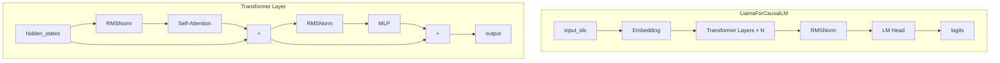
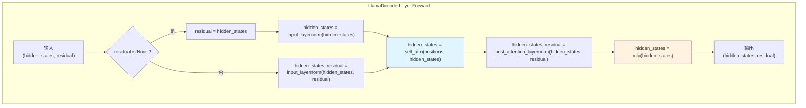
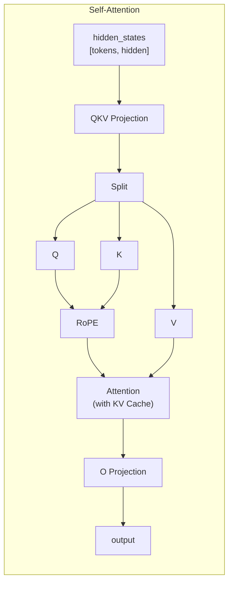
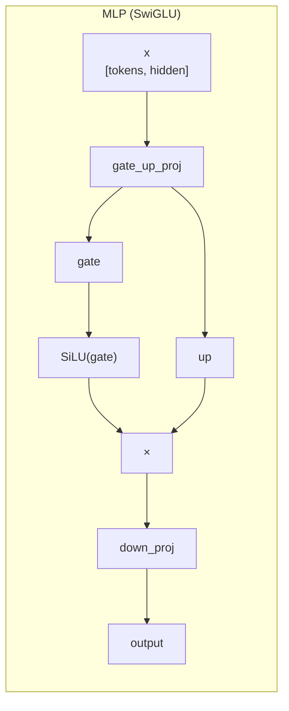
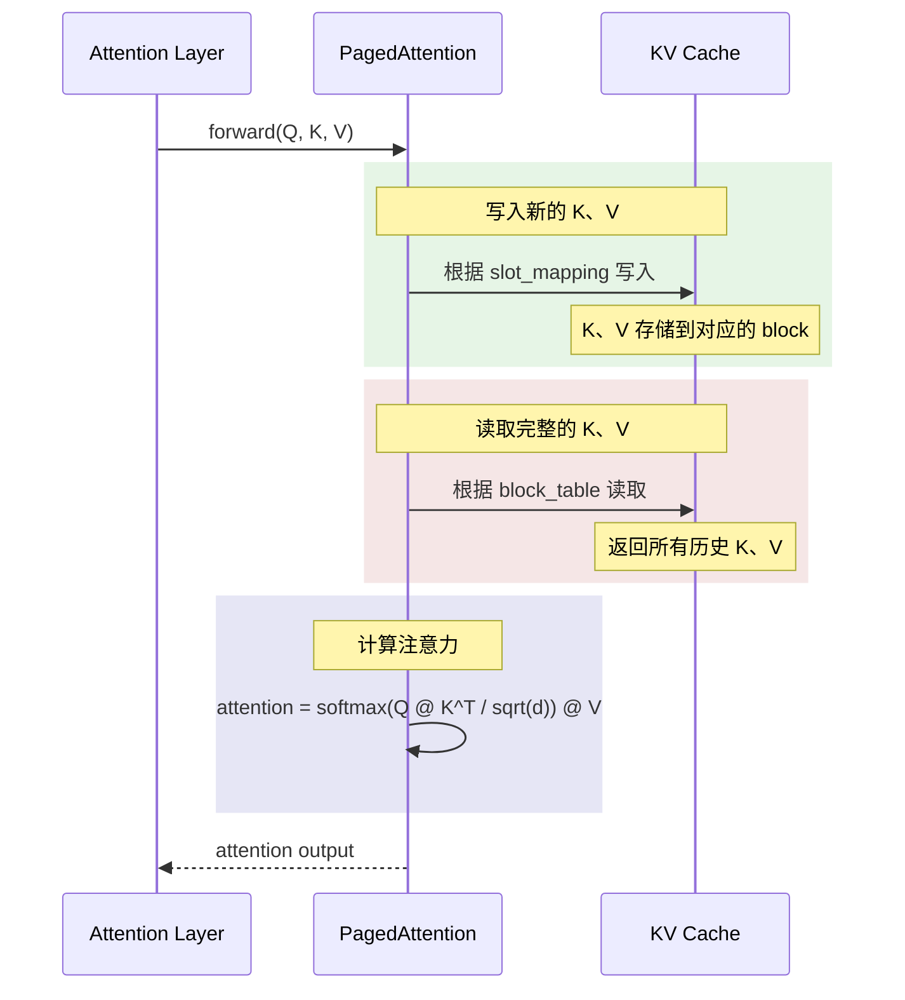
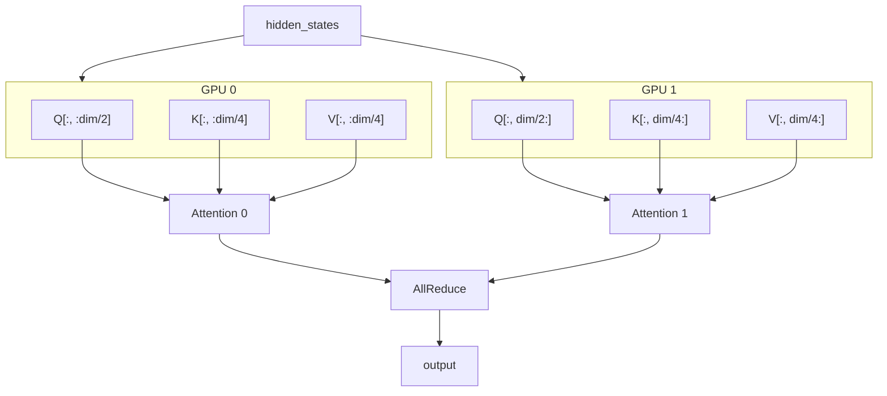
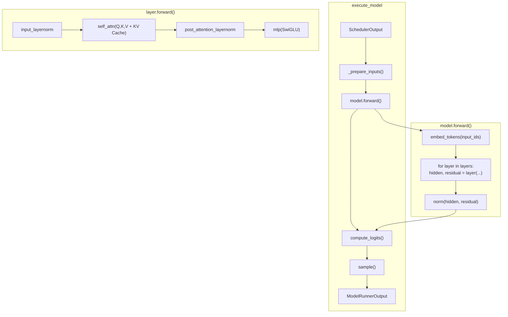

在前面的章节中，我们了解了 vLLM 的架构和调度机制。本章将深入模型的前向传播过程，以 Llama 模型为例，详细分析从输入到输出的完整计算流程。

---

## 1. 模型架构概览

### 1.1 Llama 模型结构



### 1.2 核心组件对应关系

| 组件 | vLLM 类 | 功能 |
|-----|--------|------|
| Embedding | `VocabParallelEmbedding` | token 到向量的映射 |
| Transformer Layer | `LlamaDecoderLayer` | 主要计算单元 |
| Self-Attention | `LlamaAttention` | 注意力计算 |
| MLP | `LlamaMLP` | 前馈网络 |
| LayerNorm | `RMSNorm` | 归一化 |
| LM Head | `ParallelLMHead` | 输出词表概率 |

---

## 2. vLLM 中的 Llama 实现

### 2.1 LlamaForCausalLM 类

```python
# vllm/model_executor/models/llama.py

class LlamaForCausalLM(nn.Module, SupportsLoRA, SupportsPP, SupportsEagle):
    """用于因果语言建模的 Llama 模型"""

    def __init__(self, *, vllm_config: VllmConfig, prefix: str = ""):
        super().__init__()
        config = vllm_config.model_config.hf_config
        quant_config = vllm_config.quant_config

        # 主模型（Transformer 层）
        self.model = LlamaModel(vllm_config=vllm_config, prefix=maybe_prefix(prefix, "model"))

        # 输出层（LM Head）
        if config.tie_word_embeddings:
            self.lm_head = self.model.embed_tokens  # 权重共享
        else:
            self.lm_head = ParallelLMHead(
                config.vocab_size,
                config.hidden_size,
                quant_config=quant_config,
            )

        # Logits 处理器
        self.logits_processor = LogitsProcessor(config.vocab_size)

        # 采样器
        self.sampler = get_sampler()

    def forward(
        self,
        input_ids: torch.Tensor,
        positions: torch.Tensor,
        kv_caches: list[torch.Tensor],
        attn_metadata: AttentionMetadata,
        intermediate_tensors: IntermediateTensors | None = None,
    ) -> torch.Tensor | IntermediateTensors:
        """模型前向传播"""

        # 1. 通过 Transformer 层
        hidden_states = self.model(input_ids, positions, intermediate_tensors)

        return hidden_states

    def compute_logits(
        self,
        hidden_states: torch.Tensor,
        sampling_metadata: SamplingMetadata,
    ) -> torch.Tensor:
        """计算 logits"""
        logits = self.logits_processor(
            self.lm_head,
            hidden_states,
            sampling_metadata,
        )
        return logits

    def sample(
        self,
        logits: torch.Tensor,
        sampling_metadata: SamplingMetadata,
    ) -> SamplerOutput:
        """采样下一个 token"""
        next_tokens = self.sampler(logits, sampling_metadata)
        return next_tokens
```

### 2.2 LlamaModel 类

```python
# vllm/model_executor/models/llama.py

@support_torch_compile(shape_invariants=llama_model_invariants)
class LlamaModel(nn.Module):
    """Llama 的 Transformer 模型"""

    def __init__(self, *, vllm_config: VllmConfig, prefix: str = ""):
        super().__init__()
        config = vllm_config.model_config.hf_config

        # Embedding 层
        self.embed_tokens = VocabParallelEmbedding(
            config.vocab_size,
            config.hidden_size,
        )

        # Transformer 层
        self.start_layer, self.end_layer, self.layers = make_layers(
            config.num_hidden_layers,
            lambda prefix: LlamaDecoderLayer(vllm_config=vllm_config, prefix=prefix),
            prefix=f"{prefix}.layers",
        )

        # 最终归一化
        self.norm = RMSNorm(config.hidden_size, eps=config.rms_norm_eps)

    def forward(
        self,
        input_ids: torch.Tensor | None,
        positions: torch.Tensor,
        intermediate_tensors: IntermediateTensors | None,
        inputs_embeds: torch.Tensor | None = None,
    ) -> torch.Tensor | IntermediateTensors:

        # 1. Embedding
        if get_pp_group().is_first_rank:
            if inputs_embeds is not None:
                hidden_states = inputs_embeds
            else:
                hidden_states = self.embed_tokens(input_ids)
            residual = None
        else:
            # 流水线并行：从前一阶段获取中间结果
            hidden_states = intermediate_tensors["hidden_states"]
            residual = intermediate_tensors["residual"]

        # 2. Transformer 层
        for layer in self.layers[self.start_layer:self.end_layer]:
            hidden_states, residual = layer(
                positions,
                hidden_states,
                residual,
            )

        # 3. 最终归一化（仅最后一个 PP 阶段）
        if not get_pp_group().is_last_rank:
            return IntermediateTensors({
                "hidden_states": hidden_states,
                "residual": residual
            })

        hidden_states, _ = self.norm(hidden_states, residual)
        return hidden_states
```

---

## 3. Transformer 层详解

### 3.1 LlamaDecoderLayer

```python
# vllm/model_executor/models/llama.py

class LlamaDecoderLayer(nn.Module):
    """单个 Transformer 解码器层"""

    def __init__(self, vllm_config: VllmConfig, prefix: str = ""):
        super().__init__()
        config = vllm_config.model_config.hf_config

        # Self-Attention
        self.self_attn = LlamaAttention(
            config=config,
            hidden_size=config.hidden_size,
            num_heads=config.num_attention_heads,
            num_kv_heads=config.num_key_value_heads,
            cache_config=vllm_config.cache_config,
            prefix=f"{prefix}.self_attn",
        )

        # MLP
        self.mlp = LlamaMLP(
            hidden_size=config.hidden_size,
            intermediate_size=config.intermediate_size,
            hidden_act=config.hidden_act,
            prefix=f"{prefix}.mlp",
        )

        # 归一化层
        self.input_layernorm = RMSNorm(config.hidden_size, eps=config.rms_norm_eps)
        self.post_attention_layernorm = RMSNorm(config.hidden_size, eps=config.rms_norm_eps)

    def forward(
        self,
        positions: torch.Tensor,
        hidden_states: torch.Tensor,
        residual: torch.Tensor | None,
    ) -> tuple[torch.Tensor, torch.Tensor]:
        """
        层前向传播

        使用 Pre-LN 结构（LayerNorm 在子层之前）
        """
        # 1. 第一个归一化 + 残差处理
        if residual is None:
            residual = hidden_states
            hidden_states = self.input_layernorm(hidden_states)
        else:
            hidden_states, residual = self.input_layernorm(hidden_states, residual)

        # 2. Self-Attention
        hidden_states = self.self_attn(
            positions=positions,
            hidden_states=hidden_states,
        )

        # 3. 第二个归一化 + 残差处理
        hidden_states, residual = self.post_attention_layernorm(hidden_states, residual)

        # 4. MLP
        hidden_states = self.mlp(hidden_states)

        return hidden_states, residual
```

### 3.2 前向传播数据流



---

## 4. Self-Attention 详解

### 4.1 LlamaAttention 类

```python
# vllm/model_executor/models/llama.py

class LlamaAttention(nn.Module):
    """Llama 的多头注意力层"""

    def __init__(
        self,
        config: LlamaConfig,
        hidden_size: int,
        num_heads: int,
        num_kv_heads: int,
        cache_config: CacheConfig | None = None,
        prefix: str = "",
    ):
        super().__init__()

        # 张量并行配置
        tp_size = get_tensor_model_parallel_world_size()
        self.num_heads = num_heads // tp_size
        self.num_kv_heads = max(1, num_kv_heads // tp_size)
        self.head_dim = hidden_size // num_heads
        self.scaling = self.head_dim ** -0.5

        # Q、K、V 投影（合并为一个线性层）
        self.qkv_proj = QKVParallelLinear(
            hidden_size=hidden_size,
            head_size=self.head_dim,
            total_num_heads=num_heads,
            total_num_kv_heads=num_kv_heads,
            prefix=f"{prefix}.qkv_proj",
        )

        # 输出投影
        self.o_proj = RowParallelLinear(
            input_size=num_heads * self.head_dim,
            output_size=hidden_size,
            prefix=f"{prefix}.o_proj",
        )

        # 旋转位置编码
        self.rotary_emb = get_rope(
            self.head_dim,
            max_position=config.max_position_embeddings,
        )

        # 注意力后端
        self.attn = Attention(
            self.num_heads,
            self.head_dim,
            self.scaling,
            num_kv_heads=self.num_kv_heads,
            cache_config=cache_config,
        )

    def forward(
        self,
        positions: torch.Tensor,
        hidden_states: torch.Tensor,
    ) -> torch.Tensor:
        """
        注意力前向传播

        Args:
            positions: 位置 IDs [num_tokens]
            hidden_states: 隐藏状态 [num_tokens, hidden_size]

        Returns:
            输出 [num_tokens, hidden_size]
        """
        # 1. QKV 投影
        qkv, _ = self.qkv_proj(hidden_states)
        q, k, v = qkv.split([self.q_size, self.kv_size, self.kv_size], dim=-1)

        # 2. 旋转位置编码
        q, k = self.rotary_emb(positions, q, k)

        # 3. 注意力计算（使用 vLLM 的优化后端）
        attn_output = self.attn(q, k, v)

        # 4. 输出投影
        output, _ = self.o_proj(attn_output)

        return output
```

### 4.2 注意力计算流程



### 4.3 GQA (Grouped-Query Attention)

```
标准 MHA (Multi-Head Attention):
Q heads: [h1, h2, h3, h4, h5, h6, h7, h8]
K heads: [h1, h2, h3, h4, h5, h6, h7, h8]
V heads: [h1, h2, h3, h4, h5, h6, h7, h8]

GQA (num_kv_heads=2):
Q heads: [h1, h2, h3, h4, h5, h6, h7, h8]
K heads: [k1,   k1,   k1,   k1, | k2,   k2,   k2,   k2]
V heads: [v1,   v1,   v1,   v1, | v2,   v2,   v2,   v2]

每 4 个 Q head 共享 1 个 KV head，减少 KV Cache 内存
```

---

## 5. MLP 详解

### 5.1 LlamaMLP 类

```python
# vllm/model_executor/models/llama.py

class LlamaMLP(nn.Module):
    """Llama 的 MLP（SwiGLU 激活）"""

    def __init__(
        self,
        hidden_size: int,
        intermediate_size: int,
        hidden_act: str,
        prefix: str = "",
    ):
        super().__init__()

        # gate 和 up 投影（合并）
        self.gate_up_proj = MergedColumnParallelLinear(
            input_size=hidden_size,
            output_sizes=[intermediate_size] * 2,  # gate 和 up 各一个
            prefix=f"{prefix}.gate_up_proj",
        )

        # down 投影
        self.down_proj = RowParallelLinear(
            input_size=intermediate_size,
            output_size=hidden_size,
            prefix=f"{prefix}.down_proj",
        )

        # SiLU 激活 + 门控
        self.act_fn = SiluAndMul()

    def forward(self, x: torch.Tensor) -> torch.Tensor:
        """
        MLP 前向传播

        SwiGLU: down(SiLU(gate(x)) * up(x))
        """
        # 1. gate 和 up 投影（合并执行）
        gate_up, _ = self.gate_up_proj(x)

        # 2. SiLU 激活 + 门控相乘
        x = self.act_fn(gate_up)

        # 3. down 投影
        x, _ = self.down_proj(x)

        return x
```

### 5.2 SwiGLU 计算流程



---

## 6. KV Cache 集成

### 6.1 Attention 层的 KV Cache 使用

```python
# vllm/attention/layer.py

class Attention(nn.Module):
    """vLLM 的注意力层，集成 KV Cache"""

    def forward(
        self,
        query: torch.Tensor,
        key: torch.Tensor,
        value: torch.Tensor,
    ) -> torch.Tensor:
        """
        Args:
            query: [num_tokens, num_heads * head_dim]
            key: [num_tokens, num_kv_heads * head_dim]
            value: [num_tokens, num_kv_heads * head_dim]

        内部会：
        1. 将新的 K、V 写入 KV Cache
        2. 从 KV Cache 读取完整的 K、V
        3. 计算注意力
        """
        return self.impl.forward(
            query,
            key,
            value,
            kv_cache=self.kv_cache,
            attn_metadata=self.attn_metadata,
        )
```

### 6.2 PagedAttention 后端



---

## 7. 张量并行实现

### 7.1 线性层的张量并行

```python
# vllm/model_executor/layers/linear.py

class ColumnParallelLinear(nn.Module):
    """列并行线性层（输出切分）"""

    def __init__(self, input_size: int, output_size: int, ...):
        tp_size = get_tensor_model_parallel_world_size()
        # 每个 GPU 只有 output_size / tp_size 的输出
        self.output_size_per_partition = output_size // tp_size
        self.weight = Parameter(torch.empty(
            self.output_size_per_partition,
            input_size,
        ))

class RowParallelLinear(nn.Module):
    """行并行线性层（输入切分）"""

    def __init__(self, input_size: int, output_size: int, ...):
        tp_size = get_tensor_model_parallel_world_size()
        # 每个 GPU 只处理 input_size / tp_size 的输入
        self.input_size_per_partition = input_size // tp_size
        self.weight = Parameter(torch.empty(
            output_size,
            self.input_size_per_partition,
        ))

    def forward(self, x: torch.Tensor) -> torch.Tensor:
        output = F.linear(x, self.weight)
        if self.reduce_results:
            # AllReduce 收集所有 GPU 的结果
            output = tensor_model_parallel_all_reduce(output)
        return output
```

### 7.2 QKV 投影的张量并行



---

## 8. 完整前向传播流程



---

## 9. 代码位置速查

| 组件 | 文件 | 关键类/函数 |
|-----|------|------------|
| Llama 模型 | `vllm/model_executor/models/llama.py` | `LlamaForCausalLM` |
| Transformer 层 | `vllm/model_executor/models/llama.py` | `LlamaDecoderLayer` |
| Self-Attention | `vllm/model_executor/models/llama.py` | `LlamaAttention` |
| MLP | `vllm/model_executor/models/llama.py` | `LlamaMLP` |
| Attention 后端 | `vllm/attention/layer.py` | `Attention` |
| 旋转位置编码 | `vllm/model_executor/layers/rotary_embedding.py` | `get_rope()` |
| 并行线性层 | `vllm/model_executor/layers/linear.py` | `*ParallelLinear` |
| RMSNorm | `vllm/model_executor/layers/layernorm.py` | `RMSNorm` |

---

## 10. 小结

本章我们深入了解了 vLLM 中模型前向传播的实现：

1. **模型结构**：
   - `LlamaForCausalLM` → `LlamaModel` → `LlamaDecoderLayer`
   - Pre-LN 结构，每层包含 Attention 和 MLP

2. **Self-Attention**：
   - QKV 合并投影
   - RoPE 旋转位置编码
   - GQA 减少 KV Cache 内存
   - PagedAttention 集成

3. **MLP**：
   - SwiGLU 激活函数
   - gate_up 合并投影

4. **张量并行**：
   - ColumnParallelLinear：输出切分
   - RowParallelLinear：输入切分 + AllReduce

5. **KV Cache 集成**：
   - 自动写入和读取
   - 通过 attn_metadata 控制

在下一章中，我们将深入分析采样过程，了解如何从 logits 生成下一个 token。

---

## 导航

- 上一篇：[Executor 与 Worker](02-executor-worker.md)
- 下一篇：[采样过程分析](04-sampling.md)
- [返回目录](../README.md)
