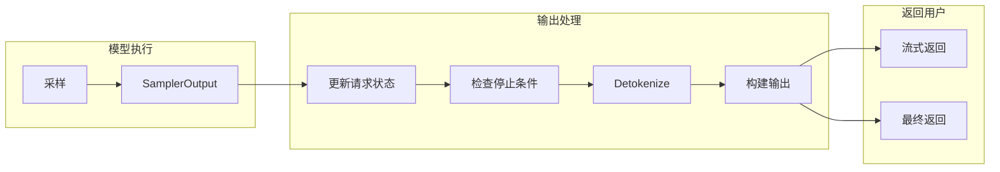
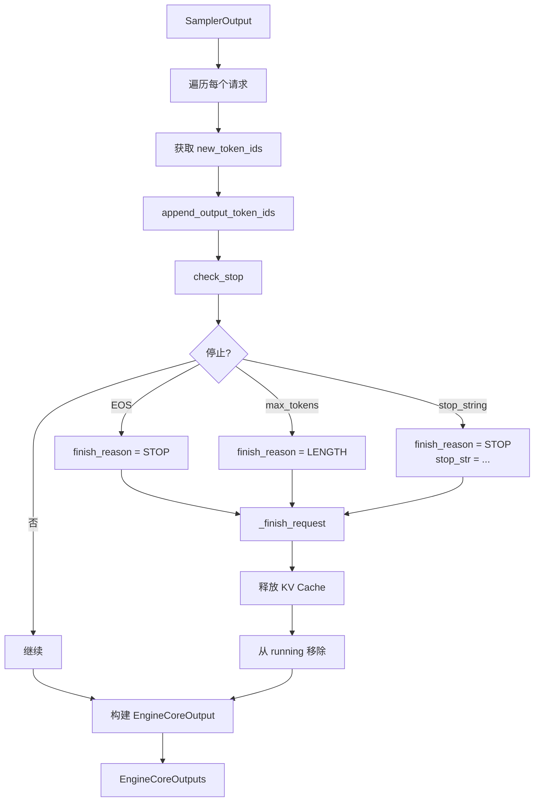
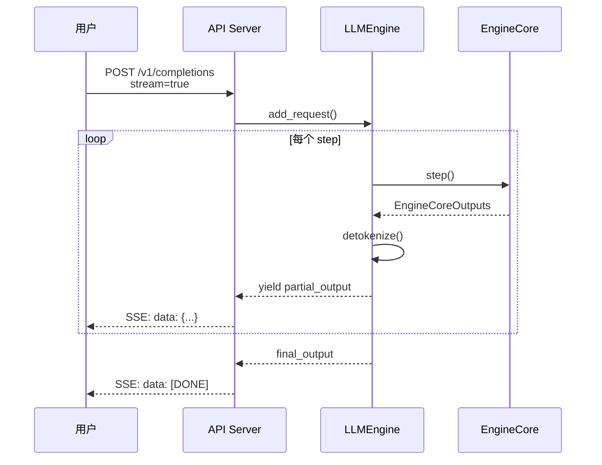
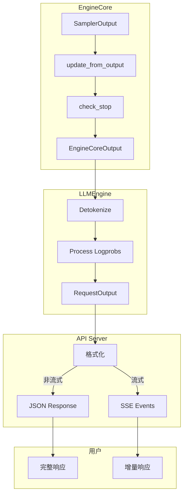

# 输出处理流程

采样完成后，生成的 token 需要经过一系列处理才能最终返回给用户。本章将详细分析从采样结果到用户输出的完整处理流程。

---

## 1. 输出处理在整体流程中的位置



---

## 2. 输出数据结构

### 2.1 SamplerOutput

```python
# vllm/v1/outputs.py

@dataclass
class SamplerOutput:
    """采样器的输出"""

    # 采样的 token IDs [num_requests, 1]
    sampled_token_ids: torch.Tensor

    # Logprobs 信息（可选）
    logprobs_tensors: LogprobsTensors | None = None

@dataclass
class LogprobsTensors:
    """Logprobs 张量"""

    # Top-k token indices [num_tokens, num_logprobs + 1]
    indices: torch.Tensor

    # Top-k logprobs [num_tokens, num_logprobs + 1]
    logprobs: torch.Tensor

    # 采样 token 的排名 [num_tokens]
    ranks: torch.Tensor
```

### 2.2 ModelRunnerOutput

```python
# vllm/v1/outputs.py

@dataclass
class ModelRunnerOutput:
    """ModelRunner 的输出"""

    # 每个请求的采样结果
    # Dict[request_id, SamplerOutput]
    sampler_output: dict[str, SamplerOutput]

    # 模型特定的输出（如 pooling embeddings）
    model_output: Any | None = None
```

### 2.3 EngineCoreOutput

```python
# vllm/v1/engine/__init__.py

@dataclass
class EngineCoreOutput:
    """EngineCore 的单个请求输出"""

    request_id: str

    # 新生成的 token IDs
    new_token_ids: list[int]

    # 完成原因（如果完成）
    finish_reason: FinishReason | None = None

    # 停止字符串（如果因停止字符串完成）
    stop_str: str | None = None

    # Logprobs 信息
    new_logprobs: list[dict[int, Logprob]] | None = None

@dataclass
class EngineCoreOutputs:
    """EngineCore 的批量输出"""

    outputs: list[EngineCoreOutput]

    # 完成的请求 IDs
    finished_req_ids: set[str] | None = None
```

### 2.4 RequestOutput（最终用户输出）

```python
# vllm/outputs.py

@dataclass
class RequestOutput:
    """用户可见的最终输出"""

    request_id: str

    # 原始 prompt
    prompt: str | None
    prompt_token_ids: list[int]

    # 生成结果（可能多个，如 beam search）
    outputs: list[CompletionOutput]

    # 是否完成
    finished: bool

    # 指标
    metrics: RequestMetrics | None = None

@dataclass
class CompletionOutput:
    """单个生成序列的输出"""

    index: int                    # 序列索引
    text: str                     # 生成的文本
    token_ids: list[int]          # 生成的 token IDs
    cumulative_logprob: float | None  # 累积对数概率
    logprobs: list[dict] | None   # 每个 token 的 logprobs
    finish_reason: str | None     # 完成原因
    stop_reason: str | int | None # 停止原因
```

---

## 3. 输出处理流程详解

### 3.1 update_from_output() - 状态更新

```python
# vllm/v1/core/sched/scheduler.py

def update_from_output(
    self,
    model_runner_output: ModelRunnerOutput,
    sampler_output: SamplerOutput | None,
    scheduler_output: SchedulerOutput,
) -> EngineCoreOutputs:
    """根据模型输出更新请求状态"""

    outputs: list[EngineCoreOutput] = []

    for req_id, req_output in model_runner_output.items():
        request = self.requests[req_id]

        # 1. 获取新生成的 token IDs
        new_token_ids = req_output.sampled_token_ids.tolist()

        # 2. 追加到请求
        request.append_output_token_ids(new_token_ids)

        # 3. 检查停止条件
        finish_reason, stop_str = check_stop(request, self.max_model_len)

        # 4. 处理完成的请求
        if finish_reason is not None:
            self._finish_request(request, finish_reason)

        # 5. 构建输出
        output = EngineCoreOutput(
            request_id=req_id,
            new_token_ids=new_token_ids,
            finish_reason=finish_reason,
            stop_str=stop_str,
            new_logprobs=self._process_logprobs(req_output),
        )
        outputs.append(output)

    return EngineCoreOutputs(outputs=outputs)
```

### 3.2 停止条件检查

```python
# vllm/v1/core/sched/utils.py

def check_stop(
    request: Request,
    max_model_len: int,
) -> tuple[FinishReason | None, str | None]:
    """检查请求是否应该停止"""

    # 1. 检查 EOS token
    last_token_id = request.all_token_ids[-1]
    if last_token_id == request.eos_token_id:
        return FinishReason.STOP, None

    # 2. 检查最大输出长度
    if request.num_output_tokens >= request.max_tokens:
        return FinishReason.LENGTH, None

    # 3. 检查模型最大长度
    if len(request.all_token_ids) >= max_model_len:
        return FinishReason.LENGTH, None

    # 4. 检查停止 token IDs
    if request.stop_token_ids:
        if last_token_id in request.stop_token_ids:
            return FinishReason.STOP, None

    # 5. 检查停止字符串
    if request.stop_strings:
        output_text = request.get_output_text()
        for stop_str in request.stop_strings:
            if stop_str in output_text:
                return FinishReason.STOP, stop_str

    return None, None  # 继续生成
```

### 3.3 流程图



---

## 4. Detokenization - 反向分词

### 4.1 增量 Detokenize

```python
# vllm/v1/engine/detokenizer.py

class IncrementalDetokenizer:
    """增量反向分词器"""

    def __init__(self, tokenizer: TokenizerLike, request: Request):
        self.tokenizer = tokenizer
        self.request = request

        # 已解码的文本
        self.output_text = ""

        # 待解码的 token 缓冲区
        self.token_buffer: list[int] = []

        # 上一次的偏移量（用于流式输出）
        self.prev_output_len = 0

    def decode(self, new_token_ids: list[int]) -> str:
        """解码新的 token，返回新增的文本"""

        # 添加到缓冲区
        self.token_buffer.extend(new_token_ids)

        # 尝试解码
        text = self.tokenizer.decode(
            self.token_buffer,
            skip_special_tokens=True,
        )

        # 检查是否有完整的字符
        # （某些 token 可能是部分字符，需要等待后续 token）
        if self._is_valid_utf8(text):
            self.output_text = text
            new_text = text[self.prev_output_len:]
            self.prev_output_len = len(text)
            return new_text

        return ""
```

### 4.2 增量解码的必要性

```
Token IDs: [15496, 284, 262, 995, 0]

逐个解码:
15496 → "Hello"     ✓ 完整单词
284   → " to"       ✓ 完整
262   → " the"      ✓ 完整
995   → " wor"      ？ 可能是 "world" 的一部分
0     → "ld"        ✓ 完成 "world"

增量解码会等待 995+0 一起解码为 " world"
而不是输出 " wor" 然后 "ld"
```

---

## 5. 流式输出

### 5.1 流式输出架构



### 5.2 Server-Sent Events (SSE) 格式

```python
# 流式响应示例
async def stream_response():
    async for output in engine.generate_stream(prompt, params):
        yield f"data: {json.dumps(output)}\n\n"

    yield "data: [DONE]\n\n"
```

**实际输出示例：**

```
data: {"id":"chatcmpl-xxx","choices":[{"delta":{"content":"Hello"}}]}

data: {"id":"chatcmpl-xxx","choices":[{"delta":{"content":" there"}}]}

data: {"id":"chatcmpl-xxx","choices":[{"delta":{"content":"!"}}]}

data: {"id":"chatcmpl-xxx","choices":[{"delta":{},"finish_reason":"stop"}]}

data: [DONE]
```

---

## 6. Logprobs 处理

### 6.1 Logprobs 数据结构

```python
@dataclass
class Logprob:
    """单个 token 的 logprob 信息"""

    logprob: float           # 对数概率
    rank: int | None         # 在词表中的排名
    decoded_token: str       # 解码后的文本

# 每个位置的 logprobs
# Dict[token_id, Logprob]
```

### 6.2 Logprobs 处理流程

```python
def _process_logprobs(
    self,
    sampler_output: SamplerOutput,
) -> list[dict[int, Logprob]] | None:
    """处理 logprobs 输出"""

    if sampler_output.logprobs_tensors is None:
        return None

    tensors = sampler_output.logprobs_tensors
    result = []

    for i in range(tensors.indices.shape[0]):
        token_logprobs = {}

        # 获取 top-k token IDs 和 logprobs
        for j in range(tensors.indices.shape[1]):
            token_id = tensors.indices[i, j].item()
            logprob = tensors.logprobs[i, j].item()

            # 解码 token
            decoded = self.tokenizer.decode([token_id])

            token_logprobs[token_id] = Logprob(
                logprob=logprob,
                rank=j if j > 0 else tensors.ranks[i].item(),
                decoded_token=decoded,
            )

        result.append(token_logprobs)

    return result
```

---

## 7. 输出格式化

### 7.1 OpenAI 兼容格式

```python
# vllm/entrypoints/openai/protocol.py

class ChatCompletionResponse(BaseModel):
    """OpenAI Chat Completion 响应格式"""

    id: str
    object: str = "chat.completion"
    created: int
    model: str
    choices: list[ChatCompletionResponseChoice]
    usage: UsageInfo

class ChatCompletionResponseChoice(BaseModel):
    index: int
    message: ChatMessage
    finish_reason: str | None
    logprobs: ChoiceLogprobs | None

class ChatMessage(BaseModel):
    role: str
    content: str
```

### 7.2 格式转换

```python
def create_chat_completion_response(
    request_output: RequestOutput,
    model_name: str,
) -> ChatCompletionResponse:
    """将 RequestOutput 转换为 OpenAI 格式"""

    choices = []
    for i, output in enumerate(request_output.outputs):
        choice = ChatCompletionResponseChoice(
            index=i,
            message=ChatMessage(
                role="assistant",
                content=output.text,
            ),
            finish_reason=output.finish_reason,
            logprobs=_convert_logprobs(output.logprobs),
        )
        choices.append(choice)

    return ChatCompletionResponse(
        id=f"chatcmpl-{request_output.request_id}",
        created=int(time.time()),
        model=model_name,
        choices=choices,
        usage=UsageInfo(
            prompt_tokens=len(request_output.prompt_token_ids),
            completion_tokens=sum(len(o.token_ids) for o in request_output.outputs),
            total_tokens=...,
        ),
    )
```

---

## 8. 输出处理完整流程图



---

## 9. 代码位置速查

| 组件 | 文件 | 关键类/函数 |
|-----|------|------------|
| 输出数据结构 | `vllm/v1/outputs.py` | `SamplerOutput`, `ModelRunnerOutput` |
| EngineCore 输出 | `vllm/v1/engine/__init__.py` | `EngineCoreOutput` |
| 用户输出 | `vllm/outputs.py` | `RequestOutput`, `CompletionOutput` |
| 状态更新 | `vllm/v1/core/sched/scheduler.py` | `update_from_output()` |
| 停止检查 | `vllm/v1/core/sched/utils.py` | `check_stop()` |
| Detokenizer | `vllm/v1/engine/detokenizer.py` | `IncrementalDetokenizer` |
| OpenAI 格式 | `vllm/entrypoints/openai/protocol.py` | `ChatCompletionResponse` |

---

## 10. 小结

本章我们详细分析了输出处理流程：

1. **数据结构链路**：
   - `SamplerOutput` → `ModelRunnerOutput` → `EngineCoreOutput` → `RequestOutput`

2. **状态更新**：
   - 追加 token 到请求
   - 检查停止条件
   - 处理完成的请求

3. **停止条件**：
   - EOS token
   - 最大长度
   - 停止字符串/token

4. **Detokenization**：
   - 增量解码
   - 处理部分字符

5. **流式输出**：
   - Server-Sent Events
   - 增量返回

6. **格式化**：
   - OpenAI 兼容格式
   - Logprobs 处理

在下一章中，我们将完整跟踪一个请求从提交到返回的完整生命周期。

---

## 导航

- 上一篇：[采样过程分析](04-sampling.md)
- 下一篇：[请求完整生命周期](06-request-lifecycle.md)
- [返回目录](../README.md)
