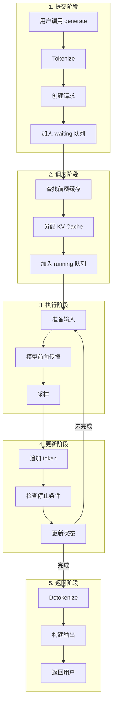
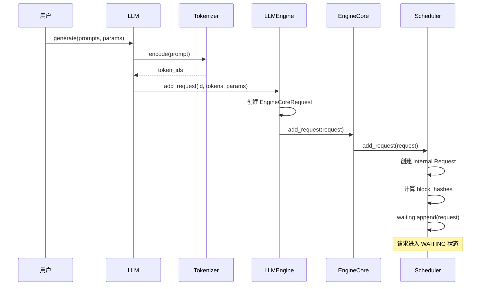
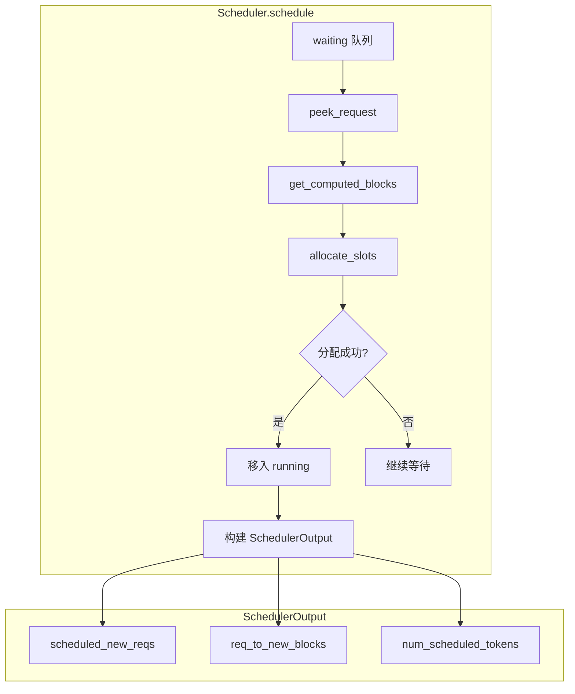
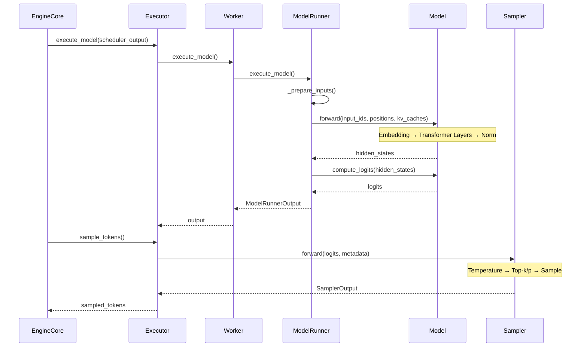
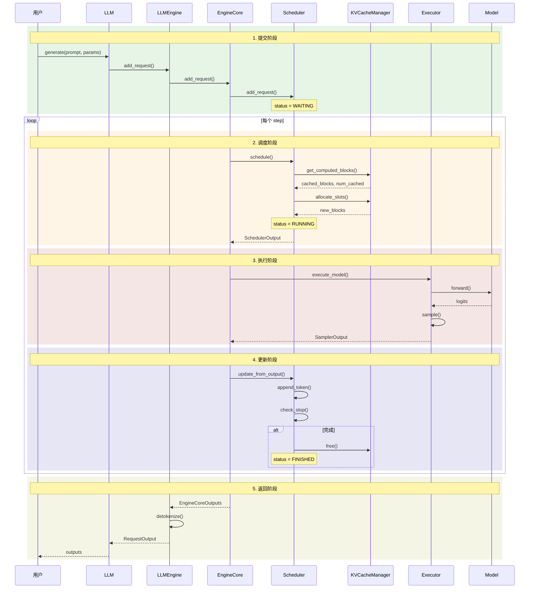
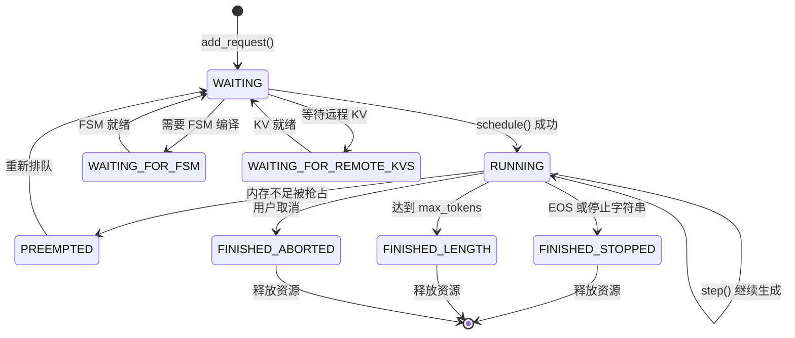

本章将完整跟踪一个请求从用户提交到最终返回的全过程，将前面章节的知识串联起来，帮助读者建立完整的认知图景。

---

## 1. 生命周期概览



---

## 2. 阶段 1：请求提交

### 2.1 用户调用

```python
# 用户代码
from vllm import LLM, SamplingParams

llm = LLM(model="meta-llama/Llama-2-7b-hf")

prompts = ["The capital of France is"]
sampling_params = SamplingParams(temperature=0.8, top_p=0.95, max_tokens=50)

outputs = llm.generate(prompts, sampling_params)
```

### 2.2 Tokenize

```python
# vllm/entrypoints/llm.py

def generate(self, prompts, sampling_params, ...):
    # 1. 处理输入
    for prompt in prompts:
        # Tokenize prompt
        prompt_token_ids = self.tokenizer.encode(prompt)

        # 创建请求
        request_id = str(next(self.request_counter))

        self._add_request(
            request_id=request_id,
            prompt=prompt,
            prompt_token_ids=prompt_token_ids,
            params=sampling_params,
        )
```

### 2.3 创建 EngineCoreRequest

```python
# vllm/v1/engine/llm_engine.py

def add_request(self, request_id, prompt, params, ...):
    # 构建 EngineCoreRequest
    engine_request = EngineCoreRequest(
        request_id=request_id,
        prompt_token_ids=prompt_token_ids,
        sampling_params=params,
        arrival_time=time.time(),
        eos_token_id=self.tokenizer.eos_token_id,
    )

    # 发送到 EngineCore
    self.engine_core.add_request(engine_request)
```

### 2.4 加入 Waiting 队列

```python
# vllm/v1/core/sched/scheduler.py

def add_request(self, request: EngineCoreRequest) -> None:
    # 1. 创建内部 Request 对象
    internal_request = Request(
        request_id=request.request_id,
        prompt_token_ids=request.prompt_token_ids,
        sampling_params=request.sampling_params,
    )

    # 2. 计算 block hashes（用于前缀缓存）
    if self.enable_caching:
        internal_request.block_hashes = compute_block_hashes(
            internal_request.prompt_token_ids,
            self.block_size,
        )

    # 3. 加入 waiting 队列
    internal_request.status = RequestStatus.WAITING
    self.waiting.append_request(internal_request)

    # 4. 记录到请求字典
    self.requests[request.request_id] = internal_request
```

### 2.5 提交阶段时序图



---

## 3. 阶段 2：调度

### 3.1 查找前缀缓存

```python
# vllm/v1/core/sched/scheduler.py :: schedule()

request = self.waiting.peek_request()

new_computed_blocks, num_cached_tokens = (
    self.kv_cache_manager.get_computed_blocks(request)
)

# 例如：prompt 有 100 tokens，前 64 个已缓存
```

### 3.2 分配 KV Cache

```python
# 计算需要处理的 token 数
num_new_tokens = request.num_tokens - num_cached_tokens

new_blocks = self.kv_cache_manager.allocate_slots(
    request,
    num_new_tokens,
    num_new_computed_tokens=num_cached_tokens,
    new_computed_blocks=new_computed_blocks,
)

if new_blocks is None:
    # 内存不足，请求继续等待
    return

```

### 3.3 移入 Running 队列

```python
# 从 waiting 移除
request = self.waiting.pop_request()

self.running.append(request)

request.status = RequestStatus.RUNNING
request.num_computed_tokens = num_cached_tokens
```

### 3.4 调度阶段示意图



---

## 4. 阶段 3：模型执行

### 4.1 准备输入

```python
# vllm/v1/worker/gpu_model_runner.py

def execute_model(self, scheduler_output: SchedulerOutput):
    # 1. 准备 input_ids
    input_ids = self._prepare_input_ids(scheduler_output)

    # 2. 准备 positions
    positions = self._prepare_positions(scheduler_output)

    # 3. 准备 attention metadata
    attn_metadata = self._prepare_attention_metadata(scheduler_output)

    # 4. 更新 block table
    self._update_block_table(scheduler_output)
```

### 4.2 模型前向传播

```python
    # 5. 前向传播
    with torch.inference_mode():
        hidden_states = self.model(
            input_ids=input_ids,
            positions=positions,
            kv_caches=self.kv_caches,
            attn_metadata=attn_metadata,
        )

    # 6. 计算 logits
    logits = self.model.compute_logits(hidden_states)

    return ModelRunnerOutput(logits=logits, ...)
```

### 4.3 采样

```python
# vllm/v1/executor/abstract.py

def sample_tokens(self, model_output: ModelRunnerOutput) -> SamplerOutput:
    # 构建采样元数据
    sampling_metadata = self._prepare_sampling_metadata()

    # 采样
    sampler_output = self.sampler(
        model_output.logits,
        sampling_metadata,
    )

    return sampler_output
```

### 4.4 执行阶段时序图



---

## 5. 阶段 4：状态更新

### 5.1 追加 Token

```python
# vllm/v1/core/sched/scheduler.py

def update_from_output(self, model_output, sampler_output, scheduler_output):
    for req_id, output in sampler_output.items():
        request = self.requests[req_id]

        # 获取新生成的 token
        new_token_ids = output.sampled_token_ids.tolist()

        # 追加到请求
        request.append_output_token_ids(new_token_ids)

        # 更新 computed_tokens
        request.num_computed_tokens += 1
```

### 5.2 检查停止条件

```python
        # 检查是否完成
        finish_reason, stop_str = check_stop(request, self.max_model_len)

        if finish_reason is not None:
            # 请求完成
            self._finish_request(request, finish_reason)
            finished_outputs.append(...)
        else:
            # 继续生成
            outputs.append(...)
```

### 5.3 完成请求处理

```python
def _finish_request(self, request: Request, reason: FinishReason):
    # 1. 释放 KV Cache
    self.kv_cache_manager.free(request)

    # 2. 从 running 移除
    self.running.remove(request)

    # 3. 更新状态
    request.status = RequestStatus.FINISHED

    # 4. 记录完成
    self.finished_req_ids.add(request.request_id)
```

---

## 6. 阶段 5：返回结果

### 6.1 Detokenize

```python
# vllm/v1/engine/llm_engine.py

def _process_outputs(self, engine_outputs: EngineCoreOutputs):
    results = []

    for output in engine_outputs.outputs:
        request = self.requests[output.request_id]

        # 增量解码
        new_text = self.detokenizer.decode(
            request,
            output.new_token_ids,
        )

        # 更新请求的输出文本
        request.output_text += new_text

        results.append(...)

    return results
```

### 6.2 构建 RequestOutput

```python
def _make_request_output(self, request: Request, finished: bool):
    return RequestOutput(
        request_id=request.request_id,
        prompt=request.prompt,
        prompt_token_ids=request.prompt_token_ids,
        outputs=[
            CompletionOutput(
                index=0,
                text=request.output_text,
                token_ids=request.output_token_ids,
                finish_reason=request.finish_reason,
                logprobs=request.logprobs,
            )
        ],
        finished=finished,
    )
```

### 6.3 返回用户

```python
# vllm/entrypoints/llm.py

def _run_engine(self, use_tqdm: bool):
    outputs = []

    while self.llm_engine.has_unfinished_requests():
        step_outputs = self.llm_engine.step()

        for output in step_outputs:
            if output.finished:
                outputs.append(output)

    return sorted(outputs, key=lambda x: int(x.request_id))
```

---

## 7. 完整生命周期时序图



---

## 8. 状态转换汇总



---

## 9. 关键数据结构流转

```
用户输入
    ↓
prompt: str
    ↓ Tokenize
prompt_token_ids: list[int]
    ↓ 创建请求
EngineCoreRequest
    ↓ 调度器内部
Request (internal)
    ↓ 调度
SchedulerOutput
    ↓ 执行
ModelRunnerOutput (logits)
    ↓ 采样
SamplerOutput (token_ids)
    ↓ 更新
EngineCoreOutput
    ↓ Detokenize
RequestOutput
    ↓
用户输出
```

---

## 10. 小结

本章我们完整跟踪了一个请求的生命周期：

1. **提交阶段**：
   - Tokenize → 创建请求 → 加入 waiting 队列

2. **调度阶段**：
   - 查找缓存 → 分配 KV Cache → 移入 running

3. **执行阶段**：
   - 准备输入 → 前向传播 → 采样

4. **更新阶段**：
   - 追加 token → 检查停止 → 更新状态

5. **返回阶段**：
   - Detokenize → 构建输出 → 返回用户

通过这个完整的流程分析，我们可以看到 vLLM 的各个组件是如何协同工作的，以及为什么它能够实现高效的 LLM 推理。

---

## 导航

- 上一篇：[输出处理流程](05-output-processing.md)
- 下一篇：[投机解码](../05-advanced-topics/01-speculative-decoding.md)
- [返回目录](../README.md)
