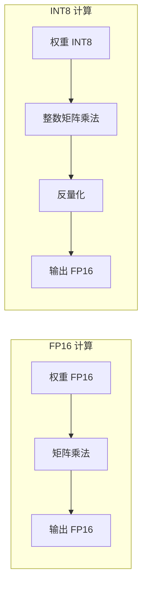
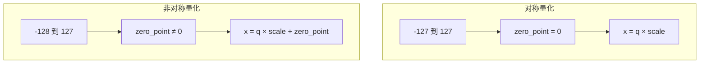
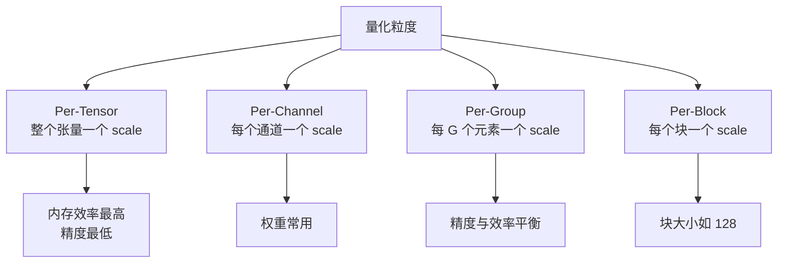
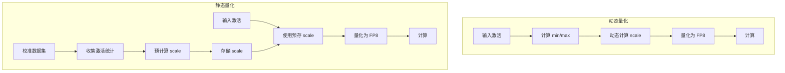
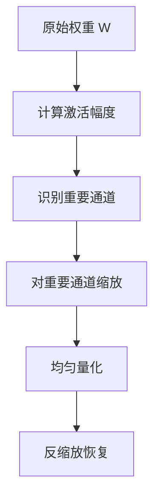
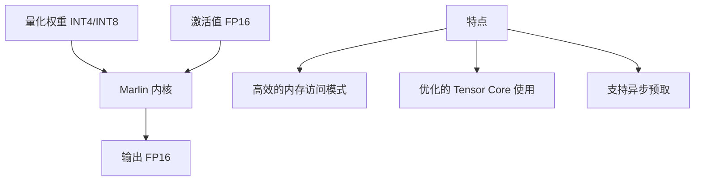
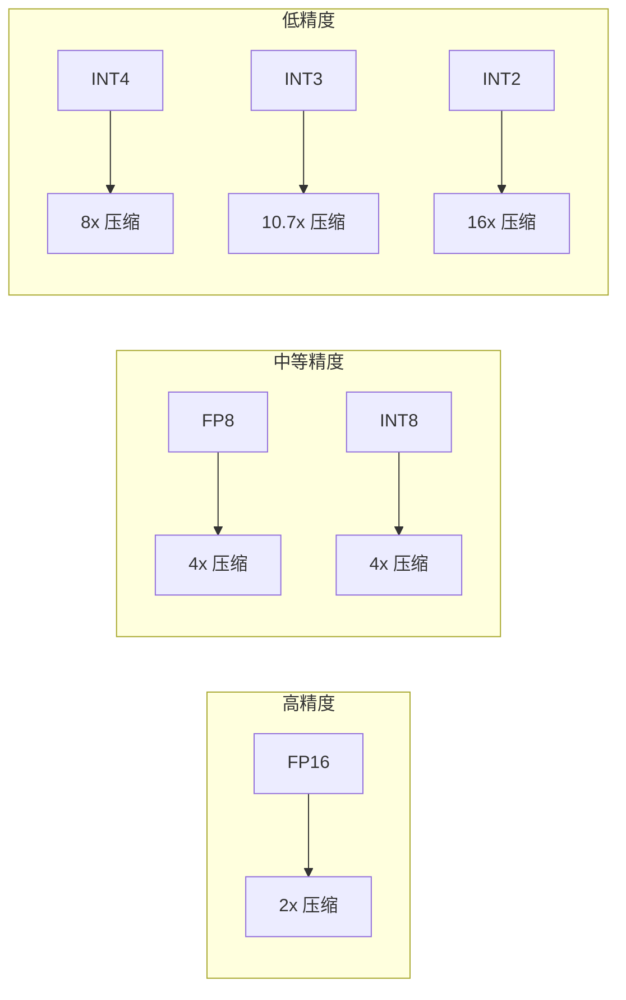
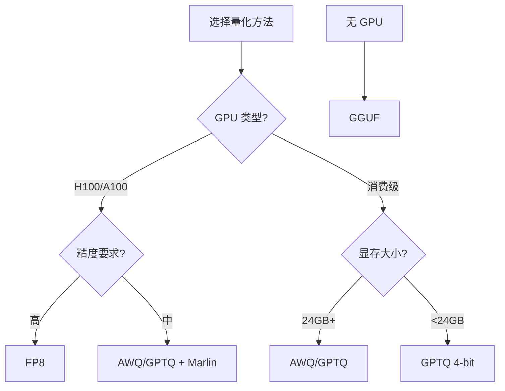
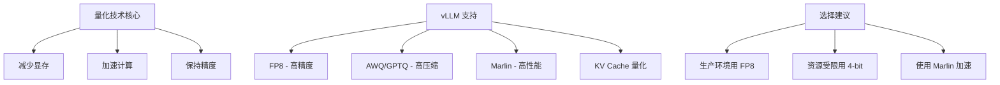

# 量化技术（Quantization）

## 概述

量化（Quantization）是一种将模型权重和激活值从高精度（如 FP32、FP16）转换为低精度（如 INT8、INT4、FP8）的技术。通过量化，可以显著减少模型的显存占用和计算量，从而提高推理效率。

本文将介绍量化的基本原理以及 vLLM 中支持的各种量化方法。

---

## 为什么需要量化

### 显存压力

以 LLaMA-70B 为例：

| 精度 | 每个参数占用 | 模型权重大小 |
|------|-------------|-------------|
| FP32 | 4 字节 | 280 GB |
| FP16/BF16 | 2 字节 | 140 GB |
| INT8 | 1 字节 | 70 GB |
| INT4 | 0.5 字节 | 35 GB |

加上 KV Cache 和激活值，FP16 推理需要多张高端 GPU；而 INT4 量化可以在单张 80GB GPU 上运行。

### 计算加速



现代 GPU 的 INT8/INT4 计算单元比 FP16 更快：
- A100: INT8 Tensor Core 是 FP16 的 2 倍吞吐
- H100: FP8 Tensor Core 是 FP16 的 2 倍吞吐

---

## 量化的基本原理

### 线性量化

最常见的量化方法是线性量化（Linear Quantization）：

```
量化:   q = round((x - zero_point) / scale)
反量化: x ≈ q × scale + zero_point
```

其中：
- `x` 是原始浮点值
- `q` 是量化后的整数值
- `scale` 是缩放因子
- `zero_point` 是零点偏移

### 对称量化 vs 非对称量化



**对称量化**（Symmetric）：
- 零点固定为 0
- 计算更简单
- 适合权重分布对称的情况

**非对称量化**（Asymmetric）：
- 零点可变
- 更灵活，精度可能更高
- 计算稍复杂

### 量化粒度



---

## vLLM 支持的量化方法

### 量化方法概览

vLLM 支持丰富的量化方法：

```python
# vllm/model_executor/layers/quantization/__init__.py

QuantizationMethods = Literal[
    "awq",           # Activation-aware Weight Quantization
    "fp8",           # FP8 量化
    "gptq",          # Post-Training Quantization for GPT
    "gptq_marlin",   # GPTQ with Marlin kernel
    "awq_marlin",    # AWQ with Marlin kernel
    "bitsandbytes",  # BitsAndBytes 量化
    "gguf",          # GGUF 格式量化
    "compressed-tensors",  # 压缩张量
    "torchao",       # PyTorch AO 量化
    "modelopt",      # NVIDIA ModelOpt FP8
    "mxfp4",         # MXFP4 格式
    ...
]
```

### 量化配置基类

```python
# vllm/model_executor/layers/quantization/base_config.py

class QuantizationConfig(ABC):
    """量化配置基类"""

    @abstractmethod
    def get_name(self) -> QuantizationMethods:
        """量化方法名称"""
        raise NotImplementedError

    @abstractmethod
    def get_supported_act_dtypes(self) -> list[torch.dtype]:
        """支持的激活数据类型"""
        raise NotImplementedError

    @classmethod
    @abstractmethod
    def get_min_capability(cls) -> int:
        """最低 GPU 计算能力要求
        70 = Volta, 75 = Turing, 80 = Ampere
        """
        raise NotImplementedError

    @abstractmethod
    def get_quant_method(
        self, layer: torch.nn.Module, prefix: str
    ) -> QuantizeMethodBase | None:
        """获取量化方法实现"""
        raise NotImplementedError


class QuantizeMethodBase(ABC):
    """量化方法基类"""

    @abstractmethod
    def create_weights(
        self, layer: torch.nn.Module, *weight_args, **extra_weight_attrs
    ):
        """创建量化权重"""
        raise NotImplementedError

    @abstractmethod
    def apply(self, layer: torch.nn.Module, *args, **kwargs) -> torch.Tensor:
        """应用量化计算"""
        raise NotImplementedError
```

---

## FP8 量化详解

### FP8 格式介绍

FP8 (8-bit Floating Point) 有两种主要格式：

| 格式 | 符号位 | 指数位 | 尾数位 | 动态范围 | 精度 |
|------|-------|-------|-------|---------|------|
| E4M3 | 1 | 4 | 3 | 较小 | 较高 |
| E5M2 | 1 | 5 | 2 | 较大 | 较低 |

E4M3 更适合权重，E5M2 更适合梯度。vLLM 主要使用 E4M3。

### Fp8Config 实现

```python
# vllm/model_executor/layers/quantization/fp8.py

class Fp8Config(QuantizationConfig):
    """FP8 量化配置"""

    def __init__(
        self,
        is_checkpoint_fp8_serialized: bool = False,  # 是否为 FP8 序列化的检查点
        activation_scheme: str = "dynamic",          # 激活量化方案
        ignored_layers: list[str] | None = None,     # 忽略的层
        weight_block_size: list[int] | None = None,  # 块大小
    ) -> None:
        super().__init__()
        self.is_checkpoint_fp8_serialized = is_checkpoint_fp8_serialized

        # 支持的激活方案: static, dynamic
        if activation_scheme not in ACTIVATION_SCHEMES:
            raise ValueError(f"Unsupported activation scheme {activation_scheme}")
        self.activation_scheme = activation_scheme
        self.ignored_layers = ignored_layers or []
        self.weight_block_size = weight_block_size

    @classmethod
    def get_min_capability(cls) -> int:
        return 75  # 最低支持 Turing 架构

    @classmethod
    def get_supported_act_dtypes(cls) -> list[torch.dtype]:
        return [torch.bfloat16, torch.half]
```

### 动态 vs 静态激活量化



**动态量化**：
- 运行时计算 scale
- 精度更高
- 开销稍大

**静态量化**：
- 使用预计算的 scale
- 计算更快
- 需要校准数据

---

## AWQ 量化详解

### AWQ 原理

AWQ (Activation-aware Weight Quantization) 的核心思想是：**保护重要的权重通道**。



关键洞察：
- 不同权重通道对输出的贡献不同
- 通过激活值的幅度识别重要通道
- 对重要通道进行缩放保护，减少量化误差

### AWQ 在 vLLM 中的使用

```python
# 加载 AWQ 量化模型
from vllm import LLM

llm = LLM(
    model="TheBloke/Llama-2-7B-AWQ",
    quantization="awq",
)

# 或者使用 Marlin 加速
llm = LLM(
    model="TheBloke/Llama-2-7B-AWQ",
    quantization="awq_marlin",  # 使用 Marlin 内核
)
```

---

## GPTQ 量化详解

### GPTQ 原理

GPTQ (Post-Training Quantization for GPT) 使用二阶信息（Hessian）来最小化量化误差：

```
目标: min ||W - Q(W)||_H
其中 H 是 Hessian 矩阵
```

GPTQ 逐列量化，并使用 Hessian 信息来补偿量化误差：


### GPTQ 配置

```python
# 加载 GPTQ 量化模型
llm = LLM(
    model="TheBloke/Llama-2-7B-GPTQ",
    quantization="gptq",
)

# 使用 Marlin 内核加速
llm = LLM(
    model="TheBloke/Llama-2-7B-GPTQ",
    quantization="gptq_marlin",
)
```

---

## Marlin 内核

### Marlin 是什么

Marlin 是一套高度优化的 CUDA 内核，专门用于 INT4/INT8 矩阵乘法：



Marlin 相比普通内核可以提供 2-4 倍的加速。

### 支持的量化格式

- `awq_marlin`: AWQ 格式 + Marlin 内核
- `gptq_marlin`: GPTQ 格式 + Marlin 内核
- `gptq_marlin_24`: 2:4 稀疏 GPTQ + Marlin 内核

---

## BitsAndBytes 量化

### 4-bit 量化

BitsAndBytes 提供简单的 4-bit 量化：

```python
llm = LLM(
    model="meta-llama/Llama-2-7B",
    quantization="bitsandbytes",
    load_format="bitsandbytes",
)
```

### NF4 格式

BitsAndBytes 使用 NF4 (Normal Float 4) 格式，专门优化正态分布的权重：

```
NF4 量化级别：
[-1.0, -0.6962, -0.5251, -0.3949, -0.2844, -0.1848, -0.0911, 0.0,
  0.0796,  0.1609,  0.2461,  0.3379,  0.4407,  0.5626,  0.7230, 1.0]
```

这些级别根据正态分布的分位数选择，使量化误差最小化。

---

## GGUF 格式

### GGUF 简介

GGUF (GGML Universal File) 是一种通用的量化模型格式，支持多种量化级别：

| 量化类型 | 位数 | 说明 |
|---------|------|------|
| Q4_0 | 4 | 基础 4-bit 量化 |
| Q4_K_M | 4 | K-means 聚类量化 |
| Q5_0 | 5 | 5-bit 量化 |
| Q5_K_M | 5 | K-means 5-bit |
| Q8_0 | 8 | 8-bit 量化 |

### 在 vLLM 中使用

```python
llm = LLM(
    model="TheBloke/Llama-2-7B-GGUF",
    quantization="gguf",
)
```

---

## KV Cache 量化

### 为什么量化 KV Cache

KV Cache 在长序列场景下占用大量显存。量化 KV Cache 可以：
- 减少显存占用 50-75%
- 支持更长的上下文
- 支持更大的批量大小

### vLLM 中的 KV Cache 量化

```python
# vllm/model_executor/layers/quantization/kv_cache.py

class BaseKVCacheMethod:
    """KV Cache 量化基类"""

    def quant_kv_tensor(
        self,
        key: torch.Tensor,
        value: torch.Tensor,
        scale: torch.Tensor,
    ) -> tuple[torch.Tensor, torch.Tensor]:
        """量化 KV 张量"""
        raise NotImplementedError
```

启用 KV Cache 量化：

```python
llm = LLM(
    model="meta-llama/Llama-2-7B",
    kv_cache_dtype="fp8",  # 或 "fp8_e4m3", "fp8_e5m2"
)
```

---

## 在线量化

### 什么是在线量化

在线量化是指在加载模型时动态进行量化，而不需要预先量化好的检查点：

```python
# vllm/model_executor/model_loader/online_quantization.py

# 动态 FP8 量化
llm = LLM(
    model="meta-llama/Llama-2-7B",
    quantization="fp8",
    # 将 FP16 权重动态转换为 FP8
)
```

### 优势与限制

**优势**：
- 无需预量化的检查点
- 灵活选择量化方法
- 适合实验和快速部署

**限制**：
- 加载时间稍长
- 某些量化方法不支持在线量化
- 精度可能略低于离线量化

---

## 量化方法对比

### 精度 vs 压缩率



### 性能对比表

| 量化方法 | 精度损失 | 速度提升 | 显存节省 | 推荐场景 |
|---------|---------|---------|---------|---------|
| FP8 | 极低 | 1.5-2x | 50% | 生产环境 |
| AWQ | 低 | 2-3x | 75% | 长文本推理 |
| GPTQ | 低-中 | 2-3x | 75% | 资源受限 |
| BitsAndBytes | 中 | 1.5x | 75% | 快速实验 |
| GGUF | 可变 | 可变 | 可变 | CPU 推理 |

---

## 最佳实践

### 选择合适的量化方法



### 配置建议

```python
# 高精度生产环境
llm = LLM(
    model="meta-llama/Llama-3.1-70B-Instruct",
    quantization="fp8",
    tensor_parallel_size=4,
)

# 资源受限环境
llm = LLM(
    model="TheBloke/Llama-2-70B-GPTQ",
    quantization="gptq_marlin",
    tensor_parallel_size=2,
)

# 单 GPU 部署
llm = LLM(
    model="TheBloke/Llama-2-7B-AWQ",
    quantization="awq_marlin",
    max_model_len=8192,
)
```

### 注意事项

1. **验证精度**：量化后务必在实际任务上验证精度
2. **选择 Marlin**：有 Marlin 版本时优先使用
3. **KV Cache 量化**：长序列场景考虑启用
4. **监控性能**：关注吞吐量和延迟指标

---

## 总结



关键要点：
1. **量化原理**：用低精度表示权重，平衡精度与效率
2. **多种方法**：FP8、AWQ、GPTQ、BitsAndBytes 等
3. **Marlin 加速**：INT4/INT8 专用高效内核
4. **实际选择**：根据硬件和精度需求选择合适方法

---

## 参考资料

1. [AWQ 论文](https://arxiv.org/abs/2306.00978)
2. [GPTQ 论文](https://arxiv.org/abs/2210.17323)
3. [FP8 格式规范](https://arxiv.org/abs/2209.05433)
4. [vLLM 量化文档](https://docs.vllm.ai/en/latest/quantization/)
5. [Marlin GitHub](https://github.com/IST-DASLab/marlin)

---

**导航**
- 上一篇：[投机解码](01-speculative-decoding.md)
- 下一篇：[分布式推理](03-distributed-inference.md)
