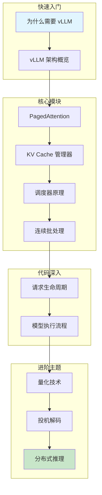

本文档系列旨在帮助深度学习初学者深入理解 vLLM —— 一个高性能的大语言模型（LLM）推理和服务框架。我们将从最基础的概念出发，逐步深入到核心算法和代码实现，让你不仅知其然，更知其所以然。

## 你将学到

- 大语言模型推理面临的核心挑战
- Transformer 架构和注意力机制的工作原理
- vLLM 的核心创新：PagedAttention 和连续批处理
- 从入口到输出的完整代码执行链路
- 如何调试和分析 vLLM 代码

## 学习路线图

我们提供两条学习路径，你可以根据自己的背景和目标选择合适的路线。

### 路径一：基础路径（推荐新手）

适合深度学习基础较薄弱的读者，从基础概念学起。

```mermaid
flowchart TD
    subgraph 第一阶段：理解问题
        A[为什么需要 vLLM] --> B[LLM 推理挑战]
        B --> C[vLLM 架构概览]
    end

    subgraph 第二阶段：学习基础
        C --> D[神经网络基础]
        D --> E[Transformer 架构]
        E --> F[注意力机制]
        F --> G[KV Cache 概念]
        G --> H[LLM 生成过程]
    end

    subgraph 第三阶段：掌握核心
        H --> I[PagedAttention]
        I --> J[连续批处理]
    end

    subgraph 第四阶段：代码实践
        J --> K[代码入口分析]
        K --> L[引擎核心流程]
    end

    style A fill:#e1f5fe
    style L fill:#c8e6c9
```

**预计阅读量**：约 70,000 字，建议分 5-7 天完成

### 路径二：进阶路径（适合有基础的读者）

如果你已经了解 Transformer 和 KV Cache 的基本概念，可以直接进入核心内容。



**预计阅读量**：约 50,000 字，建议分 3-5 天完成

## 文档版本

- **vLLM 版本**：基于 vLLM v1 架构
- **文档版本**：1.0
- **最后更新**：2025 年 1 月
