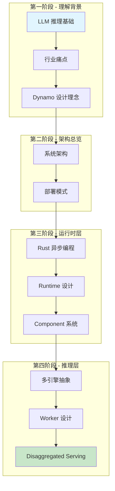
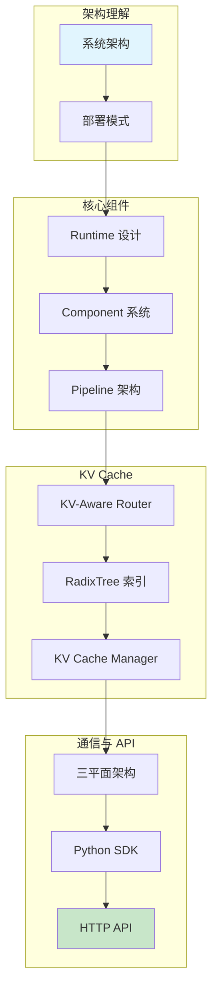

本文档系列旨在帮助开发者深入理解 NVIDIA Dynamo —— 一个高吞吐、低延迟的分布式推理框架，专为在多节点环境中服务生成式 AI 和推理模型而设计。

## 你将学到

- Dynamo 的五层架构设计
- Rust 异步编程和分布式运行时
- 多引擎抽象层（vLLM、TensorRT-LLM、SGLang）
- KV Cache 智能路由和 RadixTree 索引
- Disaggregated Serving（Prefill/Decode 分离）
- 三平面通信架构（控制平面、事件平面、数据平面）

## 学习路线图

### 路径一：基础路径（推荐新手）

适合刚接触分布式推理框架的读者。

### 路径二：进阶路径（适合有基础的读者）

如果你已经了解 LLM 推理的基本概念，可以直接进入核心内容。

## 文档结构

| 章节 | 内容 |
|------|------|
| 整体架构与设计理念 | LLM 推理基础、行业痛点、设计理念、系统架构、部署模式 |
| 运行时层原理 | Rust 异步编程、分布式系统基础、Runtime 设计、Component 系统、Pipeline 架构、服务发现 |
| LLM 推理层原理 | 推理引擎原理、vLLM 技术解析、多引擎抽象、Worker 设计、Disaggregated Serving、请求处理 |
| KV Cache 管理与路由 | KV Cache 原理、优化技术综述、KV-Aware Router、RadixTree 索引、KV Cache Manager、事件系统 |
| 分布式通信机制 | 通信基础、三平面架构、etcd 集成、NATS 集成、NIXL 传输、TCP Pipeline |
| Python SDK 原理 | Rust-Python 互操作、PyO3 绑定、服务装饰器、DynamoService 类、CLI 工具 |
| HTTP API 层原理 | REST API 基础、HTTP Server 设计、OpenAI 兼容 API、流式响应、错误处理 |

## 文档版本

- **Dynamo 版本**：基于 NVIDIA Dynamo
- **文档版本**：1.0
- **最后更新**：2025 年 1 月
