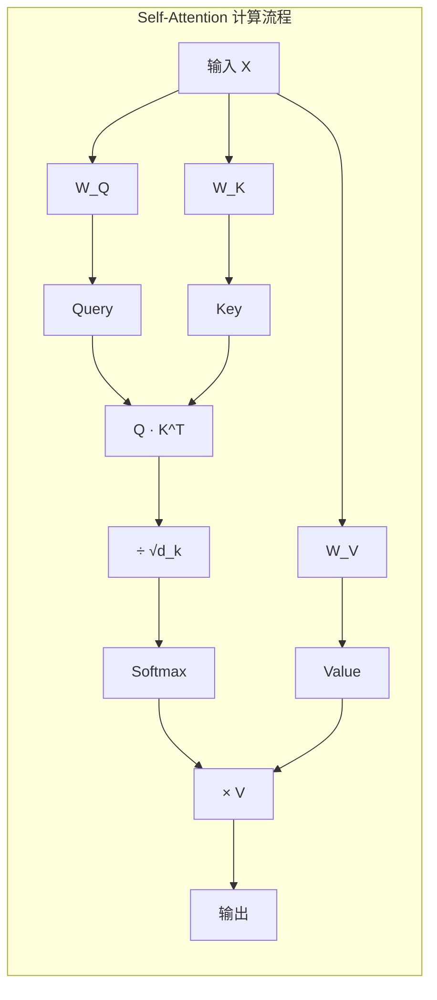
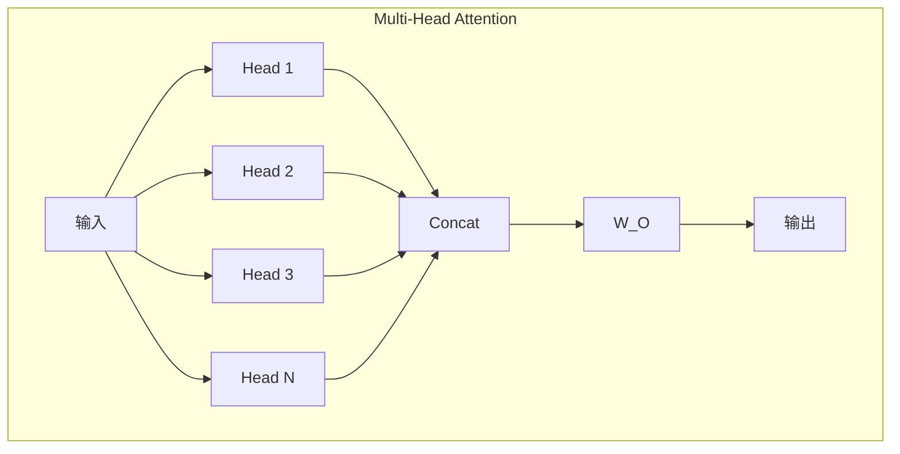
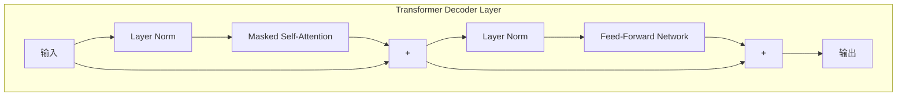
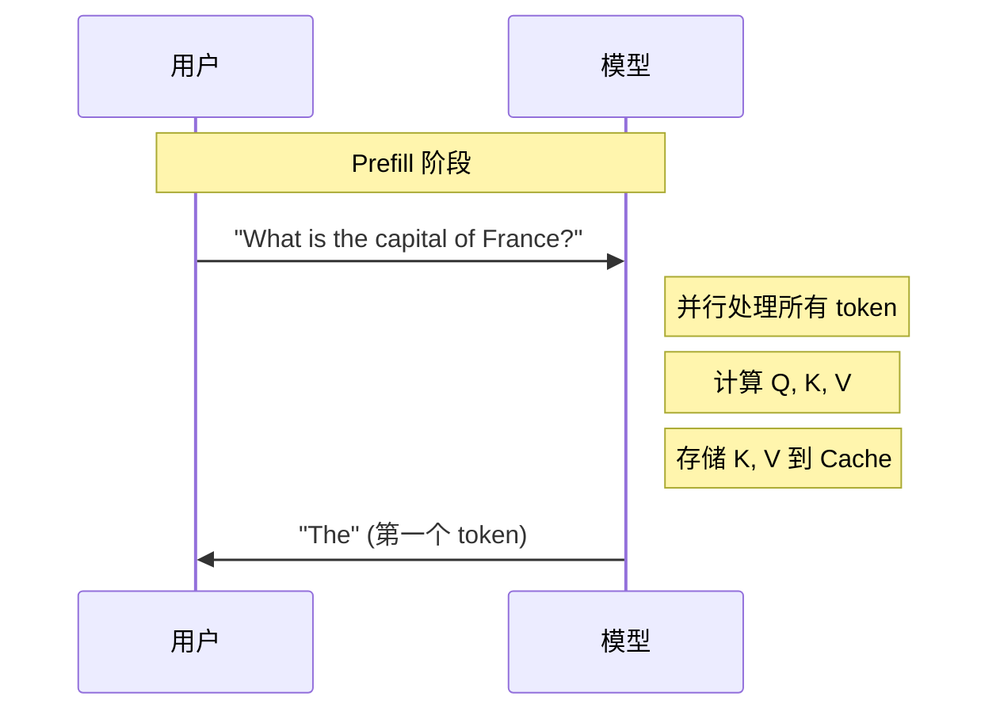
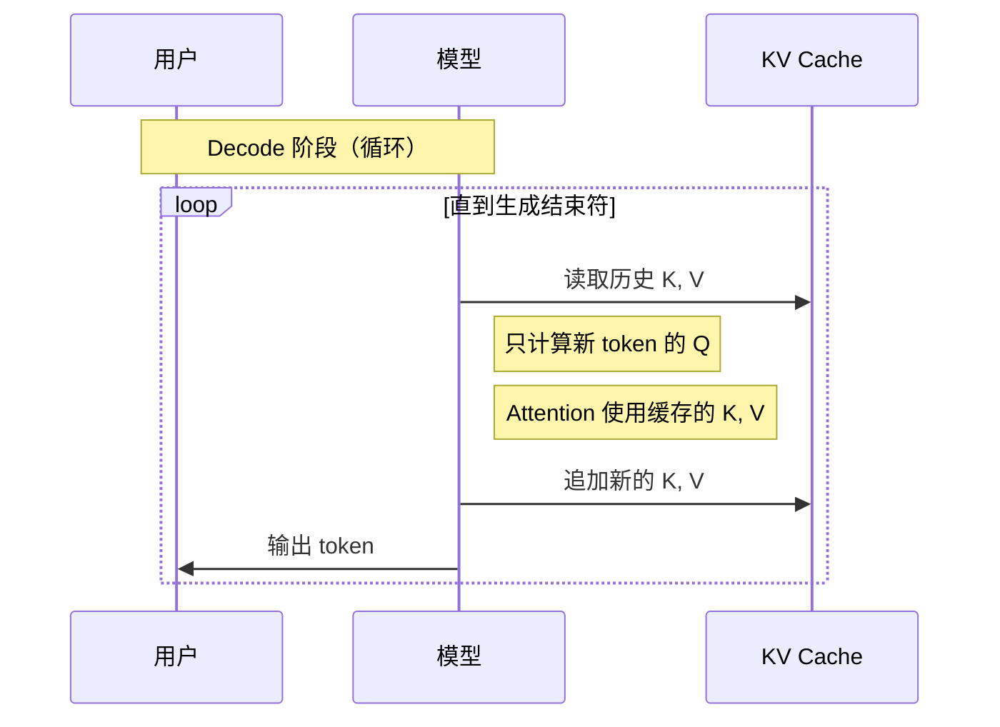
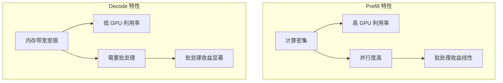
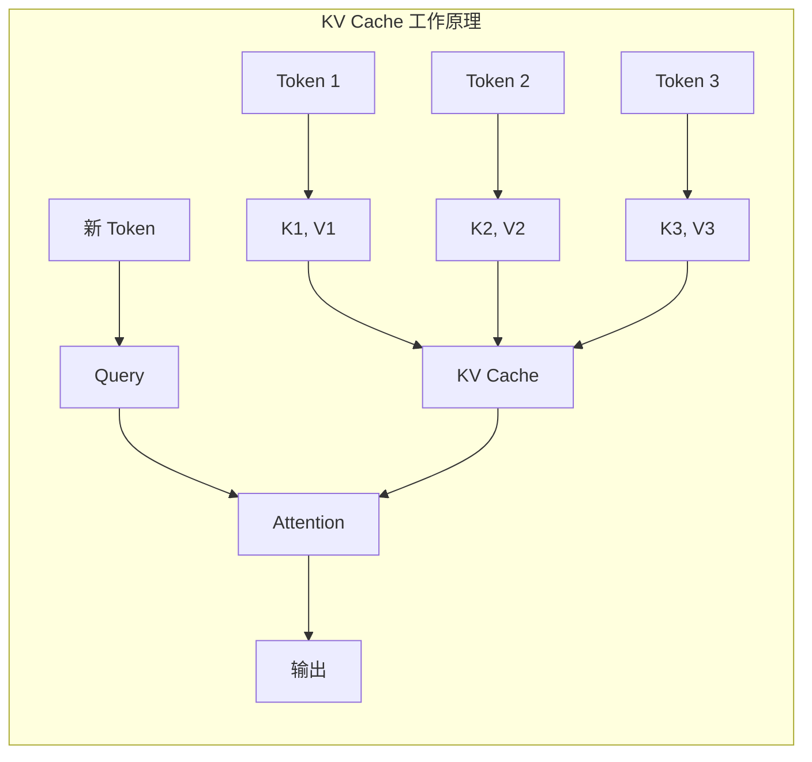
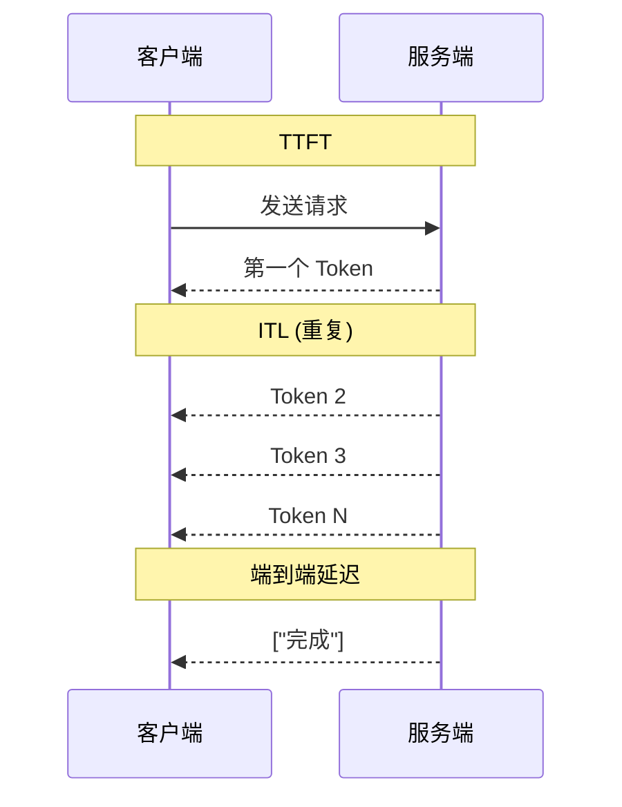

# LLM 推理基础

> 本文介绍大语言模型（LLM）推理的基础知识，包括 Transformer 架构原理、自回归生成过程，以及 Prefill/Decode 两阶段的特性差异。

---

## 1. Transformer 架构回顾

现代大语言模型（LLM）几乎都基于 Transformer 架构构建。理解 Transformer 的工作原理是理解 LLM 推理优化的基础。

### 1.1 Self-Attention 机制原理

Transformer 的核心是 Self-Attention（自注意力）机制。对于输入序列 X，Self-Attention 通过三个线性变换生成 Query（Q）、Key（K）、Value（V）：

```
Q = X · W_Q
K = X · W_K
V = X · W_V
```

然后计算注意力分数：

```
Attention(Q, K, V) = softmax(Q · K^T / √d_k) · V
```

其中 d_k 是 Key 向量的维度，用于缩放防止点积过大。



### 1.2 Multi-Head Attention

实际应用中，Transformer 使用 Multi-Head Attention，将注意力计算分成多个"头"并行执行，每个头关注不同的特征子空间：

```
MultiHead(Q, K, V) = Concat(head_1, ..., head_h) · W_O

其中 head_i = Attention(Q · W_Q^i, K · W_K^i, V · W_V^i)
```



### 1.3 Transformer Decoder Layer

一个标准的 Transformer Decoder Layer 包含：

1. **Masked Self-Attention**：处理当前位置与之前所有位置的关系
2. **Feed-Forward Network (FFN)**：两层全连接网络，通常有较大的中间维度
3. **Layer Normalization**：稳定训练
4. **Residual Connection**：残差连接



### 1.4 参数规模与计算量

对于一个 L 层、隐藏维度 d、注意力头数 h 的 Transformer 模型：

- **参数量**：约 12 × L × d²（主要来自 Q/K/V 投影和 FFN）
- **FLOPs**：对于序列长度 n，单次前向传播约 2 × n × 参数量

| 模型 | 参数量 | 层数 | 隐藏维度 | 注意力头数 |
|------|--------|------|----------|------------|
| Llama-7B | 7B | 32 | 4096 | 32 |
| Llama-70B | 70B | 80 | 8192 | 64 |
| GPT-4 (估计) | ~1.7T | ~120 | ~12288 | ~96 |

---

## 2. 自回归生成过程

LLM 生成文本采用**自回归（Autoregressive）**方式：每次只生成一个 token，然后将其作为下一次生成的输入。这个过程分为两个明显不同的阶段：

### 2.1 Prefill 阶段（Prompt Processing）

- **输入**：用户的完整 prompt（可能数千个 token）
- **计算**：一次性并行处理所有输入 token
- **输出**：生成第一个输出 token + KV Cache
- **特点**：计算密集型（Compute-bound）



### 2.2 Decode 阶段（Token Generation）

- **输入**：单个 token（上一步生成的）
- **计算**：利用 KV Cache，只计算新 token 的 attention
- **输出**：下一个 token
- **特点**：内存带宽受限（Memory-bound）



---

## 3. 两阶段的计算特性差异

### 3.1 特性对比

| 特性 | Prefill | Decode |
|------|---------|--------|
| Token 数量 | 多（整个 prompt） | 1（每次） |
| 并行度 | 高 | 低 |
| 计算瓶颈 | GPU 算力 | 内存带宽 |
| GPU 利用率 | 高（60-90%） | 低（5-30%） |
| 批处理收益 | 线性提升 | 显著提升 |

### 3.2 计算特性图解



### 3.3 KV Cache 的作用

KV Cache 是 LLM 推理优化的关键：

- **避免重复计算**：历史 token 的 K、V 只计算一次，后续直接复用
- **内存换时间**：用额外的内存存储换取计算时间
- **线性增长**：Cache 大小随序列长度线性增长



---

## 4. 关键指标定义

理解 LLM 推理性能需要关注以下指标：

| 指标 | 全称 | 说明 |
|------|------|------|
| **TTFT** | Time To First Token | 从请求到第一个 token 的延迟 |
| **ITL** | Inter-Token Latency | 相邻 token 之间的延迟 |
| **Throughput** | 吞吐量 | tokens/s 或 requests/s |
| **Latency** | 端到端延迟 | 完整请求的响应时间 |



---

## 小结

本文介绍了 LLM 推理的核心基础：

1. **Transformer 架构**：Self-Attention 机制是核心，Multi-Head 并行计算
2. **自回归生成**：逐 token 生成，分为 Prefill 和 Decode 两阶段
3. **两阶段差异**：Prefill 计算密集，Decode 内存带宽受限
4. **KV Cache**：存储历史计算结果，避免重复计算

理解这些基础知识，有助于理解后续章节中 Dynamo 如何优化这些问题。

---

## 下一篇

继续阅读 [02-行业痛点与解决方案](02-industry-challenges.md)，了解传统推理框架的问题以及业界的解决思路。
