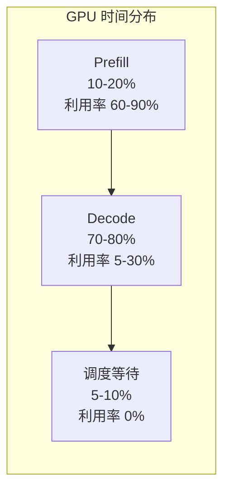
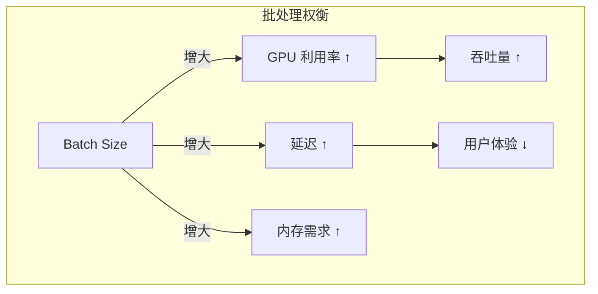
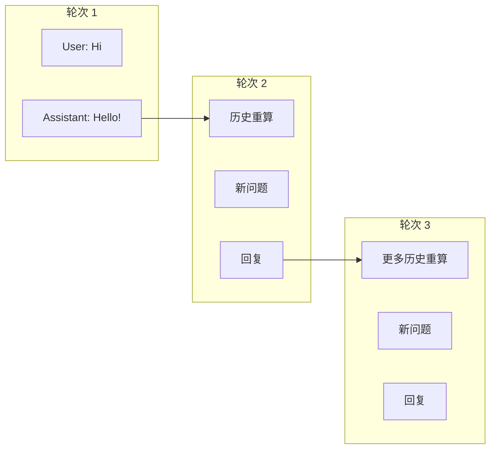
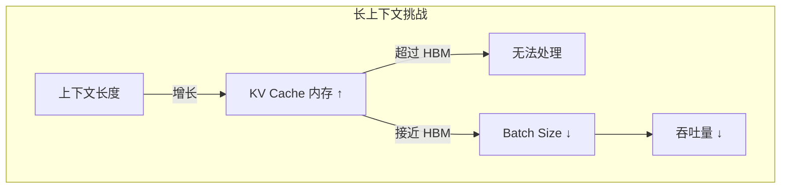
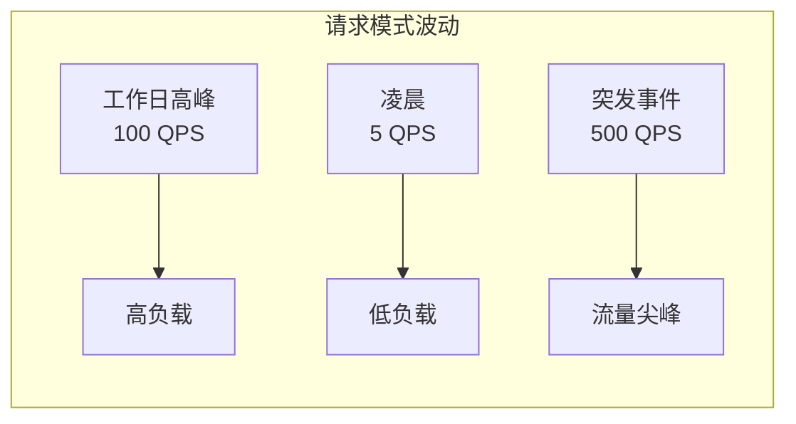
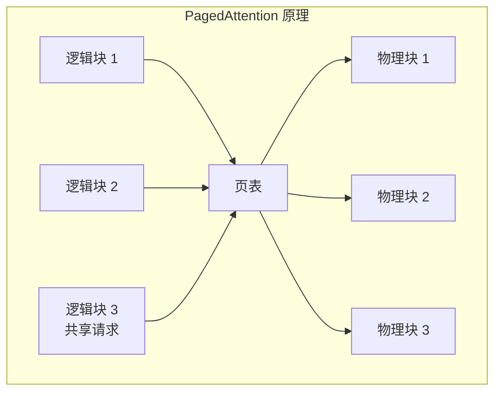
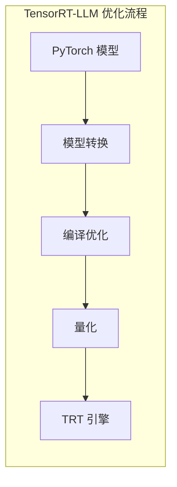
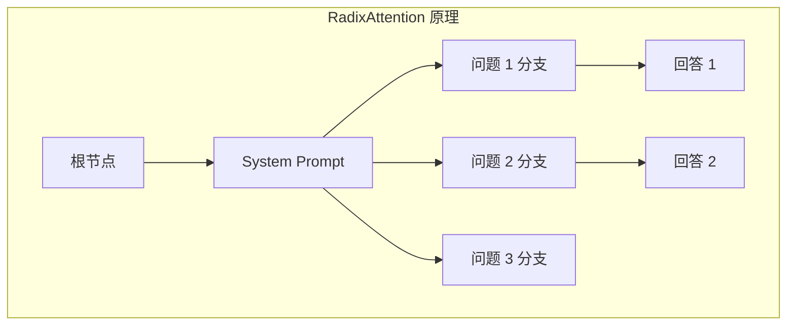
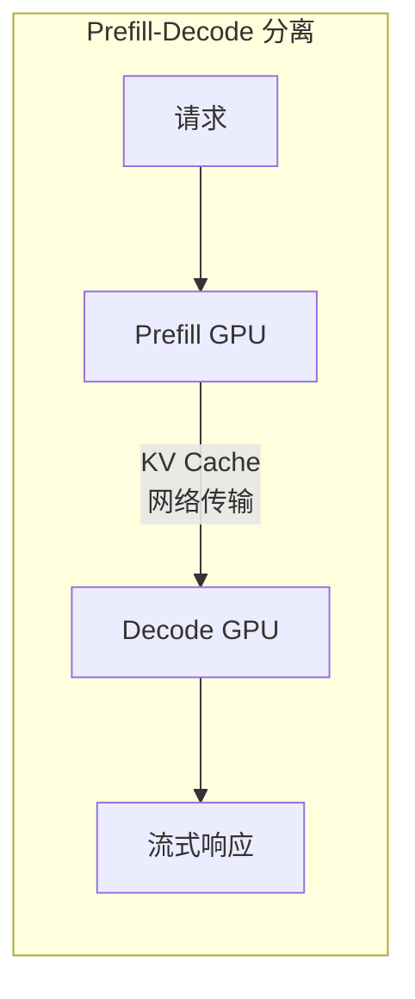
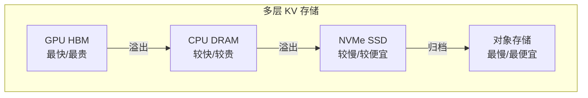

> 本文分析传统 LLM 推理框架面临的核心挑战，并综述业界的主流解决方案。

---

## 1. 传统推理框架的痛点

### 1.1 GPU 利用率问题

#### Prefill 计算密集 vs Decode 内存带宽受限

传统推理框架将 Prefill 和 Decode 放在同一个 GPU 上顺序执行。这导致：

- **Prefill 时**：GPU 算力被充分利用，但持续时间短
- **Decode 时**：GPU 大部分时间在等待内存读取，算力空闲

以 H100 GPU 为例：
- 峰值算力：1979 TFLOPS（FP8）
- 内存带宽：3.35 TB/s
- 计算/带宽比：约 590 FLOPS/Byte

对于 Decode 阶段，每生成一个 token 需要读取整个模型权重（70B 模型约 70GB），但只做很少的计算。理论上 Decode 阶段 GPU 利用率可能低于 5%。



#### 批处理大小与延迟的权衡

增大批处理大小（Batch Size）可以提高 GPU 利用率：

```
GPU 利用率 ≈ min(1, batch_size × 计算量 / 内存带宽)
```

但是：
- 更大的 batch 意味着更高的延迟
- 用户体验要求低延迟（TTFT < 1s, ITL < 50ms）
- 必须在吞吐量和延迟之间权衡



#### GPU 空闲时间分析

典型的 LLM 推理 GPU 时间分布：

| 阶段 | 时间占比 | GPU 利用率 |
|------|----------|------------|
| Prefill | 10-20% | 60-90% |
| Decode | 70-80% | 5-30% |
| 调度等待 | 5-10% | 0% |

---

### 1.2 KV Cache 重复计算问题

#### 相同 Prefix 的请求

在实际应用中，很多请求具有相同的前缀：

```
# 系统提示词相同
请求1: [System Prompt] + "What is 2+2?"
请求2: [System Prompt] + "Tell me a joke"
请求3: [System Prompt] + "Translate to French: Hello"
```

如果每次都重新计算 System Prompt 的 KV Cache，将造成大量重复计算。

#### Multi-turn 对话场景

多轮对话中，历史对话需要重新计算：

```
轮次1: User: "Hi" → Assistant: "Hello!"
轮次2: User: "Hi" + "Hello!" + "How are you?" → Assistant: "I'm good!"
轮次3: User: [前两轮完整历史] + "What's the weather?" → ...
```

每轮对话都要重新计算之前所有轮次的 KV Cache。



#### 计算浪费量化分析

假设：
- System Prompt: 500 tokens
- 每轮对话平均: 200 tokens
- 10 轮对话

无优化时的计算量：
```
总 KV 计算 = 500 + 700 + 900 + ... + 2300 = 14,000 tokens
实际新增 tokens = 500 + 200×10 = 2,500 tokens
重复计算比例 = (14000 - 2500) / 14000 = 82%
```

---

### 1.3 内存瓶颈问题

#### KV Cache 内存占用计算公式

```
KV Cache 内存 = 2 × num_layers × num_heads × head_dim × seq_len × batch_size × dtype_size
```

对于 Llama-70B（80 层，64 头，128 head_dim，FP16）：
```
单请求 4K 上下文 = 2 × 80 × 64 × 128 × 4096 × 2 bytes = 10.7 GB
单请求 128K 上下文 = 2 × 80 × 64 × 128 × 131072 × 2 bytes = 343 GB
```

#### GPU HBM 容量限制

| GPU | HBM 容量 | Llama-70B 权重 | 剩余 KV Cache |
|-----|----------|----------------|---------------|
| H100 | 80 GB | ~70 GB | ~10 GB |
| A100 | 80 GB | ~70 GB | ~10 GB |
| H200 | 141 GB | ~70 GB | ~71 GB |

即使是最新的 H100，在部署 70B 模型后，KV Cache 空间也非常有限。

#### 长上下文场景的挑战

随着 128K、1M 上下文窗口的出现：



---

### 1.4 动态负载问题

#### 请求到达率的波动性

生产环境中的请求模式变化剧烈：



#### 静态资源分配的低效

- **按峰值配置**：成本高，平时浪费
- **按均值配置**：高峰时无法服务
- **手动扩缩容**：响应慢，不够敏捷

---

## 2. 业界解决方案综述

### 2.1 vLLM：PagedAttention 与连续批处理

vLLM 的核心创新是 **PagedAttention**：

- 将 KV Cache 分成固定大小的"页"（类似操作系统虚拟内存）
- 使用页表管理物理块和逻辑块的映射
- 支持 Copy-on-Write，实现前缀共享



**连续批处理（Continuous Batching）**：
- 不再等待整个 batch 完成
- 请求完成后立即移出，新请求立即加入
- 提高 GPU 利用率

---

### 2.2 TensorRT-LLM：编译优化与量化

NVIDIA TensorRT-LLM 的优势：

- **编译时优化**：算子融合、内存规划
- **量化支持**：FP8/INT8/INT4，显著降低内存和计算需求
- **Inflight Batching**：类似连续批处理
- **深度 CUDA 优化**：针对 NVIDIA GPU 深度调优



---

### 2.3 SGLang：RadixAttention 与结构化生成

SGLang 的创新：

- **RadixAttention**：使用 Radix Tree 管理 KV Cache，高效处理前缀共享
- **结构化生成**：支持 JSON Schema、正则表达式约束输出
- **并行采样**：多个采样路径并行执行



---

### 2.4 DistServe：Prefill-Decode 分离

DistServe 的核心思想：

- 将 Prefill 和 Decode 部署在不同的 GPU 上
- Prefill GPU：优化算力利用
- Decode GPU：优化批处理和内存带宽
- 通过网络传输 KV Cache



---

### 2.5 Mooncake：分布式 KV Cache

Mooncake 的创新：

- 将 KV Cache 存储在分布式存储系统中
- 支持跨请求、跨节点的 KV Cache 共享
- 多层存储：GPU → CPU → SSD → 对象存储



---

## 3. 方案对比总结

| 方案 | 核心技术 | 解决的问题 | 局限性 |
|------|----------|------------|--------|
| vLLM | PagedAttention | 内存碎片 | 单机优化 |
| TensorRT-LLM | 编译优化 | 单卡性能 | 灵活性低 |
| SGLang | RadixAttention | 前缀共享 | 分布式支持弱 |
| DistServe | P/D 分离 | GPU 利用率 | KV 传输开销 |
| Mooncake | 分布式 KV | 长上下文 | 系统复杂度 |

Dynamo 的设计目标是**综合以上方案的优点**，提供一个统一的分布式推理框架。

---

## 下一篇

继续阅读 [03-Dynamo 设计理念](03-dynamo-design-philosophy.md)，了解 Dynamo 如何解决这些行业痛点。
