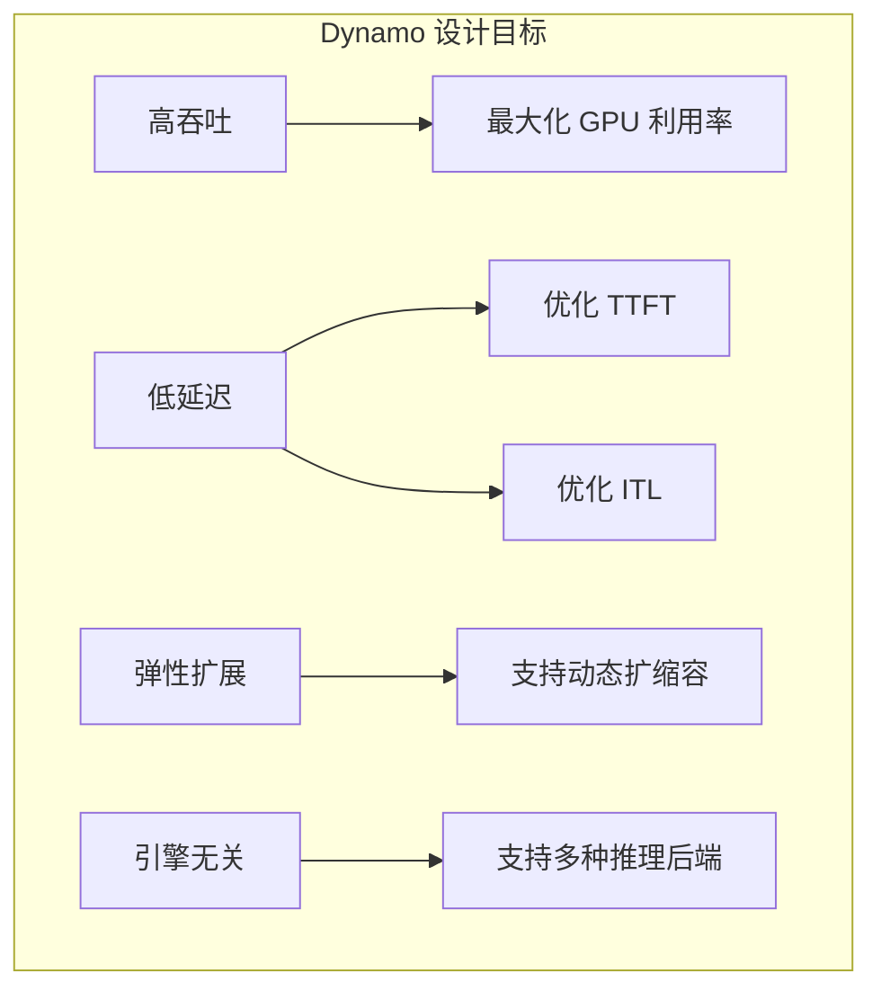
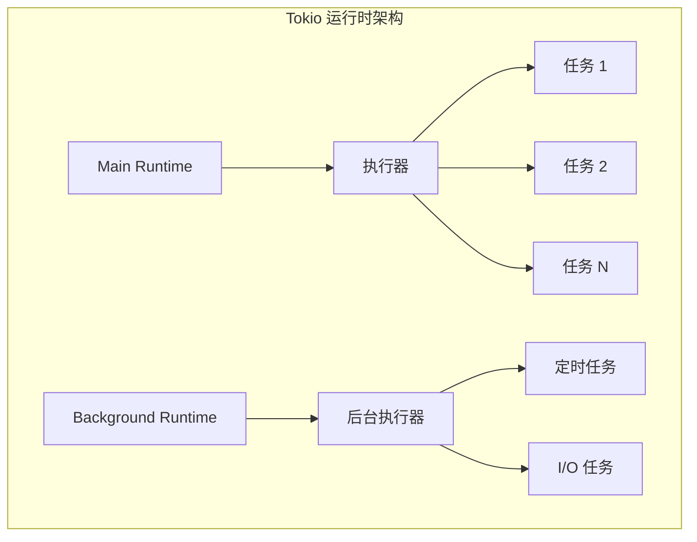
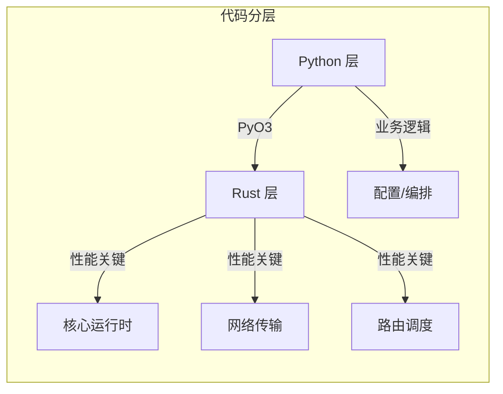
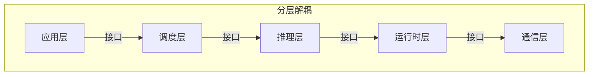
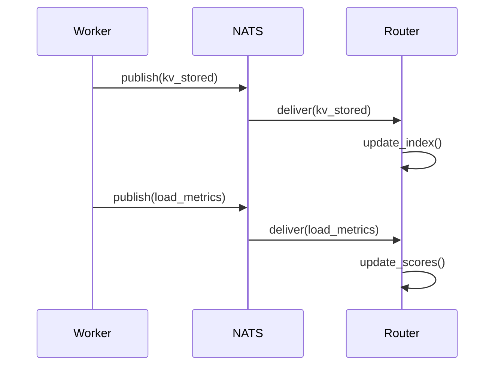
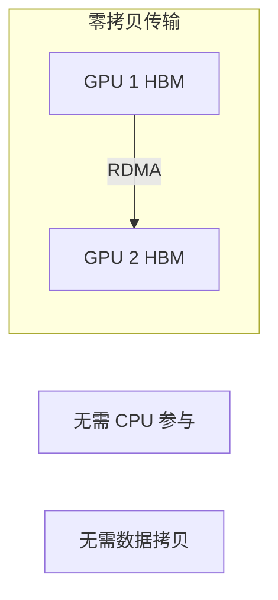
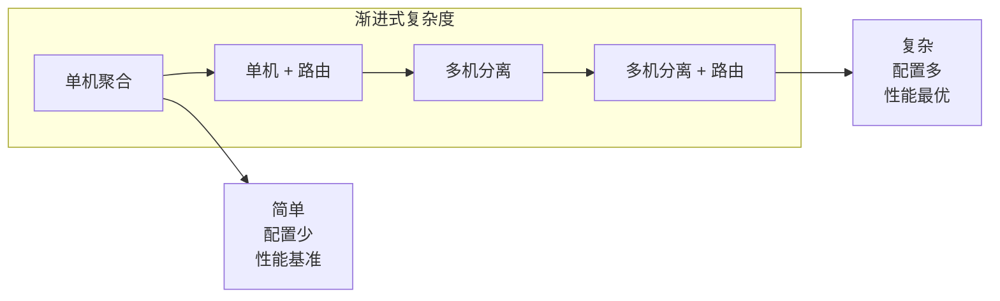
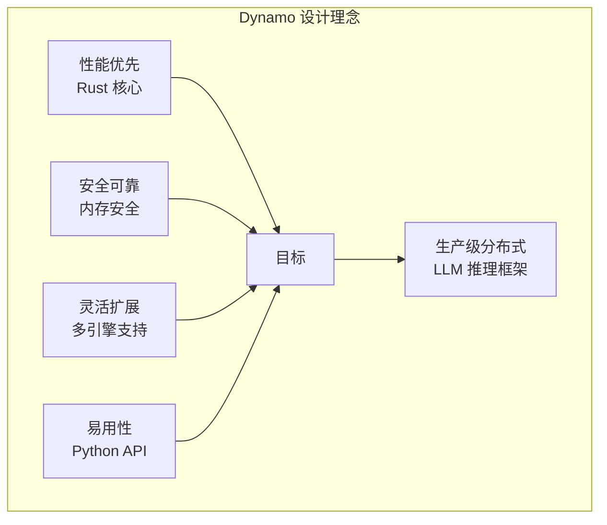

> 本文介绍 NVIDIA Dynamo 的设计目标、技术栈选择以及核心设计原则。

---

## 1. 设计目标

NVIDIA Dynamo 的设计目标是解决传统推理框架的所有挑战，打造一个**生产级分布式 LLM 推理框架**：



### 具体指标目标

| 目标 | 具体要求 |
|------|----------|
| 吞吐量 | 相比单机部署提升 2-3 倍 |
| TTFT | KV 路由优化 3 倍 |
| 延迟 | P99 < 100ms（短请求） |
| 扩展性 | 支持 100+ GPU 集群 |
| 可用性 | 99.9% SLA |

---

## 2. 技术栈选择

### 2.1 Rust 核心层

Dynamo 的核心运行时使用 **Rust** 实现，原因如下：

#### 性能优势
- **零成本抽象**：高级语法不带来运行时开销
- **无 GC 暂停**：确定性延迟
- **LLVM 优化**：生成高效机器码

#### 内存安全
- **所有权系统**：编译时防止内存错误
- **借用检查器**：防止数据竞争
- **无空指针异常**

#### 并发支持
- `async/await`：原生异步支持
- `Send/Sync` trait：编译时并发安全检查
- Tokio 生态：成熟的异步运行时

#### 与 C++/Go 的对比

| 特性 | Rust | C++ | Go |
|------|------|-----|-----|
| 内存安全 | 编译时保证 | 需要手动管理 | GC |
| 性能 | 最优 | 最优 | 略低 |
| 并发模型 | 所有权 + async | 手动 + 线程 | Goroutine |
| 学习曲线 | 陡峭 | 陡峭 | 平缓 |
| 生态成熟度 | 快速发展 | 最成熟 | 成熟 |

#### Tokio 异步运行时

Dynamo 基于 Tokio 构建异步系统：

```rust
// Dynamo Runtime 的核心结构
pub struct Runtime {
    id: Arc<String>,
    primary: RuntimeType,      // 主任务运行时
    secondary: RuntimeType,    // 后台任务运行时
    cancellation_token: CancellationToken,
}
```



---

### 2.2 Python 应用层

虽然核心用 Rust 实现，但 Dynamo 提供完整的 Python API：

#### PyO3 绑定机制
- Rust 类直接暴露为 Python 类
- 异步方法支持 Python `async/await`
- 类型安全的参数传递

```python
# Python 中使用 Dynamo
from dynamo.runtime import DistributedRuntime

async def main():
    runtime = await DistributedRuntime.create()
    namespace = runtime.namespace("myapp")
    component = namespace.component("worker")
```

#### 开发效率与生态
- 快速原型开发
- 丰富的 ML/AI 生态
- 与 vLLM、SGLang 等无缝集成

#### 性能关键路径的取舍



---

## 3. 核心设计原则

### 3.1 分层解耦

Dynamo 采用严格的分层架构：



每层：
- 只依赖下层接口
- 不关心下层实现
- 可独立演进

---

### 3.2 事件驱动

系统状态通过事件传播：



**优势**：
- **松耦合**：组件通过事件通信
- **可扩展**：新组件只需订阅相关事件
- **异步处理**：事件异步传递不阻塞

---

### 3.3 零拷贝传输

KV Cache 传输使用 RDMA：



**NIXL 传输层**：
- 直接 GPU-to-GPU 传输
- 利用 NVLink/NVSwitch/InfiniBand
- 最小化传输延迟

---

### 3.4 渐进式复杂度

用户可以根据需求选择复杂度：



| 模式 | 配置复杂度 | 性能 | 适用场景 |
|------|-----------|------|----------|
| 单机聚合 | 低 | 基准 | 开发测试 |
| 单机 + 路由 | 中 | TTFT 优化 | 多轮对话 |
| 多机分离 | 中高 | 吞吐提升 | 高吞吐需求 |
| 多机分离 + 路由 | 高 | 最优 | 生产环境 |

---

## 4. 设计理念总结



**核心理念**：
1. **性能是第一优先级**：Rust 核心 + 零拷贝传输
2. **安全不妥协**：编译时内存安全 + 类型安全
3. **灵活性为王**：多引擎支持 + 渐进式复杂度
4. **开发者友好**：Python API + 丰富生态

---

## 下一篇

继续阅读 [04-系统架构总览](04-system-architecture.md)，了解 Dynamo 的五层架构和核心概念。
