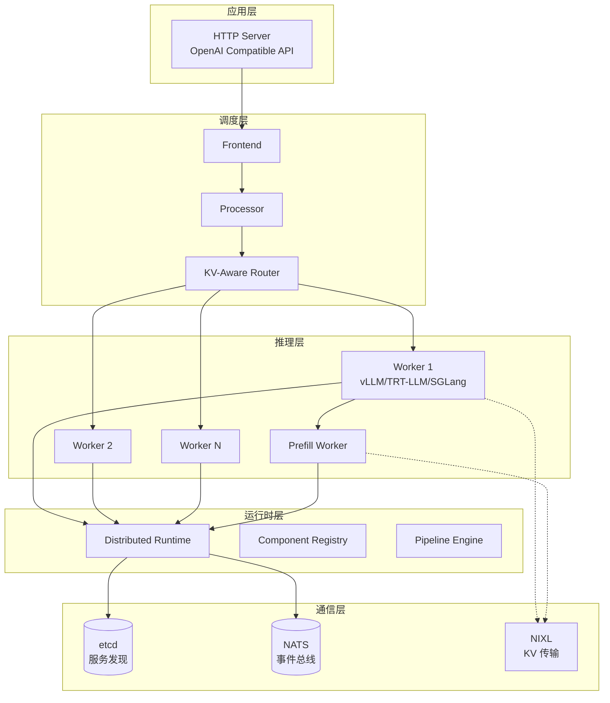
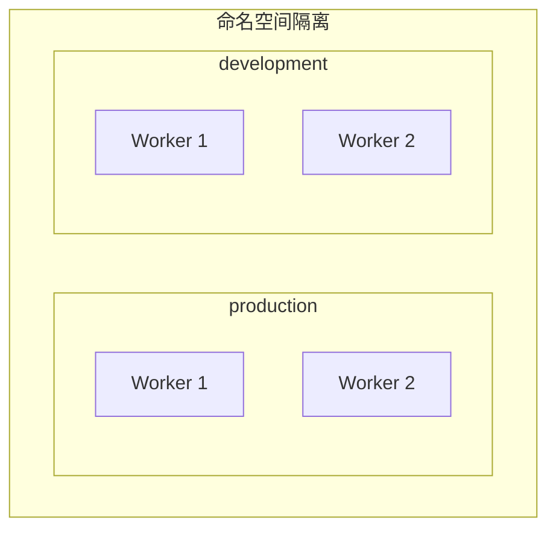
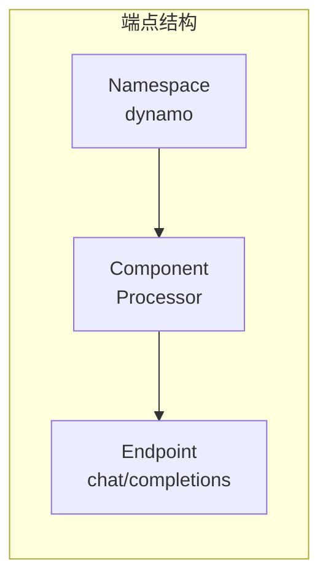
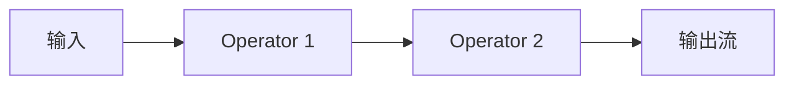
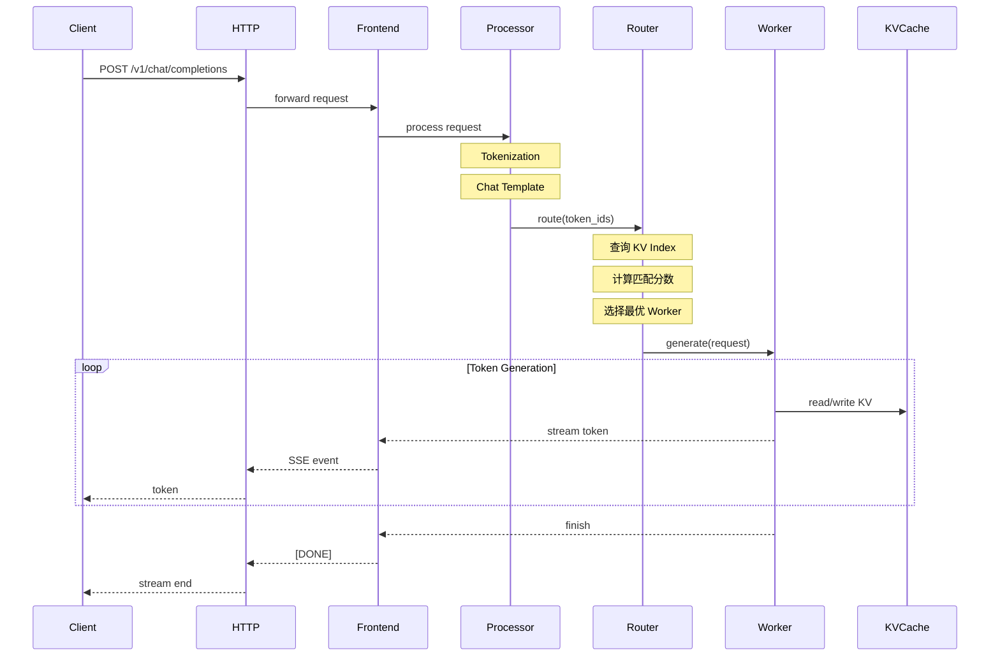
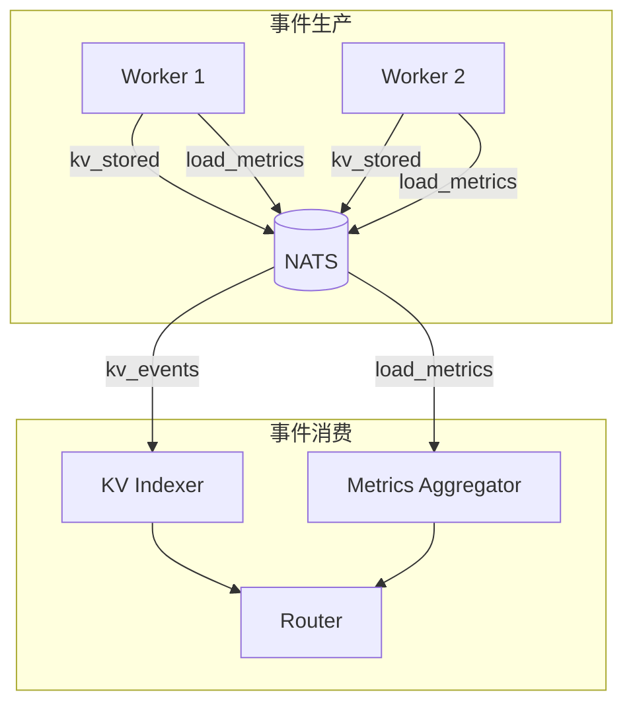
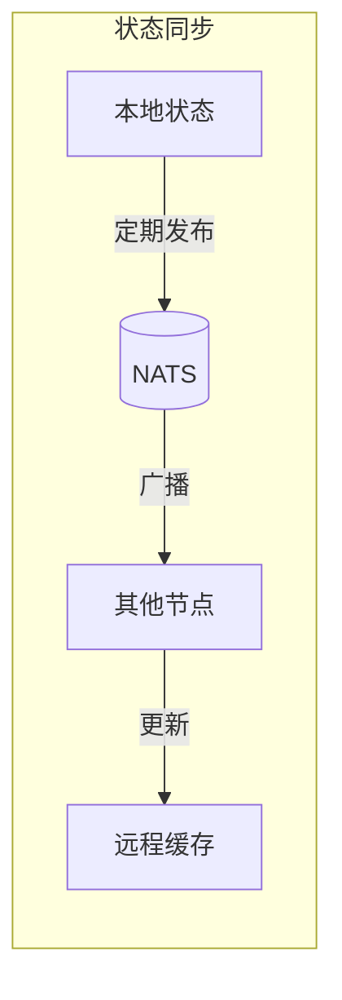
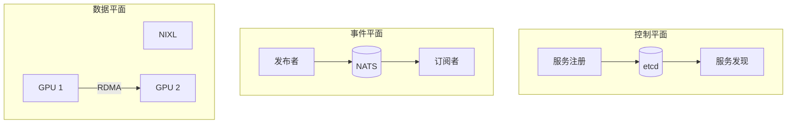
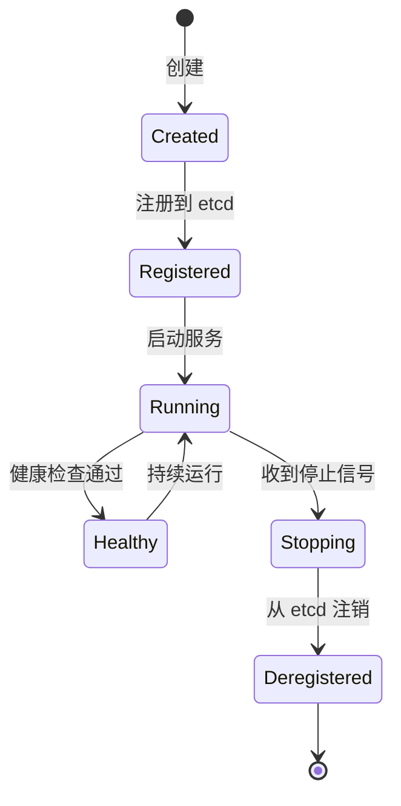

# 系统架构总览

> 本文介绍 Dynamo 的五层架构模型、核心概念定义以及数据流与控制流。

---

## 1. 五层架构模型

Dynamo 采用经典的五层架构：



---

## 2. 各层职责

| 层 | 组件 | 职责 |
|-----|------|------|
| **应用层** | HTTP Server | 提供 OpenAI 兼容 API |
| **调度层** | Frontend, Processor, Router | 请求处理、tokenization、智能路由 |
| **推理层** | Workers | 实际的模型推理 |
| **运行时层** | Runtime, Registry | 组件生命周期、服务发现 |
| **通信层** | etcd, NATS, NIXL | 协调、事件、数据传输 |

---

## 3. 核心概念定义

### 3.1 Namespace（命名空间）

逻辑隔离的组件集合，用于多租户或多环境：

```python
# 创建命名空间
namespace = runtime.namespace("production")
namespace_dev = runtime.namespace("development")
```



### 3.2 Component（组件）

可部署的服务单元，包含多个端点：

```python
# 定义组件
@service(dynamo={"namespace": "production"})
class VllmWorker:
    @dynamo_endpoint()
    async def generate(self, request):
        ...
```

### 3.3 Endpoint（端点）

组件暴露的可调用接口：

```yaml
# 端点引用格式
endpoint: dynamo.Processor.chat/completions
#         ^命名空间  ^组件     ^端点名
```



### 3.4 Service（服务）

组件的运行实例，可以有多个副本：

```yaml
ServiceArgs:
  workers: 4  # 4 个服务实例
  resources:
    gpu: 1    # 每个实例 1 个 GPU
```

### 3.5 Pipeline（管道）

数据流处理管道，支持流式处理：



---

## 4. 数据流与控制流

### 4.1 请求处理全链路



### 4.2 事件传播机制

系统使用 NATS 进行事件传播：



### 4.3 状态同步策略

Dynamo 使用**最终一致性**模型：



**一致性模型选择**：
- **强一致需求**（服务注册）：使用 etcd
- **最终一致需求**（KV 索引）：使用 NATS 事件

---

## 5. 组件交互示意

### 5.1 控制平面 vs 数据平面



### 5.2 组件生命周期



---

## 6. 架构优势

| 特性 | 说明 | 收益 |
|------|------|------|
| **分层架构** | 各层职责清晰 | 易于维护和扩展 |
| **服务发现** | 基于 etcd | 动态扩缩容 |
| **事件驱动** | 基于 NATS | 松耦合、高可扩展 |
| **零拷贝传输** | 基于 NIXL | 最小化延迟 |
| **多引擎支持** | 抽象接口 | 灵活选择后端 |

---

## 下一篇

继续阅读 [05-部署模式详解](05-deployment-modes.md)，了解 Dynamo 的四种部署模式及其适用场景。
