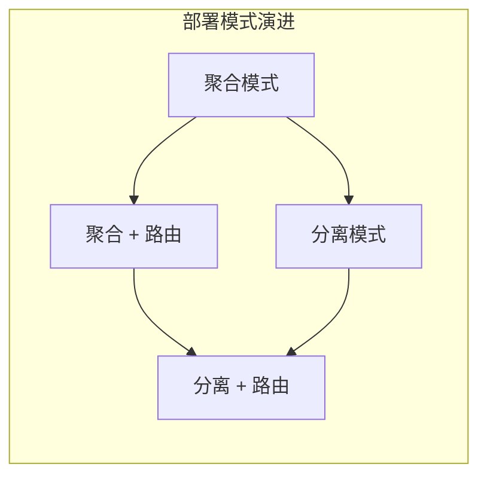
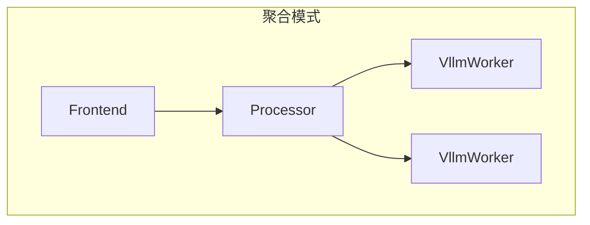
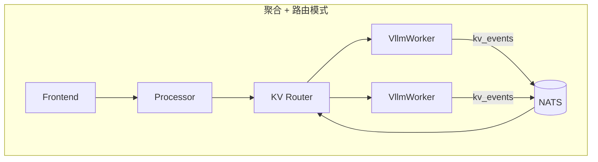
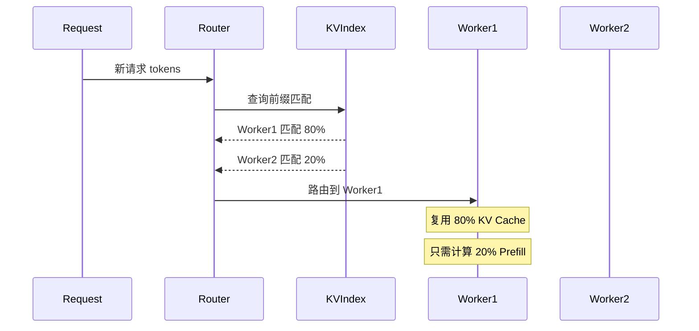
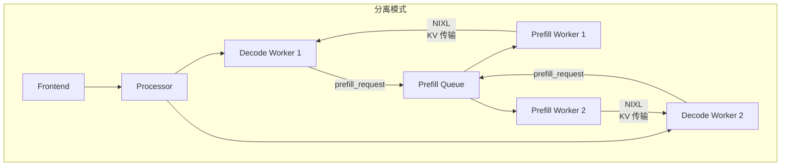
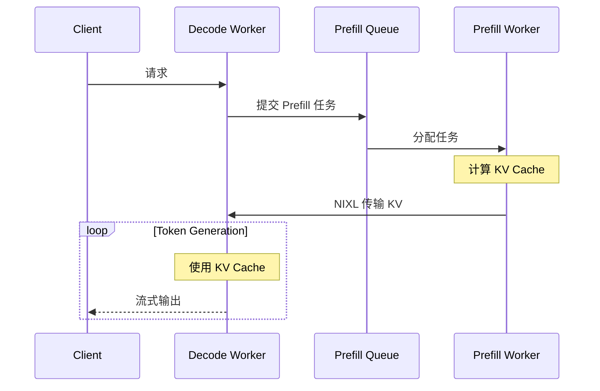
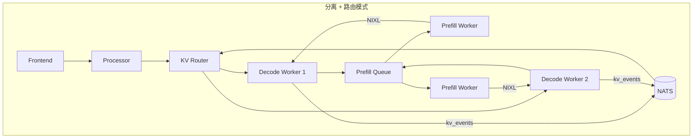
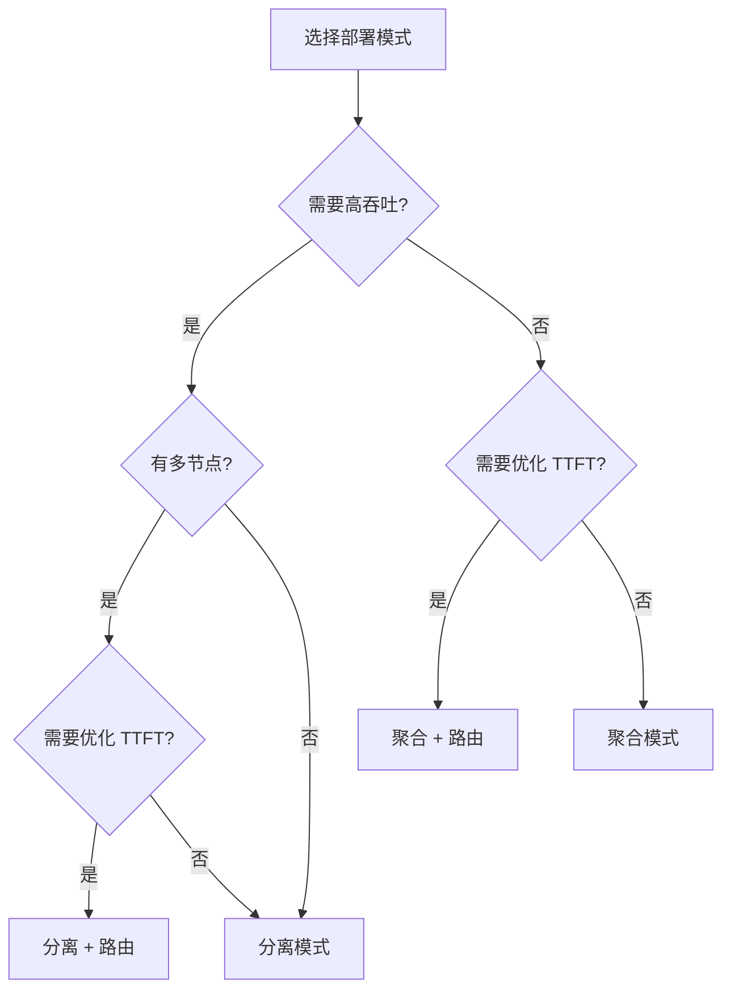

> 本文详细介绍 Dynamo 的四种部署模式，帮助用户根据实际需求选择合适的部署方案。

---

## 1. 部署模式概览

Dynamo 支持四种部署模式，复杂度和性能逐级提升：



| 模式 | 配置复杂度 | 吞吐 | TTFT | 适用场景 |
|------|-----------|------|------|----------|
| 聚合 | 低 | 基准 | 基准 | 开发测试 |
| 聚合 + 路由 | 中 | 基准 | 优化 3x | 多轮对话 |
| 分离 | 中高 | 提升 2x | 基准 | 高吞吐 |
| 分离 + 路由 | 高 | 提升 2x | 优化 3x | 生产环境 |

---

## 2. 聚合模式（Aggregated）

最简单的部署模式，所有组件运行在同一进程：



### 服务图定义

```python
# graphs/agg.py
from components.frontend import Frontend
from components.processor import Processor
from components.worker import VllmWorker

Frontend.link(Processor).link(VllmWorker)
```

### 配置示例

```yaml
# configs/agg.yaml
Frontend:
  served_model_name: deepseek-ai/DeepSeek-R1-Distill-Llama-8B
  endpoint: dynamo.Processor.chat/completions
  port: 8000

Processor:
  model: deepseek-ai/DeepSeek-R1-Distill-Llama-8B
  block-size: 64
  router: round-robin

VllmWorker:
  model: deepseek-ai/DeepSeek-R1-Distill-Llama-8B
  enable-prefix-caching: true
  tensor-parallel-size: 1
  ServiceArgs:
    workers: 1
    resources:
      gpu: 1
```

### 启动命令

```bash
dynamo serve graphs.agg:Frontend -f configs/agg.yaml
```

### 适用场景

- 开发测试
- 小规模部署
- 单 GPU 或小型 GPU 集群

---

## 3. 聚合 + 路由模式（Aggregated + Router）

在聚合模式基础上增加 KV-Aware 路由：



### 服务图定义

```python
# graphs/agg_router.py
from components.frontend import Frontend
from components.processor import Processor
from components.worker import VllmWorker
from components.kv_router import Router

Frontend.link(Processor).link(Router).link(VllmWorker)
```

### KV 路由工作原理



### 性能收益

- TTFT 降低 3 倍（高 KV 命中场景）
- 避免重复 Prefill 计算

### 适用场景

- 多 Worker 部署
- 有大量相似请求（如 RAG、多轮对话）
- 需要优化 TTFT

---

## 4. 分离模式（Disaggregated）

Prefill 和 Decode 分离部署：



### 服务图定义

```python
# graphs/disagg.py
from components.frontend import Frontend
from components.prefill_worker import PrefillWorker
from components.processor import Processor
from components.worker import VllmWorker

Frontend.link(Processor).link(VllmWorker).link(PrefillWorker)
```

### 分离模式工作流程



### 性能收益

- 单节点吞吐提升 30%
- 多节点吞吐提升 2 倍以上
- Prefill 和 Decode 独立扩展

### 适用场景

- 高吞吐需求
- 多节点部署
- 长 prompt 场景

---

## 5. 分离 + 路由模式（Disaggregated + Router）

完整功能模式，结合分离部署和 KV 路由：



### 服务图定义

```python
# graphs/disagg_router.py
from components.frontend import Frontend
from components.prefill_worker import PrefillWorker
from components.processor import Processor
from components.worker import VllmWorker
from components.kv_router import Router

Frontend.link(Processor).link(Router).link(VllmWorker).link(PrefillWorker)
```

### 性能收益

- 最高吞吐
- 最优 TTFT
- 最大灵活性

### 适用场景

- 生产环境
- 大规模集群
- 对性能有严格要求

---

## 6. 部署模式选择指南



### 决策要点

| 场景 | 推荐模式 | 原因 |
|------|----------|------|
| 开发测试 | 聚合 | 配置简单，快速验证 |
| 多轮对话应用 | 聚合 + 路由 | 复用历史 KV，优化 TTFT |
| 高并发 API 服务 | 分离 | 最大化吞吐 |
| 生产级部署 | 分离 + 路由 | 全面优化 |

---

## 7. 配置最佳实践

### 7.1 聚合模式配置要点

```yaml
VllmWorker:
  # 启用前缀缓存
  enable-prefix-caching: true
  # 单 GPU 配置
  tensor-parallel-size: 1
```

### 7.2 路由模式配置要点

```yaml
Processor:
  # 使用 KV-aware 路由
  router: kv
  # 路由评分参数
  kv-hit-weight: 1.0
  load-weight: 0.5
```

### 7.3 分离模式配置要点

```yaml
VllmWorker:
  # 启用远程 Prefill
  enable-disaggregated-prefill: true

PrefillWorker:
  # Prefill Worker 数量
  ServiceArgs:
    workers: 2
    resources:
      gpu: 1
```

---

## 8. 与现有框架对比

| 特性 | Dynamo | vLLM | TRT-LLM | SGLang |
|------|--------|------|---------|--------|
| **分离式服务** | 原生支持 | 实验性 | 不支持 | 不支持 |
| **KV 感知路由** | RadixTree | 不支持 | 不支持 | RadixAttention |
| **多层 KV 存储** | HBM/CPU/SSD | 仅 GPU | 仅 GPU | 仅 GPU |
| **分布式原生** | etcd+NATS | Ray 依赖 | Triton | 部分 |
| **多引擎支持** | vLLM/TRT/SGL | - | - | - |

---

## 总结

Dynamo 的四种部署模式为不同场景提供了灵活的选择：

1. **聚合模式**：简单易用，适合开发测试
2. **聚合 + 路由**：优化 TTFT，适合多轮对话
3. **分离模式**：提升吞吐，适合高并发场景
4. **分离 + 路由**：全面优化，适合生产环境

选择合适的部署模式，可以在复杂度和性能之间取得最佳平衡。

---

## 下一章

完成本章阅读后，建议继续阅读 [第二章：运行时层原理](../02-runtime-layer/README.md)，深入了解 Dynamo 的核心运行时设计。
