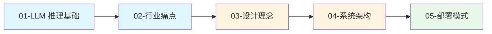

# 第一章：整体架构与设计理念

> NVIDIA Dynamo 是一个高吞吐、低延迟的分布式推理框架，专为在多节点环境中服务生成式 AI 和推理模型而设计。

## 本章概述

本章介绍 Dynamo 的整体架构设计和核心理念，帮助读者建立对系统的全局认识。内容包括 LLM 推理的背景知识、行业痛点分析、Dynamo 的设计目标与原则，以及四种部署模式的详细说明。

---

## 子文档列表

| 序号 | 文件 | 主题 | 内容简介 |
|------|------|------|----------|
| 1 | [01-llm-inference-basics.md](01-llm-inference-basics.md) | LLM 推理基础 | Transformer 架构、Self-Attention、Prefill/Decode 两阶段 |
| 2 | [02-industry-challenges.md](02-industry-challenges.md) | 行业痛点与解决方案 | GPU 利用率、KV Cache 问题、业界方案综述 |
| 3 | [03-dynamo-design-philosophy.md](03-dynamo-design-philosophy.md) | Dynamo 设计理念 | 设计目标、技术栈选择、核心设计原则 |
| 4 | [04-system-architecture.md](04-system-architecture.md) | 系统架构总览 | 五层架构、核心概念、数据流与控制流 |
| 5 | [05-deployment-modes.md](05-deployment-modes.md) | 部署模式详解 | 四种部署模式对比与配置 |

---

## 阅读顺序建议

**推荐路径**：

- **新手路径**：按顺序阅读所有文档，建立完整知识体系
- **快速上手**：直接阅读 [04-系统架构](04-system-architecture.md) 和 [05-部署模式](05-deployment-modes.md)
- **深入理解**：先读背景知识（01-02），再读设计理念（03）

---

## 关键概念速查

| 概念 | 说明 | 详见文档 |
|------|------|----------|
| **Prefill** | 处理用户 prompt，生成 KV Cache，计算密集型 | [01-llm-inference-basics.md](01-llm-inference-basics.md) |
| **Decode** | 逐 token 生成，内存带宽受限 | [01-llm-inference-basics.md](01-llm-inference-basics.md) |
| **KV Cache** | 存储历史 Key/Value，避免重复计算 | [01-llm-inference-basics.md](01-llm-inference-basics.md) |
| **PagedAttention** | vLLM 的分页 KV 管理技术 | [02-industry-challenges.md](02-industry-challenges.md) |
| **Disaggregated Serving** | Prefill/Decode 分离部署 | [05-deployment-modes.md](05-deployment-modes.md) |
| **Namespace** | 命名空间，用于多租户隔离 | [04-system-architecture.md](04-system-architecture.md) |
| **Component** | 服务组件，包含多个 Endpoint | [04-system-architecture.md](04-system-architecture.md) |
| **Endpoint** | 可调用的服务端点 | [04-system-architecture.md](04-system-architecture.md) |

---

## 下一章

完成本章阅读后，建议继续阅读 [第二章：运行时层原理](../02-runtime-layer/README.md)，深入了解 Dynamo 的核心运行时设计。
