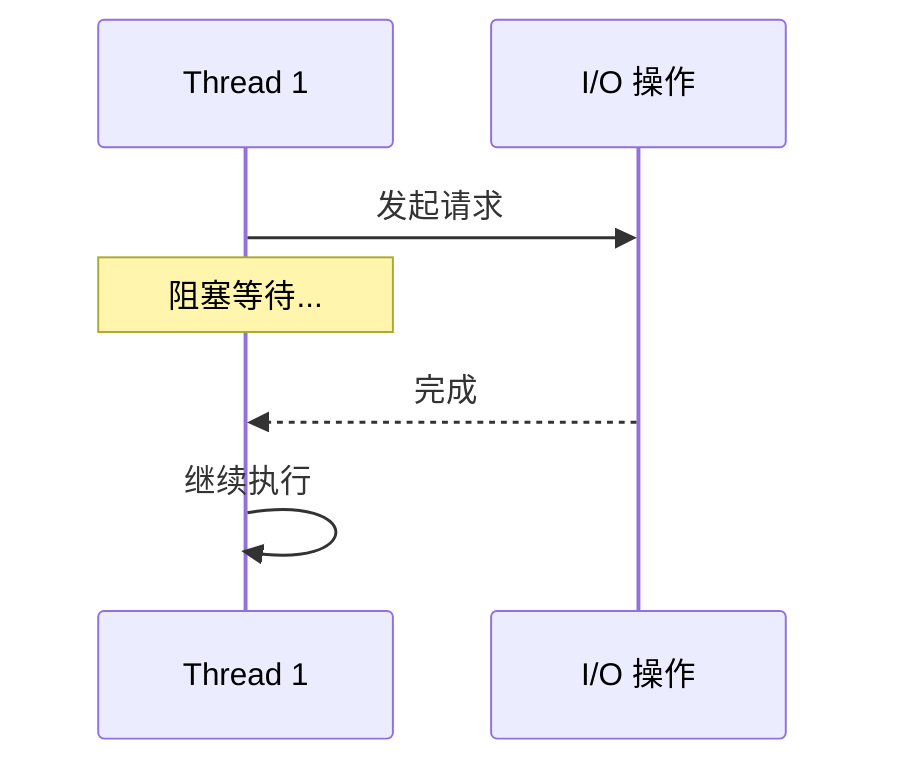
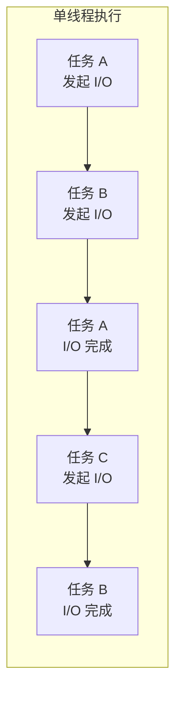
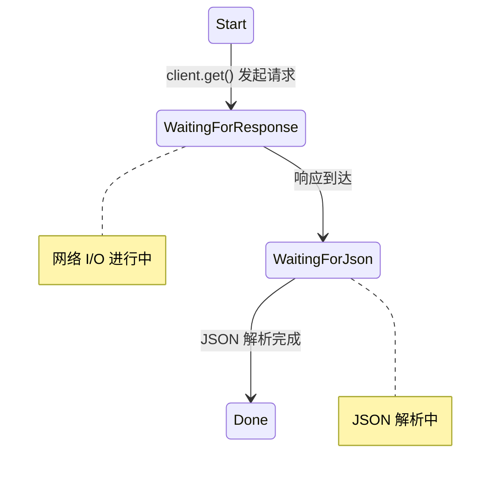
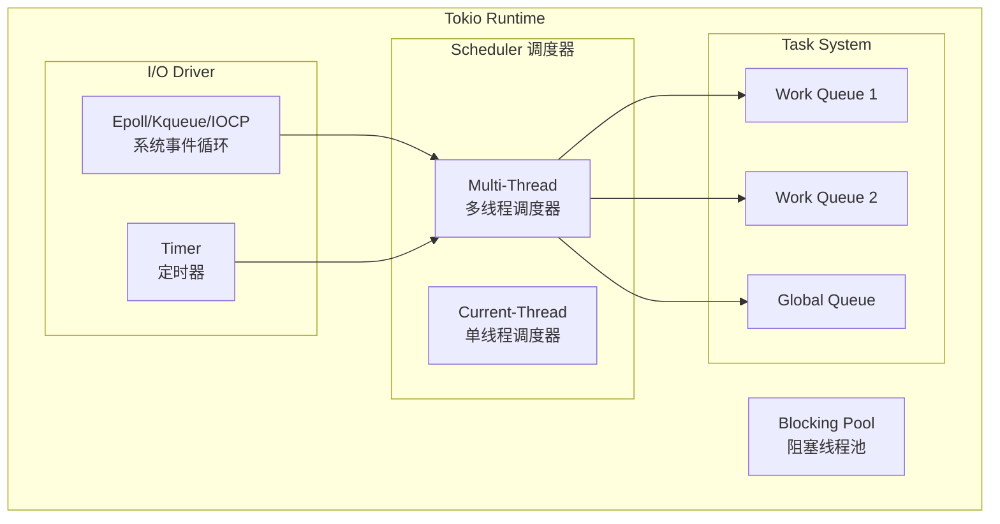
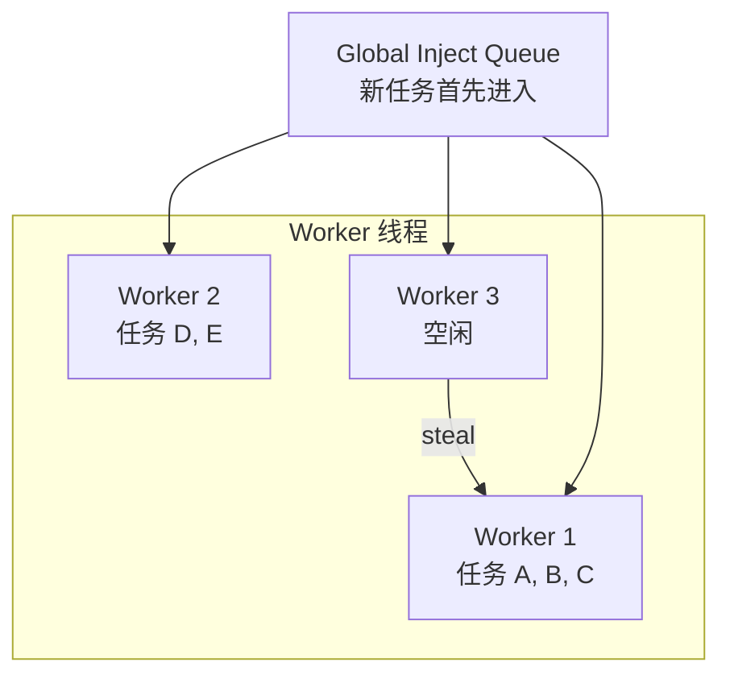
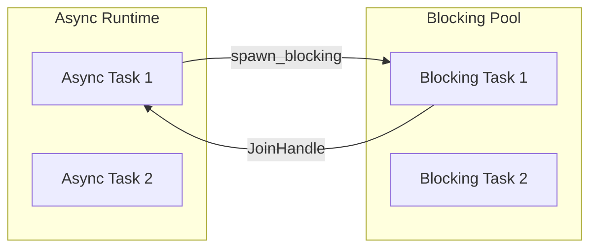
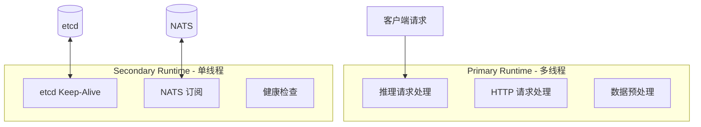

> 本文介绍 Rust 异步编程模型的核心概念，包括 Future、Poll 机制、async/await 语法以及 Tokio 运行时架构。

---

## 1. 同步 vs 异步

### 1.1 同步 I/O 的问题

传统的同步 I/O 模型中，当程序执行 I/O 操作（如网络请求、文件读写）时，线程会被阻塞，直到操作完成：



**问题**：
- 每个并发任务需要一个线程
- 线程切换开销大（~1-10μs）
- 内存占用高（每个线程 ~1MB 栈空间）

### 1.2 异步 I/O 的优势

异步 I/O 模型允许在等待 I/O 时切换到其他任务：



**优势**：
- 单线程可处理大量并发
- 无线程切换开销
- 内存占用低

---

## 2. Future 与 Poll 机制

### 2.1 Future Trait

Rust 的异步模型基于 `Future` trait，这是一种 **惰性求值** 的设计：

```rust
pub trait Future {
    type Output;

    fn poll(self: Pin<&mut Self>, cx: &mut Context<'_>) -> Poll<Self::Output>;
}

pub enum Poll<T> {
    Ready(T),    // 计算完成，返回结果
    Pending,     // 计算未完成，需要稍后再试
}
```

### 2.2 Poll 状态机

```mermaid
stateDiagram-v2
    [*] --> Created: async fn 创建
    Created --> Polling: executor 调用 poll()
    Polling --> Ready: 返回 Poll::Ready(result)
    Polling --> Pending: 返回 Poll::Pending
    Pending --> Polling: Waker 通知后再次 poll
    Ready --> [*]: 获取结果
```

### 2.3 关键概念

| 概念 | 说明 |
|------|------|
| **惰性（Lazy）** | Future 创建后不会立即执行，必须被 poll 才会推进 |
| **协作式（Cooperative）** | Future 主动让出控制权，而非被抢占 |
| **零成本抽象** | 编译时转换为状态机，无运行时开销 |

---

## 3. async/await 语法糖

### 3.1 基本用法

`async/await` 是对 Future 的语法糖，使异步代码看起来像同步代码：

```rust
// 使用 async/await
async fn fetch_and_process() -> Result<Data> {
    let response = client.get("http://api.example.com").await?;
    let data = response.json::<Data>().await?;
    Ok(data)
}
```

### 3.2 状态机转换

编译器将 async 函数转换为状态机：



**编译器生成的状态机**：

```rust
enum FetchAndProcessState {
    Start,
    WaitingForResponse { client: Client },
    WaitingForJson { response: Response },
    Done,
}
```

---

## 4. Tokio 异步运行时

### 4.1 核心组件

Tokio 是 Rust 生态中最流行的异步运行时，Dynamo 选择 Tokio 作为底层运行时。



### 4.2 Work-Stealing 调度

Tokio 的多线程调度器使用 **Work-Stealing** 算法来平衡负载：



**Work-Stealing 的优势**：

| 优势 | 说明 |
|------|------|
| **负载均衡** | 空闲 Worker 主动获取任务 |
| **缓存友好** | 任务优先在创建它的 Worker 上执行 |
| **低竞争** | 每个 Worker 有自己的队列 |

### 4.3 Blocking 线程池

某些操作无法异步化（如文件系统操作、CPU 密集计算），Tokio 提供 Blocking 线程池：

```rust
// 在 blocking 线程池中执行同步操作
let result = tokio::task::spawn_blocking(|| {
    // 这里的代码在独立线程中运行
    std::fs::read_to_string("large_file.txt")
}).await?;
```



---

## 5. Dynamo 中的应用

### 5.1 Runtime 配置

Dynamo 基于 Tokio 构建运行时：

```rust
// Dynamo Runtime 的核心结构
pub struct Runtime {
    id: Arc<String>,
    primary: RuntimeType,      // 主任务运行时
    secondary: RuntimeType,    // 后台任务运行时
    cancellation_token: CancellationToken,
}
```

### 5.2 双运行时设计



**分离的原因**：

1. **防止阻塞**：后台任务不会抢占业务任务的 CPU
2. **资源控制**：可以独立配置两个运行时的线程数
3. **故障隔离**：后台任务的问题不会直接影响主业务

---

## 小结

本文介绍了 Rust 异步编程的核心概念：

1. **Future 与 Poll**：惰性求值、协作式调度
2. **async/await**：编译器将异步代码转换为状态机
3. **Tokio 运行时**：Work-Stealing 调度、Blocking 线程池
4. **Dynamo 应用**：双运行时设计，隔离业务和后台任务

---

## 下一篇

继续阅读 [02-分布式系统基础](02-distributed-system-basics.md)，了解分布式系统的核心概念。
