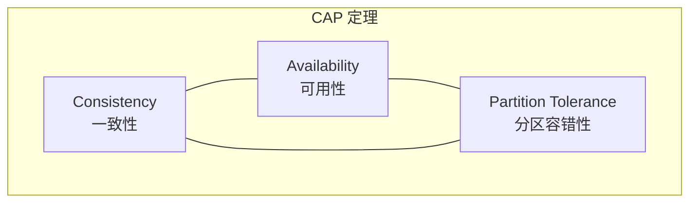
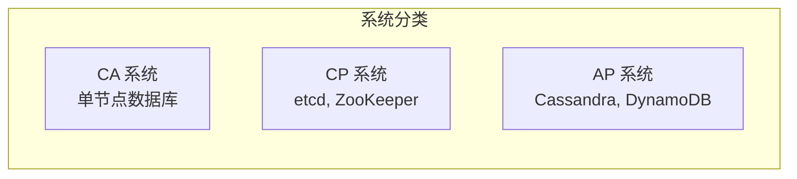
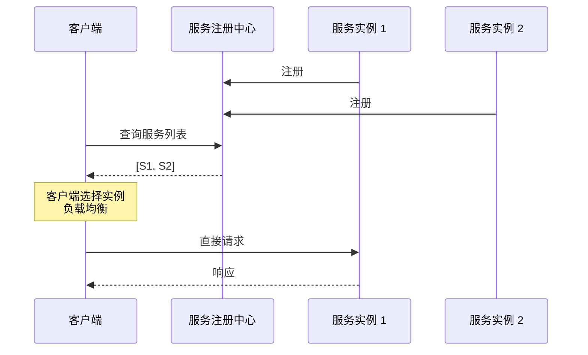
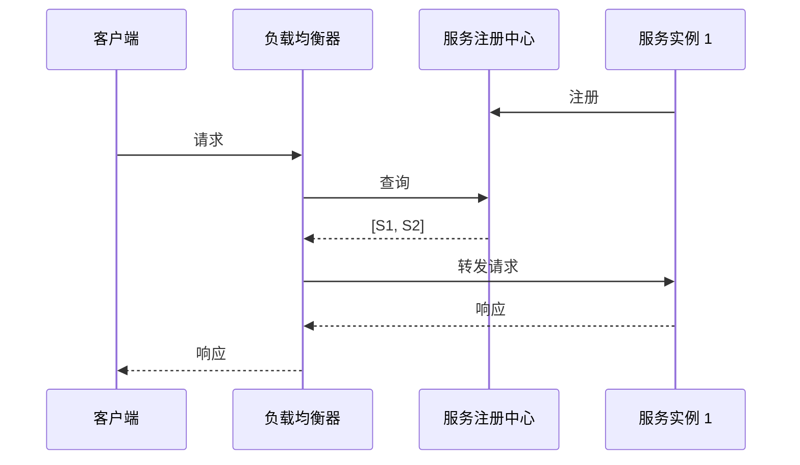
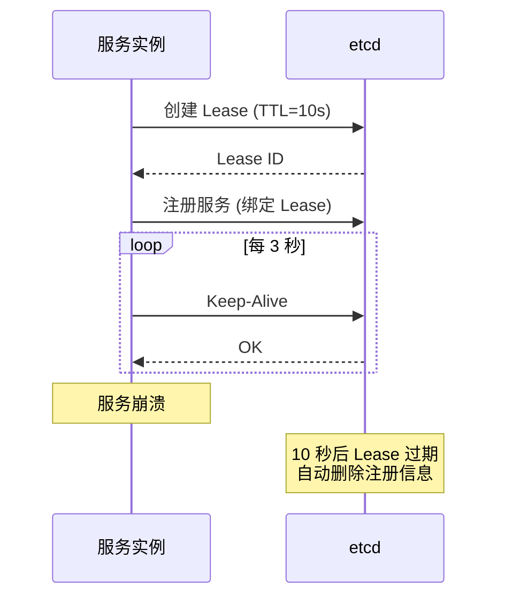
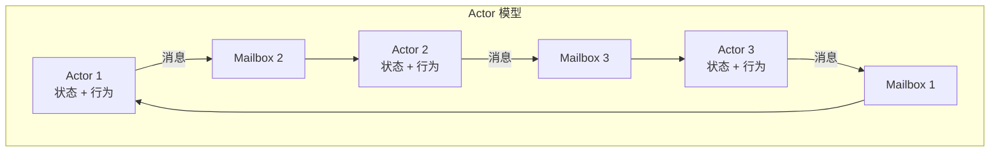
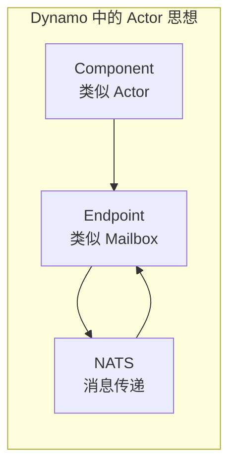
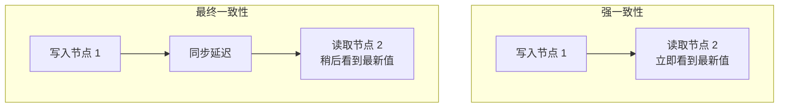

> 本文介绍分布式系统的核心概念，包括 CAP 定理、服务发现、心跳机制以及 Actor 模型。

---

## 1. CAP 定理

### 1.1 三个保证

分布式系统中，不可能同时满足以下三个保证：

| 保证 | 说明 |
|------|------|
| **Consistency** | 所有节点在同一时间看到相同的数据 |
| **Availability** | 每个请求都能收到响应（不保证是最新数据） |
| **Partition Tolerance** | 网络分区时系统仍能正常运行 |

### 1.2 系统分类

### 1.3 Dynamo 的选择

| 平面 | 系统 | 类型 | 原因 |
|------|------|------|------|
| **控制平面** | etcd | CP | 服务注册需要强一致性 |
| **事件平面** | NATS | AP | 事件传递优先可用性 |
| **数据平面** | NIXL | - | 点对点传输，不涉及分布式一致性 |

---

## 2. 服务发现模式

### 2.1 客户端发现模式

客户端负责查询服务注册中心并选择实例：

**优点**：
- 客户端掌握完整的服务列表
- 可以实现复杂的负载均衡策略

**缺点**：
- 客户端逻辑复杂
- 需要为每种语言实现发现逻辑

### 2.2 服务端发现模式

由负载均衡器代理服务发现：

**优点**：
- 客户端逻辑简单
- 统一的服务发现接口

**缺点**：
- 增加网络延迟
- 负载均衡器成为单点

### 2.3 Dynamo 的选择

**Dynamo 使用客户端发现模式**：
- 通过 etcd 存储服务注册信息
- 客户端直接查询并选择服务实例
- 支持复杂的路由策略（如 KV-Aware 路由）

---

## 3. 心跳与租约机制

### 3.1 为什么需要心跳

服务实例需要证明自己仍然存活：
- 检测服务崩溃
- 检测网络分区
- 及时清理下线服务

### 3.2 Lease 租约机制

etcd 使用 Lease 机制管理服务健康：

### 3.3 Lease 的优势

| 特性 | 说明 |
|------|------|
| **自动清理** | Lease 过期后自动删除绑定的 Key |
| **批量管理** | 多个 Key 可以绑定同一个 Lease |
| **原子性** | Lease 撤销时所有 Key 同时删除 |

---

## 4. Actor 模型

### 4.1 核心概念

Actor 模型是一种并发计算模型，每个 Actor 是独立的计算单元：

### 4.2 Actor 模型的特点

| 特点 | 说明 |
|------|------|
| **封装状态** | Actor 的状态只能通过消息修改，无共享内存 |
| **异步消息** | Actor 之间通过消息通信，消息是异步的 |
| **位置透明** | Actor 可以在本地或远程，通信方式相同 |

### 4.3 Dynamo 中的应用

虽然 Dynamo 没有使用传统的 Actor 框架（如 Actix），但其设计借鉴了 Actor 模型的思想：

| Dynamo 概念 | Actor 对应 |
|-------------|-----------|
| Component | Actor |
| Endpoint | Mailbox |
| NATS | 消息传递系统 |

---

## 5. 一致性模型

### 5.1 强一致性 vs 最终一致性

### 5.2 Dynamo 的一致性选择

| 场景 | 一致性模型 | 实现方式 |
|------|-----------|----------|
| 服务注册 | 强一致性 | etcd Raft 共识 |
| KV 索引 | 最终一致性 | NATS 事件传播 |
| 指标聚合 | 最终一致性 | 定期同步 |

---

## 小结

本文介绍了分布式系统的核心概念：

1. **CAP 定理**：一致性、可用性、分区容错性不可兼得
2. **服务发现**：客户端发现 vs 服务端发现
3. **心跳机制**：Lease 租约实现健康检查
4. **Actor 模型**：消息驱动的并发模型

这些概念是理解 Dynamo 分布式运行时设计的基础。

---

## 下一篇

继续阅读 [03-Runtime 双层设计](03-runtime-design.md)，了解 Dynamo 的运行时架构。
