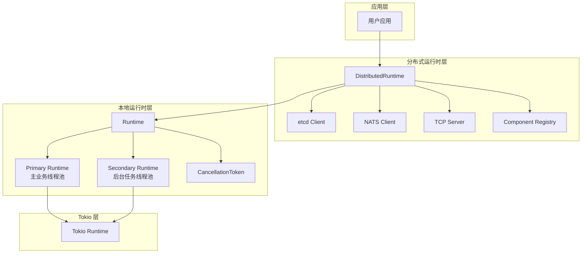
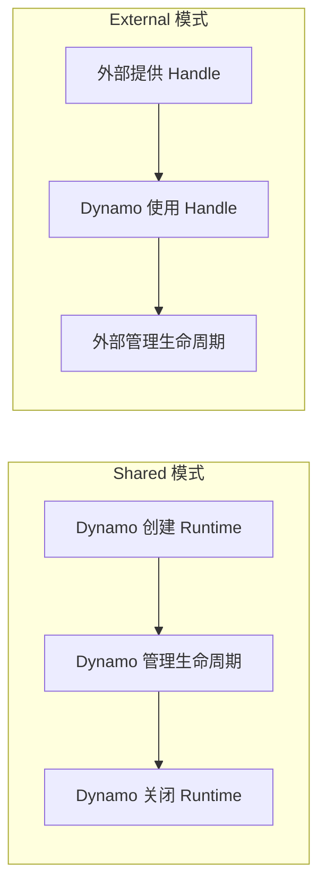
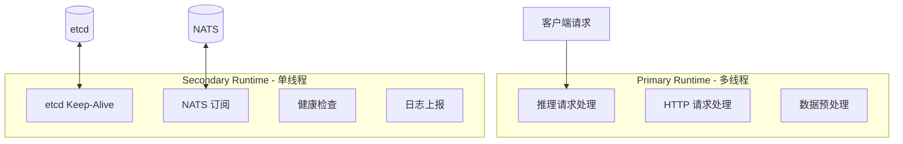
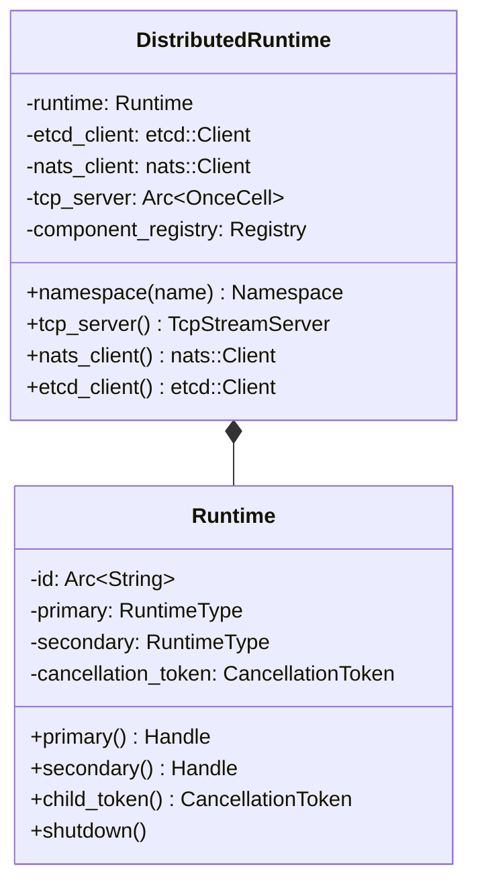
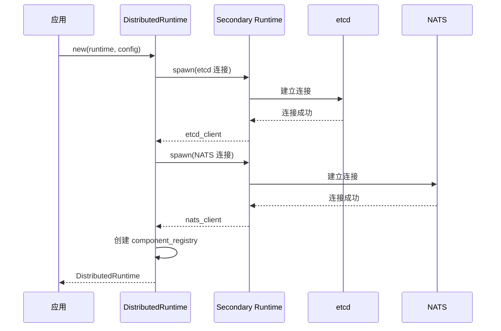
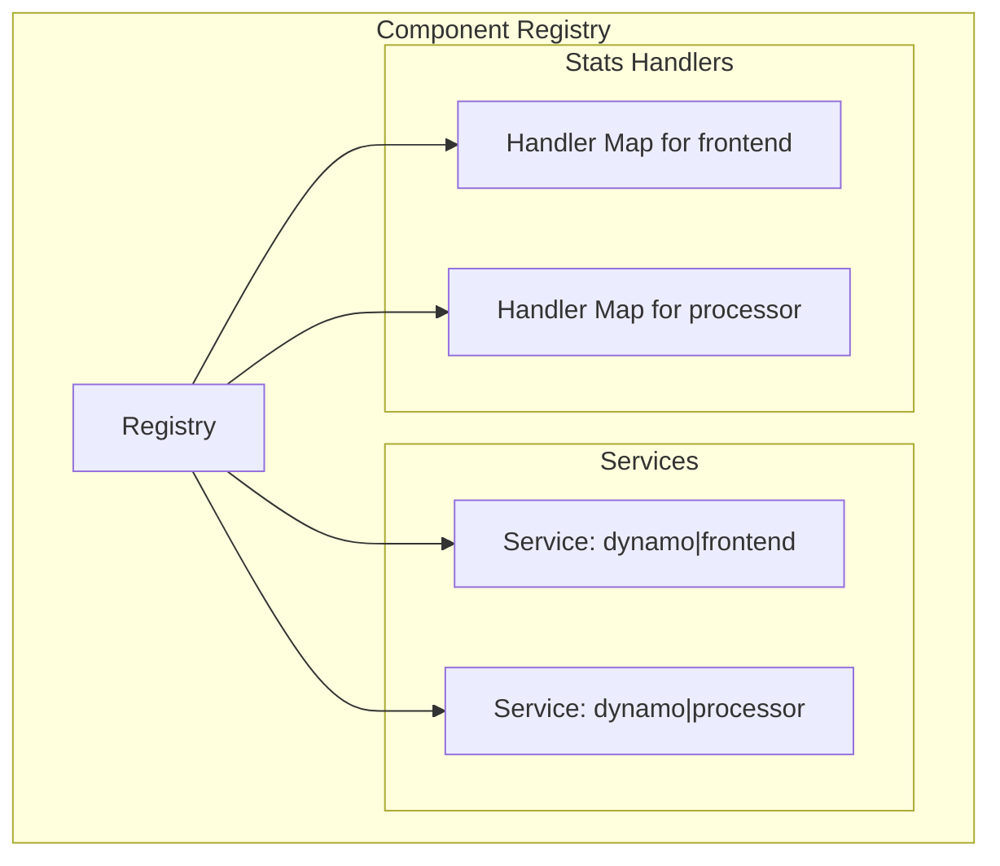
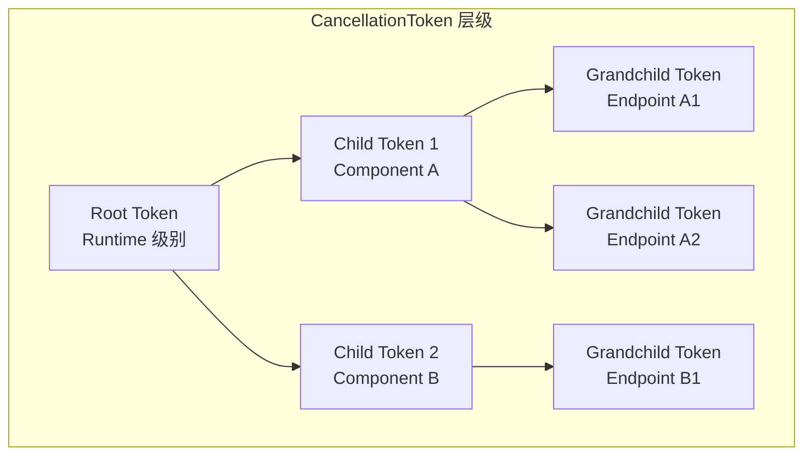
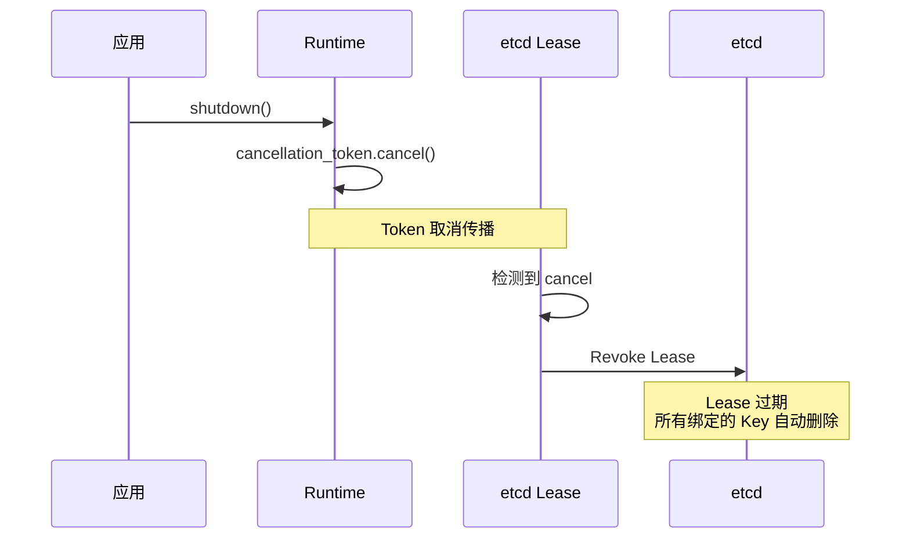
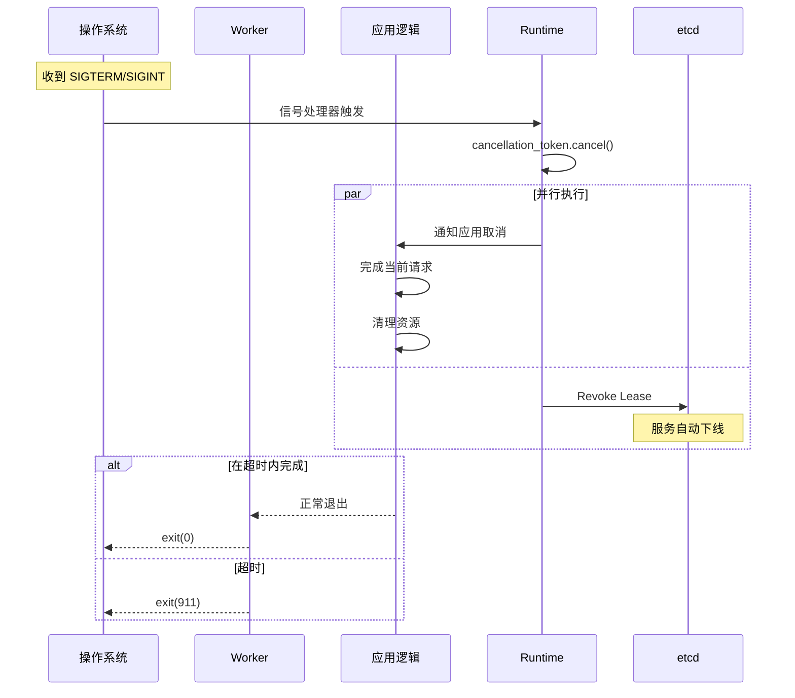

# Runtime 双层设计

> 本文介绍 Dynamo 的 Runtime 双层设计，包括 Local Runtime、Distributed Runtime 以及生命周期管理。

---

## 1. 设计理念

Dynamo 的运行时采用双层设计：**Local Runtime** 和 **Distributed Runtime**。这种设计遵循了 **关注点分离** 原则：



**设计目标**：

| 目标 | 实现方式 |
|------|----------|
| **分层解耦** | Local Runtime 不依赖分布式组件，可独立测试 |
| **资源隔离** | 业务逻辑和后台任务使用不同的线程池 |
| **生命周期管理** | 统一的取消令牌机制 |

---

## 2. Local Runtime

### 2.1 核心结构

`Runtime` 是本地运行时，管理 Tokio 线程池和取消令牌：

```rust
// 源码位置: lib/runtime/src/lib.rs:54-67

pub struct Runtime {
    id: Arc<String>,
    primary: RuntimeType,
    secondary: RuntimeType,
    cancellation_token: CancellationToken,
}

enum RuntimeType {
    Shared(Arc<tokio::runtime::Runtime>),
    External(tokio::runtime::Handle),
}
```

### 2.2 RuntimeType 枚举

`RuntimeType` 支持两种模式：



| 模式 | 说明 | 使用场景 |
|------|------|----------|
| **Shared** | Dynamo 创建和管理 Tokio Runtime | 独立运行的服务 |
| **External** | 使用外部提供的 Runtime Handle | 嵌入到其他应用中 |

### 2.3 Primary vs Secondary Runtime

Dynamo 使用两个运行时来隔离不同类型的任务：



| 运行时 | 用途 | 特点 |
|--------|------|------|
| **Primary** | 主业务逻辑 | 多线程，处理推理请求 |
| **Secondary** | 后台任务 | 单线程，处理 etcd/NATS 通信 |

**为什么要分离？**

1. **防止阻塞**：后台任务（如 Keep-Alive）不会抢占业务任务的 CPU
2. **资源控制**：可以独立配置两个运行时的线程数
3. **故障隔离**：后台任务的问题不会直接影响主业务

### 2.4 Runtime 创建方式

```rust
impl Runtime {
    /// 从当前 Tokio 运行时创建（嵌入模式）
    pub fn from_current() -> Result<Runtime>;

    /// 从外部 Handle 创建
    pub fn from_handle(handle: tokio::runtime::Handle) -> Result<Runtime>;

    /// 从配置文件创建（推荐）
    pub fn from_settings() -> Result<Runtime>;

    /// 创建单线程运行时（测试用）
    pub fn single_threaded() -> Result<Runtime>;
}
```

---

## 3. Distributed Runtime

### 3.1 核心结构

`DistributedRuntime` 扩展了 `Runtime`，增加了分布式系统所需的组件：

```rust
// 源码位置: lib/runtime/src/lib.rs:68-86

pub struct DistributedRuntime {
    // 本地运行时
    runtime: Runtime,

    // 分布式组件
    etcd_client: transports::etcd::Client,
    nats_client: transports::nats::Client,
    tcp_server: Arc<OnceCell<Arc<TcpStreamServer>>>,

    // 本地组件注册表
    component_registry: component::Registry,
}
```

### 3.2 类图



### 3.3 初始化流程



### 3.4 组件注册表 (Registry)

`Registry` 用于管理本地组件，避免重复创建资源：



**Registry 解决的问题**：

1. **Service 复用**：同一个 Component 的多个 Endpoint 共享一个 NATS Service
2. **Stats 聚合**：统一管理每个端点的统计信息处理器
3. **资源控制**：防止创建重复的 Watcher 和 Connection

---

## 4. 生命周期管理

### 4.1 CancellationToken 层级

`CancellationToken` 是 Tokio 提供的取消信号机制，Dynamo 使用层级结构管理：



**取消传播规则**：

| 规则 | 说明 |
|------|------|
| 父取消 → 子取消 | 父 Token 取消时，所有子 Token 自动取消 |
| 子取消 ≠ 父取消 | 子 Token 取消时，不影响父 Token 和兄弟 Token |
| 异步等待 | 可以通过 `cancelled()` 异步等待取消信号 |

### 4.2 与 etcd Lease 的绑定

Dynamo 将 `CancellationToken` 与 etcd Lease 绑定：



### 4.3 Graceful Shutdown 流程



---

## 5. Worker 执行框架

### 5.1 Worker 设计

Worker 是运行用户应用的入口点：

```rust
pub struct Worker {
    runtime: Runtime,
}

impl Worker {
    /// 从配置创建 Worker
    pub fn from_settings() -> Result<Worker>;

    /// 执行应用
    pub fn execute<F, Fut>(self, f: F) -> Result<()>
    where
        F: FnOnce(Runtime) -> Fut + Send + 'static,
        Fut: Future<Output = Result<()>> + Send + 'static;
}
```

### 5.2 配置管理

配置优先级（从低到高）：


---

## 小结

本文介绍了 Dynamo 的 Runtime 双层设计：

1. **Local Runtime**：管理 Tokio 线程池，隔离业务和后台任务
2. **Distributed Runtime**：扩展分布式能力，管理 etcd/NATS 连接
3. **生命周期管理**：CancellationToken 层级结构，与 etcd Lease 绑定
4. **Worker 框架**：统一的应用入口点，支持优雅关闭

---

## 下一篇

继续阅读 [04-Component 系统详解](04-component-system.md)，了解 Dynamo 的组件模型。
