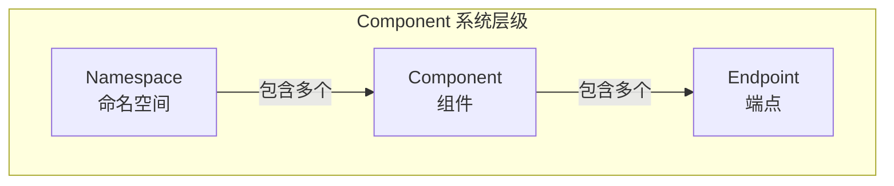
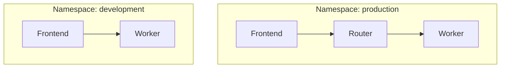
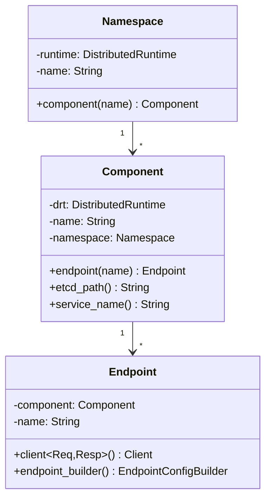
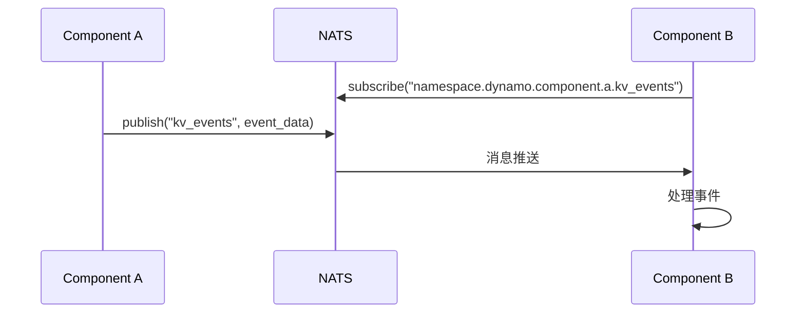
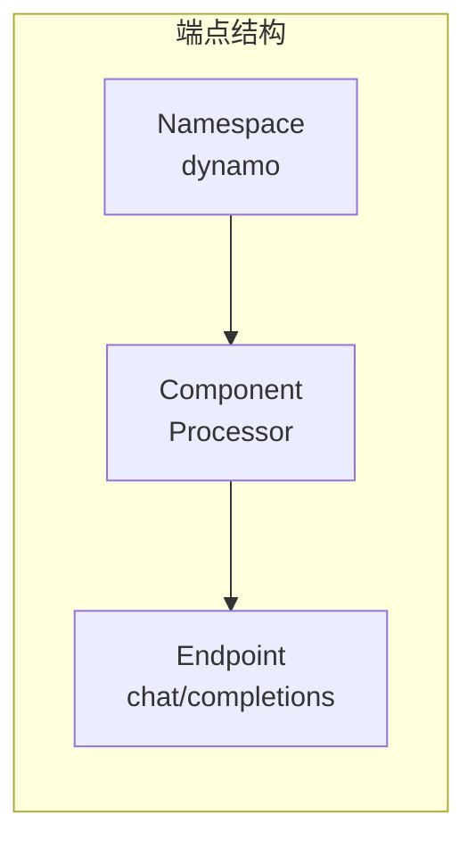
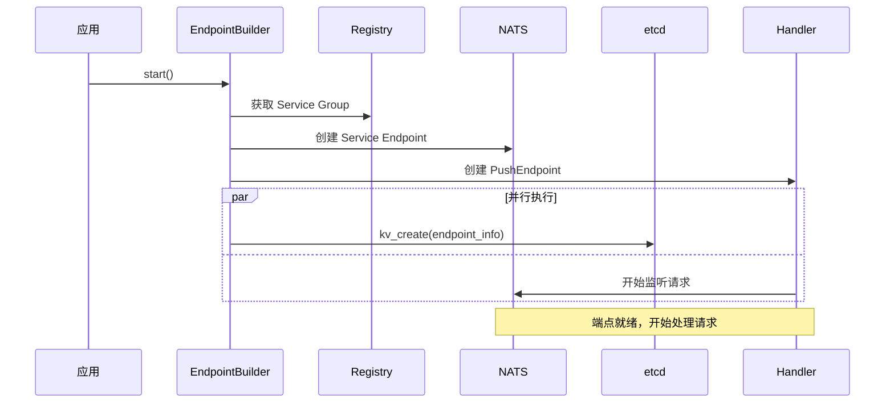
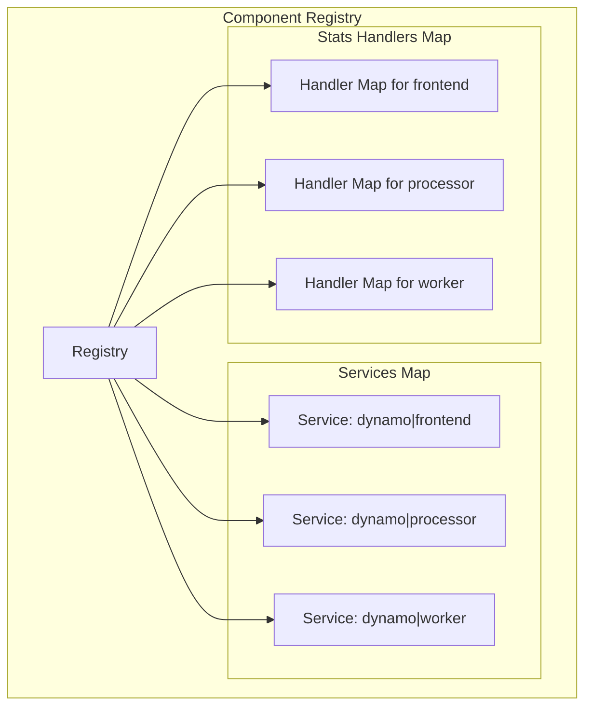
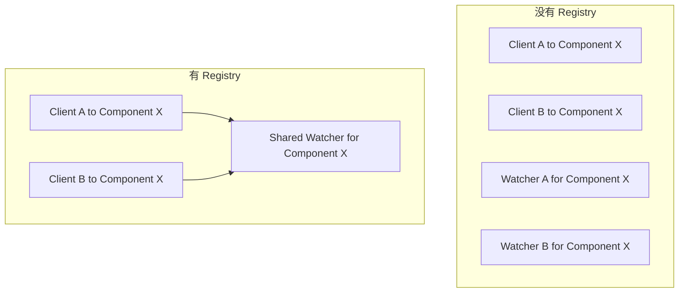
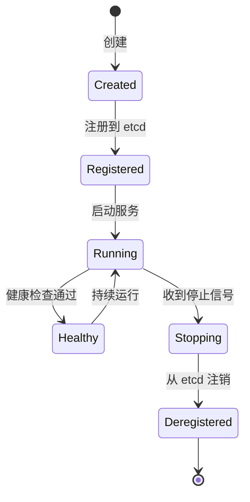
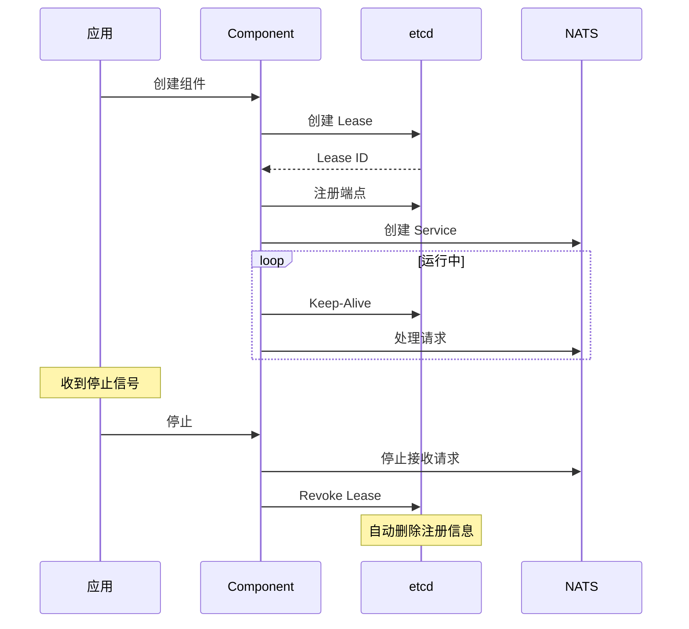

# Component 系统详解

> 本文详细介绍 Dynamo 的 Component 系统，包括 Namespace、Component、Endpoint 和 Registry 的设计与实现。

---

## 1. Component 系统概览

Component 系统是 Dynamo 分布式应用的核心抽象，定义了服务的组织方式：



---

## 2. Namespace 命名空间

### 2.1 设计目的

Namespace 提供了逻辑隔离，类似于 Kubernetes 的 Namespace：



### 2.2 使用方式

```python
# Python 中创建命名空间
namespace = runtime.namespace("production")
namespace_dev = runtime.namespace("development")
```

### 2.3 命名规范

Namespace 名称有严格的字符限制：

| 允许的字符 | 示例 |
|------------|------|
| 小写字母 | `a-z` |
| 数字 | `0-9` |
| 连字符 | `-` |
| 下划线 | `_` |

---

## 3. Component 组件模型

### 3.1 核心结构



### 3.2 Python 中定义组件

```python
@service(dynamo={"namespace": "production"})
class VllmWorker:
    @dynamo_endpoint()
    async def generate(self, request):
        ...
```

### 3.3 路径与命名

Component 使用分层的命名体系：

| 属性 | 示例值 | 说明 |
|------|--------|------|
| namespace | `dynamo` | 命名空间 |
| name | `processor` | 组件名 |
| `etcd_path()` | `dynamo/components/processor` | etcd 存储路径 |
| `service_name()` | `dynamo\|processor` | NATS 服务名 |
| `path()` | `dynamo/processor` | 逻辑路径 |

### 3.4 事件发布/订阅

Component 支持事件驱动的通信：



---

## 4. Endpoint 端点

### 4.1 Endpoint 定义

Endpoint 是 Component 上的可调用入口点：

```rust
pub struct Endpoint {
    component: Component,
    name: String,
}
```

### 4.2 端点引用格式

```yaml
# 端点引用格式
endpoint: dynamo.Processor.chat/completions
#         ^命名空间  ^组件     ^端点名
```



### 4.3 Endpoint 注册信息

端点注册到 etcd 时包含以下信息：

```json
{
    "component": "processor",
    "endpoint": "generate",
    "namespace": "dynamo",
    "lease_id": 123456789,
    "transport": { "nats_tcp": "dynamo|processor.generate-1a2b3c4d" }
}
```

### 4.4 Endpoint 启动流程



---

## 5. Registry 注册中心

### 5.1 Registry 结构



### 5.2 Registry 解决的问题

| 问题 | 解决方案 |
|------|----------|
| **Service 重复创建** | 同一个 Component 的多个 Endpoint 共享一个 NATS Service |
| **Watch 重复** | 多个客户端连接同一个 Component 时，共享一个 etcd Watcher |
| **Stats 聚合** | 统一管理每个端点的统计信息处理器 |

### 5.3 没有 Registry vs 有 Registry



---

## 6. 组件生命周期

### 6.1 状态转换



### 6.2 完整生命周期



---

## 7. 使用示例

### 7.1 创建命名空间和组件

```python
from dynamo.runtime import DistributedRuntime

async def main():
    runtime = await DistributedRuntime.create()

    # 创建命名空间
    namespace = runtime.namespace("production")

    # 创建组件
    component = namespace.component("worker")

    # 创建端点
    endpoint = component.endpoint("generate")
```

### 7.2 定义服务

```python
@service(dynamo={"namespace": "production"})
class VllmWorker:
    @dynamo_endpoint()
    async def generate(self, request):
        # 处理请求
        async for token in self.engine.generate(request):
            yield token
```

### 7.3 服务配置

```yaml
VllmWorker:
  model: deepseek-ai/DeepSeek-R1-Distill-Llama-8B
  enable-prefix-caching: true
  ServiceArgs:
    workers: 4
    resources:
      gpu: 1
```

---

## 小结

本文介绍了 Dynamo 的 Component 系统：

1. **Namespace**：逻辑隔离，多租户支持
2. **Component**：可部署的服务单元
3. **Endpoint**：可调用的服务接口
4. **Registry**：资源复用和统一管理

---

## 下一篇

继续阅读 [05-Pipeline 架构](05-pipeline-architecture.md)，了解 Dynamo 的数据流处理机制。
