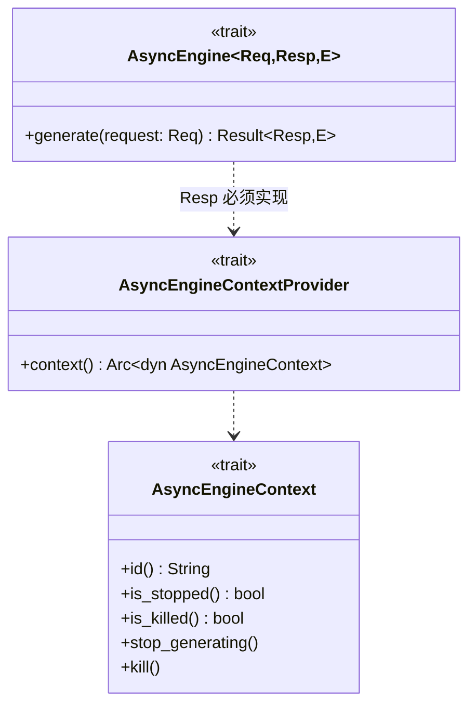
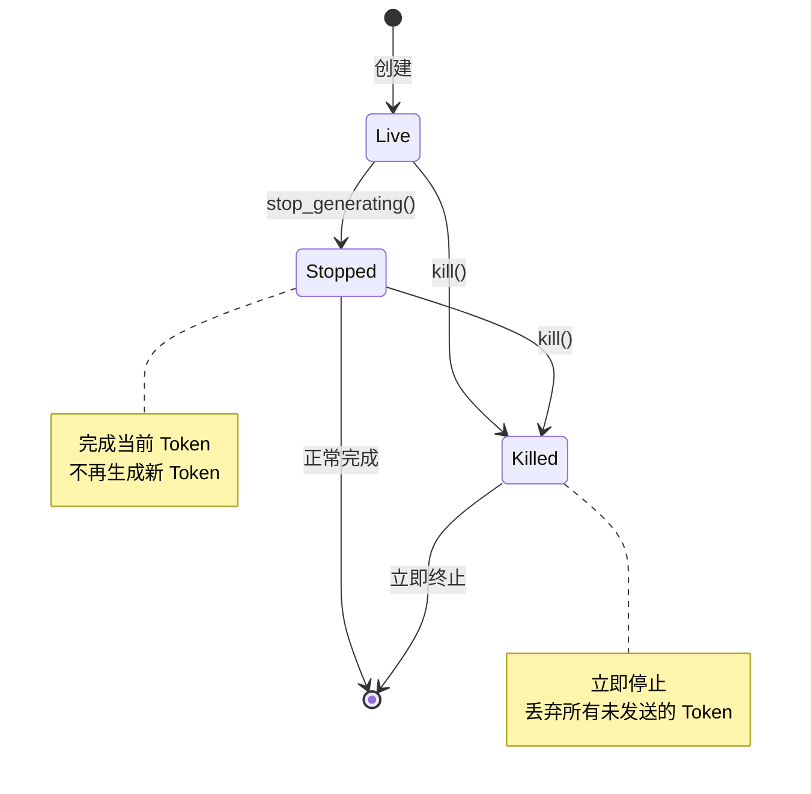
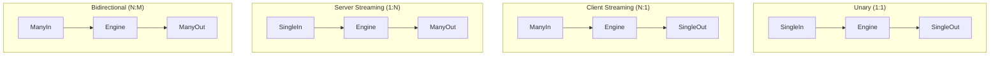
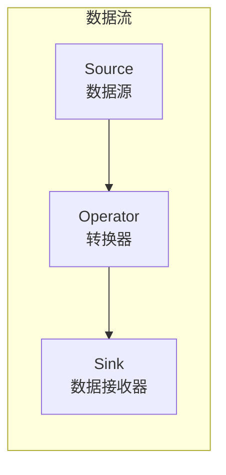
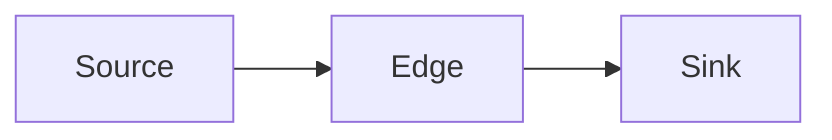
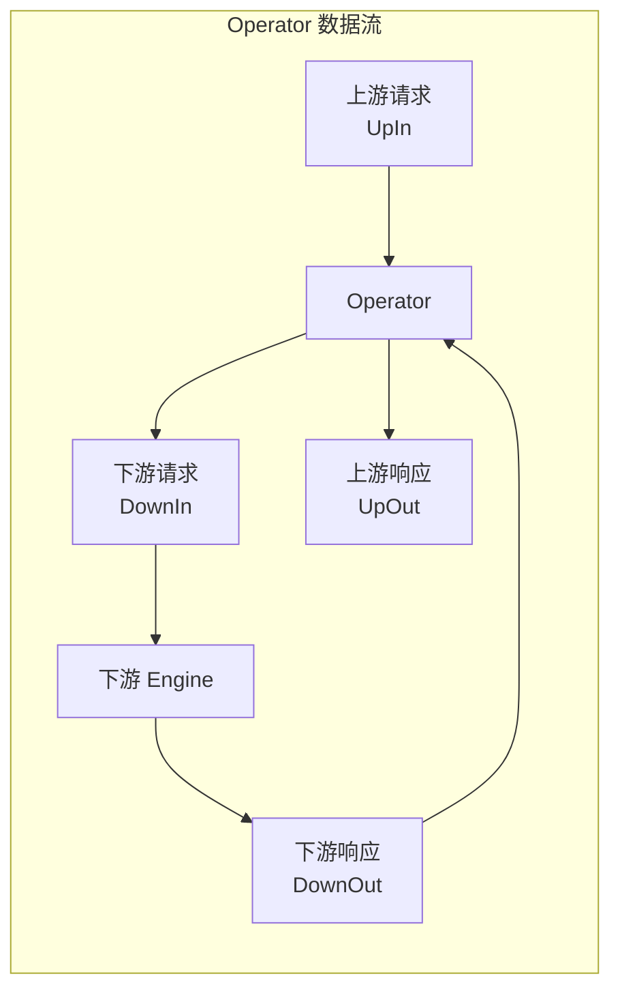
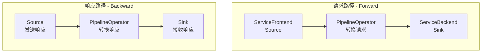
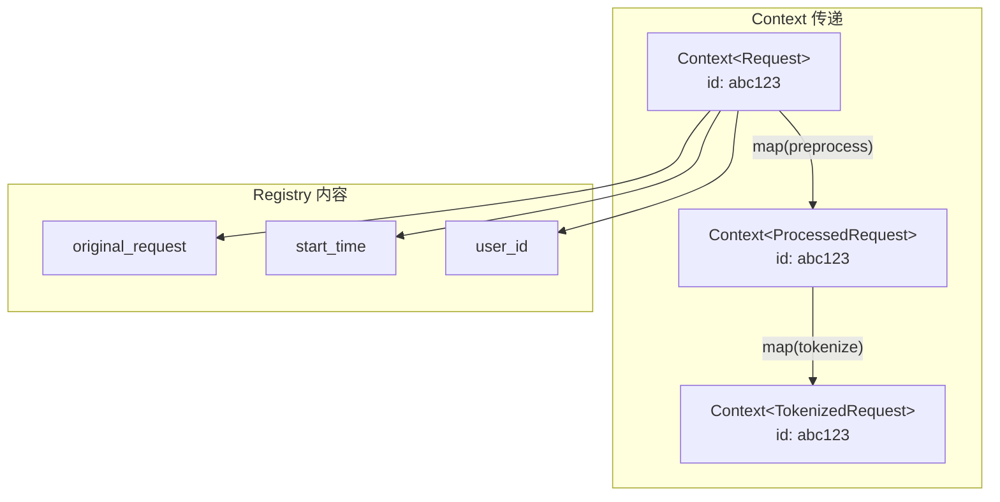
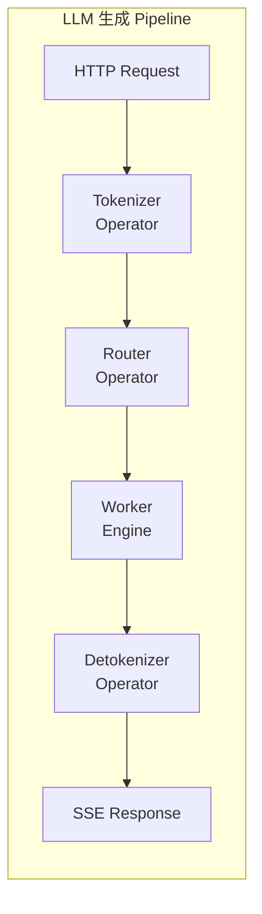
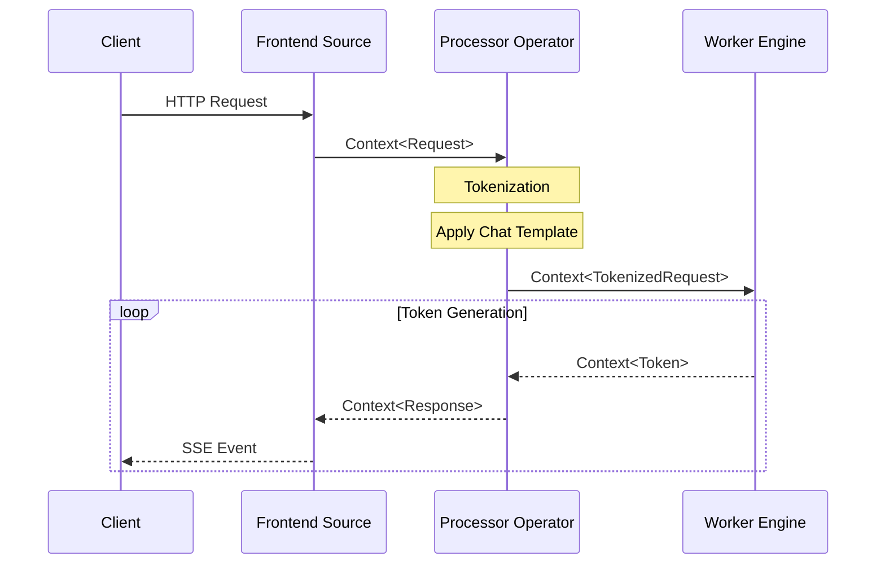

> 本文介绍 Dynamo 的 Pipeline 架构，包括 AsyncEngine Trait 体系、Pipeline 类型系统、Source/Sink/Operator 模式以及 Context 上下文传递。

---

## 1. AsyncEngine Trait 体系

### 1.1 Data Trait

所有可以在 Pipeline 中流转的数据必须实现 `Data` trait：

```rust
pub trait Data: Send + Sync + 'static {}
impl<T: Send + Sync + 'static> Data for T {}
```

| 约束 | 说明 |
|------|------|
| `Send` | 可以安全地跨线程传递 |
| `Sync` | 可以被多个线程同时访问 |
| `'static` | 不包含非静态引用 |

### 1.2 AsyncEngine Trait

`AsyncEngine` 是核心的推理引擎抽象：

```rust
#[async_trait]
pub trait AsyncEngine<Req: Data, Resp: Data + AsyncEngineContextProvider, E: Data>:
    Send + Sync
{
    async fn generate(&self, request: Req) -> Result<Resp, E>;
}
```



### 1.3 AsyncEngineContext

Context 提供了对流的控制能力：



| 方法 | 说明 |
|------|------|
| `stop_generating()` | 优雅停止，完成当前 Token |
| `kill()` | 立即终止，丢弃未发送内容 |

---

## 2. Pipeline 类型系统

### 2.1 四种 Pipeline 类型

Dynamo 定义了四种 Pipeline 类型，对应不同的输入/输出模式：



### 2.2 类型定义

```rust
/// 单输入单输出（Unary）
pub type UnaryEngine<T, U> = ServiceEngine<SingleIn<T>, SingleOut<U>>;

/// 多输入单输出（Client Streaming）
pub type ClientStreamingEngine<T, U> = ServiceEngine<ManyIn<T>, SingleOut<U>>;

/// 单输入多输出（Server Streaming）
pub type ServerStreamingEngine<T, U> = ServiceEngine<SingleIn<T>, ManyOut<U>>;

/// 多输入多输出（Bidirectional Streaming）
pub type BidirectionalStreamingEngine<T, U> = ServiceEngine<ManyIn<T>, ManyOut<U>>;
```

### 2.3 LLM 推理场景

| 类型 | 场景 | 说明 |
|------|------|------|
| Unary | 嵌入生成 | 输入文本，输出向量 |
| Server Streaming | 文本生成 | 输入 Prompt，流式输出 Token |
| Bidirectional | 对话系统 | 流式输入上下文，流式输出响应 |

---

## 3. Source/Sink/Operator 模式

### 3.1 基本概念

Pipeline 使用 Source/Sink/Operator 模式构建数据流图：



### 3.2 Source Trait

```rust
#[async_trait]
pub trait Source<T: PipelineIO>: Data {
    async fn on_next(&self, data: T, _: private::Token) -> Result<(), Error>;
    fn set_edge(&self, edge: Edge<T>, _: private::Token) -> Result<(), PipelineError>;

    fn link<S: Sink<T> + 'static>(&self, sink: Arc<S>) -> Result<Arc<S>, PipelineError> {
        let edge = Edge::new(sink.clone());
        self.set_edge(edge, private::Token)?;
        Ok(sink)
    }
}
```

### 3.3 Sink Trait

```rust
#[async_trait]
pub trait Sink<T: PipelineIO>: Data {
    async fn on_data(&self, data: T, _: private::Token) -> Result<(), Error>;
}
```

### 3.4 Edge 连接

Edge 是连接 Source 和 Sink 的桥梁：



### 3.5 Operator Trait

Operator 可以转换请求和响应：



### 3.6 Pipeline 构建示例



---

## 4. Context 上下文传递

### 4.1 Context 结构

Context 携带请求数据和元信息：

```rust
pub struct Context<T: Data> {
    current: T,                     // 当前数据
    controller: Arc<Controller>,    // 控制器
    registry: Registry,             // 键值存储
    stages: Vec<String>,           // 经过的阶段
}
```

### 4.2 Context 操作

```rust
impl<T: Data> Context<T> {
    /// 插入共享对象
    pub fn insert<K: ToString, U: Send + Sync + 'static>(&mut self, key: K, value: U);

    /// 获取共享对象
    pub fn get<V: Send + Sync + 'static>(&self, key: &str) -> Result<Arc<V>, String>;

    /// 转换到新类型（保留元信息）
    pub fn transfer<U: Send + Sync + 'static>(self, new_current: U) -> (T, Context<U>);

    /// 使用函数转换
    pub fn map<U: Send + Sync + 'static, F>(self, f: F) -> Context<U>
    where
        F: FnOnce(T) -> U;
}
```

### 4.3 Context 传递示意



**特点**：
- Context ID 保持不变
- Registry 内容持续累积
- 支持请求追踪

### 4.4 Controller 控制器

Controller 实现了 `AsyncEngineContext`，提供流控制：

```rust
enum State {
    Live,
    Stopped,
    Killed,
}

pub struct Controller {
    id: String,
    tx: Sender<State>,
    rx: Receiver<State>,
}
```

---

## 5. 实际应用示例

### 5.1 LLM 生成 Pipeline



### 5.2 请求处理流程



---

## 小结

本文介绍了 Dynamo 的 Pipeline 架构：

1. **AsyncEngine**：核心推理引擎抽象
2. **Pipeline 类型**：Unary、Client Streaming、Server Streaming、Bidirectional
3. **Source/Sink/Operator**：数据流处理模式
4. **Context**：携带请求数据和元信息

---

## 下一篇

继续阅读 [06-服务发现机制](06-service-discovery.md)，了解 Dynamo 的服务发现实现。
